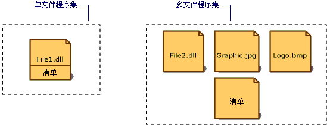

# 程序集清单
每一程序集，无论是静态的还是动态的，均包含描述该程序集中各元素彼此如何关联的数据集合。 程序集清单就包含这些程序集元数据。 程序集清单包含指定该程序集的版本要求和安全标识所需的所有元数据，以及定义该程序集的范围和解析对资源和类的引用所需的全部元数据。 程序集清单可以存储在具有 Microsoft 中间语言 (MSIL) 代码的 PE 文件（.exe 或 .dll）中，也可存储在只包含程序集清单信息的独立 PE 文件中。  
  
 以下插图显示了清单的不同存储方法。  
  
   
程序集的类型  
  
 对于有一个关联文件的程序集，该清单将被合并到 PE 文件中以构成单文件程序集。 您可以创建有独立的清单文件，或清单被合并到同一多文件程序集中某一 PE 文件的多文件程序集。  
  
 每一程序集的清单均执行以下功能：  
  
-   枚举构成该程序集的文件。  
  
-   控制对该程序集的类型和资源的引用如何映射到包含其声明和实现的文件。  
  
-   枚举该程序集所依赖的其他程序集。  
  
-   在程序集的使用者和程序集的实现详细信息的使用者之间提供一定程度的间接性。  
  
-   呈现程序集自述。  
  
## 程序集清单内容  
 下表显示了在程序集清单中包含的信息。 前四项（程序集名称、版本号、区域性和强名称信息）构成了程序集的标识。  
  
|信息|描述|  
|-----------------|-----------------|  
|程序集名称|指定程序集名称的文本字符串。|  
|版本号|主版本号和次版本号，以及修订号和生成号。 公共语言运行时使用这些编号来强制实施版本策略。|  
|区域性|有关该程序集支持的区域性或语言的信息。 此信息只应用于将一个程序集指定为包含特定区域性或特定语言信息的附属程序集。 （具有区域性信息的程序集被自动假定为附属程序集。）|  
|强名称信息|如果已经为程序集提供了一个强名称，则为来自发行者的公钥。|  
|程序集中所有文件的列表|在程序集中包含的每一文件的散列及文件名。 请注意，构成程序集的所有文件所在的目录必须是包含该程序集清单的文件所在的目录。|  
|类型引用信息|运行时用来将类型引用映射到包含其声明和实现的文件的信息。 该信息用于从程序集导出的类型。|  
|有关被引用程序集的信息|该程序集静态引用的其他程序集的列表。 如果依赖的程序集具有强名称，则每一引用均包括该依赖程序集的名称、程序集元数据（版本、区域性、操作系统等）和公钥。|  
  
 通过在代码中使用程序集特性，您可以添加或更改程序集清单中的一些信息。 您可以更改版本信息和信息性特性，包括商标、版权、产品、公司和信息性版本。 有关程序集特性的完整列表，请参阅[设置程序集特性](../../../docs/framework/app-domains/set-assembly-attributes.md)。  
  
## 另请参阅  
 [程序集内容](../../../docs/framework/app-domains/assembly-contents.md)  
 [程序集版本控制](../../../docs/framework/app-domains/assembly-versioning.md)  
 [创建附属程序集](../../../docs/framework/resources/creating-satellite-assemblies-for-desktop-apps.md)  
 [具有强名称的程序集](../../../docs/framework/app-domains/strong-named-assemblies.md)
