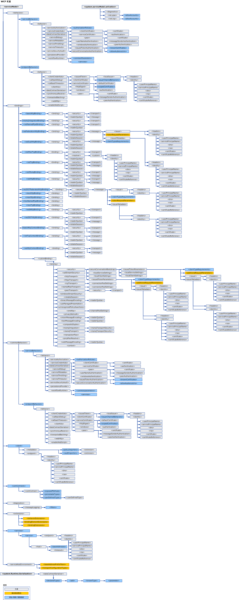

# WCF 配置架构WCF Configuration Schema
使用 [!INCLUDE[indigo1](../../../../../includes/indigo1-md.md)] 配置元素，您可以配置 [!INCLUDE[indigo2](../../../../../includes/indigo2-md.md)] 服务和客户端应用程序。[!INCLUDE[indigo1](../../../../../includes/indigo1-md.md)] configuration elements enable you to configure [!INCLUDE[indigo2](../../../../../includes/indigo2-md.md)] service and client applications. 可以使用[配置编辑器工具 (SvcConfigEditor.exe)](../../../../../docs/framework/wcf/configuration-editor-tool-svcconfigeditor-exe.md) 创建和修改客户端和服务的配置文件。You can use the [Configuration Editor Tool (SvcConfigEditor.exe)](../../../../../docs/framework/wcf/configuration-editor-tool-svcconfigeditor-exe.md) to create and modify configuration files for clients and services. 由于配置文件的格式都是以 XML 形式设置的，因此，如果要使用文本编辑器手动编辑这些文件，则您必须熟悉 XML。Since the configuration files are formatted as XML, you must be familiar with XML if you want to manually edit them using a text editor. 否则，您可能会遇到一些问题，如找不到某个 XML 元素标记或特性。Otherwise, you may run into issues such as an unfound XML element tag or attribute. 这是因为 XML 元素标记和特性是区分大小写的。This is because XML element tags and attributes are case-sensitive.  
  
 [!INCLUDE[indigo2](../../../../../includes/indigo2-md.md)] 配置系统基于 <xref:System.Configuration> 命名空间。The [!INCLUDE[indigo2](../../../../../includes/indigo2-md.md)] configuration system is based on the <xref:System.Configuration> namespace. 因此，您可以使用 <xref:System.Configuration> 命名空间提供的所有标准功能（如配置锁定、加密和合并）以提高应用程序及其配置的安全性。Therefore, you can use all the standard features provided by the <xref:System.Configuration> namespace, such as configuration locking, encryption and merging to increase the security of your application and its configuration. 有关这些概念的更多信息，请参见下列主题。For more information on these concepts, see the following topics.  
  
 [加密配置信息Encrypting Configuration Information](http://go.microsoft.com/fwlink/?LinkId=95337)  
  
 [锁定配置设置Locking Configuration Settings](http://go.microsoft.com/fwlink/?LinkId=95338)  
  
 本节描述每个配置项的所有可能的值，以及它如何与其他 WCF 配置元素进行交互。This section describes all possible values of each configuration item, and how it interacts with other WCF configuration elements. 下面的映射演示了 WCF 配置架构。The following map illustrates the WCF configuration schema.  
  
   
  
> [!CAUTION]
>  您应利用适合的访问控制列表 (ACL) 来保护应用程序配置文件 (app.config) 中的 [!INCLUDE[indigo2](../../../../../includes/indigo2-md.md)] 配置节，以防止任何潜在安全威胁。You should protect [!INCLUDE[indigo2](../../../../../includes/indigo2-md.md)] configuration sections in your application configuration files (app.config) with appropriate Access Control Lists (ACL) to prevent any potential security threats.  例如，你应确保仅有适当的人员可以访问或修改有关应用程序绑定的安全设置或服务的配置文件的服务模型节。For example, you should make sure that only the appropriate people can access or modify the security settings on application bindings, or the service model section of the configuration file for a service.  
  
## 本节内容In This Section  
 [\<system.serviceModel>\<system.serviceModel>](../../../../../docs/framework/configure-apps/file-schema/wcf/system-servicemodel.md)  
 描述 `ServiceModel` 元素。Describes the `ServiceModel` element.  
  
 [\<system.serviceModel.activation>\<system.serviceModel.activation>](../../../../../docs/framework/configure-apps/file-schema/wcf/system-servicemodel-activation.md)  
 配置 SMSvcHost.exe 工具。Configures the SMSvcHost.exe tool.  
  
 [\<system.runtime.serialization>\<system.runtime.serialization>](../../../../../docs/framework/configure-apps/file-schema/wcf/system-runtime-serialization.md)  
 当使用序列化程序（如 <xref:System.Runtime.Serialization.DataContractSerializer>）时，用于设置选项的顶级元素。The top-level element for setting options when using serializers such as the <xref:System.Runtime.Serialization.DataContractSerializer>.  
  
## 相关章节Related Sections  
 [配置 Windows Communication Foundation 应用程序Configuring Windows Communication Foundation Applications](http://msdn.microsoft.com/en-us/13cb368e-88d4-4c61-8eed-2af0361c6d7a)  
 描述如何配置 [!INCLUDE[indigo2](../../../../../includes/indigo2-md.md)] 服务和客户端。Describes how to configure [!INCLUDE[indigo2](../../../../../includes/indigo2-md.md)] services and clients.
