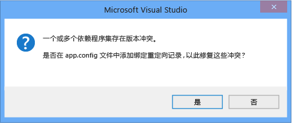

# <a name="how-to-enable-and-disable-automatic-binding-redirection"></a><span data-ttu-id="c79b4-102">如何：启用和禁用自动绑定重定向</span><span class="sxs-lookup"><span data-stu-id="c79b4-102">How to: Enable and Disable Automatic Binding Redirection</span></span>

<span data-ttu-id="c79b4-103">当你编译面向 Visual Studio 中的应用[!INCLUDE[net_v451](../../../includes/net-v451-md.md)]和更高版本，绑定重定向可能会自动添加到应用程序配置文件以重写程序集统一。</span><span class="sxs-lookup"><span data-stu-id="c79b4-103">When you compile apps in Visual Studio that target the [!INCLUDE[net_v451](../../../includes/net-v451-md.md)] and later versions, binding redirects may be automatically added to the app configuration file to override assembly unification.</span></span> <span data-ttu-id="c79b4-104">如果你的应用或其组件引用同一程序集的多个版本，就会添加绑定重定向，即使你在应用的配置文件中手动指定绑定重定向。</span><span class="sxs-lookup"><span data-stu-id="c79b4-104">Binding redirects are added if your app or its components reference more than one version of the same assembly, even if you manually specify binding redirects in the configuration file for your app.</span></span> <span data-ttu-id="c79b4-105">自动绑定重定向功能会影响桌面应用和 web 应用面向[!INCLUDE[net_v451](../../../includes/net-v451-md.md)]或更高版本中，虽然行为会略有不同的 web 应用。</span><span class="sxs-lookup"><span data-stu-id="c79b4-105">The automatic binding redirection feature affects desktop apps and web apps that target the [!INCLUDE[net_v451](../../../includes/net-v451-md.md)] or a later version, although the behavior is slightly different for a web app.</span></span> <span data-ttu-id="c79b4-106">如果您有现有的应用面向以前版本的.NET Framework 中，或者如果你想要手动编写的绑定重定向，则可以禁用此功能，可以启用自动绑定重定向。</span><span class="sxs-lookup"><span data-stu-id="c79b4-106">You can enable automatic binding redirection if you have existing apps that target previous versions of the .NET Framework, or you can disable this feature if you want to manually author binding redirects.</span></span>

## <a name="disable-automatic-binding-redirects-in-desktop-apps"></a><span data-ttu-id="c79b4-107">禁用自动绑定重定向在桌面应用程序</span><span class="sxs-lookup"><span data-stu-id="c79b4-107">Disable automatic binding redirects in desktop apps</span></span>

<span data-ttu-id="c79b4-108">默认情况下，对于面向 Windows 桌面应用启用自动绑定重定向[!INCLUDE[net_v451](../../../includes/net-v451-md.md)]及更高版本。</span><span class="sxs-lookup"><span data-stu-id="c79b4-108">Automatic binding redirects are enabled by default for Windows desktop apps that target the [!INCLUDE[net_v451](../../../includes/net-v451-md.md)] and later versions.</span></span> <span data-ttu-id="c79b4-109">绑定重定向添加到输出配置 (**app.config**) 文件编译该应用程序时，重写，否则可能会发生的程序集统一。</span><span class="sxs-lookup"><span data-stu-id="c79b4-109">The binding redirects are added to the output configuration (**app.config**) file when the app is compiled and override the assembly unification that might otherwise take place.</span></span> <span data-ttu-id="c79b4-110">在源**app.config**文件不被修改。</span><span class="sxs-lookup"><span data-stu-id="c79b4-110">The source **app.config** file is not modified.</span></span> <span data-ttu-id="c79b4-111">通过修改应用程序的项目文件或取消选中 Visual Studio 中的项目的属性中的复选框，可以禁用此功能。</span><span class="sxs-lookup"><span data-stu-id="c79b4-111">You can disable this feature by modifying the project file for the app or by deselecting a checkbox in the project's properties in Visual Studio.</span></span>

### <a name="disable-through-project-properties"></a><span data-ttu-id="c79b4-112">禁用项目属性</span><span class="sxs-lookup"><span data-stu-id="c79b4-112">Disable through project properties</span></span>

<span data-ttu-id="c79b4-113">如果你有 Visual Studio 2017 版本 15.7 或更高版本，可以轻松地禁用自动生成项目的属性页中的绑定重定向。</span><span class="sxs-lookup"><span data-stu-id="c79b4-113">If you have Visual Studio 2017 version 15.7 or later, you can easily disable autogenerated binding redirects in the project's property pages.</span></span>

1. <span data-ttu-id="c79b4-114">右键单击“解决方案资源管理器”中的项目，再选择“属性”。</span><span class="sxs-lookup"><span data-stu-id="c79b4-114">Right-click the project in **Solution Explorer** and select **Properties**.</span></span>

2. <span data-ttu-id="c79b4-115">上**应用程序**页上，取消选中**自动生成绑定重定向**选项。</span><span class="sxs-lookup"><span data-stu-id="c79b4-115">On the **Application** page, uncheck the **Auto-generate binding redirects** option.</span></span>

3. <span data-ttu-id="c79b4-116">按**Ctrl**+**S**以保存更改。</span><span class="sxs-lookup"><span data-stu-id="c79b4-116">Press **Ctrl**+**S** to save the change.</span></span>

### <a name="disable-manually-in-the-project-file"></a><span data-ttu-id="c79b4-117">在项目文件中手动禁用</span><span class="sxs-lookup"><span data-stu-id="c79b4-117">Disable manually in the project file</span></span>

1. <span data-ttu-id="c79b4-118">打开该项目文件进行编辑使用以下方法之一：</span><span class="sxs-lookup"><span data-stu-id="c79b4-118">Open the project file for editing using one of the following methods:</span></span>

   - <span data-ttu-id="c79b4-119">在 Visual Studio 中，选择在项目**解决方案资源管理器**，然后选择**在文件资源管理器中打开文件夹**从快捷菜单。</span><span class="sxs-lookup"><span data-stu-id="c79b4-119">In Visual Studio, select the project in **Solution Explorer**, and then choose **Open Folder in File Explorer** from the shortcut menu.</span></span> <span data-ttu-id="c79b4-120">在文件资源管理器，找到项目 （.csproj 或.vbproj） 文件，并在记事本中打开它。</span><span class="sxs-lookup"><span data-stu-id="c79b4-120">In File Explorer, find the project (.csproj or .vbproj) file and open it in Notepad.</span></span>
   - <span data-ttu-id="c79b4-121">在 Visual Studio 中，在**解决方案资源管理器**，右键单击项目，然后选择**卸载项目**。</span><span class="sxs-lookup"><span data-stu-id="c79b4-121">In Visual Studio, in **Solution Explorer**, right-click the project and choose **Unload Project**.</span></span> <span data-ttu-id="c79b4-122">再次，右键单击已卸载的项目，然后选择**编辑 [项目名.csproj]**。</span><span class="sxs-lookup"><span data-stu-id="c79b4-122">Right-click the unloaded project again, and then choose **Edit [projectname.csproj]**.</span></span>

2. <span data-ttu-id="c79b4-123">在项目文件中，查找以下属性项：</span><span class="sxs-lookup"><span data-stu-id="c79b4-123">In the project file, find the following property entry:</span></span>

   ```xml
   <AutoGenerateBindingRedirects>true</AutoGenerateBindingRedirects>
   ```

3. <span data-ttu-id="c79b4-124">将 `true` 更改为 `false`：</span><span class="sxs-lookup"><span data-stu-id="c79b4-124">Change `true` to `false`:</span></span>

   ```xml
   <AutoGenerateBindingRedirects>false</AutoGenerateBindingRedirects>
   ```

## <a name="enable-automatic-binding-redirects-manually"></a><span data-ttu-id="c79b4-125">手动启用自动绑定重定向</span><span class="sxs-lookup"><span data-stu-id="c79b4-125">Enable automatic binding redirects manually</span></span>

<span data-ttu-id="c79b4-126">你可以面向旧版本的.NET Framework 中，或在其中你会不会自动提示你添加重定向的情况下启用现有应用中的自动绑定重定向。</span><span class="sxs-lookup"><span data-stu-id="c79b4-126">You can enable automatic binding redirects in existing apps that target older versions of the .NET Framework, or in cases where you're not automatically prompted to add a redirect.</span></span> <span data-ttu-id="c79b4-127">如果你面向较新版本的 framework 但未自动提示以添加重定向，则可能会建议重新映射程序集的生成输出。</span><span class="sxs-lookup"><span data-stu-id="c79b4-127">If you're targeting a newer version of the framework but do not get automatically prompted to add a redirect, you'll likely get build output that suggests you remap assemblies.</span></span>

1. <span data-ttu-id="c79b4-128">打开该项目文件进行编辑使用以下方法之一：</span><span class="sxs-lookup"><span data-stu-id="c79b4-128">Open the project file for editing using one of the following methods:</span></span>

   - <span data-ttu-id="c79b4-129">在 Visual Studio 中，选择在项目**解决方案资源管理器**，然后选择**在文件资源管理器中打开文件夹**从快捷菜单。</span><span class="sxs-lookup"><span data-stu-id="c79b4-129">In Visual Studio, select the project in **Solution Explorer**, and then choose **Open Folder in File Explorer** from the shortcut menu.</span></span> <span data-ttu-id="c79b4-130">在文件资源管理器，找到项目 （.csproj 或.vbproj） 文件，并在记事本中打开它。</span><span class="sxs-lookup"><span data-stu-id="c79b4-130">In File Explorer, find the project (.csproj or .vbproj) file and open it in Notepad.</span></span>
   - <span data-ttu-id="c79b4-131">在 Visual Studio 中，在**解决方案资源管理器**，右键单击项目，然后选择**卸载项目**。</span><span class="sxs-lookup"><span data-stu-id="c79b4-131">In Visual Studio, in **Solution Explorer**, right-click the project and choose **Unload Project**.</span></span> <span data-ttu-id="c79b4-132">再次，右键单击已卸载的项目，然后选择**编辑 [项目名.csproj]**。</span><span class="sxs-lookup"><span data-stu-id="c79b4-132">Right-click the unloaded project again, and then choose **Edit [projectname.csproj]**.</span></span>

2. <span data-ttu-id="c79b4-133">将以下元素添加到第一个配置属性组 (在\<PropertyGroup > 标记):</span><span class="sxs-lookup"><span data-stu-id="c79b4-133">Add the following element to the first configuration property group (under the \<PropertyGroup> tag):</span></span>

   ```xml
   <AutoGenerateBindingRedirects>true</AutoGenerateBindingRedirects>
   ```

   <span data-ttu-id="c79b4-134">下面的示例项目文件具有插入元素：</span><span class="sxs-lookup"><span data-stu-id="c79b4-134">The following shows an example project file with the element inserted:</span></span>

   ```xml
   <?xml version="1.0" encoding="utf-8"?>
   <Project ToolsVersion="12.0" DefaultTargets="Build" xmlns="http://schemas.microsoft.com/developer/msbuild/2003">
     <Import Project="$(MSBuildExtensionsPath)\$(MSBuildToolsVersion)\Microsoft.Common.props" Condition="Exists('$(MSBuildExtensionsPath)\$(MSBuildToolsVersion)\Microsoft.Common.props')" />
       <PropertyGroup>
         <Configuration Condition=" '$(Configuration)' == ''     ">Debug</Configuration>
         <Platform Condition=" '$(Platform)' == '' ">AnyCPU</Platform>
         <ProjectGuid>{123334}</ProjectGuid>
         ...
         <AutoGenerateBindingRedirects>true</AutoGenerateBindingRedirects>
       </PropertyGroup>
     ...
   </Project>
   ```

3. <span data-ttu-id="c79b4-135">编译你的应用。</span><span class="sxs-lookup"><span data-stu-id="c79b4-135">Compile your app.</span></span>

## <a name="enable-automatic-binding-redirects-in-web-apps"></a><span data-ttu-id="c79b4-136">启用 web 应用中的自动绑定重定向</span><span class="sxs-lookup"><span data-stu-id="c79b4-136">Enable automatic binding redirects in web apps</span></span>

<span data-ttu-id="c79b4-137">Web 应用的自动绑定重定向实现方式有所不同。</span><span class="sxs-lookup"><span data-stu-id="c79b4-137">Automatic binding redirects are implemented differently for web apps.</span></span> <span data-ttu-id="c79b4-138">因为源配置 (**web.config**) 必须修改 web 应用的文件，绑定重定向不会自动添加到配置文件。</span><span class="sxs-lookup"><span data-stu-id="c79b4-138">Because the source configuration (**web.config**) file must be modified for web apps, binding redirects are not automatically added to the configuration file.</span></span> <span data-ttu-id="c79b4-139">但是，Visual Studio 会通知你绑定冲突，你可以添加绑定重定向来解决此冲突。</span><span class="sxs-lookup"><span data-stu-id="c79b4-139">However, Visual Studio notifies you of binding conflicts, and you can add binding redirects to resolve the conflicts.</span></span> <span data-ttu-id="c79b4-140">由于系统始终会提示添加绑定重定向，因此不需要显式禁用此功能的 web 应用。</span><span class="sxs-lookup"><span data-stu-id="c79b4-140">Because you're always prompted to add binding redirects, you don't need to explicitly disable this feature for a web app.</span></span>

<span data-ttu-id="c79b4-141">若要添加到绑定重定向**web.config**文件：</span><span class="sxs-lookup"><span data-stu-id="c79b4-141">To add binding redirects to a **web.config** file:</span></span>

1. <span data-ttu-id="c79b4-142">在 Visual Studio 中，编译应用，然后检查生成警告。</span><span class="sxs-lookup"><span data-stu-id="c79b4-142">In Visual Studio, compile the app, and check for build warnings.</span></span>

   <span data-ttu-id="c79b4-143"></span><span class="sxs-lookup"><span data-stu-id="c79b4-143"></span></span>

2. <span data-ttu-id="c79b4-144">如果存在程序集绑定冲突，则将显示警告。</span><span class="sxs-lookup"><span data-stu-id="c79b4-144">If there are assembly binding conflicts, a warning appears.</span></span> <span data-ttu-id="c79b4-145">双击该警告，或选择警告，然后按**Enter**。</span><span class="sxs-lookup"><span data-stu-id="c79b4-145">Double-click the warning, or select the warning and press **Enter**.</span></span>

   <span data-ttu-id="c79b4-146">一个对话框，可以自动添加必要的绑定重定向到源**web.config**文件将出现。</span><span class="sxs-lookup"><span data-stu-id="c79b4-146">A dialog box that enables you to automatically add the necessary binding redirects to the source **web.config** file appears.</span></span>

   <span data-ttu-id="c79b4-147"></span><span class="sxs-lookup"><span data-stu-id="c79b4-147"></span></span>

## <a name="see-also"></a><span data-ttu-id="c79b4-148">请参阅</span><span class="sxs-lookup"><span data-stu-id="c79b4-148">See also</span></span>

- [<span data-ttu-id="c79b4-149">\<bindingRedirect > 元素</span><span class="sxs-lookup"><span data-stu-id="c79b4-149">\<bindingRedirect> Element</span></span>](../../../docs/framework/configure-apps/file-schema/runtime/bindingredirect-element.md)
- [<span data-ttu-id="c79b4-150">重定向程序集版本</span><span class="sxs-lookup"><span data-stu-id="c79b4-150">Redirecting Assembly Versions</span></span>](../../../docs/framework/configure-apps/redirect-assembly-versions.md)
