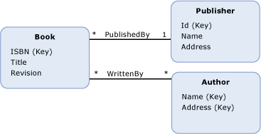

# 关联端
“关联端”标识位于某个[关联](../../../../docs/framework/data/adonet/association-type.md)一端的[实体类型](../../../../docs/framework/data/adonet/entity-type.md)以及可以在关联的该端存在的实体类型实例的数量。  关联端定义为关联的一部分；关联必须正好有两个关联端。  通过[导航属性](../../../../docs/framework/data/adonet/navigation-property.md)可以从一个关联端导航到另一个关联端。  
  
 关联端定义包含以下信息：  
  
-   关联中涉及的实体类型之一。  （必需）  
  
    > [!NOTE]
    >  对于某个给定的关联，为每个关联端指定的实体类型可以是相同的。  这将创建一个自关联。  
  
-   [关联端重数](../../../../docs/framework/data/adonet/association-end-multiplicity.md)，表明在关联的一端可以存在的实体类型实例的数量。  关联端重数的值可以为“一 \(1\)”、“零或一 \(0..1\)”或“多 \(\*\)”。  
  
-   关联端的名称。  （可选）  
  
-   有关在关联端上执行的操作的信息，例如级联删除。  （可选）  
  
## 示例  
 下图显示了一个具有两个关联的概念模型：`PublishedBy` 和 `WrittenBy`。  `PublishedBy` 关联的关联端是 `Book` 和 `Publisher` 实体类型。  `Publisher` 端的重数为“一 \(1\)”，`Book` 端的重数为“多 \(\*\)”，表明一个出版商可以出版很多书，而一本书只能由一个出版商出版。  
  
   
  
 ADO.NET 实体框架使用一种称为概念架构定义语言 \([CSDL](../../../../docs/framework/data/adonet/ef/language-reference/csdl-specification.md)\) 的域特定语言 \(DSL\) 来定义概念模型。  下面的 CSDL 定义了上图中显示的 `PublishedBy` 关联。  请注意，每个关联端的类型、名称和重数由 XML 特性指定（分别是 `Type`、`Role` 和 `Multiplicity` 特性）。  有关在端上执行的操作的可选信息在 XML 元素（`OnDelete` 元素）中指定。  在本例中，如果删除出版商，将同时删除所有关联的书籍。  
  
 [!code-xml[EDM_Example_Model#AssociationEnd](../../../../samples/snippets/xml/VS_Snippets_Data/edm_example_model/xml/books3.edmx#associationend)]  
  
## 请参阅  
 [实体数据模型关键概念](../../../../docs/framework/data/adonet/entity-data-model-key-concepts.md)   
 [实体数据模型](../../../../docs/framework/data/adonet/entity-data-model.md)