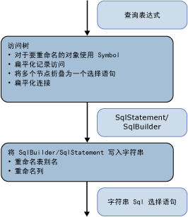

# <a name="architecture-and-design"></a>体系结构和设计
中的 SQL 生成模块[示例提供程序](http://go.microsoft.com/fwlink/?LinkId=180616)作为表示命令目录树的表达式树访问者实现的。 通过表达式树上的单个传递来执行生成。  
  
 从下至上处理树中的节点。 首先，生成一个中间结构：SqlSelectStatement 或 SqlBuilder（二者都实现 ISqlFragment）。 紧接着，从该结构生成字符串 SQL 语句。 生成中间结构的原因有两个：  
  
-   从逻辑上说，不按顺序填充 SQL SELECT 语句。 先访问参与 FROM 子句的节点，然后再访问参与 WHERE、GROUP BY 和 ORDER BY 子句的节点。  
  
-   若要重命名别名，您必须标识所有使用的别名，避免在重命名期间发生冲突。 若要延迟 SqlBuilder 中的重命名选择，请使用 Symbol 对象以表示作为重命名候选项的列。  
  
   
  
 在第一阶段，当访问表达式树时，将表达式组合为 SqlSelectStatements，对联接进行平展并对联接别名进行平展。 在此传递过程中，Symbol 对象表示可以重命名的列或输入别名。  
  
 在第二阶段，当生成实际字符串时，将重命名别名。  
  
## <a name="data-structures"></a>数据结构  
 本部分讨论中使用的类型[示例提供程序](http://go.microsoft.com/fwlink/?LinkId=180616)用于生成 SQL 语句。  
  
### <a name="isqlfragment"></a>ISqlFragment  
 本节涵盖实现 ISqlFragment 接口的类，此接口有两个用途：  
  
-   所有访问者方法的常见返回类型。  
  
-   提供用于写入最终 SQL 字符串的方法。  
  
```  
internal interface ISqlFragment {  
   void WriteSql(SqlWriter writer, SqlGenerator sqlGenerator);  
}  
```  
  
#### <a name="sqlbuilder"></a>SqlBuilder  
 SqlBuilder 是针对最终 SQL 字符串的收集设备（与 StringBuilder 类似）。 它包含构成最终 SQL 的字符串与可转换为字符串的 ISqlFragment。  
  
```  
internal sealed class SqlBuilder : ISqlFragment {  
   public void Append(object s)  
   public void AppendLine()  
   public bool IsEmpty  
}  
```  
  
#### <a name="sqlselectstatement"></a>SqlSelectStatement  
 SqlSelectStatement 表示形状"SELECT...的规范 SQL SELECT 语句 从。 WHERE... 分组依据... ORDER BY"。  
  
 每个 SQL 子句均由一个 StringBuilder 表示。 此外，它跟踪是否已指定 Distinct 以及语句是否位于最顶层。 如果语句未位于最顶层，则除非语句也具有 TOP 子句，否则将忽略 ORDER BY 子句。  
  
 FromExtents 包含 SELECT 语句的查询的列表。 该语句中通常只有一个元素。 联接的 SELECT 语句可以暂时具有多个元素。  
  
 如果 SELECT 语句是由 Join 节点创建的，则 SqlSelectStatement 将保留已在 AllJoinExtents 的联接中平展的所有范围的列表。 OuterExtents 表示 SqlSelectStatement 的外部引用并用于输入别名重命名。  
  
```  
internal sealed class SqlSelectStatement : ISqlFragment {  
   internal bool IsDistinct { get, set };  
   internal bool IsTopMost  
  
   internal List<Symbol> AllJoinExtents { get, set };  
   internal List<Symbol> FromExtents { get};  
   internal Dictionary<Symbol, bool> OuterExtents { get};  
  
   internal TopClause Top { get, set };  
  
   internal SqlBuilder Select {get};  
   internal SqlBuilder From  
   internal SqlBuilder Where  
   internal SqlBuilder GroupBy  
   public SqlBuilder OrderBy  
}  
```  
  
#### <a name="topclause"></a>TopClause  
 TopClause 表示 SqlSelectStatement 中的 TOP 表达式。 TopCount 属性指示应选择的 TOP 行的数目。  当 WithTies 为 true 时，指示已从 DbLimitExpession 构建 TopClause。  
  
```  
class TopClause : ISqlFragment {  
   internal bool WithTies {get}  
   internal ISqlFragment TopCount {get}  
   internal TopClause(ISqlFragment topCount, bool withTies)  
   internal TopClause(int topCount, bool withTies)  
}  
```  
  
### <a name="symbols"></a>符号  
 与符号相关的类和符号表将执行输入别名重命名、联接别名平展和列别名重命名。  
  
 Symbol 类表示范围、嵌套 SELECT 语句或列。 使用符号代替实际别名可在使用符号之后进行重命名，并且符号还带有它表示的项目（如类型）的其他信息。  
  
```  
class Symbol : ISqlFragment {  
   internal Dictionary<string, Symbol> Columns {get}  
   internal bool NeedsRenaming {get, set}  
   internal bool IsUnnest {get, set}   //not used  
  
   public string Name{get}  
   public string NewName {get,set}  
   internal TypeUsage Type {get, set}  
  
   public Symbol(string name, TypeUsage type)  
}  
```  
  
 Name 存储表示的范围、嵌套 SELECT 语句或列的原始别名。  
  
 NewName 存储 SQL SELECT 语句中将使用的别名。 最初将设置为 Name，仅在生成最终字符串查询时根据需要进行重命名。  
  
 Type 仅对表示范围和嵌套 SELECT 语句的符号有用。  
  
#### <a name="symbolpair"></a>SymbolPair  
 SymbolPair 类对记录平展进行寻址。  
  
 考虑属性表达式 D(v, "j3.j2.j1.a.x")，其中 v 是 VarRef，j1、j2、j3 为联接，a 为范围，而 x 为列。  
  
 最后必须将其转换为 {j'}.{x'}。 源字段表示最外部的 SqlStatement，它表示联接表达式（例如 j2）；这始终是一个联接符号。 列字段从一个联接符号移动到下一个联接符号，直到它停止在一个非联接符号处。 这将在访问 DbPropertyExpression 时返回，但绝不会添加到 SqlBuilder。  
  
```  
class SymbolPair : ISqlFragment {  
   public Symbol Source;  
   public Symbol Column;  
   public SymbolPair(Symbol source, Symbol column)  
}  
```  
  
#### <a name="joinsymbol"></a>JoinSymbol  
 联接符号是一个表示带联接或联接输入的嵌套 SELECT 语句的符号。  
  
```  
internal sealed class JoinSymbol : Symbol {  
   internal List<Symbol> ColumnList {get, set}  
   internal List<Symbol> ExtentList {get}  
   internal List<Symbol> FlattenedExtentList {get, set}  
   internal Dictionary<string, Symbol> NameToExtent {get}  
   internal bool IsNestedJoin {get, set}  
  
   public JoinSymbol(string name, TypeUsage type, List<Symbol> extents)  
}  
```  
  
 ColumnList 表示 SELECT 子句中的列的列表（如果此符号表示 SQL SELECT 语句）。 ExtentList 为 SELECT 子句中的范围的列表。 如果已在顶层平展联接的多个范围，则 FlattenedExtentList 将跟踪这些范围以确保对其别名进行的重命名正确。  
  
 NameToExtent 将 ExtentList 中的所有范围用作一个字典。 IsNestedJoin 用于确定 JoinSymbol 是普通的联接符号还是具有相应的 SqlSelectStatement 的联接符号。  
  
 所有列表只设置一次，然后用于查找或枚举。  
  
#### <a name="symboltable"></a>SymbolTable  
 SymbolTable 用于将变量名解析为符号。 SymbolTable 是作为带每个范围的新项的堆栈实现的。 查找将从上至下搜索堆栈，直到找到一个项。  
  
```  
internal sealed class SymbolTable {  
   internal void EnterScope()  
   internal void ExitScope()  
   internal void Add(string name, Symbol value)  
   internal Symbol Lookup(string name)  
}  
```  
  
 一个 Sql 生成模块实例仅有一个 SymbolTable。 对于每个关系节点都会进入和退出范围。 以前的范围中的所有符号对于以后的范围均可见，除非具有同一名称的其他符号将这些范围隐藏。  
  
### <a name="global-state-for-the-visitor"></a>访问者的全局状态  
 为了帮助重命名别名和列，保留包含所有列名 (AllColumnName) 和范围别名 (AllExtentName) 的列表，在查询树中进行第一次传递时已使用这些别名。  符号表可将变量名解析为符号。 IsVarRefSingle 仅用于验证目的，但它并非绝对必需的。  
  
 由于访问者模式不允许传递参数，通过 CurrentSelectStatement 和 IsParentAJoin 使用的两个堆栈可用于将“参数”从父节点传递到子节点。  
  
```  
internal Dictionary<string, int> AllExtentNames {get}  
internal Dictionary<string, int> AllColumnNames {get}  
SymbolTable symbolTable = new SymbolTable();  
bool isVarRefSingle = false;  
  
Stack<SqlSelectStatement> selectStatementStack;  
private SqlSelectStatement CurrentSelectStatement{get}  
  
Stack<bool> isParentAJoinStack;  
private bool IsParentAJoin{get}  
```  
  
## <a name="common-scenarios"></a>常见方案  
 本节讨论常见的提供程序方案。  
  
### <a name="grouping-expression-nodes-into-sql-statements"></a>将表达式节点组合为 SQL 语句  
 若从下往上访问树，则当遇到第一个关系节点（通常为 DbScanExpression 范围）时，将创建 SqlSelectStatement。 若要使用尽可能少的嵌套查询生成 SQL SELECT 语句，请在 SqlSelectStatement 中聚合尽可能多的父节点。  
  
 有关是否可将给定的（关系）节点添加到当前的 SqlSelectStatement（访问输入时返回的语句）或是否需要启动新语句的决策，将由方法 IsCompatible 来计算并取决于 SqlSelectStatement 中所含内容（这些内容取决于给定节点下方的节点）。  
  
 通常，如果在计算其考虑合并的节点不为空的子句之后再计算 SQL 语句子句，则无法将节点添加到当前语句。 例如，如果下一个节点为 Filter，则仅在满足以下条件时可将该节点并入当前 SqlSelectStatement 中：  
  
-   SELECT 列表为空。 如果 SELECT 列表不为空，则表明 select 列表是由 filter 前面的节点生成的，并且谓词可能更愿意使用由该 SELECT 列表生成的列。  
  
-   GROUPBY 为空。 如果 GROUPBY 不为空，则添加 filter 将表示在分组之前进行筛选，此操作是不正确的。  
  
-   TOP 子句为空。 如果 TOP 子句不为空，则添加 filter 将表示在执行 TOP 之前进行筛选，此操作是不正确的。  
  
 上述情况不适用于非关系节点（如 DbConstantExpression 或算术表达式），因为这些节点总是作为现有 SqlSelectStatement 的一部分包含。  
  
 另外，在遇到联接树（不具有联接父级的联接节点）的根时，将启动新的 SqlSelectStatement。 其左侧的所有刺联接子级都聚合到该 SqlSelectStatement 中。  
  
 只要启动新的 SqlSelectStatement 并将当前 SqlSelectStatement 添加到输入中，就可能需要通过添加投影列（SELECT 子句）来完成当前的 SqlSelectStatement（如果不存在 SqlSelectStatement）。 此操作是通过 AddDefaultColumns 方法完成的，该方法查看 SqlSelectStatement 的 FromExtents 并添加由 FromExtents 表示的范围列表引入到投影列的列表范围内的所有列。 执行此操作的原因是，此时不知道其他节点引用了哪些列。 可以对此操作进行优化，以便仅投影稍后可使用的列。  
  
### <a name="join-flattening"></a>联接平展  
 IsParentAJoin 属性有助于确定是否可以平展给定联接。 特别是，IsParentAJoin 仅为联接的左侧子级和作为联接的即时输入的每个 DbScanExpression 返回 `true`，在此情况下，该子节点会重用父级稍后将使用的同一 SqlSelectStatement。 有关更多信息，请参见“联接表达式”。  
  
### <a name="input-alias-redirecting"></a>输入别名重定向  
 使用符号表完成输入别名重定向。  
  
 为了解释输入的别名重定向，请参阅中的第一个示例[从命令目录树的最佳实践生成 SQL](../../../../../docs/framework/data/adonet/ef/generating-sql-from-command-trees-best-practices.md)。  在投影中，需要将“a”重定向为“b”。  
  
 在创建 SqlSelectStatement 对象时，作为节点的输入的范围将置于 SqlSelectStatement 的 From 属性中。 基于输入绑定名称（“b”）创建符号 (<symbol_b>) 以表示该范围，并将“AS”+ <symbol_b> 追加到 From 子句。  另外，还将此符号添加到 FromExtents 属性。  
  
 还将此符号添加到符号表以将输入绑定名链接到此符号（“b”，<symbol_b>）。  
  
 如果后续节点重用该 SqlSelectStatement，则它将一个项添加到符号表以将其输入绑定名链接到此符号。 在本示例中，带输入的绑定名"a"的 DbProjectExpression 将重用 SqlSelectStatement 并添加 ("a"、 \< symbol_b >) 到表。  
  
 当表达式引用正在重用 SqlSelectStatement 的节点的输入绑定名时，使用符号表将该引用解析为正确的重定向符号。 若在访问表示“a”的 DbVariableReferenceExpression 时解析“a.x”中的“a”，则将其解析为符号 <symbol_b>。  
  
### <a name="join-alias-flattening"></a>联接别名平展  
 联接别名平展是在访问 DbPropertyExpression 时实现的，如标题为 DbPropertyExpression 的一节中所述。  
  
### <a name="column-name-and-extent-alias-renaming"></a>列名和范围别名重命名  
 通过使用仅在生成的第二阶段中代替别名的符号来解决列名和范围别名重命名的问题，如标题为“SQL 生成的第二阶段：生成字符串命令”一节中所述。  
  
## <a name="first-phase-of-the-sql-generation-visiting-the-expression-tree"></a>SQL 生成的第一阶段：访问该表达式树  
 本节介绍 SQL 生成的第一阶段，在此阶段中将访问表示查询的表达式并生成中间结构（SqlSelectStatement 或 SqlBuilder）。  
  
 本节描述访问不同的表达式节点类别时遵循的原则以及有关访问特定表达式类型的详细信息。  
  
### <a name="relational-non-join-nodes"></a>关系（非联接）节点  
 下面的表达式类型支持非联接节点：  
  
-   DbDistinctExpression  
  
-   DbFilterExpression  
  
-   DbGroupByExpression  
  
-   DbLimitExpession  
  
-   DbProjectExpression  
  
-   DbSkipExpression  
  
-   DbSortExpression  
  
 访问这些节点时应遵循以下模式：  
  
1.  访问关系输入并获取结果 SqlSelectStatement。 对关系节点的输入可以是下列任一项：  
  
    -   关系节点，包括范围（例如 DbScanExpression）。 访问此类节点将返回 SqlSelectStatement。  
  
    -   集运算表达式（例如 UNION ALL）。 必须将结果用括号括起，并将其置于新 SqlSelectStatement 的 FROM 子句中。  
  
2.  检查是否可以将当前节点添加到由输入生成的 SqlSelectStatement。 标题为“将表达式组合为 SQL 语句”这一节对此进行了描述。 如果不可以添加，则  
  
    -   弹出当前的 SqlSelectStatement 对象。  
  
    -   创建新的 SqlSelectStatement 对象并将弹出的 SqlSelectStatement 添加为新 SqlSelectStatement 对象的 From 属性。  
  
    -   将新对象置于堆栈的顶部。  
  
3.  将输入表达式绑定从输入中重定向到正确的符号。 此信息保留在 SqlSelectStatement 对象中。  
  
4.  添加新的 SymbolTable 范围。  
  
5.  访问表达式的非输入部分（例如投影和谓词）。  
  
6.  弹出已添加到全局堆栈的所有对象。  
  
 DbSkipExpression 在 SQL 中没有直接等效项。 从逻辑上说，它将转换为：  
  
```  
SELECT Y.x1, Y.x2, ..., Y.xn  
FROM (  
   SELECT X.x1, X.x2, ..., X.xn, row_number() OVER (ORDER BY sk1, sk2, ...) AS [row_number]   
   FROM input as X   
   ) as Y  
WHERE Y.[row_number] > count   
ORDER BY sk1, sk2, ...  
```  
  
### <a name="join-expressions"></a>联接表达式  
 以下表达式将视为联接表达式，并且 VisitJoinExpression 方法将按某种常见方式处理它们：  
  
-   DbApplyExpression  
  
-   DbJoinExpression  
  
-   DbCrossJoinExpression  
  
 以下是访问步骤：  
  
 第一步，在访问子级之前，调用 IsParentAJoin 以检查联接节点是否为左刺方向的联接的子级。 如果它返回 false，则启动新的 SqlSelectStatement。 从这种意义上来说，由于父级（联接节点）将为可能要使用的子级创建 SqlSelectStatement，因此将按照不同的方式从剩余节点访问联接。  
  
 第二步，一次处理一个输入。 对于每个输入：  
  
1.  访问输入。  
  
2.  通过调用 ProcessJoinInputResult对访问输入的结果进行后续处理，此操作负责在访问联接表达式的子级后保留符号表并完成子级生成的 SqlSelectStatement。 子级的结果可以是下列项之一：  
  
    -   将向其添加父级的 SqlSelectStatement 之外的 SqlSelectStatement。 在此情况下，可能需要通过添加默认列来完成它。 如果输入是一个联接，则需要创建新的联接符号。 否则，将创建普通符号。  
  
    -   一个范围（例如 DbScanExpression），在此情况下，只是将其添加到父级的 SqlSelectStatement 的输入列表。  
  
    -   非 SqlSelectStatement，在此情况下，使用括号将其括起。  
  
    -   向其添加父级的同一 SqlSelectStatement。 在此情况下，需要将 FromExtents 列表中的符号替换为表示所有这些项的单个新 JoinSymbol。  
  
    -   对于前三种情况，调用 AddFromSymbol 以添加 AS 子句并更新符号表。  
  
 第三步，访问联接条件（如果有）。  
  
### <a name="set-operations"></a>Set 运算  
 集运算 DbUnionAllExpression、DbExceptExpression 和 DbIntersectExpression 都由方法 VisitSetOpExpression 处理。 它创建形状的 SqlBuilder  
  
```xml  
<leftSqlSelectStatement> <setOp> <rightSqlSelectStatement>  
```  
  
 其中\<leftSqlSelectStatement > 和\<rightSqlSelectStatement > 是通过访问每个输入，获取 SqlSelectStatements 和\<setOp > 是相应的操作 (例如 UNION ALL)。  
  
### <a name="dbscanexpression"></a>DbScanExpression  
 如果在联接上下文中访问 DbScanExpression（作为一个联接的输入，该联接是另一个联接的左侧子级），则它会返回一个 SqlBuilder，后者带有相应目标（为定义查询、表或视图）的目标 SQL。 否则，创建一个新的 SqlSelectStatement，其 FROM 字段设置为与相应目标对应。  
  
### <a name="dbvariablereferenceexpression"></a>DbVariableReferenceExpression  
 访问 DbVariableReferenceExpression 将基于符号表中的某个查找返回与变量引用表达式对应的符号。  
  
### <a name="dbpropertyexpression"></a>DbPropertyExpression  
 联接别名平展是在访问 DbPropertyExpression 时标识并处理的。  
  
 首先访问 Instance 属性，并且结果为 Symbol、JoinSymbol 或 SymbolPair。 以下是对这三种情况的处理方式：  
  
-   如果返回 JoinSymbol，则其 NameToExtent 属性包含所需属性的符号。 如果联接符号表示嵌套联接，则返回带联接符号的新 Symbol 对，以跟踪将用作实例别名的符号和表示实际属性的符号，从而进行进一步的解析。  
  
-   如果返回 SymbolPair 且 Column 部分为联接符号，则再次返回联接符号，而此时列属性将更新为指向当前属性表达式所表示的属性。 否则，返回一个 SqlBuilder，它使用 SymbolPair 源作为别名并使用当前属性的符号作为列。  
  
-   如果返回 Symbol，则 Visit 方法返回一个 SqlBuilder 方法，它使用该实例作为别名并使用属性名作为列名。  
  
### <a name="dbnewinstanceexpression"></a>DbNewInstanceExpression  
 在用作 DbProjectExpression 的 Projection 属性时，DbNewInstanceExpression 会生成参数的以逗号分隔的列表以表示投影列。  
  
 若 DbNewInstanceExpression 具有集合返回类型并定义一个作为参数提供的表达式的新集合，则将单独处理以下三种情况：  
  
-   如果 DbNewInstanceExpression 将 DbElementExpression 用作唯一参数，则将对其进行转换，如下所示：  
  
    ```  
    NewInstance(Element(X)) =>  SELECT TOP 1 …FROM X  
    ```  
  
 如果 DbNewInstanceExpression 不具有任何参数（表示空表），则将 DbNewInstanceExpression 转换为：  
  
```  
SELECT CAST(NULL AS <primitiveType>) as X  
FROM (SELECT 1) AS Y WHERE 1=0  
```  
  
 否则，DbNewInstanceExpression 会生成参数的 UNION ALL 通道：  
  
```  
SELECT <visit-result-arg1> as X  
UNION ALL SELECT <visit-result-arg2> as X  
UNION ALL …  
UNION ALL SELECT <visit-result-argN> as X  
```  
  
### <a name="dbfunctionexpression"></a>DbFunctionExpression  
 规范函数和内置函数的处理方式相同：如果它们需要特别处理（例如，从 TRIM(string) 转换为 LTRIM(RTRIM(string)），则将调用适当的处理程序。 否则，将它们转换为 FunctionName(arg1, arg2, ..., argn)。  
  
 字典用于跟踪哪些函数需要特别处理及其相应的处理程序。  
  
 用户定义的函数将转换为 NamespaceName.FunctionName(arg1, arg2, ..., argn)。  
  
### <a name="dbelementexpression"></a>DbElementExpression  
 仅在访问用于表示标量子查询的 DbElementExpression 时调用访问 DbElementExpression 的方法。 因此，DbElementExpression 将转换为完整的 SqlSelectStatement，并用括号将其括起。  
  
### <a name="dbquantifierexpression"></a>DbQuantifierExpression  
 根据表达式类型（Any 或 All），将 DbQuantifierExpression 转换为：  
  
```  
Any(input, x) => Exists(Filter(input,x))  
All(input, x) => Not Exists(Filter(input, not(x))  
```  
  
### <a name="dbnotexpression"></a>DbNotExpression  
 在某些情况下，可以使用其输入表达式折叠 DbNotExpression 的转换。 例如：  
  
```  
Not(IsNull(a)) =>  "a IS NOT NULL"  
Not(All(input, x) => Not (Not Exists(Filter(input, not(x))) => Exists(Filter(input, not(x))  
```  
  
 执行第二次折叠的原因是，在转换类型为 All 的 DbQuantifierExpression 时提供程序导致效率较低。 因此，实体框架无法执行简化。  
  
### <a name="dbisemptyexpression"></a>DbIsEmptyExpression  
 将 DbIsEmptyExpression 转换为：  
  
```  
IsEmpty(inut) = Not Exists(input)  
```  
  
## <a name="second-phase-of-sql-generation-generating-the-string-command"></a>SQL 生成的第二阶段：生成字符串命令  
 在生成字符串 SQL 命令时，SqlSelectStatement 会生成符号的实际别名，这将解决列名和范围别名的重命名问题。  
  
 在将 SqlSelectStatement 对象写入字符串时会发生范围别名重命名。 首先，创建外部范围使用的所有别名的列表。 对于 FromExtents（如果它不为 null，则为 AllJoinExtents）中的每个符号，如果该符号与任何外部范围发生冲突，则对该符号进行重命名。 如果需要进行重命名，则它不会与 AllExtentNames 中收集的任何范围发生冲突。  
  
 在将 Symbol 对象写入字符串时会发生列重命名。 第一阶段中的 AddDefaultColumns 已确定是否必须对某个列符号进行重命名。 在第二阶段中，只有进行重命名才能确保生成的名称不会与 AllColumnNames 中使用的任何名称发生冲突。  
  
 若要同时为范围别名和列生成唯一名称，请使用 <existing_name>_n，其中 n 是尚未使用的最小别名。 所有别名的全局列表加大了对层叠重命名的需要。  
  
## <a name="see-also"></a>请参阅  
 [示例提供程序中的 SQL 生成](../../../../../docs/framework/data/adonet/ef/sql-generation-in-the-sample-provider.md)
