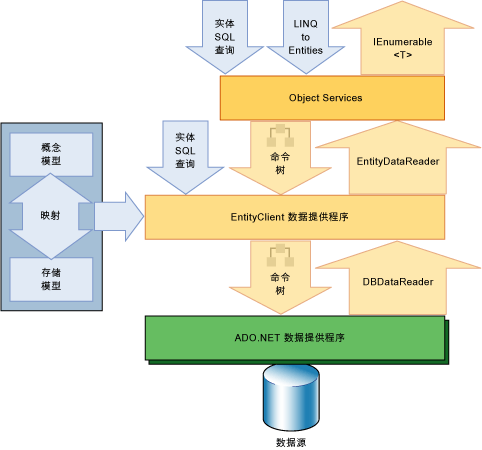

# 实体框架概述Entity Framework overview

[!INCLUDE[adonet_ef](../../../../../includes/adonet-ef-md.md)]是 ADO.NET 中的一套支持开发面向数据的软件应用程序的技术。The [!INCLUDE[adonet_ef](../../../../../includes/adonet-ef-md.md)] is a set of technologies in ADO.NET that support the development of data-oriented software applications. 面向数据的应用程序的架构师和开发人员曾为实现两个迥然不同的目标费尽心机：Architects and developers of data-oriented applications have struggled with the need to achieve two very different objectives. 他们必须为要解决的业务问题的实体、关系和逻辑构建模型，还必须处理用于存储和检索数据的数据引擎。They must model the entities, relationships, and logic of the business problems they are solving, and they must also work with the data engines used to store and retrieve the data. 数据可能跨多个各有不同协议的存储系统；甚至使用单个存储系统的应用程序也必须在存储系统的需求与编写高效且容易维护的应用程序代码之间取得平衡。The data may span multiple storage systems, each with its own protocols; even applications that work with a single storage system must balance the requirements of the storage system against the requirements of writing efficient and maintainable application code.

[!INCLUDE[adonet_ef](../../../../../includes/adonet-ef-md.md)] 使开发人员可以采用特定于域的对象和属性（如客户和客户地址）的形式使用数据，而不必自己考虑存储这些数据的基础数据库表和列。The [!INCLUDE[adonet_ef](../../../../../includes/adonet-ef-md.md)] enables developers to work with data in the form of domain-specific objects and properties, such as customers and customer addresses, without having to concern themselves with the underlying database tables and columns where this data is stored. 借助[!INCLUDE[adonet_ef](../../../../../includes/adonet-ef-md.md)]，开发人员在处理数据时能够以更高的抽象级别工作，并且能够以相比传统应用程序更少的代码创建和维护面向数据的应用程序。With the [!INCLUDE[adonet_ef](../../../../../includes/adonet-ef-md.md)], developers can work at a higher level of abstraction when they deal with data, and can create and maintain data-oriented applications with less code than in traditional applications. 因为[!INCLUDE[adonet_ef](../../../../../includes/adonet-ef-md.md)]是.NET Framework 的组件[!INCLUDE[adonet_ef](../../../../../includes/adonet-ef-md.md)]应用程序可以在其安装.NET Framework 版本 3.5 SP1 的任何计算机上运行。Because the [!INCLUDE[adonet_ef](../../../../../includes/adonet-ef-md.md)] is a component of the .NET Framework, [!INCLUDE[adonet_ef](../../../../../includes/adonet-ef-md.md)] applications can run on any computer on which the .NET Framework starting with version 3.5 SP1 is installed.

## 赋予模型生命Give life to models
 构建应用程序或服务时常用的一种长期存在的设计方法是将应用程序或服务分为三部分：域模型、逻辑模型和物理模型。A longstanding and common design approach when building an application or service is the division of the application or service into three parts: a domain model, a logical model, and a physical model. 域模型定义要建模的系统中的实体和关系。The domain model defines the entities and relationships in the system that is being modeled. 关系数据库的逻辑模型通过外键约束将实体和关系规范化到表中。The logical model for a relational database normalizes the entities and relationships into tables with foreign key constraints. 物理模型通过指定分区和索引等存储详细信息实现特定数据引擎的功能。The physical model addresses the capabilities of a particular data engine by specifying storage details such as partitioning and indexing.

 物理模型由数据库管理员进行优化以改善性能，而编写应用程序代码的程序员的工作主要限制为通过编写 SQL 查询和调用存储过程来处理逻辑模型。The physical model is refined by database administrators to improve performance, but programmers writing application code primarily confine themselves to working with the logical model by writing SQL queries and calling stored procedures. 域模型通常用作捕获和沟通应用程序需求的工具，常常以静态关系图形式提供，用于在项目早期阶段查看和讨论之用，随后会被弃用。Domain models are generally used as a tool for capturing and communicating the requirements of an application, frequently as inert diagrams that are viewed and discussed in the early stages of a project and then abandoned. 许多开发团队会跳过概念模型的创建，直接从指定关系数据库中的表、列和键开始工作。Many development teams skip creating a conceptual model and begin by specifying tables, columns, and keys in a relational database.

 [!INCLUDE[adonet_ef](../../../../../includes/adonet-ef-md.md)]开发人员能够在域模型中查询实体和关系，从而赋予模型生命 (称为*概念*中的模型[!INCLUDE[adonet_ef](../../../../../includes/adonet-ef-md.md)]) 时依赖于[!INCLUDE[adonet_ef](../../../../../includes/adonet-ef-md.md)]转换这些对数据源特定于命令的操作。The [!INCLUDE[adonet_ef](../../../../../includes/adonet-ef-md.md)] gives life to models by enabling developers to query entities and relationships in the domain model (called a *conceptual* model in the [!INCLUDE[adonet_ef](../../../../../includes/adonet-ef-md.md)]) while relying on the [!INCLUDE[adonet_ef](../../../../../includes/adonet-ef-md.md)] to translate those operations to data source–specific commands. 这使应用程序不再对特定数据源具有硬编码的依赖性。This frees applications from hard-coded dependencies on a particular data source.

 在使用 Code First 时，概念模型在代码中映射到存储模型。When working with Code First, the conceptual model is mapped to the storage model in code. [!INCLUDE[adonet_ef](../../../../../includes/adonet-ef-md.md)]可以基于对象类型和您定义的其他配置推断概念模型。The [!INCLUDE[adonet_ef](../../../../../includes/adonet-ef-md.md)] can infer the conceptual model based on the object types and additional configurations that you define. 基于您定义域类型的方式和在代码中提供的其他配置信息的组合，在运行时生成映射元数据。The mapping metadata is generated during run time based on a combination of how you defined your domain types and additional configuration information that you provide in code. [!INCLUDE[adonet_ef](../../../../../includes/adonet-ef-md.md)]基于元数据根据需要生成数据库。generates the database as needed based on the metadata. 有关详细信息，请参阅[创建和映射概念模型](https://go.microsoft.com/fwlink/?LinkID=235382)。For more information, see [Creating and Mapping a Conceptual Model](https://go.microsoft.com/fwlink/?LinkID=235382).

 使用实体数据模型工具时，概念模型、存储模型以及这两者之间的映射以基于 XML 的架构表示，并在具有对应扩展名的文件中定义：When working with the Entity Data Model Tools, the conceptual model, the storage model, and the mappings between the two are expressed in XML-based schemas and defined in files that have corresponding name extensions:

- 概念架构定义语言 (CSDL) 定义概念模型。Conceptual schema definition language (CSDL) defines the conceptual model. CSDL 是[!INCLUDE[adonet_ef](../../../../../includes/adonet-ef-md.md)]的实现[实体数据模型](../../../../../docs/framework/data/adonet/entity-data-model.md)。CSDL is the [!INCLUDE[adonet_ef](../../../../../includes/adonet-ef-md.md)]'s implementation of the [Entity Data Model](../../../../../docs/framework/data/adonet/entity-data-model.md). 文件扩展名为 .csdl。The file extension is .csdl.

- 存储架构定义语言 (SSDL) 定义存储模型，也称为“逻辑模型”。Store schema definition language (SSDL) defines the storage model, which is also called the logical model. 文件扩展名为 .ssdl。The file extension is .ssdl.

- 映射规范语言 (MSL) 定义存储模型与概念模型之间的映射。Mapping specification language (MSL) defines the mappings between the storage and conceptual models. 文件扩展名为 .msl。The file extension is .msl.

可以根据需要对存储模型和映射进行更改，而无需对概念模型、数据类或应用程序代码进行更改。The storage model and mappings can change as needed without requiring changes to the conceptual model, data classes, or application code. 存储模型是特定于提供程序的，因此可以在各种数据源之间使用一致的概念模型。Because storage models are provider-specific, you can work with a consistent conceptual model across various data sources.

[!INCLUDE[adonet_ef](../../../../../includes/adonet-ef-md.md)]使用这些模型和映射文件来创建、 读取、 更新和删除操作中的数据源中的等效操作对概念模型实体和关系。The [!INCLUDE[adonet_ef](../../../../../includes/adonet-ef-md.md)] uses these model and mapping files to create, read, update, and delete operations against entities and relationships in the conceptual model to equivalent operations in the data source. [!INCLUDE[adonet_ef](../../../../../includes/adonet-ef-md.md)]甚至支持到数据源中的存储过程在概念模型中的实体映射。The [!INCLUDE[adonet_ef](../../../../../includes/adonet-ef-md.md)] even supports mapping entities in the conceptual model to stored procedures in the data source. 有关详细信息，请参阅[CSDL、 SSDL 和 MSL 规范](../../../../../docs/framework/data/adonet/ef/language-reference/csdl-ssdl-and-msl-specifications.md)。For more information, see [CSDL, SSDL, and MSL Specifications](../../../../../docs/framework/data/adonet/ef/language-reference/csdl-ssdl-and-msl-specifications.md).

## 对数据的 map 对象Map objects to data
 面向对象的编程对与数据存储系统的交互提出了一个难题。Object-oriented programming poses a challenge for interacting with data storage systems. 虽然类的组织结构通常可以比较接近地反映关系数据库表的组织结构，但这种对应关系并不完美。Although the organization of classes frequently mirrors the organization of relational database tables, the fit is not perfect. 多个规范化表通常对应于单个类，而且类间关系的表示方式与表间关系的表示方式通常也不相同。Multiple normalized tables frequently correspond to a single class, and relationships between classes are often represented differently than relationships between tables are represented. 例如，若要表示某个销售订单的客户，`Order` 类可能会使用一个包含对 `Customer` 类实例的引用的属性，而数据库中的 `Order` 表行会包含一个外键列（或一组列），通过这些列包含对应于 `Customer` 表中的主键值的值。For example, to represent the customer for a sales order, an `Order` class might use a property that contains a reference to an instance of a `Customer` class, while an `Order` table row in a database contains a foreign key column (or set of columns) with a value that corresponds to a primary key value in the `Customer` table. `Customer` 类可能会使用一个名为 `Orders` 的属性（该属性包含 `Order` 类实例的集合），而数据库中的 `Customer` 表则不包含相应的列。A `Customer` class might have a property named `Orders` that contains a collection of instances of the `Order` class, while the `Customer` table in a database has no comparable column. [!INCLUDE[adonet_ef](../../../../../includes/adonet-ef-md.md)]让开发人员可以灵活地采用此方式表示关系，或更贴切地对在数据库中表示的关系进行建模。The [!INCLUDE[adonet_ef](../../../../../includes/adonet-ef-md.md)] provides developers with the flexibility to represent relationships in this way, or to more closely model relationships as they are represented in the database.

 现有解决方案只能通过将面向对象的类和属性映射到关系表和列来尝试弥合这种通常称为“阻抗不匹配”的差异。Existing solutions have tried to bridge this gap, which is frequently called an "impedance mismatch", by only mapping object-oriented classes and properties to relational tables and columns. 而不会采用这种传统方法，[!INCLUDE[adonet_ef](../../../../../includes/adonet-ef-md.md)]映射到概念模型中实体和关系的关系表、 列和逻辑模型中的外键约束。Instead of taking this traditional approach, the [!INCLUDE[adonet_ef](../../../../../includes/adonet-ef-md.md)] maps relational tables, columns, and foreign key constraints in logical models to entities and relationships in conceptual models. 这在定义对象和优化逻辑模型方面都增加了灵活性。This enables greater flexibility both in defining objects and optimizing the logical model. [!INCLUDE[adonet_edm](../../../../../includes/adonet-edm-md.md)] 工具基于概念模型生成可扩展数据类。The [!INCLUDE[adonet_edm](../../../../../includes/adonet-edm-md.md)] tools generate extensible data classes based on the conceptual model. 这些类是分部类，可以通过开发人员添加的其他成员进行扩展。These classes are partial classes that can be extended with additional members that the developer adds. 默认情况下，为特定概念模型生成的类派生自基类，这些基类提供服务以将实体具体化为对象以及跟踪和保存更改。By default, the classes that are generated for a particular conceptual model derive from base classes that provide services for materializing entities as objects and for tracking and saving changes. 开发人员可以使用这些类像处理通过关联相关的对象一样处理实体和关系。Developers can use these classes to work with the entities and relationships as objects related by associations. 开发人员还可以自定义针对某一概念模型生成的类。Developers can also customize the classes that are generated for a conceptual model. 有关详细信息，请参阅[使用对象](../../../../../docs/framework/data/adonet/ef/working-with-objects.md)。For more information, see [Working with Objects](../../../../../docs/framework/data/adonet/ef/working-with-objects.md).

## 访问和更改实体数据Access and change entity data

[!INCLUDE[adonet_ef](../../../../../includes/adonet-ef-md.md)]不仅仅是另一种对象关系映射解决方案，从本质上讲，它的作用是使应用程序能够访问和更改概念模型中以实体和关系形式表示的数据。More than just another object-relational mapping solution, the [!INCLUDE[adonet_ef](../../../../../includes/adonet-ef-md.md)] is fundamentally about enabling applications to access and change data that is represented as entities and relationships in the conceptual model. [!INCLUDE[adonet_ef](../../../../../includes/adonet-ef-md.md)]使用模型和映射文件中的信息将对概念模型中表示的实体类型的对象查询转换为特定于数据源的查询。The [!INCLUDE[adonet_ef](../../../../../includes/adonet-ef-md.md)] uses information in the model and mapping files to translate object queries against entity types represented in the conceptual model into data source-specific queries. 查询结果具体化为对象的[!INCLUDE[adonet_ef](../../../../../includes/adonet-ef-md.md)]管理。Query results are materialized into objects that the [!INCLUDE[adonet_ef](../../../../../includes/adonet-ef-md.md)] manages. [!INCLUDE[adonet_ef](../../../../../includes/adonet-ef-md.md)]提供以下方式来查询概念模型并返回对象：The [!INCLUDE[adonet_ef](../../../../../includes/adonet-ef-md.md)] provides the following ways to query a conceptual model and return objects:

- [!INCLUDE[linq_entities](../../../../../includes/linq-entities-md.md)]。. 提供语言集成查询 (LINQ) 支持，用于查询在概念模型中定义的实体类型。Provides Language-Integrated Query (LINQ) support for querying entity types that are defined in a conceptual model. 有关详细信息，请参阅[LINQ to Entities](../../../../../docs/framework/data/adonet/ef/language-reference/linq-to-entities.md)。For more information, see [LINQ to Entities](../../../../../docs/framework/data/adonet/ef/language-reference/linq-to-entities.md).

- [!INCLUDE[esql](../../../../../includes/esql-md.md)]。. 与存储无关的 SQL 方言直接使用概念模型中的实体并支持[!INCLUDE[adonet_edm](../../../../../includes/adonet-edm-md.md)]概念。A storage-independent dialect of SQL that works directly with entities in the conceptual model and that supports [!INCLUDE[adonet_edm](../../../../../includes/adonet-edm-md.md)] concepts. [!INCLUDE[esql](../../../../../includes/esql-md.md)] 可用于对象查询和使用 EntityClient 提供程序执行的查询。is used both with object queries and queries that are executed by using the EntityClient provider. 有关详细信息，请参阅[实体 SQL 概述](../../../../../docs/framework/data/adonet/ef/language-reference/entity-sql-overview.md)。For more information, see [Entity SQL Overview](../../../../../docs/framework/data/adonet/ef/language-reference/entity-sql-overview.md).

[!INCLUDE[adonet_ef](../../../../../includes/adonet-ef-md.md)] 中包含 EntityClient 数据提供程序。The [!INCLUDE[adonet_ef](../../../../../includes/adonet-ef-md.md)] includes the EntityClient data provider. 此提供程序管理连接，将实体查询转换为特定于数据源的查询，并返回[!INCLUDE[adonet_ef](../../../../../includes/adonet-ef-md.md)]用于将实体数据具体化为对象的数据读取器。This provider manages connections, translates entity queries into data source-specific queries, and returns a data reader that the [!INCLUDE[adonet_ef](../../../../../includes/adonet-ef-md.md)] uses to materialize entity data into objects. 当不需要对象具体化时，通过使应用程序执行 [!INCLUDE[esql](../../../../../includes/esql-md.md)] 查询并使用返回的只读数据读取器，还可以像标准 ADO.NET 数据提供程序一样使用 EntityClient 提供程序。When object materialization is not required, the EntityClient provider can also be used like a standard ADO.NET data provider by enabling applications to execute [!INCLUDE[esql](../../../../../includes/esql-md.md)] queries and consume the returned read-only data reader. 有关详细信息，请参阅[针对实体框架的 EntityClient Provider](../../../../../docs/framework/data/adonet/ef/entityclient-provider-for-the-entity-framework.md)。For more information, see [EntityClient Provider for the Entity Framework](../../../../../docs/framework/data/adonet/ef/entityclient-provider-for-the-entity-framework.md).

下图阐释了用于访问数据的[!INCLUDE[adonet_ef](../../../../../includes/adonet-ef-md.md)]体系结构：The following diagram illustrates the [!INCLUDE[adonet_ef](../../../../../includes/adonet-ef-md.md)] architecture for accessing data:

[!INCLUDE[adonet_edm](../../../../../includes/adonet-edm-md.md)]工具可生成一个从 `System.Data.Objects.ObjectContext` 或 `System.Data.Entity.DbContext` 派生的类，该类表示概念模型中的实体容器。The [!INCLUDE[adonet_edm](../../../../../includes/adonet-edm-md.md)] Tools can generate a class derived from `System.Data.Objects.ObjectContext` or `System.Data.Entity.DbContext` that represents the entity container in the conceptual model. 此对象上下文提供跟踪更改以及管理标识、并发和关系的功能。This object context provides the facilities for tracking changes and managing identities, concurrency, and relationships. 此类还公开将插入、更新和删除操作写入数据源的 `SaveChanges` 方法。This class also exposes a `SaveChanges` method that writes inserts, updates, and deletes to the data source. 与查询类似，这些更改是由系统自动生成的命令或由开发人员指定的存储过程执行的。Like queries, these changes are either made by commands automatically generated by the system or by stored procedures that are specified by the developer.

## 数据提供程序Data providers

`EntityClient`提供程序通过访问概念实体和关系方面的数据来扩展 ADO.NET 提供程序模型。The `EntityClient` provider extends the ADO.NET provider model by accessing data in terms of conceptual entities and relationships. 它执行使用 [!INCLUDE[esql](../../../../../includes/esql-md.md)] 的查询。It executes queries that use [!INCLUDE[esql](../../../../../includes/esql-md.md)]. [!INCLUDE[esql](../../../../../includes/esql-md.md)] 提供使 `EntityClient` 能与数据库进行通信的基础查询语言。provides the underlying query language that enables `EntityClient` to communicate with the database. 有关详细信息，请参阅[针对实体框架的 EntityClient Provider](../../../../../docs/framework/data/adonet/ef/entityclient-provider-for-the-entity-framework.md)。For more information, see [EntityClient Provider for the Entity Framework](../../../../../docs/framework/data/adonet/ef/entityclient-provider-for-the-entity-framework.md).

[!INCLUDE[adonet_ef](../../../../../includes/adonet-ef-md.md)] 包含一个支持规范命令目录树的最新 SqlClient 数据提供程序。The [!INCLUDE[adonet_ef](../../../../../includes/adonet-ef-md.md)] includes an updated SqlClient Data Provider that supports canonical command trees. 有关详细信息，请参阅[用于实体框架的 SqlClient](../../../../../docs/framework/data/adonet/ef/sqlclient-for-the-entity-framework.md)。For more information, see [SqlClient for the Entity Framework](../../../../../docs/framework/data/adonet/ef/sqlclient-for-the-entity-framework.md).

## 实体数据模型工具Entity data model tools

连同[!INCLUDE[adonet_ef](../../../../../includes/adonet-ef-md.md)]运行时，Visual Studio 包括映射和建模工具。Together with the [!INCLUDE[adonet_ef](../../../../../includes/adonet-ef-md.md)] runtime, Visual Studio includes the mapping and modeling tools. 有关详细信息，请参阅[建模和映射](../../../../../docs/framework/data/adonet/ef/modeling-and-mapping.md)。For more information, see [Modeling and Mapping](../../../../../docs/framework/data/adonet/ef/modeling-and-mapping.md).

## 了解详细信息Learn more

若要详细了解[!INCLUDE[adonet_ef](../../../../../includes/adonet-ef-md.md)]，请参阅：To learn more about the [!INCLUDE[adonet_ef](../../../../../includes/adonet-ef-md.md)], see:

[入门教程](../../../../../docs/framework/data/adonet/ef/getting-started.md)-介绍如何启动和运行使用快速[快速入门教程](https://docs.microsoft.com/previous-versions/dotnet/netframework-4.0/bb399182(v=vs.100))，其中说明了如何创建一个简单[!INCLUDE[adonet_ef](../../../../../includes/adonet-ef-md.md)]应用程序。[Getting Started](../../../../../docs/framework/data/adonet/ef/getting-started.md) - Provides information about how to get up and running quickly using the [Quickstart](https://docs.microsoft.com/previous-versions/dotnet/netframework-4.0/bb399182(v=vs.100)), which shows how to create a simple [!INCLUDE[adonet_ef](../../../../../includes/adonet-ef-md.md)] application.

[实体框架术语](../../../../../docs/framework/data/adonet/ef/terminology.md)-定义的许多术语所引入的实体数据模型和[!INCLUDE[adonet_ef](../../../../../includes/adonet-ef-md.md)]中使用和[!INCLUDE[adonet_ef](../../../../../includes/adonet-ef-md.md)]文档。[Entity Framework Terminology](../../../../../docs/framework/data/adonet/ef/terminology.md) - Defines many of the terms that are introduced by the Entity Data Model and the [!INCLUDE[adonet_ef](../../../../../includes/adonet-ef-md.md)] and that are used in [!INCLUDE[adonet_ef](../../../../../includes/adonet-ef-md.md)] documentation.

[实体框架资源](../../../../../docs/framework/data/adonet/ef/resources.md)-提供概念性主题的链接和链接到外部主题和资源来构建[!INCLUDE[adonet_ef](../../../../../includes/adonet-ef-md.md)]应用程序。[Entity Framework Resources](../../../../../docs/framework/data/adonet/ef/resources.md) - Provides links to conceptual topics and links to external topics and resources for building [!INCLUDE[adonet_ef](../../../../../includes/adonet-ef-md.md)] applications.

## 请参阅See also

- [ADO.NET 实体框架ADO.NET Entity Framework](../../../../../docs/framework/data/adonet/ef/index.md)
