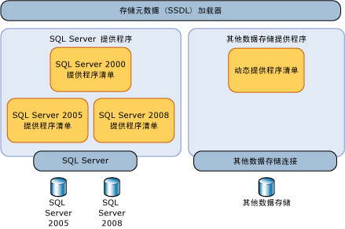
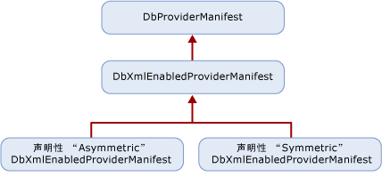

# <a name="provider-manifest-specification"></a>提供程序清单规范
本节讨论数据存储提供程序如何可以支持数据存储中的类型和功能。  
  
 实体服务独立于特定的数据存储提供程序进行操作，但仍允许数据提供程序显式定义模型、映射和查询与基础数据存储进行交互的方式。 由于没有抽象层，只能在特定的数据存储或数据提供程序中以实体服务为目标。  
  
 提供程序支持的类型由基础数据库直接或间接地提供支持。 这些类型不一定严格要求是存储类型，但提供程序使用这些类型支持[!INCLUDE[adonet_ef](../../../../../includes/adonet-ef-md.md)]。 提供程序/存储类型在实体数据模型 (EDM) 条目中进行了说明。  
  
 在 EDM 条目中指定了数据存储支持的函数的参数和返回类型。  
  
## <a name="requirements"></a>要求  
 [!INCLUDE[adonet_ef](../../../../../includes/adonet-ef-md.md)]和数据存储需要能够在已知类型中往返传递数据，而且不丢失或截断任何数据。  
  
 提供程序清单必须可由工具在设计时加载，而不必打开与数据存储的连接。  
  
 [!INCLUDE[adonet_ef](../../../../../includes/adonet-ef-md.md)]是敏感的但可能不到基础数据存储区。 当在清单中定义和使用 EDM 项目（例如标识符和类型名称）时，这些项目必须使用[!INCLUDE[adonet_ef](../../../../../includes/adonet-ef-md.md)]大小写区分。 如果可能区分大小写的数据存储元素出现在提供程序的清单中，则在提供程序清单中需要维持大小写区分。  
  
 对于所有数据提供程序，[!INCLUDE[adonet_ef](../../../../../includes/adonet-ef-md.md)]均需要一个提供程序清单。 如果你尝试使用的提供程序没有提供程序清单[!INCLUDE[adonet_ef](../../../../../includes/adonet-ef-md.md)]，你将收到错误。  
  
 下表描述了在提供程序交互过程中引发异常时，[!INCLUDE[adonet_ef](../../../../../includes/adonet-ef-md.md)]将引发的异常的种类。  
  
|问题|例外|  
|-----------|---------------|  
|提供程序不支持 DbProviderServices 中的 GetProviderManifest。|ProviderIncompatibleException|  
|缺少提供程序清单：在尝试检索提供程序清单时，提供程序返回 `null`。|ProviderIncompatibleException|  
|无效的提供程序清单：在尝试检索提供程序清单时，提供程序返回无效的 XML。|ProviderIncompatibleException|  
  
## <a name="scenarios"></a>方案  
 提供程序应支持下面的方案：  
  
### <a name="writing-a-provider-with-symmetric-type-mapping"></a>使用对称类型映射编写提供程序  
 你可以编写的提供程序[!INCLUDE[adonet_ef](../../../../../includes/adonet-ef-md.md)]其中每个存储类型映射到单个 EDM 类型，而与映射方向无关。 对于具有非常简单的映射（与 EDM 类型对应）的提供程序类型，您可以使用对称解决方案，因为此类型系统很简单或者匹配 EDM 类型。  
  
 您可以利用提供程序的域的简单性，生成一个静态声明性提供程序清单。  
  
 编写具有两部分的 XML 文件：  
  
-   以存储类型或函数的“EDM 对应项”的形式表示的提供程序类型列表。 存储类型具有对应的 EDM 类型。 存储函数具有对应的 EDM 函数。 例如，varchar 是一个 SQL Server 类型，但对应的 EDM 类型是字符串。  
  
-   提供程序支持的函数列表，其中的参数和返回类型用 EDM 术语表示。  
  
### <a name="writing-a-provider-with-asymmetric-type-mapping"></a>使用非对称类型映射编写提供程序  
 在编写[!INCLUDE[adonet_ef](../../../../../includes/adonet-ef-md.md)]的数据存储提供程序时，某些类型的 EDM 到提供程序的类型映射可能与提供程序到 EDM 的类型映射不同。 例如，无限制的 EDM PrimitiveTypeKind.String 可能会映射到提供程序上的 nvarchar(4000)，而 nvarchar(4000) 将映射到 EDM PrimitiveTypeKind.String(MaxLength=4000)。  
  
 编写具有两部分的 XML 文件：  
  
-   用 EDM 术语表示的提供程序类型的列表，其中定义了两个方向的映射：EDM 到提供程序的映射和提供程序到 EDM 的映射。  
  
-   提供程序支持的函数列表，其中的参数和返回类型用 EDM 术语表示。  
  
## <a name="provider-manifest-discoverability"></a>提供程序清单的可发现性  
 清单可以由实体服务中的若干组件类型（例如“工具”或“查询”）间接地使用，但更多的是通过使用数据存储元数据加载程序由元数据直接利用。  
  
   
  
 但是，给定的提供程序可能支持不同的存储或相同存储的不同版本。 因此，对于每个支持的数据存储，提供程序必须报告不同的清单。  
  
### <a name="provider-manifest-token"></a>提供程序清单标记  
 当打开数据存储连接时，提供程序可以查询信息以返回正确的清单。 在无法获取连接信息的脱机方案中，或者在无法连接到存储的情况下，上述方法可能不可行。 通过使用 .ssdl 文件中的 `ProviderManifestToken` 元素的 `Schema` 特性可标识清单。 此特性没有必需的格式要求，提供程序可选择所需的最少信息来标识清单，而无需打开与存储的连接。  
  
 例如：  
  
```xml  
<Schema Namespace="Northwind" Provider="System.Data.SqlClient" ProviderManifestToken="2005" xmlns:edm="http://schemas.microsoft.com/ado/2006/04/edm/ssdl" xmlns="http://schemas.microsoft.com/ado/2006/04/edm/ssdl">  
```  
  
## <a name="provider-manifest-programming-model"></a>提供程序清单编程模型  
 提供程序派生自 <xref:System.Data.Common.DbXmlEnabledProviderManifest>，这使得它们可以通过声明方式指定其清单。 下图显示了提供程序的类层次结构：  
  
   
  
### <a name="discoverability-api"></a>可发现性 API  
 通过使用数据存储连接或提供程序清单标记，存储元数据加载程序 (StoreItemCollection) 可加载提供程序清单。  
  
#### <a name="using-a-data-store-connection"></a>使用数据存储连接  
 当数据存储连接可用时，调用 DbProvderServices.GetProviderManifestToken 以返回传递给 GetProviderManifest 方法的标记，GetProviderManifest 方法返回 DbProviderManifest。 此方法委托给提供程序的 GetDbProviderManifestToken 实现。  
  
```  
public string GetProviderManifestToken(DbConnection connection);  
public DbProviderManifest GetProviderManifest(string manifestToken);  
```  
  
#### <a name="using-a-provider-manifest-token"></a>使用提供程序清单标记  
 对于脱机方案，此标记从 SSDL 表示形式中选取。 SSDL 允许你指定 ProviderManifestToken (请参阅[架构元素 (SSDL)](http://msdn.microsoft.com/en-us/fec75ae4-7f16-4421-9265-9dac61509222)有关详细信息)。 例如，如果无法打开某个连接，则 SSDL 会具有一个提供程序清单标记，用于指定有关清单的信息。  
  
```  
public DbProviderManifest GetProviderManifest(string manifestToken);  
```  
  
### <a name="provider-manifest-schema"></a>提供程序清单架构  
 为每个提供程序定义的信息架构包含元数据要使用的静态信息：  
  
```xml  
<?xml version="1.0" encoding="utf-8"?>  
<xs:schema elementFormDefault="qualified"  
   xmlns:xs="http://www.w3.org/2001/XMLSchema"  
   targetNamespace="http://schemas.microsoft.com/ado/2006/04/edm/providermanifest"  
   xmlns:pm="http://schemas.microsoft.com/ado/2006/04/edm/providermanifest">  
  
  <xs:element name="ProviderManifest">  
    <xs:complexType>  
      <xs:sequence>  
        <xs:element name="Types" type="pm:TTypes" minOccurs="1" maxOccurs="1" />  
        <xs:element name="Functions" type="pm:TFunctions" minOccurs="0" maxOccurs="1"/>  
      </xs:sequence>  
      <xs:attribute name="Namespace" type="xs:string" use="required"/>  
    </xs:complexType>  
  </xs:element>  
  <xs:complexType name="TVersion">  
    <xs:attribute name="Major" type="xs:int" use="required" />  
    <xs:attribute name="Minor" type="xs:int" use="required" />  
    <xs:attribute name="Build" type="xs:int" use="required" />  
    <xs:attribute name="Revision" type="xs:int" use="required" />  
  </xs:complexType>  
  
  <xs:complexType name="TIntegerFacetDescription">  
    <xs:attribute name="Minimum" type="xs:int" use="optional" />  
    <xs:attribute name="Maximum" type="xs:int" use="optional" />  
    <xs:attribute name="DefaultValue" type="xs:int" use="optional" />  
    <xs:attribute name="Constant" type="xs:boolean" default="false" />  
  </xs:complexType>  
  
  <xs:complexType name="TBooleanFacetDescription">  
    <xs:attribute name="DefaultValue" type="xs:boolean" use="optional" />  
    <xs:attribute name="Constant" type="xs:boolean" default="true" />  
  </xs:complexType>  
  
  <xs:complexType name="TDateTimeFacetDescription">  
    <xs:attribute name="Constant" type="xs:boolean" default="false" />  
  </xs:complexType>  
  
  <xs:complexType name="TFacetDescriptions">  
    <xs:choice maxOccurs="unbounded">  
      <xs:element name="Precision" minOccurs="0" maxOccurs="1" type="pm:TIntegerFacetDescription"/>  
      <xs:element name="Scale" minOccurs="0" maxOccurs="1" type="pm:TIntegerFacetDescription"/>  
      <xs:element name="MaxLength" minOccurs="0" maxOccurs="1" type="pm:TIntegerFacetDescription"/>  
      <xs:element name="Unicode" minOccurs="0" maxOccurs="1" type="pm:TBooleanFacetDescription"/>  
      <xs:element name="FixedLength" minOccurs="0" maxOccurs="1" type="pm:TBooleanFacetDescription"/>  
    </xs:choice>  
  </xs:complexType>  
  
  <xs:complexType name="TType">  
    <xs:sequence>  
      <xs:element name="FacetDescriptions" type="pm:TFacetDescriptions" minOccurs="0" maxOccurs="1"/>  
    </xs:sequence>  
    <xs:attribute name="Name" type="xs:string" use="required"/>  
    <xs:attribute name="PrimitiveTypeKind" type="pm:TPrimitiveTypeKind" use="required" />  
  </xs:complexType>  
  
  <xs:complexType name="TTypes">  
    <xs:sequence>  
      <xs:element name="Type" type="pm:TType" minOccurs="0" maxOccurs="unbounded"/>  
    </xs:sequence>  
  </xs:complexType>  
  
  <xs:attributeGroup name="TFacetAttribute">  
    <xs:attribute name="Precision" type="xs:int" use="optional"/>  
    <xs:attribute name="Scale" type="xs:int" use="optional"/>  
    <xs:attribute name="MaxLength" type="xs:int" use="optional"/>  
    <xs:attribute name="Unicode" type="xs:boolean" use="optional"/>  
    <xs:attribute name="FixedLength" type="xs:boolean" use="optional"/>  
  </xs:attributeGroup>  
  
  <xs:complexType name="TFunctionParameter">  
    <xs:attribute name="Name" type="xs:string" use="required" />  
    <xs:attribute name="Type" type="xs:string" use="required" />  
    <xs:attributeGroup ref="pm:TFacetAttribute" />  
    <xs:attribute name="Mode" type="pm:TParameterDirection" use="required" />  
  </xs:complexType>  
  
  <xs:complexType name="TReturnType">  
    <xs:attribute name="Type" type="xs:string" use="required" />  
    <xs:attributeGroup ref="pm:TFacetAttribute" />  
  </xs:complexType>  
  
  <xs:complexType name="TFunction">  
    <xs:choice minOccurs="0" maxOccurs ="unbounded">  
      <xs:element name ="ReturnType" type="pm:TReturnType" minOccurs="0" maxOccurs="1" />  
      <xs:element name="Parameter" type="pm:TFunctionParameter" minOccurs="0" maxOccurs="unbounded"/>  
    </xs:choice>  
    <xs:attribute name="Name" type="xs:string" use="required" />  
    <xs:attribute name="Aggregate" type="xs:boolean" use="optional" />  
    <xs:attribute name="BuiltIn" type="xs:boolean" use="optional" />  
    <xs:attribute name="StoreFunctionName" type="xs:string" use="optional" />  
    <xs:attribute name="NiladicFunction" type="xs:boolean" use="optional" />  
    <xs:attribute name="ParameterTypeSemantics" type="pm:TParameterTypeSemantics" use="optional" default="AllowImplicitConversion" />  
  </xs:complexType>  
  
  <xs:complexType name="TFunctions">  
    <xs:sequence>  
      <xs:element name="Function" type="pm:TFunction" minOccurs="0" maxOccurs="unbounded"/>  
    </xs:sequence>  
  </xs:complexType>  
  
  <xs:simpleType name="TPrimitiveTypeKind">  
    <xs:restriction base="xs:string">  
      <xs:enumeration value="Binary"/>  
      <xs:enumeration value="Boolean"/>  
      <xs:enumeration value="Byte"/>  
      <xs:enumeration value="Decimal"/>  
      <xs:enumeration value="DateTime"/>  
      <xs:enumeration value="Time"/>  
      <xs:enumeration value="DateTimeOffset"/>          
      <xs:enumeration value="Double"/>  
      <xs:enumeration value="Guid"/>  
      <xs:enumeration value="Single"/>  
      <xs:enumeration value="SByte"/>  
      <xs:enumeration value="Int16"/>  
      <xs:enumeration value="Int32"/>  
      <xs:enumeration value="Int64"/>  
      <xs:enumeration value="String"/>  
    </xs:restriction>  
  </xs:simpleType>  
  
  <xs:simpleType name="TParameterDirection">  
    <xs:restriction base="xs:string">  
      <xs:enumeration value="In"/>  
      <xs:enumeration value="Out"/>  
      <xs:enumeration value="InOut"/>  
    </xs:restriction>  
  </xs:simpleType>  
  
  <xs:simpleType name="TParameterTypeSemantics">  
    <xs:restriction base="xs:string">  
      <xs:enumeration value="ExactMatchOnly" />  
      <xs:enumeration value="AllowImplicitPromotion" />  
      <xs:enumeration value="AllowImplicitConversion" />  
    </xs:restriction>  
  </xs:simpleType>  
</xs:schema>  
```  
  
#### <a name="types-node"></a>Types 节点  
 提供程序清单中的 Types 节点包含有关数据存储区本身支持的或通过提供程序支持的 Type 的信息。  
  
##### <a name="type-node"></a>Type 节点  
 每个 Type 节点以 EDM 的形式定义一个提供程序类型。 Type 节点描述提供程序类型的名称、与其映射到的模型类型相关的信息以及用于描述类型映射的各个方面。  
  
 为了在提供程序清单中表示此类型信息，每个 TypeInformation 声明必须为每个 Type 定义几个方面的说明：  
  
|特性名|数据类型|必需|默认值|描述|  
|--------------------|---------------|--------------|-------------------|-----------------|  
|名称|String|是|无|提供程序特定的数据类型名称|  
|PrimitiveTypeKind|PrimitiveTypeKind|是|无|EDM 类型名称|  
  
###### <a name="function-node"></a>Function 节点  
 每个 Function 定义一个可通过提供程序使用的函数。  
  
|特性名|数据类型|必需|默认值|描述|  
|--------------------|---------------|--------------|-------------------|-----------------|  
|名称|String|是|无|函数的标识符/名称|  
|ReturnType|String|No|Void|函数的 EDM 返回类型|  
|聚合|Boolean|No|False|如果函数为聚合函数，则为 True。|  
|BuiltIn|Boolean|No|True|如果函数内置于数据存储中，则返回 True|  
|StoreFunctionName|String|否|\<名称 >|数据存储中的函数名称。  考虑了函数名称的重定向级别。|  
|NiladicFunction|Boolean|No|False|如果函数不需要任何参数且在调用时不使用任何参数，则返回 True。|  
|ParameterType<br /><br /> 语义|ParameterSemantics|No|AllowImplicit<br /><br /> 转换|有关查询管道应如何处理参数类型替换的选项：<br /><br /> -   ExactMatchOnly<br />-   AllowImplicitPromotion<br />-AllowImplicitConversion|  
  
 **参数节点**  
  
 每个函数都具有包含一个或多个 Parameter 节点的集合。  
  
|特性名|数据类型|必需|默认值|描述|  
|--------------------|---------------|--------------|-------------------|-----------------|  
|名称|String|是|无|参数的标识符/名称。|  
|类型|String|是|无|参数的 EDM 类型。|  
|模式|参数<br /><br /> 方向|是|无|参数的方向：<br /><br /> -   in<br />-out<br />-inout|  
  
##### <a name="namespace-attribute"></a>Namespace 属性  
 每个数据存储提供程序必须为清单中定义的信息定义一个命名空间或一组命名空间。 此命名空间可在 Entity SQL 查询中用来解析函数和类型的名称。 例如，SqlServer。 此命名空间必须与规范命名空间 EDM 不同，EDM 是由实体服务为 Entity SQL 查询要支持的标准函数定义的。  
  
## <a name="see-also"></a>请参阅  
 [编写实体框架数据提供程序](../../../../../docs/framework/data/adonet/ef/writing-an-ef-data-provider.md)
