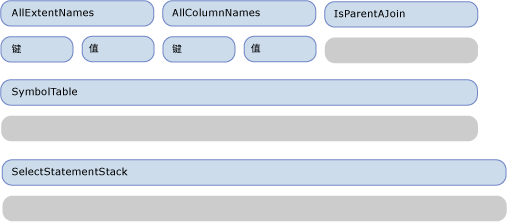
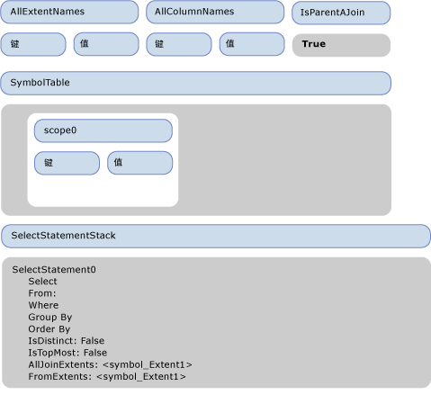
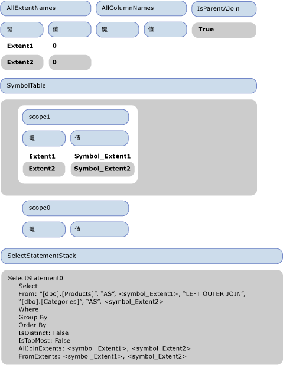
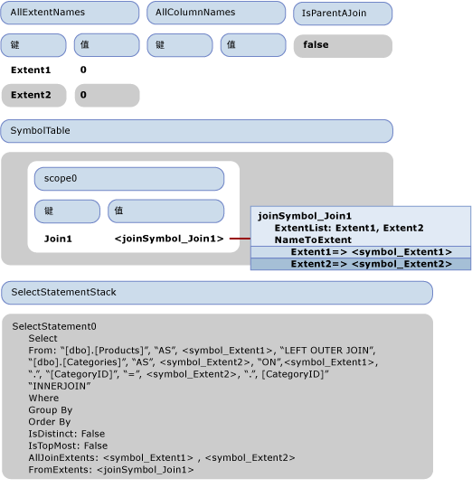
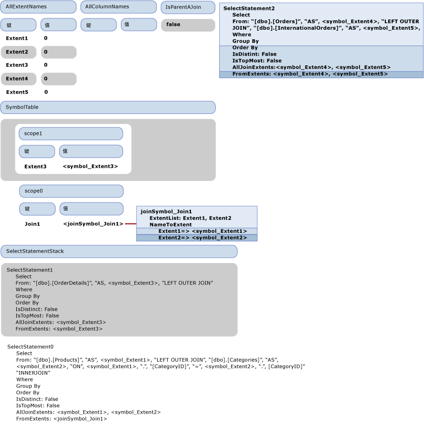
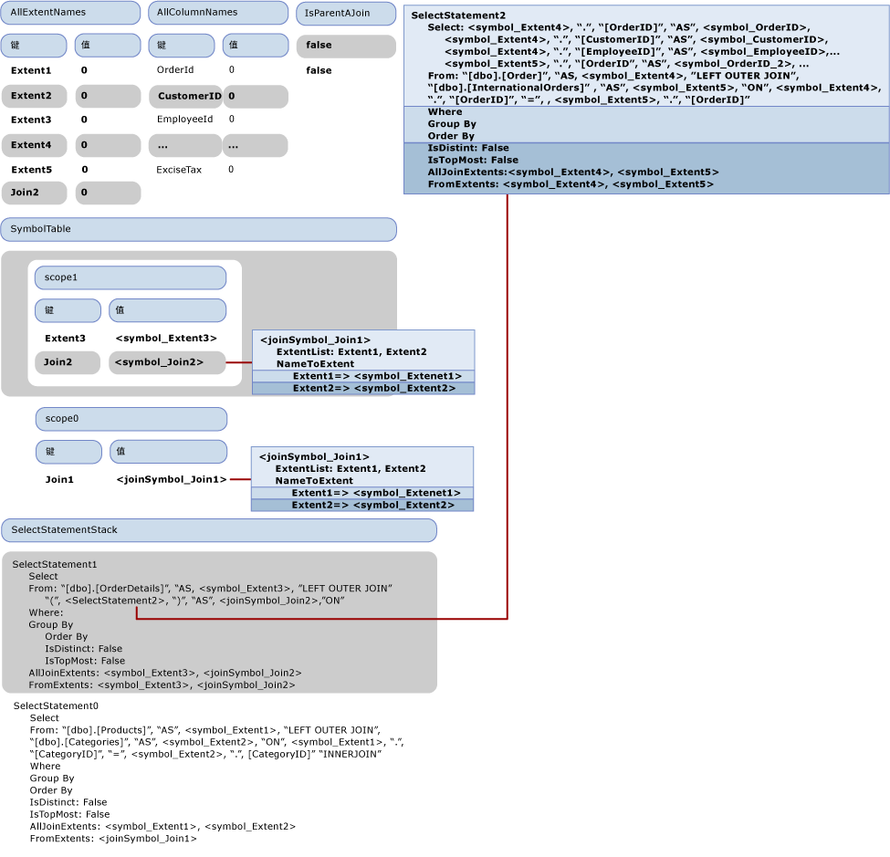

# <a name="walkthrough-sql-generation"></a>演练：SQL 生成
本主题说明了如何中进行 SQL 生成[示例提供程序](https://code.msdn.microsoft.com/windowsdesktop/Entity-Framework-Sample-6a9801d0)。 下面的 Entity SQL 查询使用随示例提供程序提供的模型：  
  
```  
SELECT  j1.ProductId, j1.ProductName, j1.CategoryName, j2.ShipCountry, j2.ProductId  
FROM (  SELECT P.ProductName, P.ProductId, P.Category.CategoryName  
        FROM NorthwindEntities.Products AS P) as j1  
INNER JOIN (SELECT OD.ProductId, OD.Order.ShipCountry as ShipCountry  
            FROM NorthwindEntities.OrderDetails AS OD) as j2  
            ON j1.ProductId == j2.ProductId   
```  
  
 此查询生成以下传递给提供程序的输出命令目录树：  
  
```  
DbQueryCommandTree  
|_Parameters  
|_Query : Collection{Record['C1'=Edm.Int32, 'ProductID'=Edm.Int32, 'ProductName'=Edm.String, 'CategoryName'=Edm.String, 'ShipCountry'=Edm.String, 'ProductID1'=Edm.Int32]}  
  |_Project  
    |_Input : 'Join4'  
    | |_InnerJoin  
    |   |_Left : 'Join1'  
    |   | |_LeftOuterJoin  
    |   |   |_Left : 'Extent1'  
    |   |   | |_Scan : dbo.Products  
    |   |   |_Right : 'Extent2'  
    |   |   | |_Scan : dbo.Categories  
    |   |   |_JoinCondition  
    |   |     |_  
    |   |       |_Var(Extent1).CategoryID  
    |   |       |_=  
    |   |       |_Var(Extent2).CategoryID  
    |   |_Right : 'Join3'  
    |   | |_LeftOuterJoin  
    |   |   |_Left : 'Extent3'  
    |   |   | |_Scan : dbo.OrderDetails  
    |   |   |_Right : 'Join2'  
    |   |   | |_LeftOuterJoin  
    |   |   |   |_Left : 'Extent4'  
    |   |   |   | |_Scan : dbo.Orders  
    |   |   |   |_Right : 'Extent5'  
    |   |   |   | |_Scan : dbo.InternationalOrders  
    |   |   |   |_JoinCondition  
    |   |   |     |_  
    |   |   |       |_Var(Extent4).OrderID  
    |   |   |       |_=  
    |   |   |       |_Var(Extent5).OrderID  
    |   |   |_JoinCondition  
    |   |     |_  
    |   |       |_Var(Extent3).OrderID  
    |   |       |_=  
    |   |       |_Var(Join2).Extent4.OrderID  
    |   |_JoinCondition  
    |     |_  
    |       |_Var(Join1).Extent1.ProductID  
    |       |_=  
    |       |_Var(Join3).Extent3.ProductID  
    |_Projection  
      |_NewInstance : Record['C1'=Edm.Int32, 'ProductID'=Edm.Int32, 'ProductName'=Edm.String, 'CategoryName'=Edm.String, 'ShipCountry'=Edm.String, 'ProductID1'=Edm.Int32]  
        |_Column : 'C1'  
        | |_1  
        |_Column : 'ProductID'  
        | |_Var(Join4).Join1.Extent1.ProductID  
        |_Column : 'ProductName'  
        | |_Var(Join4).Join1.Extent1.ProductName  
        |_Column : 'CategoryName'  
        | |_Var(Join4).Join1.Extent2.CategoryName  
        |_Column : 'ShipCountry'  
        | |_Var(Join4).Join3.Join2.Extent4.ShipCountry  
        |_Column : 'ProductID1'  
          |_Var(Join4).Join3.Extent3.ProductID  
```  
  
 本主题描述如何将此输出命令目录树转换成下列 SQL 语句。  
  
```  
SELECT   
1 AS [C1],   
[Extent1].[ProductID] AS [ProductID],   
[Extent1].[ProductName] AS [ProductName],   
[Extent2].[CategoryName] AS [CategoryName],   
[Join3].[ShipCountry] AS [ShipCountry],   
[Join3].[ProductID] AS [ProductID1]  
FROM   [dbo].[Products] AS [Extent1]  
LEFT OUTER JOIN [dbo].[Categories] AS [Extent2] ON [Extent1].[CategoryID] = [Extent2].[CategoryID]  
INNER JOIN    
(SELECT [Extent3].[OrderID] AS [OrderID1], [Extent3].[ProductID] AS [ProductID], [Extent3].[UnitPrice] AS [UnitPrice], [Extent3].[Quantity] AS [Quantity], [Extent3].[Discount] AS [Discount], [Join2].[OrderID2], [Join2].[CustomerID], [Join2].[EmployeeID], [Join2].[OrderDate], [Join2].[RequiredDate], [Join2].[ShippedDate], [Join2].[Freight], [Join2].[ShipName], [Join2].[ShipAddress], [Join2].[ShipCity], [Join2].[ShipRegion], [Join2].[ShipPostalCode], [Join2].[ShipCountry], [Join2].[OrderID3], [Join2].[CustomsDescription], [Join2].[ExciseTax]  
FROM  [dbo].[OrderDetails] AS [Extent3]  
LEFT OUTER JOIN    
      (SELECT [Extent4].[OrderID] AS [OrderID2], [Extent4].[CustomerID] AS [CustomerID], [Extent4].[EmployeeID] AS [EmployeeID], [Extent4].[OrderDate] AS [OrderDate], [Extent4].[RequiredDate] AS [RequiredDate], [Extent4].[ShippedDate] AS [ShippedDate], [Extent4].[Freight] AS [Freight], [Extent4].[ShipName] AS [ShipName], [Extent4].[ShipAddress] AS [ShipAddress], [Extent4].[ShipCity] AS [ShipCity], [Extent4].[ShipRegion] AS [ShipRegion], [Extent4].[ShipPostalCode] AS [ShipPostalCode], [Extent4].[ShipCountry] AS [ShipCountry], [Extent5].[OrderID] AS [OrderID3], [Extent5].[CustomsDescription] AS [CustomsDescription], [Extent5].[ExciseTax] AS [ExciseTax]  
FROM  [dbo].[Orders] AS [Extent4]  
LEFT OUTER JOIN [dbo].[InternationalOrders] AS [Extent5] ON [Extent4].[OrderID] = [Extent5].[OrderID]   
      ) AS [Join2] ON [Extent3].[OrderID] = [Join2].[OrderID2]   
   ) AS [Join3] ON [Extent1].[ProductID] = [Join3].[ProductID]  
```  
  
## <a name="first-phase-of-sql-generation-visiting-the-expression-tree"></a>SQL 生成的第一阶段：访问表达式树  
 下图说明访问者的初始空状态。  本主题只演示与演练说明相关的属性。  
  
   
  
 访问 Project 节点时，将通过其输入 (Join4) 调用 VisitInputExpression，这将触发通过 VisitJoinExpression 方法访问 Join4。 由于这是最顶端联接，因此 IsParentAJoin 返回 false，在 SELECT 语句堆栈上创建并推送新的 SqlSelectStatement(SelectStatement0)。 此外，在符号表中输入一个新范围 (scope0)。 在访问该联接的第一个（左侧）输入之前，将在 IsParentAJoin 堆栈上推送“true”。 下图中显示了刚好在访问作为 Join4 的左输入的 Join1 之前的那一刻访问者的状态。  
  
   
  
 通过 Join4 调用联接访问方法时，IsParentAJoin 为 true，因此它重用当前的选择语句 SelectStatement0。 输入一个新范围 (scope1)。 在访问该联接的左侧子级 Extent1 之前，将在 IsParentAJoin 堆栈上推送另一个“true”。  
  
 访问 Extent1 时，由于 IsParentAJoin 返回 true，因此它返回包含“[dbo].[Products]”的 SqlBuilder。 控制权将返回给访问 Join4 的方法。 从 IsParentAJoin 中弹出一项，并调用 ProcessJoinInputResult，这会将访问 Extent1 的结果追加到 SelectStatement0 的 From 子句。 将创建输入绑定名称“Extent1”的新的 From 符号 symbol_Extent1 并将其添加到 SelectStatement0 的 FromExtents，另外还将“As”和 symbol_Extent1 追加到 From 子句中。 向 AllExtentNames 中添加一个对应于“Extent1”的新项，其值为 0。 将一个新项添加到符号表的当前范围中，以便将“Extent1”与其符号 symbol_Extent1 相关联。 此外，将 Symbol_Extent1 添加到 SqlSelectStatement 的 AllJoinExtents。  
  
 在访问 Join1 的右侧输入之前，将“LEFT OUTER JOIN”添加到 SelectStatement0 的 From 子句。 由于右侧输入是一个 Scan 表达式，因此再一次将 true 推送到 IsParentAJoin 堆栈。 下图显示了在访问右侧输入之前的状态。  
  
   
  
 按照处理左侧输入的相同方式处理右侧输入。 下图显示了访问右侧输入之后的状态。  
  
   
  
 在 IsParentAJoin 堆栈上推送下一个“false”，并处理联接条件 Var(Extent1).CategoryID == Var(Extent2).CategoryID。 Var （extenent1） 解析为 < symbol_Extent1 > 查找向上符号表中。 由于该实例解析为一个简单符号，Var(Extent1) 进行处理后。类别 Id、 与 SqlBuilder \<symbol1 >。"返回"类别 id。 比较的另一侧也采用类似方式处理，将访问联接条件的结果追加到 SelectStatement1 的 FROM 子句，并从 IsParentAJoin 堆栈中弹出“false”值。  
  
 就这样完成了对 Join1 的全部处理，并从符号表中弹出一个范围。  
  
 控制权将返回给正在处理的 Join4，即 Join1 的父级。 由于子级重用了 Select 语句，因此 Join1 范围由单个联接符号 < joinSymbol_Join1 >。 此外将新条目添加到符号表以将 Join1 与 < joinSymbol_Join1 > 相关联。  
  
 下一个要处理的节点是 Join3，即 Join4 的第二个子级。 由于 Join3 是右侧子级，因此将“false”推送到 IsParentAJoin 堆栈。 下图中说明了访问者此时的状态。  
  
   
  
 对于 Join3，IsParentAJoin 返回 false，并需要启动一个新的 SqlSelectStatement (SelectStatement1)，将其推送到堆栈上。 按照处理前面的联接的方式继续处理，将一个新范围推送到堆栈上，并处理子级。 左侧的子级是一个 Extent (Extent3)，右侧子级是还需要启动一个新的 SqlSelectStatement 的联接 (Join2):SelectStatement2. Join2 上的子级也是 Extent，并聚合成 SelectStatement2。  
  
 下图显示了刚好在访问 Join2 之后但在完成其后续处理 (ProcessJoinInputResult) 之前的那一刻访问者的状态：  
  
   
  
 在上图中，SelectStatement2 显示为可自由浮动，原因是它已从堆栈中弹出，但尚未由父级进行后续处理。 需要将它添加到父级的 FROM 部分，但它没有 SELECT 子句，并不是完整的 SQL 语句。 因此，此时将由 AddDefaultColumns 方法将默认列（由 SelectStatement2 输入生成的所有列）添加到选择列表中。 AddDefaultColumns 循环访问 FromExtents 中的每个符号，并为每个符号添加范围内的所有列。 对于简单符号，它将查看符号类型来检索要添加的所有符号属性。 它还使用列名称填充 AllColumnNames 字典。 将已完成的 SelectStatement2 追加到 SelectStatement1 的 FROM 子句。  
  
 下一步，创建一个新的联接符号来表示 Join2，将该符号标记为嵌套联接，并将其添加到 SelectStatement1 的 AllJoinExtents，然后将其添加到符号表。  现在需要处理 Join3 的联接条件 Var(Extent3).OrderID =  Var(Join2).Extent4.OrderID。 左侧的处理方式与 Join1 的联接条件的处理方式相似。 但右侧的“Var(Join2).Extent4.OrderID”的处理方式有所不同，原因是需要联接平展。  
  
 下图显示了刚好在处理 DbPropertyExpression "Var(Join2).Extent4.OrderID" 之前的那一刻访问者的状态。  
  
 下面来看一下如何访问“Var(Join2).Extent4.OrderID”。 首先，访问实例属性“Var(Join2).Extent4”，它是另一个 DbPropertyExpression，并首先访问其实例“Var(Join2)”。 在符号表中最顶端范围，"Join2"解析为 < joinSymbol_join2 >。 在 DbPropertyExpression 的处理“Var(Join2).Extent4”的访问方法中，请注意，当需要访问实例并进行平展时返回的是一个联接符号。  
  
 由于它是一个嵌套的联接，我们查找"Extent4"属性，并在联接符号的 NameToExtent 字典中，将它解析为 < symbol_Extent4 > 并返回一个新的 SymbolPair (< joinSymbol_join2 >，< symbol_Extent4 >)。 由于从处理"Var(Join2) 实例返回一个符号对。Extent4.OrderID"，是范围的的符号对 (< symbol_Extent4 >)，该对话框具有它表示的列列表的 ColumnPart 中解析"OrderID"属性。 因此，"Var(Join2)。Extent4.OrderID"被解析为 {< joinSymbol_Join2 >"。"，< symbol_OrderID >}。  
  
 Join4 的联接条件将采用类似方式处理。 控制权返回给处理最顶端项目的 VisitInputExpression 方法。 让我们看一下返回的 SelectStatement0 的 FromExtents：输入标识为一个联接，移除原始范围，并替换为一个仅带有联接符号的新范围。 此外，还更新符号表，然后处理 Project 的投影部分。 如前面所述，对属性进行解析并对联接范围进行平展。  
  
   
  
 最后，生成下面的 SqlSelectStatement：  
  
```  
SELECT:   
  "1", " AS ", "[C1]",  
  <symbol_Extent1>, ".", "[ProductID]", " AS ", "[ProductID]",   
  <symbol_Extent1>, ".", "[ProductName]", " AS ", "[ProductName]",  
  <symbol_Extent2>, ".", "[CategoryName]", " AS ", "[CategoryName]",  
  <joinSymbol_Join3>, ".", <symbol_ShipCountry>, " AS ", "[ShipCountry]",   
  <joinSymbol_Join3>, ".", <symbol_ProductID>, " AS ", "[ProductID1]"  
FROM: "[dbo].[Products]", " AS ", <symbol_Extent1>,   
        "LEFT OUTER JOIN ""[dbo].[Categories]", " AS ", <symbol_Extent2>, " ON ", <symbol_Extent1>, ".", "[CategoryID]", " = ", <symbol_Extent2>, ".", "[CategoryID]",   
        "INNER JOIN ",   
        " (", SELECT:   
           <symbol_Extent3>, ".", "[OrderID]", " AS ", <symbol_OrderID>, ",   
              <symbol_Extent3>, ".", "[ProductID]", " AS ", <symbol_ProductID>, ...,  
         <joinSymbol_Join2>, ".", <symbol_OrderID_2>, ", ",   
           <joinSymbol_Join2>, ".", <symbol_CustomerID>, ....,    
        <joinSymbol_Join2>, ".", <symbol_OrderID_3>,   
<joinSymbol_Join2>, ".", <symbol_CustomsDescription>,   
<joinSymbol_Join2>, ".", <symbol_ExciseTax>  
FROM: "[dbo].[OrderDetails]", " AS ", <symbol_Extent3>,   
"LEFT OUTER JOIN ",   
" (", SELECT:   
<symbol_Extent4>, ".", "[OrderID]", " AS ", <symbol_OrderID_2>,   
<symbol_Extent4>, ".", "[CustomerID]", " AS ", <symbol_CustomerID>, ...  
<symbol_Extent5>, ".", "[OrderID]", " AS ", <symbol_OrderID_3>,  
<symbol_Extent5>, ".", "[CustomsDescription]", " AS ", <symbol_CustomsDescription>,  
<symbol_Extent5>, ".", "[ExciseTax]", " AS ", <symbol_ExciseTax>  
FROM: "[dbo].[Orders]", " AS ", <symbol_Extent4>,  
"LEFT OUTER JOIN ", , "[dbo].[InternationalOrders]", " AS ", <symbol_Extent5>,   
" ON ", <symbol_Extent4>, ".", "[OrderID]", " = ", , <symbol_Extent5>, ".", "[OrderID]"  
" )", " AS ", <joinSymbol_Join2>, " ON ", , , <symbol_Extent3>, ".", "[OrderID]", " = ", , <joinSymbol_Join2>, ".", <symbol_OrderID_2>  
" )", " AS ", <joinSymbol_Join3>, " ON ", , , <symbol_Extent1>, ".", "[ProductID]", " = ", , <joinSymbol_Join3>, ".", <symbol_ProductID>  
```  
  
### <a name="second-phase-of-sql-generation-generating-the-string-command"></a>SQL 生成的第二个阶段：生成字符串命令  
 第二阶段生成符号的实际名称，我们只关注表示名为“OrderID”的列的符号，因为在本例中需要解决冲突。 SqlSelectStatement 中突出显示了这些符号。 请注意，图中使用的后缀仅强调这些符号是不同的实例，而不表示任何新的名称，因为在此阶段还未指派它们的最终名称，这些最终名称很可能与原始名称不同。  
  
 第一个符号找到，则需要重命名为 < symbol_OrderID >。 为它指派的新名称为“OrderID1”，标记 1 表示为“OrderID”使用的最后一个后缀，该符号标记为不需要重命名。 接下来，找到 < symbol_OrderID_2 > 的第一个应用。 将它重命名为使用下一个可用的后缀“OrderID2”，同样将其标记为不需要重命名，以便在下一次使用它时不需要再进行重命名。 这也是出于 < symbol_OrderID_3 >。  
  
 在第二阶段结束时，将生成最后的 SQL 语句。  
  
## <a name="see-also"></a>请参阅

- [示例提供程序中的 SQL 生成](../../../../../docs/framework/data/adonet/ef/sql-generation-in-the-sample-provider.md)
