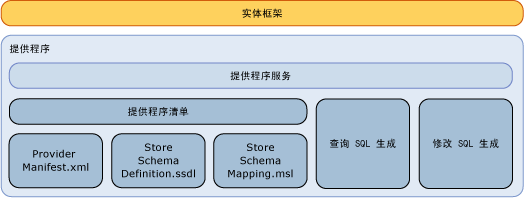

# 编写实体框架数据提供程序
本部分讨论如何编写[!INCLUDE[adonet_ef](../../../../../includes/adonet-ef-md.md)]提供程序以支持 SQL Server 以外的数据源。 [!INCLUDE[adonet_ef](../../../../../includes/adonet-ef-md.md)]包括支持 SQL Server 的提供程序。  
  
## 实体框架提供程序模型简介  
 [!INCLUDE[adonet_ef](../../../../../includes/adonet-ef-md.md)]是独立于数据库的，您可以使用 ADO.NET 提供程序模型编写提供程序以连接到不同的数据源集。  
  
 实体框架数据提供程序（通过使用 ADO.NET 数据提供程序模型构建）具有下列功能：  
  
-   将实体数据模型 (EDM) 基元类型映射到提供程序类型。  
  
-   公开提供程序特定的函数。  
  
-   为给定 DbQueryCommandTree 生成提供程序特定的命令以支持[!INCLUDE[adonet_ef](../../../../../includes/adonet-ef-md.md)]查询。  
  
-   为给定 DbModificationCommandTree 生成提供程序特定的更新命令以支持[!INCLUDE[adonet_ef](../../../../../includes/adonet-ef-md.md)]中的更新。  
  
-   公开存储架构定义的映射文件以支持基于数据库的模型生成。  
  
-   通过概念模型公开元数据（例如，表和视图）。  
  
   
  
## 示例  
 请参阅[实体框架示例提供程序](http://go.microsoft.com/fwlink/?LinkId=180616)有关的示例[!INCLUDE[adonet_ef](../../../../../includes/adonet-ef-md.md)]支持 SQL Server 以外的数据源提供程序。  
  
## 本节内容  
 [SQL 生成](../../../../../docs/framework/data/adonet/ef/sql-generation.md)  
  
 [修改 SQL 生成](../../../../../docs/framework/data/adonet/ef/modification-sql-generation.md)  
  
 [提供程序清单规范](../../../../../docs/framework/data/adonet/ef/provider-manifest-specification.md)  
  
## 请参阅  
 [使用数据提供程序](../../../../../docs/framework/data/adonet/ef/working-with-data-providers.md)
