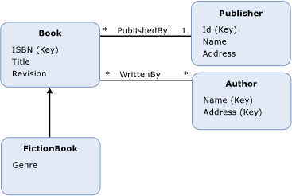

# 实体数据模型：继承Entity Data Model: Inheritance
实体数据模型 (EDM) 支持的继承[实体类型](../../../../docs/framework/data/adonet/entity-type.md)。The Entity Data Model (EDM) supports inheritance for [entity types](../../../../docs/framework/data/adonet/entity-type.md). EDM 中的继承与面向对象的编程语言中的类的继承类似。Inheritance in the EDM is similar to inheritance for classes in object-oriented programming languages. 像使用面向对象的语言中的类，在概念模型中可定义一个实体类型 (*派生类型*)，继承自另一个实体类型 (*基类型*)。Like with classes in object-oriented languages, in a conceptual model you can define an entity type (a *derived type*) that inherits from another entity type (the *base type*). 但是，与面向对象编程中的类，不同的概念模型中的派生的类型始终会继承所有[属性](../../../../docs/framework/data/adonet/property.md)和[导航属性](../../../../docs/framework/data/adonet/navigation-property.md)的基类型。However, unlike classes in object-oriented programming, in a conceptual model the derived type always inherits all the [properties](../../../../docs/framework/data/adonet/property.md) and [navigation properties](../../../../docs/framework/data/adonet/navigation-property.md) of the base type. 不能重写派生类型中的继承属性。You cannot override inherited properties in a derived type.  
  
 在概念模型中，可以构建继承层次结构，其中一个派生类型将继承自另一个派生类型。In a conceptual model you can build inheritance hierarchies in which a derived type inherits from another derived type. 在层次结构 （不是派生的类型的层次结构中的一个类型） 的顶部的类型称为*根类型*。The type at the top of the hierarchy (the one type in the hierarchy that is not a derived type) is called the *root type*. 继承层次结构，在[实体键](../../../../docs/framework/data/adonet/entity-key.md)必须在根类型上定义。In an inheritance hierarchy, the [entity key](../../../../docs/framework/data/adonet/entity-key.md) must be defined on the root type.  
  
 不能构建这样的继承层次结构，即一个派生类型继承自多个类型。You cannot build inheritance hierarchies in which a derived type inherits from more than one type. 例如，在包含 `Book` 实体类型的概念模型中，可以定义都是继承自 `FictionBook` 的派生类型 `NonFictionBook` 和 `Book`。For example, in a conceptual model with a `Book` entity type, you could define derived types `FictionBook` and `NonFictionBook` that each inherit from `Book`. 但是，随后不能定义同时继承自 `FictionBook` 和 `NonFictionBook` 类型的类型。However, you could not then define a type that inherits from both the `FictionBook` and `NonFictionBook` types.  
  
## 示例Example  
 下图显示了一个具有四个实体类型的概念模型：`Book`、`FictionBook`、`Publisher` 和 `Author`。The diagram below shows a conceptual model with four entity types: `Book`, `FictionBook`, `Publisher`, and `Author`. `FictionBook` 实体类型是一个派生类型，继承自 `Book` 实体类型。The `FictionBook` entity type is a derived type, inheriting from the `Book` entity type. `FictionBook` 类型继承了 `ISBN (Key)`、`Title` 和 `Revision` 属性，并定义了一个名为 `Genre` 的附加属性。The `FictionBook` type inherits the `ISBN (Key)`, `Title`, and `Revision` properties, and defines an additional property called `Genre`.  
  
   
  
 [ADO.NET 实体框架](../../../../docs/framework/data/adonet/ef/index.md)使用域特定语言 (DSL) 称为概念架构定义语言 ([CSDL](../../../../docs/framework/data/adonet/ef/language-reference/csdl-specification.md)) 来定义概念模型。The [ADO.NET Entity Framework](../../../../docs/framework/data/adonet/ef/index.md) uses a domain-specific language (DSL) called conceptual schema definition language ([CSDL](../../../../docs/framework/data/adonet/ef/language-reference/csdl-specification.md)) to define conceptual models. 下面的 CSDL 定义了一个实体类型 `FictionBook`，它继承自 `Book` 类型（如上图中所示）：The following CSDL defines an entity type, `FictionBook`, that inherits from the `Book` type (as in the diagram above):  
  
 [!code-xml[EDM_Example_Model#DerivedType](../../../../samples/snippets/xml/VS_Snippets_Data/edm_example_model/xml/books5.edmx#derivedtype)]  
  
## 另请参阅See Also  
 [实体数据模型关键概念Entity Data Model Key Concepts](../../../../docs/framework/data/adonet/entity-data-model-key-concepts.md)  
 [实体数据模型Entity Data Model](../../../../docs/framework/data/adonet/entity-data-model.md)
