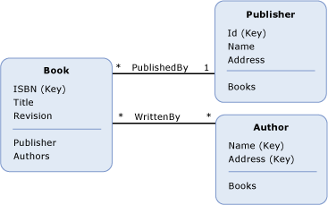

# 实体数据模型关键概念Entity Data Model Key Concepts
实体数据模型 (EDM) 使用三个关键概念来描述数据结构：*实体类型*，*关联类型*，和*属性*。The Entity Data Model (EDM) uses three key concepts to describe the structure of data: *entity type*, *association type*, and *property*. 在任何 EDM 实现中，这些都是描述数据结构的最重要概念。These are the most important concepts in describing the structure of data in any implementation of the EDM.  
  
## 实体类型Entity Type  
 [实体类型](../../../../docs/framework/data/adonet/entity-type.md)是用于描述实体数据模型的数据结构的基本构建块。The [entity type](../../../../docs/framework/data/adonet/entity-type.md) is the fundamental building block for describing the structure of data with the Entity Data Model. 在概念模型中，实体类型都从构造[属性](../../../../docs/framework/data/adonet/property.md)介绍的结构的顶级概念，如客户和订单中的业务应用程序。In a conceptual model, entity types are constructed from [properties](../../../../docs/framework/data/adonet/property.md) and describe the structure of top-level concepts, such as a customers and orders in a business application. 正如计算机程序中的类定义是用于类实例的模板一样，实体类型也是实体的模板。In the same way that a class definition in a computer program is a template for instances of the class, an entity type is a template for entities. 实体表示一个特定对象（例如特定的客户或订单）。An entity represents a specific object (such as a specific customer or order). 每个实体都必须具有唯一[实体键](../../../../docs/framework/data/adonet/entity-key.md)内[实体集](../../../../docs/framework/data/adonet/entity-set.md)。Each entity must have a unique [entity key](../../../../docs/framework/data/adonet/entity-key.md) within an [entity set](../../../../docs/framework/data/adonet/entity-set.md).  实体集是指特定实体类型的实例集合。An entity set is a collection of instances of a specific entity type. 实体集 (和[关联集](../../../../docs/framework/data/adonet/association-set.md)) 按逻辑分组在[实体容器](../../../../docs/framework/data/adonet/entity-container.md)。Entity sets (and [association sets](../../../../docs/framework/data/adonet/association-set.md)) are logically grouped in an [entity container](../../../../docs/framework/data/adonet/entity-container.md).  
  
 实体类型支持继承功能：即一个实体类型可以从另一个实体类型中派生。Inheritance is supported with entity types: that is, one entity type can be derived from another. 有关详细信息，请参阅[实体数据模型： 继承](../../../../docs/framework/data/adonet/entity-data-model-inheritance.md)。For more information, see [Entity Data Model: Inheritance](../../../../docs/framework/data/adonet/entity-data-model-inheritance.md).  
  
## 关联类型Association Type  
 [关联类型](../../../../docs/framework/data/adonet/association-type.md)（也称为关联） 是用于描述实体数据模型中的关系的基本构建块。An [association type](../../../../docs/framework/data/adonet/association-type.md) (also called an association) is the fundamental building block for describing relationships in the Entity Data Model. 在概念模型中，关联表示两个实体类型（例如 Customer 和 Order）之间的关系。In a conceptual model, an association represents a relationship between two entity types (such as Customer and Order). 每个关联了两个[关联端](../../../../docs/framework/data/adonet/association-end.md)指定关联中涉及的实体类型。Every association has two [association ends](../../../../docs/framework/data/adonet/association-end.md) that specify the entity types involved in the association. 每个关联端还指定[关联端重数](../../../../docs/framework/data/adonet/association-end-multiplicity.md)，该值指示可在该关联一端的实体数。Each association end also specifies an [association end multiplicity](../../../../docs/framework/data/adonet/association-end-multiplicity.md) that indicates the number of entities that can be at that end of the association. 关联端重数的值可以为“一 (1)”、“零或一 (0..1)”或“多 (*)”。An association end multiplicity can have a value of one (1), zero or one (0..1), or many (*). 可以通过访问的关联另一端的实体[导航属性](../../../../docs/framework/data/adonet/navigation-property.md)，或如果它们公开的实体类型上的外键。Entities at one end of an association can be accessed through [navigation properties](../../../../docs/framework/data/adonet/navigation-property.md), or through foreign keys if they are exposed on an entity type. 有关详细信息，请参阅[外键属性](../../../../docs/framework/data/adonet/foreign-key-property.md)。For more information, see [foreign key property](../../../../docs/framework/data/adonet/foreign-key-property.md).  
  
 在应用程序中，关联实例表示特定的关联（例如 Customer 实例与 Order 实例之间的关联）。In an application, an instance of an association represents a specific association (such as an association between an instance of Customer and instances of Order). 关联实例按逻辑分组在[关联集](../../../../docs/framework/data/adonet/association-set.md)。Association instances are logically grouped in an [association set](../../../../docs/framework/data/adonet/association-set.md). 关联集 (和[实体集](../../../../docs/framework/data/adonet/entity-set.md)) 按逻辑分组在[实体容器](../../../../docs/framework/data/adonet/entity-container.md)。Association sets (and [entity sets](../../../../docs/framework/data/adonet/entity-set.md)) are logically grouped in an [entity container](../../../../docs/framework/data/adonet/entity-container.md).  
  
## 属性Property  
 [实体类型](../../../../docs/framework/data/adonet/entity-type.md)包含[属性](../../../../docs/framework/data/adonet/property.md)，用于定义其结构和特征。[Entity types](../../../../docs/framework/data/adonet/entity-type.md) contain [properties](../../../../docs/framework/data/adonet/property.md) that define their structure and characteristics. 例如，Customer 实体类型可能具有 CustomerId、Name 及 Address 这样的属性。For example, a Customer entity type may have properties such as CustomerId, Name, and Address.  
  
 概念模型中的属性类似于对计算机程序中的类所定义的属性。Properties in a conceptual model are analogous to properties defined on a class in a computer program. 正如类的属性定义类的形状和携带有关对象的信息一样，概念模型中的属性也定义实体类型的形状和携带有关实体类型实例的信息。In the same way that properties on a class define the shape of the class and carry information about objects, properties in a conceptual model define the shape of an entity type and carry information about entity type instances.  
  
 属性可以包含基元数据（例如字符串、整数或布尔值）或结构化数据（例如复杂类型）。A property can contain primitive data (such as a string, an integer, or a Boolean value), or structured data (such as a complex type). 有关详细信息，请参阅[实体数据模型： 基元数据类型](../../../../docs/framework/data/adonet/entity-data-model-primitive-data-types.md)。For more information, see [Entity Data Model: Primitive Data Types](../../../../docs/framework/data/adonet/entity-data-model-primitive-data-types.md).  
  
## 概念模型的表示形式Representations of a Conceptual Model  
 A*概念模型*是以实体和关系的特定表示形式的某些数据结构。A *conceptual model* is a specific representation of the structure of some data as entities and relationships. 概念模型的一种表示形式是图表。One way to represent a conceptual model is with a diagram. 下图用三个实体类型（`Book`、`Publisher` 和 `Author`）以及两个关联（`PublishedBy` 和 `WrittenBy`）来表示概念模型：The following diagram represents a conceptual model with three entity types (`Book`, `Publisher`, and `Author`) and two associations (`PublishedBy` and `WrittenBy`):  
  
   
  
 然而，如果要传达一些有关模型的详细信息，这种表现形式存在一些不足。This representation, however, has some shortcomings when it comes to conveying some details about the model. 例如，图中没有传达属性类型和实体集信息。For example, property type and entity set information are not conveyed in the diagram. 域特定语言 (DSL) 可用于更明确地传达有关概念模型的大量信息。The richness of a conceptual model can be conveyed more clearly with a domain-specific language (DSL). [ADO.NET 实体框架](../../../../docs/framework/data/adonet/ef/index.md)使用调用的基于 XML 的 DSL*概念架构定义语言*([CSDL](../../../../docs/framework/data/adonet/ef/language-reference/csdl-specification.md)) 来定义概念模型。The [ADO.NET Entity Framework](../../../../docs/framework/data/adonet/ef/index.md) uses an XML-based DSL called *conceptual schema definition language* ([CSDL](../../../../docs/framework/data/adonet/ef/language-reference/csdl-specification.md)) to define conceptual models. 下面是上图所示的概念模型的 CSDL 定义。The following is the CSDL definition of the conceptual model in the diagram above:  
  
 [!code-xml[EDM_Example_Model#EDMExampleCSDL](../../../../samples/snippets/xml/VS_Snippets_Data/edm_example_model/xml/books.edmx#edmexamplecsdl)]  
  
## 另请参阅See Also  
 [实体数据模型Entity Data Model](../../../../docs/framework/data/adonet/entity-data-model.md)
