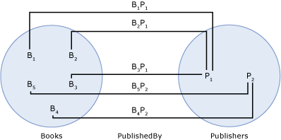

# 实体集
*实体集*是的逻辑容器的实例[实体类型](../../../../docs/framework/data/adonet/entity-type.md)和从该实体类型派生的任何类型的实例。 (有关派生类型的信息，请参阅[实体数据模型： 继承](../../../../docs/framework/data/adonet/entity-data-model-inheritance.md)。)实体类型与实体集之间的关系类似于关系数据库中行与表之间的关系：与行类似，实体类型描述了数据结构，而与表类似，实体集包含了给定结构的实例。 实体集不是一种数据建模构造，它没有描述数据结构。 相反，实体集提供了一种承载或存储环境构造（例如公共语言运行库或 SQL Server 数据库）来分组实体类型实例，以便可以将它们映射到某个数据存储区。  
  
 实体集定义中[实体容器](../../../../docs/framework/data/adonet/entity-container.md)，这是实体集的逻辑分组和[关联集](../../../../docs/framework/data/adonet/association-set.md)。  
  
 对于实体集中存在的实体类型实例，必须满足以下条件：  
  
-   实例的类型或者与实体集所基于的实体类型相同，或者是该实体类型的一个子类型。  
  
-   [实体键](../../../../docs/framework/data/adonet/entity-key.md)实例是在实体集内唯一。  
  
-   实例不存在于任何其他实体集中。  
  
    > [!NOTE]
    >  可以使用相同的实体类型定义多个实体集，但某个给定实体类型的一个实例只能存在于一个实体集中。  
  
 不必为概念模型中的每个实体类型都定义实体集。  
  
## 示例  
 下图显示了一个具有三个实体类型的概念模型：`Book`、`Publisher` 和 `Author`。  
  
   
  
 下图显示了基于上面所示的概念模型的两个实体集（`Books` 和 `Publishers`）和一个关联集 (`PublishedBy`)。 在 bi`Books`实体集表示的实例`Book`在运行时的实体类型。 同样，Pj 表示`Publisher`实例中`Publishers`实体集。 BiPj 表示的实例`PublishedBy`中的关联`PublishedBy`关联集。  
  
   
  
 [ADO.NET 实体框架](../../../../docs/framework/data/adonet/ef/index.md)使用域特定语言 (DSL) 称为概念架构定义语言 ([CSDL](../../../../docs/framework/data/adonet/ef/language-reference/csdl-specification.md)) 来定义概念模型。 下面的 CSDL 定义了一个实体容器，其中对于上图所示的概念模型中的每个实体类型都有一个实体集。 请注意，每个实体集的名称和实体类型都是使用 XML 特性定义的。  
  
 [!code-xml[EDM_Example_Model#EntityContainerExample](../../../../samples/snippets/xml/VS_Snippets_Data/edm_example_model/xml/books.edmx#entitycontainerexample)]  
  
 每个类型可以定义多个实体集 (MEST)。 下面的 CSDL 定义了一个实体容器，其中包含 `Book` 实体类型的两个实体集：  
  
 [!code-xml[EDM_Example_Model#MESTExample](../../../../samples/snippets/xml/VS_Snippets_Data/edm_example_model/xml/books2.edmx#mestexample)]  
  
## 请参阅  
 [实体数据模型关键概念](../../../../docs/framework/data/adonet/entity-data-model-key-concepts.md)  
 [实体数据模型](../../../../docs/framework/data/adonet/entity-data-model.md)
