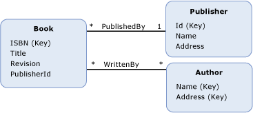

# 外键属性foreign key property
A*外键属性*实体数据模型 (EDM) 中是基元类型[属性](../../../../docs/framework/data/adonet/property.md)（或一组基元类型属性） 上[实体类型](../../../../docs/framework/data/adonet/entity-type.md)包含[实体键](../../../../docs/framework/data/adonet/entity-key.md)另一个实体类型。A *foreign key property* in the Entity Data Model (EDM) is a primitive type [property](../../../../docs/framework/data/adonet/property.md) (or a set of primitive type properties) on an [entity type](../../../../docs/framework/data/adonet/entity-type.md) that contains the [entity key](../../../../docs/framework/data/adonet/entity-key.md) of another entity type.  
  
 外键属性相当于关系数据库中的外键列。A foreign key property is analogous to a foreign key column in a relational database. 在关系数据库中使用外键列是表中的行之间创建关系的方式相同，在概念模型中的外键属性用于建立[关联](../../../../docs/framework/data/adonet/association-type.md)实体类型之间。In the same way that foreign key columns are used in a relational database to create relationships between rows in tables, foreign key properties in a conceptual model are used to establish [associations](../../../../docs/framework/data/adonet/association-type.md) between entity types. A[引用完整性约束](../../../../docs/framework/data/adonet/referential-integrity-constraint.md)用于定义当某个类型具有外键属性的两个实体类型之间的关联。A [referential integrity constraint](../../../../docs/framework/data/adonet/referential-integrity-constraint.md) is used to define an association between two entity types when one of the types has a foreign key property.  
  
## 示例Example  
 下图显示了一个具有三个实体类型的概念模型：`Book`、`Publisher` 和 `Author`。The diagram below shows a conceptual model with three entity types: `Book`, `Publisher`, and `Author`. `Book` 实体类型有一个属性 `PublisherId`，当您为 `Publisher` 关联定义一个引用完整性约束时，它将引用 `PublishedBy` 实体类型的实体键。The `Book` entity type has a property, `PublisherId`, that references the entity key of the `Publisher` entity type when you define a referential integrity constraint on the `PublishedBy` association.  
  
   
  
 [ADO.NET 实体框架](../../../../docs/framework/data/adonet/ef/index.md)使用域特定语言 (DSL) 称为概念架构定义语言 ([CSDL](../../../../docs/framework/data/adonet/ef/language-reference/csdl-specification.md)) 来定义概念模型。The [ADO.NET Entity Framework](../../../../docs/framework/data/adonet/ef/index.md) uses a domain-specific language (DSL) called conceptual schema definition language ([CSDL](../../../../docs/framework/data/adonet/ef/language-reference/csdl-specification.md)) to define conceptual models. 下面的 CSDL 使用外键属性 `PublisherId` 为上图所示的概念模型中的 `PublishedBy` 关联定义了一个引用完整性约束。The following CSDL uses the foreign key property `PublisherId` to define a referential integrity constraint on the `PublishedBy` association shown in the conceptual model shown above.  
  
 [!code-xml[EDM_Example_Model#RefConstraint](../../../../samples/snippets/xml/VS_Snippets_Data/edm_example_model/xml/books4.edmx#refconstraint)]  
  
## 请参阅See Also  
 [实体数据模型关键概念Entity Data Model Key Concepts](../../../../docs/framework/data/adonet/entity-data-model-key-concepts.md)  
 [实体数据模型Entity Data Model](../../../../docs/framework/data/adonet/entity-data-model.md)
