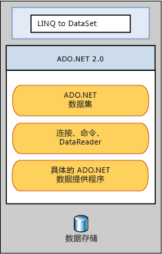

# LINQ to DataSetLINQ to DataSet
使用 [!INCLUDE[linq_dataset](../../../../includes/linq-dataset-md.md)] 可以更快更容易地查询在 <xref:System.Data.DataSet> 对象中缓存的数据。[!INCLUDE[linq_dataset](../../../../includes/linq-dataset-md.md)] makes it easier and faster to query over data cached in a <xref:System.Data.DataSet> object. 具体而言，通过使开发人员能够使用编程语言本身而不是通过使用单独的查询语言来编写查询，[!INCLUDE[linq_dataset](../../../../includes/linq-dataset-md.md)] 可以简化查询。Specifically, [!INCLUDE[linq_dataset](../../../../includes/linq-dataset-md.md)] simplifies querying by enabling developers to write queries from the programming language itself, instead of by using a separate query language. 对于现在可以在其查询中利用 [!INCLUDE[vsprvs](../../../../includes/vsprvs-md.md)] 所提供的编译时语法检查、静态类型和 IntelliSense 支持的 [!INCLUDE[vsprvs](../../../../includes/vsprvs-md.md)] 开发人员，这特别有用。This is especially useful for [!INCLUDE[vsprvs](../../../../includes/vsprvs-md.md)] developers, who can now take advantage of the compile-time syntax checking, static typing, and IntelliSense support provided by the [!INCLUDE[vsprvs](../../../../includes/vsprvs-md.md)] in their queries.  
  
 [!INCLUDE[linq_dataset](../../../../includes/linq-dataset-md.md)] 也可用于查询从一个或多个数据源合并的数据。 can also be used to query over data that has been consolidated from one or more data sources. 这可以使许多需要灵活表示和处理数据的方案（例如查询本地聚合的数据和 Web 应用程序中的中间层缓存）能够实现。This enables many scenarios that require flexibility in how data is represented and handled, such as querying locally aggregated data and middle-tier caching in Web applications. 具体地说，一般报告、分析和业务智能应用程序将需要这种操作方法。In particular, generic reporting, analysis, and business intelligence applications require this method of manipulation.  
  
 [!INCLUDE[linq_dataset](../../../../includes/linq-dataset-md.md)]主要通过中的扩展方法公开功能<xref:System.Data.DataRowExtensions>和<xref:System.Data.DataTableExtensions>类。The [!INCLUDE[linq_dataset](../../../../includes/linq-dataset-md.md)] functionality is exposed primarily through the extension methods in the <xref:System.Data.DataRowExtensions> and <xref:System.Data.DataTableExtensions> classes. [!INCLUDE[linq_dataset](../../../../includes/linq-dataset-md.md)]基于并使用现有[!INCLUDE[ado_whidbey_long](../../../../includes/ado-whidbey-long-md.md)]体系结构，不能替换[!INCLUDE[ado_whidbey_long](../../../../includes/ado-whidbey-long-md.md)]应用程序代码中。 builds on and uses the existing [!INCLUDE[ado_whidbey_long](../../../../includes/ado-whidbey-long-md.md)] architecture, and is not meant to replace [!INCLUDE[ado_whidbey_long](../../../../includes/ado-whidbey-long-md.md)] in application code. 现有的 ADO.NET 2.0 代码将继续在 [!INCLUDE[linq_dataset](../../../../includes/linq-dataset-md.md)] 应用程序中有效。Existing ADO.NET 2.0 code will continue to function in a [!INCLUDE[linq_dataset](../../../../includes/linq-dataset-md.md)] application. 下图阐释了 [!INCLUDE[linq_dataset](../../../../includes/linq-dataset-md.md)] 与 [!INCLUDE[ado_whidbey_long](../../../../includes/ado-whidbey-long-md.md)] 和数据存储区的关系。The relationship of [!INCLUDE[linq_dataset](../../../../includes/linq-dataset-md.md)] to [!INCLUDE[ado_whidbey_long](../../../../includes/ado-whidbey-long-md.md)] and the data store is illustrated in the following diagram.  
  
   
  
## 本节内容In This Section  
 [入门Getting Started](../../../../docs/framework/data/adonet/getting-started-linq-to-dataset.md)  
  
 [编程指南Programming Guide](../../../../docs/framework/data/adonet/programming-guide-linq-to-dataset.md)  
  
## 参考Reference  
 <xref:System.Data.DataTableExtensions>  
  
 <xref:System.Data.DataRowExtensions>  
  
 <xref:System.Data.DataRowComparer>  
  
## 请参阅See Also  
 [LINQ（语言集成查询）LINQ (Language-Integrated Query)](http://msdn.microsoft.com/library/a73c4aec-5d15-4e98-b962-1274021ea93d)  
 [LINQ 和 ADO.NETLINQ and ADO.NET](../../../../docs/framework/data/adonet/linq-and-ado-net.md)  
 [ADO.NETADO.NET](../../../../docs/framework/data/adonet/index.md)
