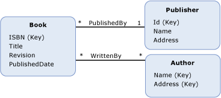

# 模型定义函数
A*模型定义函数*是在概念模型中定义的函数。 模型定义函数的主体用表示[Entity SQL](../../../../docs/framework/data/adonet/ef/language-reference/entity-sql-language.md)，这样，当函数为独立于表示规则或语言在数据源中受支持。  
  
 模型定义函数的定义包含以下信息：  
  
-   函数名。 （必需）  
  
-   返回值的类型。 （可选）  
  
    > [!NOTE]
    >  如果未指定返回类型，则返回值为 void。  
  
-   参数信息。 （可选）  
  
-   [Entity SQL](../../../../docs/framework/data/adonet/ef/language-reference/entity-sql-language.md)定义函数的主体的表达式。  
  
 请注意，模型定义函数不支持输出参数。 这一限制可以保证无法对模型定义函数进行编写。  
  
## 示例  
 下图显示了一个具有三个实体类型的概念模型：`Book`、`Publisher` 和 `Author`。  
  
   
  
 [ADO.NET 实体框架](../../../../docs/framework/data/adonet/ef/index.md)使用域特定语言 (DSL) 称为概念架构定义语言 ([CSDL](../../../../docs/framework/data/adonet/ef/language-reference/csdl-specification.md)) 来定义概念模型。 下面的 CSDL 在概念模型中定义了一个函数，它返回自某个 `Book` 实例（如上图所示）出版以来的年数。  
  
 [!code-xml[EDM_Example_Model#ModelDefinedFunction](../../../../samples/snippets/xml/VS_Snippets_Data/edm_example_model/xml/books4.edmx#modeldefinedfunction)]  
  
## 请参阅  
 [实体数据模型关键概念](../../../../docs/framework/data/adonet/entity-data-model-key-concepts.md)  
 [实体数据模型](../../../../docs/framework/data/adonet/entity-data-model.md)  
 [实体数据模型：基元数据类型](../../../../docs/framework/data/adonet/entity-data-model-primitive-data-types.md)
