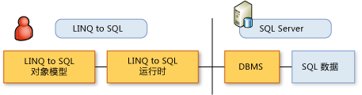

# 使用 LINQ to SQL 的典型步骤Typical Steps for Using LINQ to SQL
若要实现 [!INCLUDE[vbtecdlinq](../../../../../../includes/vbtecdlinq-md.md)] 应用程序，请按照本主题后面部分说明的步骤操作。To implement a [!INCLUDE[vbtecdlinq](../../../../../../includes/vbtecdlinq-md.md)] application, you follow the steps described later in this topic. 请注意，很多步骤是可选的。Note that many steps are optional. 您可以以对象模型的默认状态使用它，这种可能性很高。It is very possible that you can use your object model in its default state.  
  
 为了很快入手，请使用 [!INCLUDE[vs_ordesigner_long](../../../../../../includes/vs-ordesigner-long-md.md)] 来创建对象模型并开始编写查询代码。For a really fast start, use the [!INCLUDE[vs_ordesigner_long](../../../../../../includes/vs-ordesigner-long-md.md)] to create your object model and start coding your queries.  
  
## 创建对象模型Creating the Object Model  
 第一步是用现有关系数据库的元数据创建对象模型。The first step is to create an object model from the metadata of an existing relational database. 对象模型按照开发人员所用的编程语言来表示数据库。The object model represents the database according to the programming language of the developer. 有关详细信息，请参阅[LINQ to SQL 对象模型](../../../../../../docs/framework/data/adonet/sql/linq/the-linq-to-sql-object-model.md)。For more information, see [The LINQ to SQL Object Model](../../../../../../docs/framework/data/adonet/sql/linq/the-linq-to-sql-object-model.md).  
  
### 1.选择用于创建模型的工具。1. Select a tool to create the model.  
 有三种工具可用于创建模型。Three tools are available for creating the model.  
  
-   必须向The [!INCLUDE[vs_ordesigner_long](../../../../../../includes/vs-ordesigner-long-md.md)]  
  
     此设计器提供了用于从现有数据库创建对象模型的丰富用户界面。This designer provides a rich user interface for creating an object model from an existing database. 此工具是 Visual Studio IDE 的一部分，最适合于小型或中型数据库。This tool is part of the Visual Studio IDE, and is best suited to small or medium databases.  
  
-   SQLMetal 代码生成工具The SQLMetal code-generation tool  
  
     此命令行实用工具提供了与 [!INCLUDE[vs_ordesigner_short](../../../../../../includes/vs-ordesigner-short-md.md)]略微不同的一组选项。This command-line utility provides a slightly different set of options from the [!INCLUDE[vs_ordesigner_short](../../../../../../includes/vs-ordesigner-short-md.md)]. 最好使用此工具对大型数据库进行建模。Modeling large databases is best done by using this tool. 有关详细信息，请参阅 [SqlMetal.exe（代码生成工具）](../../../../../../docs/framework/tools/sqlmetal-exe-code-generation-tool.md)。For more information, see [SqlMetal.exe (Code Generation Tool)](../../../../../../docs/framework/tools/sqlmetal-exe-code-generation-tool.md).  
  
-   代码编辑器A code editor  
  
     可以通过使用 Visual Studio 代码编辑器或其他编辑器编写你自己的代码。You can write your own code by using either the Visual Studio code editor or another editor. 我们建议，在您具有现有数据库且可以使用 [!INCLUDE[vs_ordesigner_short](../../../../../../includes/vs-ordesigner-short-md.md)]或 SQLMetal 工具时不要使用这种方法，因为这种方法容易出错。We do not recommend this approach, which can be prone to errors, when you have an existing database and can use either the [!INCLUDE[vs_ordesigner_short](../../../../../../includes/vs-ordesigner-short-md.md)] or the SQLMetal tool. 但是，代码编辑器在改进或修改你已通过使用其他工具生成的代码方面非常有用。However, the code editor can be valuable for refining or modifying code you have already generated by using other tools. 有关详细信息，请参阅[如何：通过使用代码编辑器自定义实体类](../../../../../../docs/framework/data/adonet/sql/linq/how-to-customize-entity-classes-by-using-the-code-editor.md)。For more information, see [How to: Customize Entity Classes by Using the Code Editor](../../../../../../docs/framework/data/adonet/sql/linq/how-to-customize-entity-classes-by-using-the-code-editor.md).  
  
### 2.选择你要生成的代码类型。2. Select the kind of code you want to generate.  
  
-   一个C#或 Visual Basic 源代码文件进行基于属性的映射。A C# or Visual Basic source code file for attribute-based mapping.  
  
     然后，在 Visual Studio 项目中将此代码文件。You then include this code file in your Visual Studio project. 有关详细信息，请参阅[基于属性的映射](../../../../../../docs/framework/data/adonet/sql/linq/attribute-based-mapping.md)。For more information, see [Attribute-Based Mapping](../../../../../../docs/framework/data/adonet/sql/linq/attribute-based-mapping.md).  
  
-   用于外部映射的 XML 文件。An XML file for external mapping.  
  
     通过使用此方法，你可以将映射元数据放在应用程序代码外部。By using this approach, you can keep the mapping metadata out of your application code. 有关详细信息，请参阅[外部映射](../../../../../../docs/framework/data/adonet/sql/linq/external-mapping.md)。For more information, see [External Mapping](../../../../../../docs/framework/data/adonet/sql/linq/external-mapping.md).  
  
    > [!NOTE]
    >  [!INCLUDE[vs_ordesigner_short](../../../../../../includes/vs-ordesigner-short-md.md)]不支持生成外部映射文件。The [!INCLUDE[vs_ordesigner_short](../../../../../../includes/vs-ordesigner-short-md.md)] does not support the generation of external mapping files. 您必须使用 SQLMetal 工具来实现此功能。You must use the SQLMetal tool to implement this feature.  
  
-   DBML 文件，你可以在生成最终代码文件之前修改此文件。A DBML file, which you can modify before generating a final code file.  
  
     这是一项高级功能。This is an advanced feature.  
  
### 3.改进代码文件以反映你的应用程序的需要。3. Refine the code file to reflect the needs of your application.  
 为此，你可以使用 [!INCLUDE[vs_ordesigner_short](../../../../../../includes/vs-ordesigner-short-md.md)]或代码编辑器。For this purpose, you can use either the [!INCLUDE[vs_ordesigner_short](../../../../../../includes/vs-ordesigner-short-md.md)] or the code editor.  
  
## 使用对象模型Using the Object Model  
 下图显示了在两层方案中开发人员与数据之间的关系。The following illustration shows the relationship between the developer and the data in a two-tier scenario. 有关其他方案，请参阅[N 层和远程应用程序使用 LINQ 到 SQL](../../../../../../docs/framework/data/adonet/sql/linq/n-tier-and-remote-applications-with-linq-to-sql.md)。For other scenarios, see [N-Tier and Remote Applications with LINQ to SQL](../../../../../../docs/framework/data/adonet/sql/linq/n-tier-and-remote-applications-with-linq-to-sql.md).  
  
   
  
 既然您已经有了对象模型，您就可以在该模型中描述信息请求和操作数据。Now that you have the object model, you describe information requests and manipulate data within that model. 您应从对象模型中的对象和属性的角度来考虑，而不是从数据库的行和列的角度来考虑。You think in terms of the objects and properties in your object model and not in terms of the rows and columns of the database. 您不是直接对数据库进行操作。You do not deal directly with the database.  
  
 当您指示 [!INCLUDE[vbtecdlinq](../../../../../../includes/vbtecdlinq-md.md)] 执行您已描述的查询或对您已操作的数据调用 `SubmitChanges()` 时，[!INCLUDE[vbtecdlinq](../../../../../../includes/vbtecdlinq-md.md)] 会用数据库的语言与数据库通信。When you instruct [!INCLUDE[vbtecdlinq](../../../../../../includes/vbtecdlinq-md.md)] to either execute a query that you have described or call `SubmitChanges()` on data that you have manipulated, [!INCLUDE[vbtecdlinq](../../../../../../includes/vbtecdlinq-md.md)] communicates with the database in the language of the database.  
  
 以下内容代表使用您已创建的对象模型的典型步骤。The following represents typical steps for using the object model that you have created.  
  
### 1.创建查询以从数据库中检索信息。1. Create queries to retrieve information from the database.  
 有关详细信息，请参阅[查询概念](../../../../../../docs/framework/data/adonet/sql/linq/query-concepts.md)并[查询示例](../../../../../../docs/framework/data/adonet/sql/linq/query-examples.md)。For more information, see [Query Concepts](../../../../../../docs/framework/data/adonet/sql/linq/query-concepts.md) and [Query Examples](../../../../../../docs/framework/data/adonet/sql/linq/query-examples.md).  
  
### 2.重写 Insert、Update 和 Delete 的默认行为。2. Override default behaviors for Insert, Update, and Delete.  
 这一步是可选的。This step is optional. 有关详细信息，请参阅[自定义插入、 更新和删除操作](../../../../../../docs/framework/data/adonet/sql/linq/customizing-insert-update-and-delete-operations.md)。For more information, see [Customizing Insert, Update, and Delete Operations](../../../../../../docs/framework/data/adonet/sql/linq/customizing-insert-update-and-delete-operations.md).  
  
### 3.设置适当的选项以检测和报告并发冲突。3. Set appropriate options to detect and report concurrency conflicts.  
 您可以保留模型用于处理并发冲突的默认值，也可以根据您的需要对其进行更改。You can leave your model with its default values for handling concurrency conflicts, or you can change it to suit your purposes. 有关详细信息，请参阅[如何：指定针对并发冲突对哪些成员进行测试](../../../../../../docs/framework/data/adonet/sql/linq/how-to-specify-which-members-are-tested-for-concurrency-conflicts.md)和[如何：指定引发时并发异常](../../../../../../docs/framework/data/adonet/sql/linq/how-to-specify-when-concurrency-exceptions-are-thrown.md)。For more information, see [How to: Specify Which Members are Tested for Concurrency Conflicts](../../../../../../docs/framework/data/adonet/sql/linq/how-to-specify-which-members-are-tested-for-concurrency-conflicts.md) and [How to: Specify When Concurrency Exceptions are Thrown](../../../../../../docs/framework/data/adonet/sql/linq/how-to-specify-when-concurrency-exceptions-are-thrown.md).  
  
### 4.建立继承层次结构。4. Establish an inheritance hierarchy.  
 这一步是可选的。This step is optional. 有关详细信息，请参阅[层次结构支持](../../../../../../docs/framework/data/adonet/sql/linq/inheritance-support.md)。For more information, see [Inheritance Support](../../../../../../docs/framework/data/adonet/sql/linq/inheritance-support.md).  
  
### 5.提供合适的用户界面。5. Provide an appropriate user interface.  
 这一步是可选的，取决于您的应用程序的使用方式。This step is optional, and depends on how your application will be used.  
  
### 6.调试并测试应用程序。6. Debug and test your application.  
 有关详细信息，请参阅[调试支持](../../../../../../docs/framework/data/adonet/sql/linq/debugging-support.md)。For more information, see [Debugging Support](../../../../../../docs/framework/data/adonet/sql/linq/debugging-support.md).  
  
## 请参阅See also

- [入门Getting Started](../../../../../../docs/framework/data/adonet/sql/linq/getting-started.md)
- [创建对象模型Creating the Object Model](../../../../../../docs/framework/data/adonet/sql/linq/creating-the-object-model.md)
- [存储过程Stored Procedures](../../../../../../docs/framework/data/adonet/sql/linq/stored-procedures.md)
