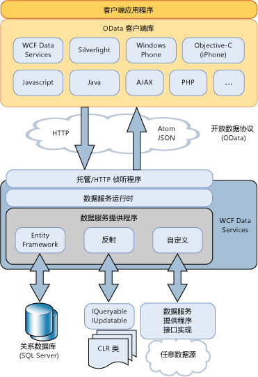

# WCF 数据服务概述WCF Data Services Overview
[!INCLUDE[ssAstoria](../../../../includes/ssastoria-md.md)] 支持使用来创建和使用的 Web 或 intranet 的数据服务[!INCLUDE[ssODataFull](../../../../includes/ssodatafull-md.md)]。 enables creation and consumption of data services for the Web or an intranet by using the [!INCLUDE[ssODataFull](../../../../includes/ssodatafull-md.md)]. [!INCLUDE[ssODataShort](../../../../includes/ssodatashort-md.md)] 使您能够将数据公开为通过 Uri 进行寻址的资源。 enables you to expose your data as resources that are addressable by URIs. 这样，您就可以通过使用具象状态传输 (REST) 的语义（尤其是标准 HTTP 谓词 GET、PUT、POST 和 DELETE）来访问和更改数据。This enables you to access and change data by using the semantics of representational state transfer (REST), specifically the standard HTTP verbs of GET, PUT, POST, and DELETE. 本主题概述了 [!INCLUDE[ssODataShort](../../../../includes/ssodatashort-md.md)] 定义的模式和做法，另外还介绍 [!INCLUDE[ssAstoria](../../../../includes/ssastoria-md.md)]提供的帮助在基于 .NET Framework 的应用程序中使用 [!INCLUDE[ssODataShort](../../../../includes/ssodatashort-md.md)] 的工具。This topic provides an overview of both the patterns and practices defined by [!INCLUDE[ssODataShort](../../../../includes/ssodatashort-md.md)] and also the facilities provided by [!INCLUDE[ssAstoria](../../../../includes/ssastoria-md.md)] to take advantage of [!INCLUDE[ssODataShort](../../../../includes/ssodatashort-md.md)] in .NET Framework-based applications.  
  
## 以资源形式对数据进行寻址Address Data as Resources  
 [!INCLUDE[ssODataShort](../../../../includes/ssodatashort-md.md)] 将数据公开为可通过 URI 进行寻址的资源。 exposes data as resources that are addressable by URIs. 基于实体数据模型的实体关系约定构造资源路径。The resource paths are constructed based on the entity-relationship conventions of the Entity Data Model. 在此模型中，实体表示应用程序域，如客户、 订单、 项和产品中的数据的操作单元。In this model, entities represent operational units of data in an application domain, such as customers, orders, items, and products. 有关详细信息，请参阅[实体数据模型](../../../../docs/framework/data/adonet/entity-data-model.md)。For more information, see [Entity Data Model](../../../../docs/framework/data/adonet/entity-data-model.md).  
  
 在 [!INCLUDE[ssODataShort](../../../../includes/ssodatashort-md.md)] 中，实体资源地址的形式为包含实体类型实例的实体集。In [!INCLUDE[ssODataShort](../../../../includes/ssodatashort-md.md)], you address entity resources as an entity set that contains instances of entity types. 例如，URI`http://services.odata.org/Northwind/Northwind.svc/Customers('ALFKI')/Orders`返回的所有从订单`Northwind`与客户相关的数据服务`CustomerID`的值 `ALFKI.`For example, the URI `http://services.odata.org/Northwind/Northwind.svc/Customers('ALFKI')/Orders` returns all of the orders from the `Northwind` data service that are related to the customer with a `CustomerID` value of `ALFKI.`  
  
 利用查询表达式，可以对资源执行传统的查询操作，如筛选、排序和分页。Query expressions enable you to perform traditional query operations against resources, such as filtering, sorting, and paging. 例如，URI `http://services.odata.org/Northwind/Northwind.svc/Customers('ALFKI')/Orders?$filter=Freight gt 50` 对资源进行筛选，以仅返回运费高于 50 美元的订单。For example, the URI `http://services.odata.org/Northwind/Northwind.svc/Customers('ALFKI')/Orders?$filter=Freight gt 50` filters the resources to return only the orders with a freight cost of more than $50. 有关详细信息，请参阅[访问数据服务资源](../../../../docs/framework/data/wcf/accessing-data-service-resources-wcf-data-services.md)。For more information, see [Accessing Data Service Resources](../../../../docs/framework/data/wcf/accessing-data-service-resources-wcf-data-services.md).  
  
## 可互操作的数据访问Interoperable Data Access  
 [!INCLUDE[ssODataShort](../../../../includes/ssodatashort-md.md)] 基于标准 Internet 协议来使数据服务与不使用.NET Framework 的应用程序进行互操作。 builds on standard Internet protocols to make data services interoperable with applications that do not use the .NET Framework. 因为您可以使用标准 Uri 对数据进行寻址，应用程序可以访问和更改数据，通过使用具象状态传输 (REST)，尤其是标准 HTTP 谓词的语义 GET、 PUT、 POST 和 DELETE。Because you can use standard URIs to address data, your application can access and change data by using the semantics of representational state transfer (REST), specifically the standard HTTP verbs of GET, PUT, POST, and DELETE. 这样您就可以从任何可分析和访问通过标准 HTTP 协议传输的数据的客户端访问这些服务。This enables you to access these services from any client that can parse and access data that is transmitted over standard HTTP protocols.  
  
 [!INCLUDE[ssODataShort](../../../../includes/ssodatashort-md.md)] 定义一组对 Atom 发布协议 (AtomPub) 的扩展。 defines a set of extensions to the Atom Publishing Protocol (AtomPub). 它支持采用多种数据格式的 HTTP 请求和响应，以适应各种客户端应用程序和平台。It supports HTTP requests and responses in more than one data format to accommodate various client applications and platforms. [!INCLUDE[ssODataShort](../../../../includes/ssodatashort-md.md)] 源可以采用 Atom、JavaScript 对象表示法 (JSON) 以及纯 XML 格式表示数据。An [!INCLUDE[ssODataShort](../../../../includes/ssodatashort-md.md)] feed can represent data in Atom, JavaScript Object Notation (JSON), and as plain XML. 尽管 Atom 是默认格式，但源的格式会在 HTTP 请求的标头中指定。While Atom is the default format, the format of the feed is specified in the header of the HTTP request. 有关详细信息，请参阅[OData: Atom 格式](https://go.microsoft.com/fwlink/?LinkID=185794)并[OData: JSON 格式](https://go.microsoft.com/fwlink/?LinkID=185795)。For more information, see [OData: Atom Format](https://go.microsoft.com/fwlink/?LinkID=185794) and [OData: JSON Format](https://go.microsoft.com/fwlink/?LinkID=185795).  
  
 发布的数据时[!INCLUDE[ssODataShort](../../../../includes/ssodatashort-md.md)]馈送，[!INCLUDE[ssAstoria](../../../../includes/ssastoria-md.md)]依赖于其他现有的 Internet 功能执行诸如缓存和身份验证等操作。When publishing data as an [!INCLUDE[ssODataShort](../../../../includes/ssodatashort-md.md)] feed, [!INCLUDE[ssAstoria](../../../../includes/ssastoria-md.md)] relies on other existing Internet facilities for such operations as caching and authentication. 若要实现此目的，[!INCLUDE[ssAstoria](../../../../includes/ssastoria-md.md)]与现有宿主应用程序和服务，如 ASP.NET、 Windows Communication Foundation (WCF) 和 Internet 信息服务 (IIS) 集成。To accomplish this, [!INCLUDE[ssAstoria](../../../../includes/ssastoria-md.md)] integrates with existing hosting applications and services, such as ASP.NET, Windows Communication Foundation (WCF), and Internet Information Services (IIS).  
  
## 存储独立性Storage Independence  
 尽管可基于实体关系模型对资源进行寻址，但是无论基础数据源是什么，[!INCLUDE[ssAstoria](../../../../includes/ssastoria-md.md)]都会公开 [!INCLUDE[ssODataShort](../../../../includes/ssodatashort-md.md)] 源。Although resources are addressed based on an entity-relationship model, [!INCLUDE[ssAstoria](../../../../includes/ssastoria-md.md)] expose [!INCLUDE[ssODataShort](../../../../includes/ssodatashort-md.md)] feeds regardless of the underlying data source. [!INCLUDE[ssAstoria](../../../../includes/ssastoria-md.md)] 接受针对 URI 标识的资源的 HTTP 请求后，会对该请求进行反序列化，并将该请求的表示形式传递给 [!INCLUDE[ssAstoria](../../../../includes/ssastoria-md.md)] 提供程序。After [!INCLUDE[ssAstoria](../../../../includes/ssastoria-md.md)] accepts an HTTP request for a resource that a URI identifies, the request is deserialized and a representation of that request is passed to an [!INCLUDE[ssAstoria](../../../../includes/ssastoria-md.md)] provider. 此提供程序将该请求转换为特定于数据源的格式，并在基础数据源上执行该请求。This provider translates the request into a data source-specific format and executes the request on the underlying data source. [!INCLUDE[ssAstoria](../../../../includes/ssastoria-md.md)]通过将对 [!INCLUDE[ssODataShort](../../../../includes/ssodatashort-md.md)] 规定的资源进行寻址的概念模型与基础数据源的具体架构分离，实现存储独立性。 achieves storage independence by separating the conceptual model that addresses resources prescribed by [!INCLUDE[ssODataShort](../../../../includes/ssodatashort-md.md)] from the specific schema of the underlying data source.  
  
 [!INCLUDE[ssAstoria](../../../../includes/ssastoria-md.md)] 与 ADO.NET 实体框架集成，使您可以创建公开关系数据的数据服务。 integrates with the ADO.NET Entity Framework to enable you to create data services that expose relational data. 可以使用实体数据模型工具创建包含以实体形式存在的可寻址资源的数据模型，同时定义此模型与基础数据库中表之间的映射。You can use the Entity Data Model tools to create a data model that contains addressable resources as entities and at the same time define the mapping between this model and the tables in the underlying database. 有关详细信息，请参阅[实体框架提供程序](../../../../docs/framework/data/wcf/entity-framework-provider-wcf-data-services.md)。For more information, see [Entity Framework Provider](../../../../docs/framework/data/wcf/entity-framework-provider-wcf-data-services.md).  
  
 [!INCLUDE[ssAstoria](../../../../includes/ssastoria-md.md)] 此外可以创建公开返回的一个实现所有的数据结构的数据服务<xref:System.Linq.IQueryable%601>接口。 also enables you to create data services that expose any data structures that return an implementation of the <xref:System.Linq.IQueryable%601> interface. 这样您就可以创建公开 .NET Framework 类型中数据的数据服务。This enables you to create data services that expose data from .NET Framework types. 当您也实现 <xref:System.Data.Services.IUpdatable> 接口时，支持创建、更新和删除操作。Create, update, and delete operations are supported when you also implement the <xref:System.Data.Services.IUpdatable> interface. 有关详细信息，请参阅[反射提供程序](../../../../docs/framework/data/wcf/reflection-provider-wcf-data-services.md)。For more information, see [Reflection Provider](../../../../docs/framework/data/wcf/reflection-provider-wcf-data-services.md).  
  
 为举例说明了如何[!INCLUDE[ssAstoria](../../../../includes/ssastoria-md.md)]集成，使用这些数据提供程序，请参阅后面本主题的体系结构关系图。For an illustration of how [!INCLUDE[ssAstoria](../../../../includes/ssastoria-md.md)] integrates with these data providers, see the architectural diagram later in this topic.  
  
## 自定义业务逻辑Custom Business Logic  
 [!INCLUDE[ssAstoria](../../../../includes/ssastoria-md.md)] 轻松将自定义业务逻辑添加到数据服务通过服务操作和侦听器。 makes it easy to add custom business logic to a data service through service operations and interceptors. 服务操作是在可通过 URI（采用与数据资源相同的形式）进行寻址的服务器上定义的方法。Service operations are methods defined on the server that are addressable by URIs in the same form as data resources. 服务操作还可以使用查询表达式语法对操作返回的数据进行筛选、排序和分页。Service operations can also use query expression syntax to filter, order, and page data returned by an operation. 例如，URI `http://localhost:12345/Northwind.svc/GetOrdersByCity?city='London'&$orderby=OrderDate&$top=10&$skip=10` 表示对 Northwind 数据服务上的名为 `GetOrdersByCity` 的服务操作的调用，此调用将返回来自伦敦的客户的订单，并且会对结果进行分页并按 `OrderDate` 排序。For example, the URI `http://localhost:12345/Northwind.svc/GetOrdersByCity?city='London'&$orderby=OrderDate&$top=10&$skip=10` represents a call to a service operation named `GetOrdersByCity` on the Northwind data service that returns orders for customers from London, with paged results sorted by `OrderDate`. 有关详细信息，请参阅[服务操作](../../../../docs/framework/data/wcf/service-operations-wcf-data-services.md)。For more information, see [Service Operations](../../../../docs/framework/data/wcf/service-operations-wcf-data-services.md).  
  
 利用侦听器，可以将自定义应用程序逻辑集成到数据服务对请求或响应消息的处理中。Interceptors enable custom application logic to be integrated in the processing of request or response messages by a data service. 在指定的实体集上执行查询、插入、更新或删除操作时，将调用相应的侦听器。Interceptors are called when a query, insert, update, or delete action occurs on the specified entity set. 然后，侦听器可能会更改数据、执行授权策略或者甚至终止操作。An interceptor then may alter the data, enforce authorization policy, or even terminate the operation. 必须为由数据服务公开的给定实体集显式注册侦听器方法。Interceptor methods must be explicitly registered for a given entity set that is exposed by a data service. 有关详细信息，请参阅[侦听器](../../../../docs/framework/data/wcf/interceptors-wcf-data-services.md)。For more information, see [Interceptors](../../../../docs/framework/data/wcf/interceptors-wcf-data-services.md).  
  
## 客户端库Client Libraries  
 [!INCLUDE[ssODataShort](../../../../includes/ssodatashort-md.md)] 定义一组统一模式来与数据服务交互。 defines a set of uniform patterns for interacting with data services. 这提供了创建基于这些服务，如更加轻松地使用数据服务的客户端库的可重用组件的机会。This provides an opportunity to create reusable components that are based on these services, such as client-side libraries that make it easier to consume data services.  
  
 [!INCLUDE[ssAstoria](../../../../includes/ssastoria-md.md)] 包括基于 .NET Framework 和基于 Silverlight 的客户端应用程序的客户端库。 includes client libraries for both .NET Framework-based and Silverlight-based client applications. 通过这些客户端库，可以使用 .NET Framework 对象与数据服务进行交互。These client libraries enable you to interact with data services by using .NET Framework objects. 它们还支持基于对象的查询和 LINQ 查询、加载相关对象、更改跟踪和标识解析。They also support object-based queries and LINQ queries, loading related objects, change tracking, and identity resolution. 有关详细信息，请参阅[WCF Data Services 客户端库](../../../../docs/framework/data/wcf/wcf-data-services-client-library.md)。For more information, see [WCF Data Services Client Library](../../../../docs/framework/data/wcf/wcf-data-services-client-library.md).  
  
 除了[!INCLUDE[ssODataShort](../../../../includes/ssodatashort-md.md)]客户端库使用.NET Framework 和 Silverlight，附带有其他客户端库，使您能够使用[!INCLUDE[ssODataShort](../../../../includes/ssodatashort-md.md)]客户端应用程序，如 PHP、 AJAX 和 Java 应用程序中的源。In addition to the [!INCLUDE[ssODataShort](../../../../includes/ssodatashort-md.md)] client libraries included with the .NET Framework and with Silverlight, there are other client libraries that enable you to consume an [!INCLUDE[ssODataShort](../../../../includes/ssodatashort-md.md)] feed in client applications, such as PHP, AJAX, and Java applications. 有关详细信息，请参阅[OData SDK](https://go.microsoft.com/fwlink/?LinkID=185796)。For more information, see the [OData SDK](https://go.microsoft.com/fwlink/?LinkID=185796).  
  
## 体系结构概述Architecture Overview  
 下图演示了[!INCLUDE[ssAstoria](../../../../includes/ssastoria-md.md)]体系结构用于公开[!INCLUDE[ssODataShort](../../../../includes/ssodatashort-md.md)]源和中使用这些源[!INCLUDE[ssODataShort](../../../../includes/ssodatashort-md.md)]-启用客户端库：The following diagram illustrates the [!INCLUDE[ssAstoria](../../../../includes/ssastoria-md.md)] architecture for exposing [!INCLUDE[ssODataShort](../../../../includes/ssodatashort-md.md)] feeds and using these feeds in [!INCLUDE[ssODataShort](../../../../includes/ssodatashort-md.md)]-enabled client libraries:  
  
   
  
## 请参阅See Also  
 [WCF Data Services 4.5WCF Data Services 4.5](../../../../docs/framework/data/wcf/index.md)  
 [入门Getting Started](../../../../docs/framework/data/wcf/getting-started-with-wcf-data-services.md)  
 [定义 WCF Data ServicesDefining WCF Data Services](../../../../docs/framework/data/wcf/defining-wcf-data-services.md)  
 [访问数据服务 (WCF Data Services)Accessing a Data Service (WCF Data Services)](https://msdn.microsoft.com/library/1e54a2b9-2ec6-4002-b8f8-c1d8df37c350)  
 [WCF Data Services 客户端库WCF Data Services Client Library](../../../../docs/framework/data/wcf/wcf-data-services-client-library.md)  
 [Representational State Transfer (REST)](https://go.microsoft.com/fwlink/?LinkId=113919)（表述性状态转移 (REST)）[Representational State Transfer (REST)](https://go.microsoft.com/fwlink/?LinkId=113919)
