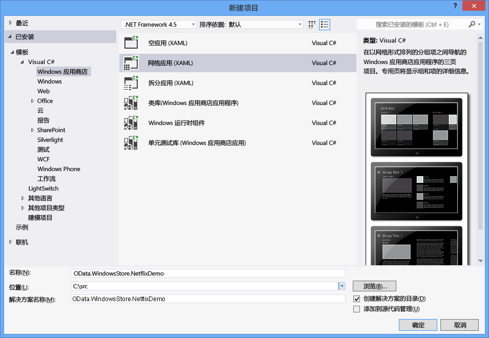
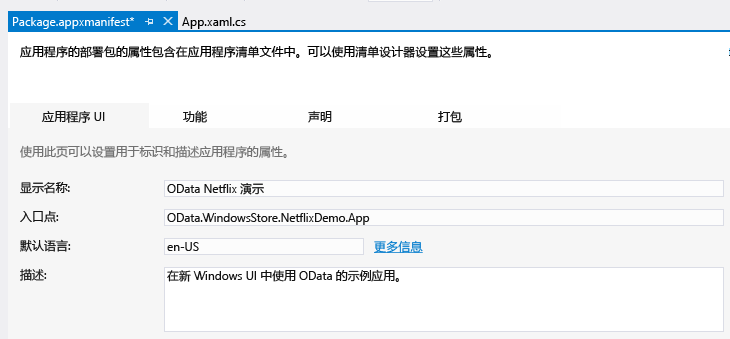
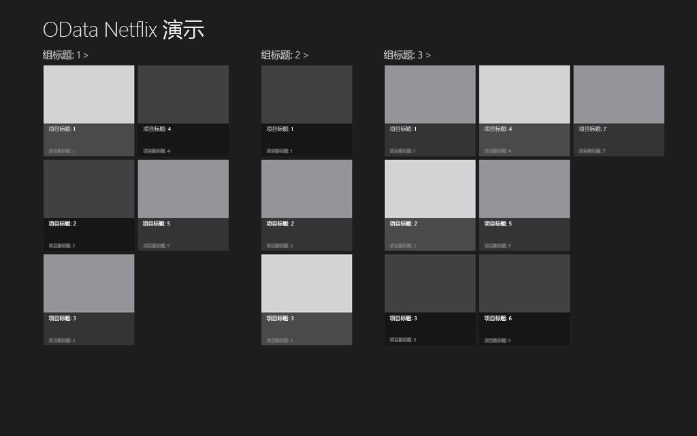
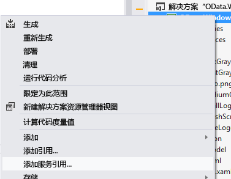
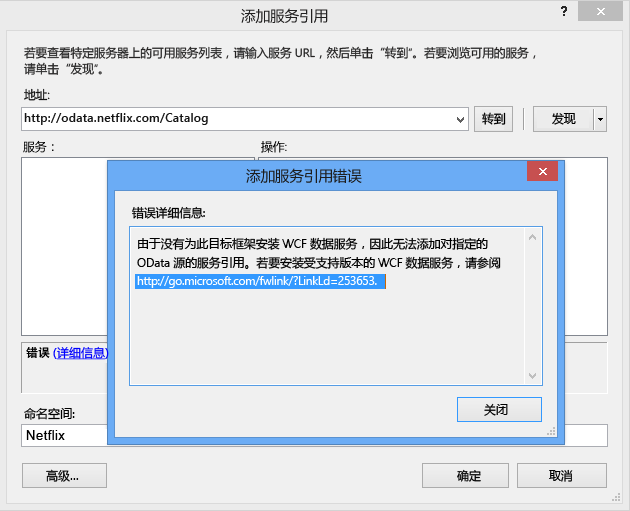
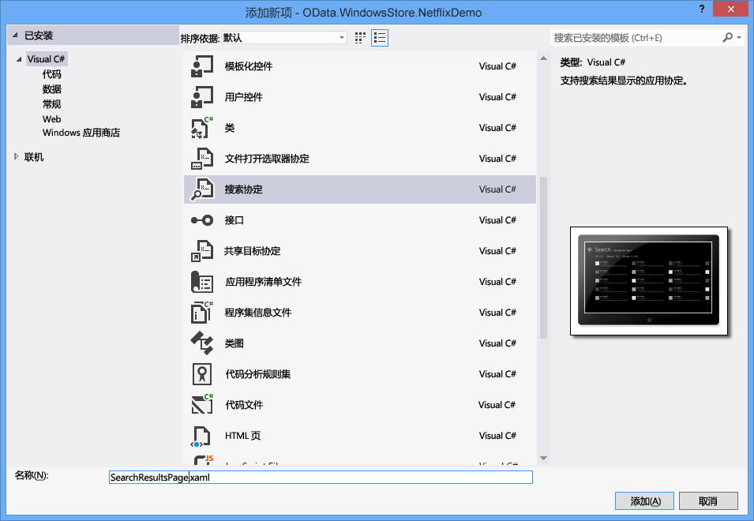

# 编写使用 OData 服务的 Windows 应用商店应用程序
Windows 8 引入了一种新型应用程序：Windows 应用商店应用程序。  Windows 应用商店应用程序具有全新的外观，可在各种设备上运行并在 Windows 应用商店中有售。  本主题说明如何编写使用 OData 服务（特别是 NetFlix Catalog OData 服务）的 Windows 应用商店应用程序。  有关 Windows 应用商店应用程序的详细信息，请阅读[Windows 应用商店应用程序入门](http://msdn.microsoft.com/library/windows/apps/br211386.aspx)。  
  
## 先决条件  
  
1.  [Microsoft Windows 8](http://go.microsoft.com/fwlink/p/?LinkId=266654)  
  
2.  [Microsoft Visual Studio 2012](http://go.microsoft.com/fwlink/p/?LinkId=266655)  
  
3.  [WCF 数据服务](http://msdn.microsoft.com/data/bb931106)（可能为英文网页）  
  
#### 创建默认 Windows 应用商店网格应用程序  
  
1.  使用 C\# 和 XAML 创建新的 Windows 应用商店网格应用程序。  将该应用程序命名为 OData.WindowsStore.NetflixDemo：  
  
       
  
2.  打开 Package.appxmanifest，然后在“显示名称”文本框中输入一个友好名称。  这指定与 Windows 8 搜索功能一起使用的应用程序名称。  
  
       
  
3.  在 App.xaml 文件的 \<AppName\> 元素中输入一个友好名称。  这设置在应用程序启动时显示的应用程序名称。  
  
       
  
4.  生成并启动该应用程序。  您首先看到的是应用程序的初始屏幕。  下面的屏幕快照显示默认初始屏幕。  使用的图像存储在项目的 Assets 文件夹中。  
  
       
  
     然后，将显示该应用程序。  
  
       
  
     默认应用程序在 SampleDataSource.cs 中定义一组类：SampleDataGroup 和 SampleDataItem，它们都从 SampleDataCommon 派生，而 SampleDataCommon 则从 BindableBase 派生。  SampleDataGroup 和 SampleDataItem 绑定到默认 GridView。  SampleDataSource.cs 位于 NetflixDemois 项目的 DataModel 文件夹中。  该应用程序显示分组的集合。  每个组包含任意数量的项，分别由 SampleDataGroup 和 SampleDataItem 表示。  在前面的屏幕快照中，您可以看到称为项目 Group Title 1 的组，该组中的所有项在一起显示。  
  
     应用程序的主页是 GroupedItemsPage.xaml。  它包含一个 GridView， 后者显示 SampleDataSource.cs 类创建的示例数据。  在调用 rootFrame.Navigate 时，由 App.xaml.cs 加载 GroupedItemsPage：  
  
    ```csharp  
    if (!rootFrame.Navigate(typeof(GroupedItemsPage), "AllGroups"))  
    {  
        throw new Exception("Failed to create initial page");  
    }  
  
    ```  
  
     这导致 GroupedItemsPage 实例化且调用其 LoadState 方法。  LoadState 导致创建静态 SampleDataSource 实例，该实例创建 SampleDataGroup 对象的集合。  每个 SampleDataGroup 对象包含 SampleDataItem 对象的集合。  LoadState 在 DefaultViewModel 中存储 SampleDataGroup 对象的集合：  
  
    ```csharp  
    protected override void LoadState(Object navigationParameter, Dictionary<String, Object> pageState)  
    {  
        var sampleDataGroups = SampleDataSource.GetGroups((String)navigationParameter);  
        this.DefaultViewModel["Groups"] = sampleDataGroups;  
    }  
  
    ```  
  
     然后将 DefaultViewModel 绑定到 GridView。  配置数据绑定时，将在 GroupedItemsPage.xaml 文件中引用它。  
  
    ```cpp  
    <CollectionViewSource  
                x:Name="groupedItemsViewSource"  
                Source="{Binding Groups}"  
                IsSourceGrouped="true"  
                ItemsPath="TopItems"  
                d:Source="{Binding AllGroups, Source={d:DesignInstance Type=data:SampleDataSource, IsDesignTimeCreatable=True}}"/>  
  
    ```  
  
     CollectionViewSource 用作处理分组集合的代理。  绑定发生时，它遍历 SampleDataGroup 对象的集合以填充 GridView。  ItemsPath 特性通知 CollectionViewSource 要使用每个 SampleDataGroup 对象的哪些属性来查找它包含的 SampleDataItem。  在本示例中，每个 SampleDataGroup 对象包含 SampleDataItem 对象的 TopItems 集合。  
  
     对于 Netflix 应用程序，按风格将影片分组。  因此，应用程序显示很多风格以及属于各个风格的影片。  
  
#### 向 Netflix OData 服务添加服务引用  
  
1.  在调用 Netflix OData 服务前，需要添加服务引用。  在解决方案资源管理器中，右击该项目，并选择“添加服务引用…”。  
  
       
  
2.  在地址栏中输入 Netflix OData 服务的 URL，并单击“访问”。  将服务引用的命名空间设置为 Netflix，然后单击“确定”。  
  
       
  
    > [!NOTE]
    >  如果尚未安装[用于 Windows 应用商店应用的 WCF 数据服务工具](http://go.microsoft.com/fwlink/p/?LinkId=266652)（可能为英文网页），系统将用类似上文的消息进行提示。  您需要下载并安装链接中引用的工具以继续。  
  
 添加服务引用将强类型化的类，WCF 数据服务将使用该类分析 Netflix OData 服务返回的 OData。  在 SampleDataSource.cs 中定义的类可以绑定到 GridView，因此我们需要将数据从生成的 OData 客户端类传输到在 SampleDataSource.cs 中定义的可绑定类。  为此，我们需要对 SampleDataSource.cs 中定义的数据模型进行一下更改。  
  
#### 更新应用程序的数据模型  
  
1.  使用[此主题](https://gist.github.com/3419288)（可能为英文网页）中的代码替换 SampleDataSource.cs 中的现有代码。  更新的代码向 SampleDataSource 类添加一个 LoadMovies 方法，该方法将对 Netflix OData 服务执行一个查询并填充风格列表 \(allGroups\) 和在每个风格内填充影片列表。  SampleDataGroup 类用于表示一种风格，SampleDataItem 类用于表示一个影片。  
  
    ```csharp  
    public static async void LoadMovies()  
    {  
        IEnumerable<Title> titles = await ((DataServiceQuery<Title>)Context.Titles  
            .Expand("Genres,AudioFormats,AudioFormats/Language,Awards,Cast")  
            .Where(t => t.Rating == "PG")  
            .OrderByDescending(t => t.ReleaseYear)  
            .Take(300)).ExecuteAsync();  
  
        foreach (Title title in titles)  
        {  
            foreach (Genre netflixGenre in title.Genres)  
            {  
                SampleDataGroup genre = GetGroup(netflixGenre.Name);  
                if (genre == null)  
                {  
                    genre = new SampleDataGroup(netflixGenre.Name, netflixGenre.Name, String.Empty, title.BoxArt.LargeUrl, String.Empty);  
                    Instance.AllGroups.Add(genre);  
                }  
                var content = new StringBuilder();  
                // Write additional things to content here if you want them to display in the item detail.  
                genre.Items.Add(new SampleDataItem(title.Id, title.Name, String.Format("{0}rnrn{1} ({2})", title.Synopsis, title.Rating, title.ReleaseYear), title.BoxArt.HighDefinitionUrl ?? title.BoxArt.LargeUrl, "Description", content.ToString()));  
            }  
        }  
    }  
  
    ```  
  
     [基于任务的异步模式](http://go.microsoft.com/fwlink/p/?LinkId=266651) \(TAP\)（可能为英文网页）用于从 Netflix 异步获取最近 300 \(Take\) 部 \(OrderByDescending\) 已进行 PG 评定的 \(Where\) 影片。  其余代码从 OData 源返回的实体构造 SimpleDataItems 和 SimpleDataGroups。  
  
     SampleDataSource 类还实现简单的搜索方法。  在本示例中，它对加载的影片执行简单的内存中搜索。  
  
    ```csharp  
    public static IEnumerable<SampleDataItem> Search(string searchString)  
    {  
            var regex = new Regex(searchString, RegexOptions.CultureInvariant | RegexOptions.IgnoreCase | RegexOptions.IgnorePatternWhitespace);  
            return Instance.AllGroups  
                .SelectMany(g => g.Items)  
                .Where(m => regex.IsMatch(m.Title) || regex.IsMatch(m.Subtitle))  
                    .Distinct(new SampleDataItemComparer());  
    }  
  
    ```  
  
     在 SampleDataSource.cs 中，还定义了称为 ExtensionMethods 的类。  这些扩展方法使用 TAP 模式以允许 SampleDataSource 在不阻塞 UI 的情况下执行 OData 查询。  例如，以下代码使用 Task.Factory.FromAsync 方法实现 TAP：  
  
    ```csharp  
    public static async Task<IEnumerable<T>> ExecuteAsync<T>(this DataServiceQuery<T> query)  
    {  
        return await Task.Factory.FromAsync<IEnumerable<T>>(query.BeginExecute(null, null), query.EndExecute);  
    }  
  
    ```  
  
     在默认应用程序中，应用程序的主页是 GroupedItemsPage。  不过，此时它显示从 Netflix 按风格分组检索的影片。  GroupedItemsPage 实例化时，调用其 LoadState 方法。  LoadState 导致创建静态 SampleDataSource 实例，并前文所述调用 Netflix OData 服务。  LoadState 在 DefaultViewModel 中存储风格（SampleDataGroup 对象）的集合：  
  
    ```csharp  
    protected override void LoadState(Object navigationParameter, Dictionary<String, Object> pageState)  
    {  
  
        var sampleDataGroups = SampleDataSource.GetGroups((String)navigationParameter);  
        this.DefaultViewModel["Groups"] = sampleDataGroups;  
    }  
    ```  
  
     如前文所述，然后使用 DefaultViewModel 将数据绑定到 GridView。  
  
#### 添加搜索协定以允许应用程序参与 Windows 搜索  
  
1.  向应用程序添加搜索协定。  这允许应用程序集成与 Windows 8 搜索功能集成。  将搜索协定命名为 SearchResultsPage.xaml  
  
       
  
2.  通过删除 queryText 周围迁入的引号，修改 SearchResultsPage.xaml.cs 的第 58 行：  
  
    ```csharp  
    // Communicate results through the view model  
    this.DefaultViewModel["QueryText"] = queryText;  
    this.DefaultViewModel["Filters"] = filterList;  
    this.DefaultViewModel["ShowFilters"] = filterList.Count > 1;  
  
    ```  
  
3.  将第 81 行的以下两行代码插入 SearchResultsPage.xaml.cs 以检索搜索结果。  
  
    ```csharp  
    // TODO: Respond to the change in active filter by setting this.DefaultViewModel["Results"]  
                    //       to a collection of items with bindable Image, Title, Subtitle, and Description properties  
                    var searchValue = (string)this.DefaultViewModel["QueryText"];  
                    this.DefaultViewModel["Results"] = new List<SampleDataItem>(SampleDataSource.Search(searchValue));  
  
    ```  
  
 用户调用 Windows 搜索时，键入一个搜索词然后在搜索栏点按“Netflix 演示应用程序”图标，执行 SearchResultsPage 的 LoadState 方法。  发送到 LoadState 的导航参数包含查询文本。  接着调用 Filter\_SelectionChanged 方法，该方法调用 SampleDataSourceen 类的 Search 方法。  返回结果并将其显示在 SearchResultsPage.xaml 页。  
  
```csharp  
/// <summary>  
        /// Invoked when a filter is selected using the ComboBox in snapped view state.  
        /// </summary>  
        /// <param name="sender">The ComboBox instance.</param>  
        /// <param name="e">Event data describing how the selected filter was changed.</param>  
        void Filter_SelectionChanged(object sender, SelectionChangedEventArgs e)  
        {  
            // Determine what filter was selected  
            var selectedFilter = e.AddedItems.FirstOrDefault() as Filter;  
            if (selectedFilter != null)  
            {  
                // Mirror the results into the corresponding Filter object to allow the  
                // RadioButton representation used when not snapped to reflect the change  
                selectedFilter.Active = true;  
  
                // TODO: Respond to the change in active filter by setting this.DefaultViewModel["Results"]  
                //       to a collection of items with bindable Image, Title, Subtitle, and Description properties  
                var searchValue = (string)this.DefaultViewModel["QueryText"];  
                this.DefaultViewModel["Results"] = new List<SampleDataItem>(SampleDataSource.Search(searchValue));  
  
                // Ensure results are found  
                object results;  
                ICollection resultsCollection;  
                if (this.DefaultViewModel.TryGetValue("Results", out results) &&  
                    (resultsCollection = results as ICollection) != null &&  
                    resultsCollection.Count != 0)  
                {  
                    VisualStateManager.GoToState(this, "ResultsFound", true);  
                    return;  
                }  
            }  
  
            // Display informational text when there are no search results.  
            VisualStateManager.GoToState(this, "NoResultsFound", true);  
        }  
```  
  
 有关将搜索集成到应用程序的更多信息，请参见[搜索：集成到 Windows 8 搜索功能](http://go.microsoft.com/fwlink/p/?LinkId=266650)（可能为英文网页）。  
  
## 运行此应用程序  
 按 F5 启动应用程序。  请注意，应用程序启动后，需要几秒钟加载这些图像。  此外，您的第一个搜索尝试可能不返回任何结果。  在实际应用程序中，您需要处理这些问题。  
  
 应用程序调用 Netflix OData 服务，接收生成的 OData 客户端类中的数据，然后将该数据传输到可绑定的数据类（SampleDataSource、SampleDataGroup 和 SampleDataItem）。  它使用这些可绑定的类将数据绑定到 GridView。  如果对 XAML 数据绑定的工作方式不熟悉，请参见[如何将列表或网格中的项分组（使用 C\#\/VB\/C\+\+ 和 XAML 的 Windows 应用商店应用程序）](http://msdn.microsoft.com/library/windows/apps/xaml/hh780627)（可能为英文网页）。