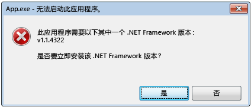
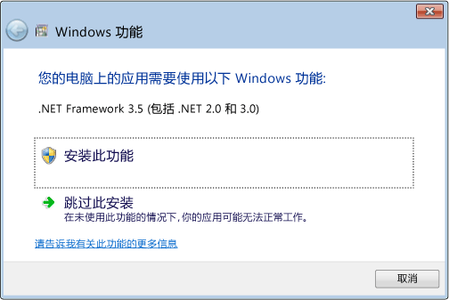

# .NET Framework 初始化错误：管理用户体验
公共语言运行时 (CLR) 激活系统确定将用于运行托管应用程序代码的 CLR 版本。 在某些情况下，激活系统可能无法找到要加载的 CLR 版本。 如果应用程序所需的 CLR 版本无效或未安装在指定计算机上，则通常会出现这种情况。 如果找不到请求的版本，CLR 激活系统将从调用的函数或接口返回一个 HRESULT 错误代码，并且会向正在运行该应用程序的用户显示一条错误消息。 这篇文章提供 HRESULT 代码的列表，并解释如何才能防止显示错误消息。  
  
 CLR 提供的日志记录基础结构有助于调试 CLR 激活问题，如[如何：调试 CLR 激活问题](../../../docs/framework/deployment/how-to-debug-clr-activation-issues.md)中所述。 该基础结构不应与[程序集绑定日志](../../../docs/framework/tools/fuslogvw-exe-assembly-binding-log-viewer.md)混淆，两者完全不同。  
  
## CLR 激活 HRESULT 代码  
 CLR 激活 API 返回 HRESULT 代码以报告对主机的激活操作结果。 在进行其他操作之前，CLR 主机应始终咨询这些返回值。  
  
-   CLR_E_SHIM_RUNTIMELOAD  
  
-   CLR_E_SHIM_RUNTIMEEXPORT  
  
-   CLR_E_SHIM_INSTALLROOT  
  
-   CLR_E_SHIM_INSTALLCOMP  
  
-   CLR_E_SHIM_LEGACYRUNTIMEALREADYBOUND  
  
-   CLR_E_SHIM_SHUTDOWNINPROGRESS  
  
## 初始化错误的 UI  
 如果 CLR 激活系统无法加载应用程序所需运行时的正确版本，它将向用户显示一条错误消息，通知他们，他们的计算机未正确配置，无法运行该应用程序，并为他们提供机会来修复该问题。 在此情况下通常会显示以下错误消息。 用户可以选择“是”以转到 Microsoft 网站，从中为应用程序下载正确的 .NET Framework 版本。  
  
   
初始化错误的典型错误消息  
  
## 解决初始化错误  
 开发人员可以通过各种选项来控制 .NET Framework 初始化错误消息。 例如，如下一节所述，可以使用 API 标志阻止显示消息。 但仍需解决阻止应用程序加载请求运行时的问题。 否则，应用程序可能无法运行，或某些功能可能不可用。  
  
 若要解决根本问题并提供最佳用户体验（更少错误消息），建议执行以下操作：  
  
-   对于 .NET Framework 3.5（和更早版本）应用程序：配置应用程序以支持 .NET Framework 4 或 4.5（请参阅[说明](../../../docs/framework/migration-guide/how-to-configure-an-app-to-support-net-framework-4-or-4-5.md)。  
  
-   对于 .NET Framework 4 应用程序：安装 .NET Framework 4 可再发行组件包，作为应用程序安装的一部分。 请参阅[面向开发人员的部署指南](../../../docs/framework/deployment/deployment-guide-for-developers.md)。  
  
## 控制错误消息  
 通过显示错误消息来传达找不到请求的 .NET Framework 版本，这种方法对用户而言既有用，又不太方便。 对于任何一种情况，都可通过将标志传递给激活 API 来控制此 UI。  
  
 [ICLRMetaHostPolicy::GetRequestedRuntime](../../../docs/framework/unmanaged-api/hosting/iclrmetahostpolicy-getrequestedruntime-method.md) 方法接受 [METAHOST_POLICY_FLAGS](../../../docs/framework/unmanaged-api/hosting/metahost-policy-flags-enumeration.md) 枚举作为输入。 可以包括 METAHOST_POLICY_SHOW_ERROR_DIALOG 标志，以在找不到请求的 CLR 版本时请求显示错误消息。 默认情况下，不显示错误消息。 （[ICLRMetaHost::GetRuntime](../../../docs/framework/unmanaged-api/hosting/iclrmetahost-getruntime-method.md) 方法不接受此标志，且不提供任何显示该错误消息的其他方式。）  
  
 Windows 提供的 [SetErrorMode](http://go.microsoft.com/fwlink/p/?LinkID=255242) 函数可用于声名是否希望因代码在进程中运行而显示错误消息。 可以指定 SEM_FAILCRITICALERRORS 标志来阻止显示错误消息。  
  
 但是，在某些情况下，需要替代由应用程序进程设置的 SEM_FAILCRITICALERRORS 设置。 例如，如果使用本机 COM 组件托管 CLR 且托管位置位于设置 SEM_FAILCRITICALERRORS 的进程，则建议替代该标志，具体取决于在该特定应用程序进程内显示的错误消息的影响。 在这种情况下，可以使用以下一种标志替代 SEM_FAILCRITICALERRORS：  
  
-   将 METAHOST_POLICY_IGNORE_ERROR_MODE 与 [ICLRMetaHostPolicy::GetRequestedRuntime](../../../docs/framework/unmanaged-api/hosting/iclrmetahostpolicy-getrequestedruntime-method.md) 方法一起使用。  
  
-   将 RUNTIME_INFO_IGNORE_ERROR_MODE 与 [GetRequestedRuntimeInfo](../../../docs/framework/unmanaged-api/hosting/getrequestedruntimeinfo-function.md) 函数一起使用。  
  
## 用于提供 CLR 的主机的 UI 策略  
 CLR 包括一组适用于各种方案的主机，如果在加载所需运行时版本时遇到问题，这些主机均将显示错误消息。 下表提供了主机及其错误消息策略的列表。  
  
|CLR 主机|描述|错误消息策略|是否可以禁用错误消息？|  
|--------------|-----------------|--------------------------|------------------------------------|  
|托管 EXE 主机|启动托管 EXE。|缺少 .NET Framework 版本时显示|否|  
|托管 COM 主机|将托管 COM 组件加载到进程。|缺少 .NET Framework 版本时显示|是，通过设置 SEM_FAILCRITICALERRORS 标志|  
|ClickOnce 主机|启动 ClickOnce 应用程序。|缺少 .NET Framework 版本时显示，从 [!INCLUDE[net_v45](../../../includes/net-v45-md.md)] 开始|否|  
|XBAP 主机|启动 WPF XBAP 应用程序。|缺少 .NET Framework 版本时显示，从 [!INCLUDE[net_v45](../../../includes/net-v45-md.md)] 开始|否|  
  
## [!INCLUDE[win8](../../../includes/win8-md.md)] 行为和 UI  
 CLR 激活系统在 [!INCLUDE[win8](../../../includes/win8-md.md)] 上提供与在其他版本 Windows 操作系统上一样的行为和 UI，除非加载 CLR 2.0 时遇到问题。 [!INCLUDE[win8](../../../includes/win8-md.md)] 包括使用 CLR 4.5 的 [!INCLUDE[net_v45](../../../includes/net-v45-md.md)]。 但是，[!INCLUDE[win8](../../../includes/win8-md.md)] 不包括 .NET Framework 2.0、3.0 或 3.5，它们都使用 CLR 2.0。 结果，依赖于 CLR 2.0 的应用程序默认情况下在 [!INCLUDE[win8](../../../includes/win8-md.md)] 上不运行。 相反，它们将显示下面的对话框，使用户能够安装 .NET Framework 3.5。 用户还可在“控制面板”中启用 .NET Framework 3.5。 这两个选项将在[在 Windows 10、Windows 8.1 和 Windows 8 上安装 .NET Framework 3.5](../../../docs/framework/install/dotnet-35-windows-10.md)一文中进行讨论。  
  
   
提示按需安装 .NET Framework 3.5  
  
> [!NOTE]
>  [!INCLUDE[net_v45](../../../includes/net-v45-md.md)] 取代了用户计算机上的 .NET Framework 4 (CLR 4)。 因此，.NET Framework 4 应用程序将在 [!INCLUDE[win8](../../../includes/win8-md.md)] 上顺畅运行，不会显示该对话框。  
  
 安装 .NET Framework 3.5 后，用户可以在其 [!INCLUDE[win8](../../../includes/win8-md.md)] 计算机上运行依赖于 .NET Framework 2.0、3.0 或 3.5 的应用程序。 他们还可以运行 .NET Framework 1.0 和 1.1 应用程序，前提是这些应用程序未显式配置为仅在 .NET Framework 1.0 或 1.1 版上运行。 请参阅[从 .NET Framework 1.1 迁移](../../../docs/framework/migration-guide/migrating-from-the-net-framework-1-1.md)。  
  
 从 [!INCLUDE[net_v45](../../../includes/net-v45-md.md)] 开始，CLR 激活日志记录获得了极大的改进，包括何时和为什么会显示初始化错误消息的日志条目。 有关详细信息，请参阅[如何：调试 CLR 激活问题](../../../docs/framework/deployment/how-to-debug-clr-activation-issues.md)。  
  
## 请参阅  
 [面向开发人员的部署指南](../../../docs/framework/deployment/deployment-guide-for-developers.md)  
 [如何：将应用程序配置为支持 .NET Framework 4 或 4.5](../../../docs/framework/migration-guide/how-to-configure-an-app-to-support-net-framework-4-or-4-5.md)  
 [如何：调试 CLR 激活问题](../../../docs/framework/deployment/how-to-debug-clr-activation-issues.md)  
 [在 Windows 10、Windows 8.1 和 Windows 8 上安装 .NET Framework 3.5](../../../docs/framework/install/dotnet-35-windows-10.md)
