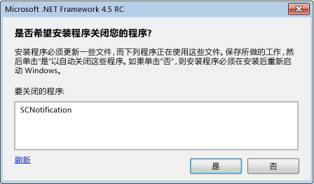

# 在 .NET Framework 4.5 安装期间减少系统重新启动Reducing System Restarts During .NET Framework 4.5 Installations
[!INCLUDE[net_v45](../../../includes/net-v45-md.md)] 安装程序使用[重启管理器](https://go.microsoft.com/fwlink/?LinkId=231425)来防止安装期间可能出现的系统重启。The [!INCLUDE[net_v45](../../../includes/net-v45-md.md)] installer uses the [Restart Manager](https://go.microsoft.com/fwlink/?LinkId=231425) to prevent system restarts whenever possible during installation. 如果应用安装程序安装了 .NET Framework，则此程序可通过使用重启管理器来利用此功能。If your app setup program installs the .NET Framework, it can interface with the Restart Manager to take advantage of this feature. 有关详细信息，请参阅[如何：获取 .NET Framework 4.5 安装程序的进度](../../../docs/framework/deployment/how-to-get-progress-from-the-dotnet-installer.md)。For more information, see [How to: Get Progress from the .NET Framework 4.5 Installer](../../../docs/framework/deployment/how-to-get-progress-from-the-dotnet-installer.md).  
  
## 重启的原因Reasons for a Restart  
 如果在安装 [!INCLUDE[net_v45](../../../includes/net-v45-md.md)] 时 .NET Framework 4 应用正在运行，则此安装需要重启系统。The [!INCLUDE[net_v45](../../../includes/net-v45-md.md)] installation requires a system restart if a .NET Framework 4 app is in use during the installation. 这是因为 [!INCLUDE[net_v45](../../../includes/net-v45-md.md)] 将替代 .NET Framework 4 文件，而在安装期间需要使用这些文件。This is because the [!INCLUDE[net_v45](../../../includes/net-v45-md.md)] replaces .NET Framework 4 files and requires those files to be available during installation. 在许多情况下，通过提前检测并关闭正在运行的 .NET Framework 4 应用即可避免重启。In many cases, the restart can be prevented by preemptively detecting and closing.NET Framework 4 apps that are in use. 但有时某些系统应用不应被关闭。However, some system apps should not be closed. 此时就无法避免重启。In these cases, a restart cannot be avoided.  
  
## 最终用户体验End-User Experience  
 当安装程序检测到 .NET Framework 4 应用正在运行时，执行 [!INCLUDE[net_v45](../../../includes/net-v45-md.md)] 完全安装的最终用户有机会避免系统重启。An end-user who is doing a full installation of the [!INCLUDE[net_v45](../../../includes/net-v45-md.md)] is given the opportunity to avoid a system restart if the installer detects .NET Framework 4 apps in use. 系统将显示一条消息，其中列出所有正在运行的 .NET Framework 4 应用并提供在安装前关闭这些应用的选项。A message lists all running .NET Framework 4 apps and provides the option to close these apps before the installation. 如果用户确认选择，安装程序将关闭这些应用，避免系统重启。If the user confirms, these apps are shut down by the installer, and a system restart is avoided. 如果用户未在特定时间段内对此消息做出响应，系统将在未关闭这些应用的情况下继续安装。If the user does not respond to the message within a certain amount of time, the installation continues without closing any apps.  
  
 如果已关闭了正在运行的应用，但重启管理器仍检测到需要系统重启，则不会显示此消息。If the Restart Manager detects a situation that will require a system restart even if running apps are closed, the message is not displayed.  
  
   
关闭正在运行的 .NET Framework 应用的提示Prompt for closing .NET Framework apps that are in use  
  
## 使用链接的安装程序Using a Chained Installer  
 如果想要向应用重新分发 .NET Framework，但希望使用自己的安装程序和 UI，则可将 .NET Framework 安装过程包含在（链接到）自己的安装过程中。If you want to redistribute the .NET Framework with your app, but you want to use your own setup program and UI, you can include (chain) the .NET Framework setup process to your setup process. 有关链接的安装的详细信息，请参阅[面向开发人员的部署指南](../../../docs/framework/deployment/deployment-guide-for-developers.md)。For more information about chained installations, see [Deployment Guide for Developers](../../../docs/framework/deployment/deployment-guide-for-developers.md). 为减少链接的安装中的系统重启次数，.NET Framework 安装程序为安装程序提供了需要关闭的应用列表。To reduce system restarts in chained installations, the .NET Framework installer supplies your setup program with the list of apps to close. 安装程序必须通过用户界面（如消息框）向用户提供此信息，获得用户的响应并将响应传递回 .NET Framework 安装程序。Your setup program must provide this information to the user through a user interface such as a message box, get the user’s response, and then pass the response back to the .NET Framework installer. 有关链接的安装程序的示例，请参阅文章[如何：获取 .NET Framework 4.5 安装程序的进度](../../../docs/framework/deployment/how-to-get-progress-from-the-dotnet-installer.md)。For an example of a chained installer, see the article [How to: Get Progress from the .NET Framework 4.5 Installer](../../../docs/framework/deployment/how-to-get-progress-from-the-dotnet-installer.md).  
  
 如果使用的是链接的安装程序，但不希望提供自己的消息框用于关闭应用，则链接 .NET Framework 安装过程时可以使用命令行上的 `/showrmui` 和 `/passive` 选项。If you're using a chained installer, but you do not want to provide your own message box for closing apps, you can use the `/showrmui` and `/passive` options on the command line when you chain the .NET Framework setup process. 一起使用这些选项时，如果可以通过关闭应用避免系统重启，安装程序将显示关闭应用的消息框。When you use these options together, the installer shows the message box for closing apps if they can be closed to avoid a system restart. 此消息框在被动模式下的行为与在完全用户界面下的行为相同。This message box behaves the same in passive mode as it does under the full user interface. 请参阅[面向开发人员的部署指南](../../../docs/framework/deployment/deployment-guide-for-developers.md)，了解用于重新分发 .NET Framework 的一组完整命令行选项。See [Deployment Guide for Developers](../../../docs/framework/deployment/deployment-guide-for-developers.md) for the complete set of command-line options for the .NET Framework redistributable.  
  
## 请参阅See Also  
- [部署Deployment](../../../docs/framework/deployment/index.md)  
- [面向开发人员的部署指南Deployment Guide for Developers](../../../docs/framework/deployment/deployment-guide-for-developers.md)  
- [如何：获取 .NET Framework 4.5 安装程序的进度How to: Get Progress from the .NET Framework 4.5 Installer](../../../docs/framework/deployment/how-to-get-progress-from-the-dotnet-installer.md)
