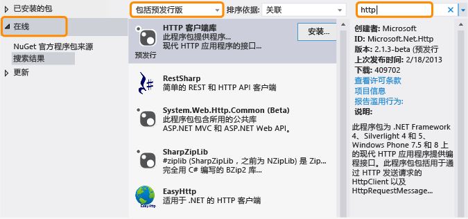

# .NET Framework 和带外版本The .NET Framework and Out-of-Band Releases

.NET Framework 不断适应不同的平台（例如 Windows Phone 和 Windows 应用商店应用以及传统桌面和 Web 应用）以最大化代码的重复使用。The .NET Framework is evolving to accommodate different platforms such as Windows Phone and Windows Store apps as well as traditional desktop and web apps, and to maximize code reuse. 除了 .NET Framework 定期发布之外，我们还会发布处于预发布阶段 (OOB) 的新功能以改善跨平台开发或引入新功能。In addition to our regular .NET Framework releases, we release new features out of band (OOB) to improve cross-platform development or to introduce new functionality. 本主题讨论 .NET Framework 及其 OOB 版本的未来方向。This topic discusses the future direction of the .NET Framework and its OOB releases.

## OOB 版本的优点Advantages of OOB releases
 将新组件或更新发送给带区之外的组件让 Microsoft 能够更频繁地提供 .NET Framework 的更新。Shipping new components or updates to components out of band enables Microsoft to provide more frequent updates to the .NET Framework. 此外，我们可以更快地收集和回应客户反馈。In addition, we can gather and respond to customer feedback more quickly.

 如果你在应用程序中使用了 OOB 功能，你的用户不必安装最新版 .NET Framework 即可运行你的应用程序，因为 OOB 程序集是与你的应用程序包一起部署的。When you use an OOB feature in your app, your users do not have to install the latest version of the .NET Framework to run your app, because the OOB assemblies deploy with your app package.

## OOB 包是如何存储的How OOB packages are distributed
核心公共语言运行时 (CLR) 组件的 OOB 版本通过 [NuGet ](https://www.nuget.org/)（.NET 的包管理器）提供。OOB releases for core common language runtime (CLR) components are delivered through the [NuGet](https://www.nuget.org/), which is a package manager for .NET. NuGet 让你可以轻松地通过 Visual Studio 中的解决方案资源管理器浏览并将库添加至你的 .NET Framework 项目。NuGet enables you to browse and add libraries to your .NET Framework projects easily from the Solution Explorer in Visual Studio. 从 Visual Studio 2012 开始，NuGet 随附于 Visual Studio 的所有版本。NuGet is included with all editions of Visual Studio starting with Visual Studio 2012. 若要确定 NuGet 是否已安装，请在 Visual Studio“工具”菜单上查找“NuGet 包管理器”。To see if NuGet is installed, look for **NuGet Package Manager** on the Visual Studio **Tools** menu. 如果尚未安装：If it’s not installed:

1.  在 Visual Studio 菜单栏中，依次选择“工具”和“扩展和更新”（在 Visual Studio 2010 中，选择“扩展管理器”）。On the Visual Studio menu bar, choose **Tools**, **Extensions and Updates** (in Visual Studio 2010, choose **Extension Manager**).

     此时，“扩展和更新”对话框打开。The **Extensions and Updates** dialog box opens.

2.  依次选择“联机”、“NuGet 包管理器”和“下载”。Choose **Online**, **NuGet Package Manager**, and then choose **Download**.

3.  在下载完毕后，重新启动 Visual Studio。After the download completes, restart Visual Studio.

 有关详细安装说明，请参阅 NuGet 文档网站上的[安装 NuGet](/nuget/install-nuget-client-tools)。For detailed installation instructions, see [Installing NuGet](/nuget/install-nuget-client-tools) on the NuGet Docs website. 有关 NuGet 的详细信息，请参阅 [NuGet 文档](/nuget)。For more information about NuGet, see the [NuGet documentation](/nuget).

## 使用 NuGet OOB 程序包Using a NuGet OOB package
 在安装 NuGet 后，可以使用 Visual Studio 中的解决方案资源管理器浏览并添加引用到 NuGet 程序包：After you install NuGet, you can browse and add references to NuGet packages by using Solution Explorer in Visual Studio:

1.  在 Visual Studio 中打开项目的快捷菜单，然后选择“管理 NuGet 包”。Open the shortcut menu for your project in Visual Studio, and then choose **Manage NuGet Packages**. （也可以在“项目”菜单中选择此选项。）(This option is also available from the **Project** menu.)

2.  在左侧窗格中，选择“联机”。In the left pane, choose **Online**.

3.  如果要使用预发行包，请选择中间窗格内下拉列表框中的“包括预发行版”（而不选择“仅限稳定版”）。If you want to use prerelease packages, in the drop-down list box in the middle pane, choose **Include Prerelease** instead of **Stable Only**.

4.  在右侧窗格中，使用“搜索”框来查找要使用的包。In the right pane, use the **Search** box to locate the package you would like to use. 某些 Microsoft 程序包通过 Microsoft .NET Framework 徽标进行识别，发布者均为 Microsoft。Some Microsoft packages are identified by the Microsoft .NET Framework logo, and all identify Microsoft as the publisher.

 

 如前所述，当你部署使用了 OOB 包的应用程序，OOB 程序集将随附你的应用程序包。As mentioned previously, when you deploy an app that uses an OOB package, the OOB assemblies will ship with your app package.

## OOB 版本的类型Types of OOB releases
 通常情况下，OOB 程序包具有一个或多个预发行版本和一个稳定的版本。Typically, an OOB package has one or more prerelease versions and a stable version. 预发行附带的许可证通常不允许再发行，但可让你试用程序包并提供反馈。The license that accompanies a prerelease doesn't typically allow redistribution, but enables you to try out a package and provide feedback. 任何对包的更新中都包含反馈。Feedback is incorporated in any updates made to the package. 最终发布版本作为稳定的包随 NuGet 分发并包含允许随应用程序重新分发 NuGet 程序包的许可证。A final release is distributed as a stable package with NuGet and includes a license that lets you redistribute the NuGet package with your app. 稳定程序包受 Microsoft 支持。Stable packages are supported by Microsoft. Microsoft 还提供 IntelliSense 支持以及其他文档类型（如所有程序包的博客文章和论坛答案）。Microsoft provides IntelliSense support as well as other types of documentation such as blog posts and forum answers for all packages. 此外，只有一些程序包可使用源代码，并非所有程序包都可使用。In addition, source code may be available with some, but not all, packages. 有关新增和更新后的包的公告，可订阅 [.NET Framework 博客](https://devblogs.microsoft.com/dotnet/)。For announcements regarding new and updated packages, you can subscribe to [the .NET Framework Blog](https://devblogs.microsoft.com/dotnet/).

 若要查找预发行版包和稳定版包，请在 NuGet 包管理器中选择“包括预发行版”。To find both prerelease and stable packages, choose **Include Prerelease** in the NuGet Package Manager.

 如果要接收稳定版包的通知，请订阅 [.NET Framework 源](https://nuget.org/api/v2/curated-feeds/dotnetframework/Packages/)。If you want to be notified of stable package releases, subscribe to [the .NET Framework feed](https://nuget.org/api/v2/curated-feeds/dotnetframework/Packages/).

## 请参阅See also

- [入门Getting Started](../../../docs/framework/get-started/index.md)