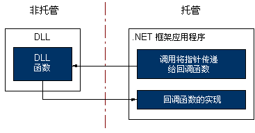

# 回调函数
回调函数是托管应用程序中的代码，可帮助非托管 DLL 函数完成一项任务。 对回调函数的调用间接从托管应用程序中进行传递、经过 DLL 函数，再回到托管实现。 一些通过平台调用的 DLL 函数需要托管代码中的回调函数才能正常运行。  
  
 若要从托管代码中调用大部分 DLL 函数，则可以创建函数的托管定义，然后再调用它。 此过程相当简单。  
  
 使用需要回调函数的 DLL 函数还有一些其他步骤。 首先，必须通过查看函数的文档来确定该函数是否需要回调。 然后，需要在托管应用程序中创建回调函数。 最后，调用 DLL 函数，将指针作为一个参数传递给回调函数。 下面的插图总结了这些过程。  
  
   
回调函数和实现  
  
 回调函数非常适合用于需要重复执行一项任务的情况。 另一个常见用法是与枚举函数配合使用，如 Win32 API 中的 EnumFontFamilies、EnumPrinters 和 EnumWindows。 EnumWindows 函数通过计算机上所有现有的窗口进行枚举，调用每个窗口上的回调函数以执行任务。 有关说明和示例，请参阅[如何：实现回调函数](../../../docs/framework/interop/how-to-implement-callback-functions.md)。  
  
## 请参阅  
 [如何：实现回调函数](../../../docs/framework/interop/how-to-implement-callback-functions.md)  
 [调用 DLL 函数](../../../docs/framework/interop/calling-a-dll-function.md)
