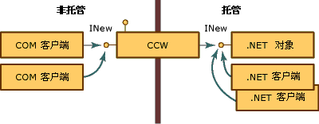
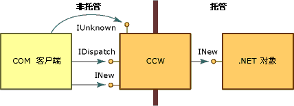

# <a name="com-callable-wrapper"></a><span data-ttu-id="70710-102">COM 可调用包装</span><span class="sxs-lookup"><span data-stu-id="70710-102">COM Callable Wrapper</span></span>
<span data-ttu-id="70710-103">COM 客户端调用 .NET 对象时，公共语言运行时将创建托管对象和该对象的 COM 可调用包装器 (CCW)。</span><span class="sxs-lookup"><span data-stu-id="70710-103">When a COM client calls a .NET object, the common language runtime creates the managed object and a COM callable wrapper (CCW) for the object.</span></span> <span data-ttu-id="70710-104">无法直接引用 .NET 对象，COM 客户端使用 CCW 作为托管对象的代理。</span><span class="sxs-lookup"><span data-stu-id="70710-104">Unable to reference a .NET object directly, COM clients use the CCW as a proxy for the managed object.</span></span>  
  
 <span data-ttu-id="70710-105">无论请求其服务的 COM 客户端数量是多少，该运行时都只为托管对象创建恰好一个 CCW。</span><span class="sxs-lookup"><span data-stu-id="70710-105">The runtime creates exactly one CCW for a managed object, regardless of the number of COM clients requesting its services.</span></span> <span data-ttu-id="70710-106">如下图所示，多个 COM 客户端可以保持对公开 INew 接口的 CCW 的引用。</span><span class="sxs-lookup"><span data-stu-id="70710-106">As the following illustration shows, multiple COM clients can hold a reference to the CCW that exposes the INew interface.</span></span> <span data-ttu-id="70710-107">反之，CCW 保持对实现该接口的托管对象的单一引用，并被垃圾回收。</span><span class="sxs-lookup"><span data-stu-id="70710-107">The CCW, in turn, holds a single reference to the managed object that implements the interface and is garbage collected.</span></span> <span data-ttu-id="70710-108">COM 和 .NET 客户端可以同时对同一托管对象发出请求。</span><span class="sxs-lookup"><span data-stu-id="70710-108">Both COM and .NET clients can make requests on the same managed object simultaneously.</span></span>  
  
 <span data-ttu-id="70710-109"></span><span class="sxs-lookup"><span data-stu-id="70710-109"></span></span>  
<span data-ttu-id="70710-110">通过 COM 可调用包装器访问 .NET 对象</span><span class="sxs-lookup"><span data-stu-id="70710-110">Accessing .NET objects through COM callable wrapper</span></span>  
  
 <span data-ttu-id="70710-111">COM 可调用包装器对在 .NET Framework 内运行的其它类不可见。</span><span class="sxs-lookup"><span data-stu-id="70710-111">COM callable wrappers are invisible to other classes running within the .NET Framework.</span></span> <span data-ttu-id="70710-112">它们的主要目的是封送托管和非托管代码之间的调用；但是，CCW 还托管它们包装的托管对象的对象标识和对象生存期。</span><span class="sxs-lookup"><span data-stu-id="70710-112">Their primary purpose is to marshal calls between managed and unmanaged code; however, CCWs also manage the object identity and object lifetime of the managed objects they wrap.</span></span>  
  
## <a name="object-identity"></a><span data-ttu-id="70710-113">对象标识</span><span class="sxs-lookup"><span data-stu-id="70710-113">Object Identity</span></span>  
 <span data-ttu-id="70710-114">运行时为其垃圾回收堆中的 .NET 对象分配内存，从而使运行时能根据需要在内存中移动对象。</span><span class="sxs-lookup"><span data-stu-id="70710-114">The runtime allocates memory for the .NET object from its garbage-collected heap, which enables the runtime to move the object around in memory as necessary.</span></span> <span data-ttu-id="70710-115">与此相反，运行时为非回收堆中的 CCW 分配内存，使 COM 客户端直接引用包装器成为可能。</span><span class="sxs-lookup"><span data-stu-id="70710-115">In contrast, the runtime allocates memory for the CCW from a noncollected heap, making it possible for COM clients to reference the wrapper directly.</span></span>  
  
## <a name="object-lifetime"></a><span data-ttu-id="70710-116">对象生存期</span><span class="sxs-lookup"><span data-stu-id="70710-116">Object Lifetime</span></span>  
 <span data-ttu-id="70710-117">与其包装的 .NET 客户端不同，CCW 在传统 COM 方式中会进行引用计数。</span><span class="sxs-lookup"><span data-stu-id="70710-117">Unlike the .NET client it wraps, the CCW is reference-counted in traditional COM fashion.</span></span> <span data-ttu-id="70710-118">当 CCW 上的引用计数达到零时，包装器将释放其对托管对象的引用。</span><span class="sxs-lookup"><span data-stu-id="70710-118">When the reference count on the CCW reaches zero, the wrapper releases its reference on the managed object.</span></span> <span data-ttu-id="70710-119">将在下一个垃圾回收周期期间收集无剩余引用的托管对象。</span><span class="sxs-lookup"><span data-stu-id="70710-119">A managed object with no remaining references is collected during the next garbage-collection cycle.</span></span>  
  
## <a name="simulating-com-interfaces"></a><span data-ttu-id="70710-120">模拟 COM 接口</span><span class="sxs-lookup"><span data-stu-id="70710-120">Simulating COM interfaces</span></span>  
 <span data-ttu-id="70710-121">[COM 可调用包装器](../../../docs/framework/interop/com-callable-wrapper.md) (CCW) 公开所有公共的 COM 可见接口和数据类型，并以与 COM 对基于接口的交互的强制一致的方式向 COM 客户端返回值。</span><span class="sxs-lookup"><span data-stu-id="70710-121">The [COM callable wrapper](../../../docs/framework/interop/com-callable-wrapper.md) (CCW) exposes all public, COM-visible interfaces, data types, and return values to COM clients in a manner that is consistent with COM's enforcement of interface-based interaction.</span></span> <span data-ttu-id="70710-122">对于 COM 客户端而言，调用 .NET Framework 对象上的方法与调用 COM 对象上的方法相同。</span><span class="sxs-lookup"><span data-stu-id="70710-122">For a COM client, invoking methods on a .NET Framework object is identical to invoking methods on a COM object.</span></span>  
  
 <span data-ttu-id="70710-123">若要创建这一无缝的方法，CCW 生成传统 COM 接口，如 IUnknown 和 IDispatch。</span><span class="sxs-lookup"><span data-stu-id="70710-123">To create this seamless approach, the CCW manufactures traditional COM interfaces, such as **IUnknown** and **IDispatch**.</span></span> <span data-ttu-id="70710-124">如下图所示，CCW 保持对其包装的 .NET 对象的单一引用。</span><span class="sxs-lookup"><span data-stu-id="70710-124">As the following illustration shows, the CCW maintains a single reference on the .NET object that it wraps.</span></span> <span data-ttu-id="70710-125">COM 客户端和 .NET 对象通过代理和 CCW 的存根构造进行相互交互。</span><span class="sxs-lookup"><span data-stu-id="70710-125">Both the COM client and .NET object interact with each other through the proxy and stub construction of the CCW.</span></span>  
  
 <span data-ttu-id="70710-126"></span><span class="sxs-lookup"><span data-stu-id="70710-126"></span></span>  
<span data-ttu-id="70710-127">COM 接口和 COM 可调用包器</span><span class="sxs-lookup"><span data-stu-id="70710-127">Com interfaces and the COM callable wrapper</span></span>  
  
 <span data-ttu-id="70710-128">除公开由托管环境中的类显式实现的接口外，.NET Framework 代表对象提供对下表中列出的 COM 接口的实现。</span><span class="sxs-lookup"><span data-stu-id="70710-128">In addition to exposing the interfaces that are explicitly implemented by a class in the managed environment, the .NET Framework supplies implementations of the COM interfaces listed in the following table on behalf of the object.</span></span> <span data-ttu-id="70710-129">.NET 类可以通过提供其自身对这些接口的实现而替代默认行为。</span><span class="sxs-lookup"><span data-stu-id="70710-129">A .NET class can override the default behavior by providing its own implementation of these interfaces.</span></span> <span data-ttu-id="70710-130">但是，运行时始终提供 IUnknown 和 IDispatch 接口的实现。</span><span class="sxs-lookup"><span data-stu-id="70710-130">However, the runtime always provides the implementation for the **IUnknown** and **IDispatch** interfaces.</span></span>  
  
|<span data-ttu-id="70710-131">接口</span><span class="sxs-lookup"><span data-stu-id="70710-131">Interface</span></span>|<span data-ttu-id="70710-132">描述</span><span class="sxs-lookup"><span data-stu-id="70710-132">Description</span></span>|  
|---------------|-----------------|  
|<span data-ttu-id="70710-133">**Idispatch**</span><span class="sxs-lookup"><span data-stu-id="70710-133">**Idispatch**</span></span>|<span data-ttu-id="70710-134">为晚期绑定到类型提供一个机制。</span><span class="sxs-lookup"><span data-stu-id="70710-134">Provides a mechanism for late binding to type.</span></span>|  
|<span data-ttu-id="70710-135">**IerrorInfo**</span><span class="sxs-lookup"><span data-stu-id="70710-135">**IerrorInfo**</span></span>|<span data-ttu-id="70710-136">提供以下内容的文字描述：错误、错误源、帮助文件，帮助上下文以及定义错误的接口的 GUID（.NET 类始终为 GUID_NULL）。</span><span class="sxs-lookup"><span data-stu-id="70710-136">Provides a textual description of the error, its source, a Help file, Help context, and the GUID of the interface that defined the error (always **GUID_NULL** for .NET classes).</span></span>|  
|<span data-ttu-id="70710-137">**IprovideClassInfo**</span><span class="sxs-lookup"><span data-stu-id="70710-137">**IprovideClassInfo**</span></span>|<span data-ttu-id="70710-138">启用 COM 客户端，以获取对由托管类实现的 ITypeInfo 接口的访问。</span><span class="sxs-lookup"><span data-stu-id="70710-138">Enables COM clients to gain access to the **ITypeInfo** interface implemented by a managed class.</span></span>|  
|<span data-ttu-id="70710-139">**IsupportErrorInfo**</span><span class="sxs-lookup"><span data-stu-id="70710-139">**IsupportErrorInfo**</span></span>|<span data-ttu-id="70710-140">启用 COM 客户端，以确定托管对象是否支持 IErrorInfo 接口。</span><span class="sxs-lookup"><span data-stu-id="70710-140">Enables a COM client to determine whether the managed object supports the **IErrorInfo** interface.</span></span> <span data-ttu-id="70710-141">如果支持，则启用客户端，以获取指向最新异常对象的指针。</span><span class="sxs-lookup"><span data-stu-id="70710-141">If so, enables the client to obtain a pointer to the latest exception object.</span></span> <span data-ttu-id="70710-142">所有托管类型都支持 IErrorInfo 接口。</span><span class="sxs-lookup"><span data-stu-id="70710-142">All managed types support the **IErrorInfo** interface.</span></span>|  
|<span data-ttu-id="70710-143">**ItypeInfo**</span><span class="sxs-lookup"><span data-stu-id="70710-143">**ItypeInfo**</span></span>|<span data-ttu-id="70710-144">为类提供与 Tlbexp.exe 生成的类型信息完全相同的类型信息。</span><span class="sxs-lookup"><span data-stu-id="70710-144">Provides type information for a class that is exactly the same as the type information produced by Tlbexp.exe.</span></span>|  
|<span data-ttu-id="70710-145">**Iunknown**</span><span class="sxs-lookup"><span data-stu-id="70710-145">**Iunknown**</span></span>|<span data-ttu-id="70710-146">提供 IUnknown 接口的标准实现，COM 客户端使用该接口管理 CCW 的生存期并提供类型强制转换。</span><span class="sxs-lookup"><span data-stu-id="70710-146">Provides the standard implementation of the **IUnknown** interface with which the COM client manages the lifetime of the CCW and provides type coercion.</span></span>|  
  
 <span data-ttu-id="70710-147">托管类还可以提供下表中介绍的 COM 接口。</span><span class="sxs-lookup"><span data-stu-id="70710-147">A managed class can also provide the COM interfaces described in the following table.</span></span>  
  
|<span data-ttu-id="70710-148">接口</span><span class="sxs-lookup"><span data-stu-id="70710-148">Interface</span></span>|<span data-ttu-id="70710-149">描述</span><span class="sxs-lookup"><span data-stu-id="70710-149">Description</span></span>|  
|---------------|-----------------|  
|<span data-ttu-id="70710-150">(_classname) 类接口</span><span class="sxs-lookup"><span data-stu-id="70710-150">The (_*classname*) class interface</span></span>|<span data-ttu-id="70710-151">该接口由运行时公开但未显式定义，它公开托管对象上显式公开的所有公共接口、方法、属性和字段。</span><span class="sxs-lookup"><span data-stu-id="70710-151">Interface, exposed by the runtime and not explicitly defined, that exposes all public interfaces, methods, properties, and fields that are explicitly exposed on a managed object.</span></span>|  
|<span data-ttu-id="70710-152">**IConnectionPoint** 和 **IconnectionPointContainer**</span><span class="sxs-lookup"><span data-stu-id="70710-152">**IConnectionPoint** and **IconnectionPointContainer**</span></span>|<span data-ttu-id="70710-153">以基于委托的事件（用于注册事件订阅服务器的接口）为源的对象的接口。</span><span class="sxs-lookup"><span data-stu-id="70710-153">Interface for objects that source delegate-based events (an interface for registering event subscribers).</span></span>|  
|<span data-ttu-id="70710-154">**IdispatchEx**</span><span class="sxs-lookup"><span data-stu-id="70710-154">**IdispatchEx**</span></span>|<span data-ttu-id="70710-155">如果类实现 IExpando，则为由运行时提供的接口。</span><span class="sxs-lookup"><span data-stu-id="70710-155">Interface supplied by the runtime if the class implements **IExpando**.</span></span> <span data-ttu-id="70710-156">IDispatchEx 接口是 IDispatch 接口的扩展，与 IDispatch 不同，它可枚举、添加、删除和以区分大小的方式调用成员。</span><span class="sxs-lookup"><span data-stu-id="70710-156">The **IDispatchEx** interface is an extension of the **IDispatch** interface that, unlike **IDispatch**, enables enumeration, addition, deletion, and case-sensitive calling of members.</span></span>|  
|<span data-ttu-id="70710-157">**IEnumVARIANT**</span><span class="sxs-lookup"><span data-stu-id="70710-157">**IEnumVARIANT**</span></span>|<span data-ttu-id="70710-158">集合类型类的接口，如果类实现 IEnumerable，则该接口将枚举集合中的对象。</span><span class="sxs-lookup"><span data-stu-id="70710-158">Interface for collection-type classes, which enumerates the objects in the collection if the class implements **IEnumerable**.</span></span>|  
  
## <a name="introducing-the-class-interface"></a><span data-ttu-id="70710-159">类接口简介</span><span class="sxs-lookup"><span data-stu-id="70710-159">Introducing the class interface</span></span>  
 <span data-ttu-id="70710-160">类接口，未在托管代码中显式定义，是公开 .NET 对象中显式公开的所有公共方法、属性、字段和事件的接口。</span><span class="sxs-lookup"><span data-stu-id="70710-160">The class interface, which is not explicitly defined in managed code, is an interface that exposes all public methods, properties, fields, and events that are explicitly exposed on the .NET object.</span></span> <span data-ttu-id="70710-161">此接口可以是双重接口或仅支持调度的接口。</span><span class="sxs-lookup"><span data-stu-id="70710-161">This interface can be a dual or dispatch-only interface.</span></span> <span data-ttu-id="70710-162">类接口接收 .NET 类本身的名称（前面带下划线）。</span><span class="sxs-lookup"><span data-stu-id="70710-162">The class interface receives the name of the .NET class itself, preceded by an underscore.</span></span> <span data-ttu-id="70710-163">例如，对于类 Mammal，类接口为 _Mammal。</span><span class="sxs-lookup"><span data-stu-id="70710-163">For example, for class Mammal, the class interface is _Mammal.</span></span>  
  
 <span data-ttu-id="70710-164">对于派生类，类接口也公开基类的所有公共方法、属性和字段。</span><span class="sxs-lookup"><span data-stu-id="70710-164">For derived classes, the class interface also exposes all public methods, properties, and fields of the base class.</span></span> <span data-ttu-id="70710-165">派生类还公开各基类的类接口。</span><span class="sxs-lookup"><span data-stu-id="70710-165">The derived class also exposes a class interface for each base class.</span></span> <span data-ttu-id="70710-166">例如，如果类 Mammal 扩展类 MammalSuperclass（MammalSuperclass 类本身扩展 System.Object），则 .NET 对象向 COM 客户端公开名为 _Mammal、_MammalSuperclass 和 _Object 的三个类接口。</span><span class="sxs-lookup"><span data-stu-id="70710-166">For example, if class Mammal extends class MammalSuperclass, which itself extends System.Object, the .NET object exposes to COM clients three class interfaces named _Mammal, _MammalSuperclass, and _Object.</span></span>  
  
 <span data-ttu-id="70710-167">例如，请考虑以下 .NET 类：</span><span class="sxs-lookup"><span data-stu-id="70710-167">For example, consider the following .NET class:</span></span>  
  
```vb  
' Applies the ClassInterfaceAttribute to set the interface to dual.  
<ClassInterface(ClassInterfaceType.AutoDual)> _  
' Implicitly extends System.Object.  
Public Class Mammal  
    Sub Eat()  
    Sub Breathe()  
    Sub Sleep()  
End Class  
```  
  
```csharp  
// Applies the ClassInterfaceAttribute to set the interface to dual.  
[ClassInterface(ClassInterfaceType.AutoDual)]  
// Implicitly extends System.Object.  
public class Mammal  
{  
    void  Eat();  
    void  Breathe():  
    void  Sleep();  
}  
```  
  
 <span data-ttu-id="70710-168">COM 客户端可以获取指向名为`_Mammal` 的类接口（如由[类型库导出程序 (Tlbexp.exe)](../../../docs/framework/tools/tlbexp-exe-type-library-exporter.md) 工具生成的类型库中所述）的指针。</span><span class="sxs-lookup"><span data-stu-id="70710-168">The COM client can obtain a pointer to a class interface named `_Mammal`, which is described in the type library that the [Type Library Exporter (Tlbexp.exe)](../../../docs/framework/tools/tlbexp-exe-type-library-exporter.md) tool generates.</span></span> <span data-ttu-id="70710-169">如果 `Mammal` 类实现了一个或多个接口，则这些接口将出现在组件类下。</span><span class="sxs-lookup"><span data-stu-id="70710-169">If the `Mammal` class implemented one or more interfaces, the interfaces would appear under the coclass.</span></span>  
  
```  
[odl, uuid(…), hidden, dual, nonextensible, oleautomation]  
interface _Mammal : IDispatch  
{  
    [id(0x00000000), propget] HRESULT ToString([out, retval] BSTR*  
        pRetVal);  
    [id(0x60020001)] HRESULT Equals([in] VARIANT obj, [out, retval]  
        VARIANT_BOOL* pRetVal);  
    [id(0x60020002)] HRESULT GetHashCode([out, retval] short* pRetVal);  
    [id(0x60020003)] HRESULT GetType([out, retval] _Type** pRetVal);  
    [id(0x6002000d)] HRESULT Eat();  
    [id(0x6002000e)] HRESULT Breathe();  
    [id(0x6002000f)] HRESULT Sleep();  
}  
[uuid(…)]  
coclass Mammal   
{  
    [default] interface _Mammal;  
}  
```  
  
 <span data-ttu-id="70710-170">生成类接口是可选操作。</span><span class="sxs-lookup"><span data-stu-id="70710-170">Generating the class interface is optional.</span></span> <span data-ttu-id="70710-171">默认情况下，COM 互操作会为你导出到类型库中的每个类生成仅支持调度的接口。</span><span class="sxs-lookup"><span data-stu-id="70710-171">By default, COM interop generates a dispatch-only interface for each class you export to a type library.</span></span> <span data-ttu-id="70710-172">可以通过将 <xref:System.Runtime.InteropServices.ClassInterfaceAttribute> 应用到你的类来阻止或修改此接口的自动创建。</span><span class="sxs-lookup"><span data-stu-id="70710-172">You can prevent or modify the automatic creation of this interface by applying the <xref:System.Runtime.InteropServices.ClassInterfaceAttribute> to your class.</span></span> <span data-ttu-id="70710-173">尽管类接口可以减轻向 COM 公开托管类的任务，但其用途相当有限。</span><span class="sxs-lookup"><span data-stu-id="70710-173">Although the class interface can ease the task of exposing managed classes to COM, its uses are limited.</span></span>  
  
> [!CAUTION]
>  <span data-ttu-id="70710-174">使用类接口（而不是显式定义你自己的类接口）可以增加托管类的未来版本控制的复杂性。</span><span class="sxs-lookup"><span data-stu-id="70710-174">Using the class interface, instead of explicitly defining your own, can complicate the future versioning of your managed class.</span></span> <span data-ttu-id="70710-175">请在使用类接口之前阅读以下指南。</span><span class="sxs-lookup"><span data-stu-id="70710-175">Please read the following guidelines before using the class interface.</span></span>  
  
### <a name="define-an-explicit-interface-for-com-clients-to-use-rather-than-generating-the-class-interface"></a><span data-ttu-id="70710-176">定义要使用的 COM 客户端的显式接口，而非生成类接口。</span><span class="sxs-lookup"><span data-stu-id="70710-176">Define an explicit interface for COM clients to use rather than generating the class interface.</span></span>  
 <span data-ttu-id="70710-177">由于 COM 互操作会自动生成类接口，对类进行的后期版本更改可改变由公共语言运行时公开的类接口的布局。</span><span class="sxs-lookup"><span data-stu-id="70710-177">Because COM interop generates a class interface automatically, post-version changes to your class can alter the layout of the class interface exposed by the common language runtime.</span></span> <span data-ttu-id="70710-178">由于 COM 客户端通常没有准备处理接口布局中的更改，因此如果更改类的成员布局，它们将发生中断。</span><span class="sxs-lookup"><span data-stu-id="70710-178">Since COM clients are typically unprepared to handle changes in the layout of an interface, they break if you change the member layout of the class.</span></span>  
  
 <span data-ttu-id="70710-179">本指南强调了向 COM 客户端公开的接口必须保持不变这一概念。</span><span class="sxs-lookup"><span data-stu-id="70710-179">This guideline reinforces the notion that interfaces exposed to COM clients must remain unchangeable.</span></span> <span data-ttu-id="70710-180">若要降低因对接口布局无意地重新排序而中断 COM 客户端的风险，请通过显式定义接口从接口布局中隔离对类的所有更改。</span><span class="sxs-lookup"><span data-stu-id="70710-180">To reduce the risk of breaking COM clients by inadvertently reordering the interface layout, isolate all changes to the class from the interface layout by explicitly defining interfaces.</span></span>  
  
 <span data-ttu-id="70710-181">使用 ClassInterfaceAttribute  来取消类接口的自动生成，并实现类的显式接口，如以下代码片段所示：</span><span class="sxs-lookup"><span data-stu-id="70710-181">Use the **ClassInterfaceAttribute** to disengage the automatic generation of the class interface and implement an explicit interface for the class, as the following code fragment shows:</span></span>  
  
```vb  
<ClassInterface(ClassInterfaceType.None)>Public Class LoanApp  
    Implements IExplicit  
    Sub M() Implements IExplicit.M  
…  
End Class  
```  
  
```csharp  
[ClassInterface(ClassInterfaceType.None)]  
public class LoanApp : IExplicit {  
    void M();  
}  
```  
  
 <span data-ttu-id="70710-182">ClassInterfaceType.None 值防止类元数据导出到类型库时生成类接口。</span><span class="sxs-lookup"><span data-stu-id="70710-182">The **ClassInterfaceType.None** value prevents the class interface from being generated when the class metadata is exported to a type library.</span></span> <span data-ttu-id="70710-183">在前面的示例中，COM 客户端只能通过 `IExplicit` 接口访问 `LoanApp` 类。</span><span class="sxs-lookup"><span data-stu-id="70710-183">In the preceding example, COM clients can access the `LoanApp` class only through the `IExplicit` interface.</span></span>  
  
### <a name="avoid-caching-dispatch-identifiers-dispids"></a><span data-ttu-id="70710-184">避免缓存调度标识符 (DispId)。</span><span class="sxs-lookup"><span data-stu-id="70710-184">Avoid caching dispatch identifiers (DispIds).</span></span>  
 <span data-ttu-id="70710-185">对于脚本化客户端、Microsoft Visual Basic 6.0 客户端或不缓存接口成员的 DispId 的任何后期绑定客户端，可接受使用类接口。</span><span class="sxs-lookup"><span data-stu-id="70710-185">Using the class interface is an acceptable option for scripted clients, Microsoft Visual Basic 6.0 clients, or any late-bound client that does not cache the DispIds of interface members.</span></span> <span data-ttu-id="70710-186">DispId 标识接口成员，以启用后期绑定。</span><span class="sxs-lookup"><span data-stu-id="70710-186">DispIds identify interface members to enable late binding.</span></span>  
  
 <span data-ttu-id="70710-187">对于类接口，基于接口中成员的位置生成 DispId。</span><span class="sxs-lookup"><span data-stu-id="70710-187">For the class interface, generation of DispIds is based on the position of the member in the interface.</span></span> <span data-ttu-id="70710-188">如果更改了成员顺序并将类导出到类型库中，则将改变类接口中生成的 DispId。</span><span class="sxs-lookup"><span data-stu-id="70710-188">If you change the order of the member and export the class to a type library, you will alter the DispIds generated in the class interface.</span></span>  
  
 <span data-ttu-id="70710-189">若要避免在使用类接口时中断后期绑定 COM 客户端，请应用具有 ClassInterfaceAttribute 值的 ClassInterfaceType.AutoDispatch。</span><span class="sxs-lookup"><span data-stu-id="70710-189">To avoid breaking late-bound COM clients when using the class interface, apply the **ClassInterfaceAttribute** with the **ClassInterfaceType.AutoDispatch** value.</span></span> <span data-ttu-id="70710-190">此值实现仅支持调度的类接口，但将省略类型库中的接口说明。</span><span class="sxs-lookup"><span data-stu-id="70710-190">This value implements a dispatch-only class interface, but omits the interface description from the type library.</span></span> <span data-ttu-id="70710-191">没有接口说明，客户端就无法在编译时缓存 DispId。</span><span class="sxs-lookup"><span data-stu-id="70710-191">Without an interface description, clients are unable to cache DispIds at compile time.</span></span> <span data-ttu-id="70710-192">尽管这是类接口的默认接口类型，但你可以显式地应用属性值。</span><span class="sxs-lookup"><span data-stu-id="70710-192">Although this is the default interface type for the class interface, you can apply the attribute value explicitly.</span></span>  
  
```vb  
<ClassInterface(ClassInterfaceType.AutoDispatch)> Public Class LoanApp  
    Implements IAnother  
    Sub M() Implements IAnother.M  
…  
End Class  
```  
  
```csharp  
[ClassInterface(ClassInterfaceType.AutoDispatch]  
public class LoanApp : IAnother {  
    void M();  
}  
```  
  
 <span data-ttu-id="70710-193">若要在运行时获取接口成员的 DispId，COM 客户端可以调用 IDispatch.GetIdsOfNames。</span><span class="sxs-lookup"><span data-stu-id="70710-193">To get the DispId of an interface member at run time, COM clients can call **IDispatch.GetIdsOfNames**.</span></span> <span data-ttu-id="70710-194">若要调用接口上的方法，请将返回的 DispId 作为参数传递给 IDispatch.Invoke。</span><span class="sxs-lookup"><span data-stu-id="70710-194">To invoke a method on the interface, pass the returned DispId as an argument to **IDispatch.Invoke**.</span></span>  
  
### <a name="restrict-using-the-dual-interface-option-for-the-class-interface"></a><span data-ttu-id="70710-195">限制使用类接口的双重接口选项。</span><span class="sxs-lookup"><span data-stu-id="70710-195">Restrict using the dual interface option for the class interface.</span></span>  
 <span data-ttu-id="70710-196">双重接口通过 COM 客户端启用对接口成员的早期绑定和后期绑定。</span><span class="sxs-lookup"><span data-stu-id="70710-196">Dual interfaces enable early and late binding to interface members by COM clients.</span></span> <span data-ttu-id="70710-197">在设计时和测试期间，将类接口设置为双重可能会非常有用。</span><span class="sxs-lookup"><span data-stu-id="70710-197">At design time and during testing, you might find it useful to set the class interface to dual.</span></span> <span data-ttu-id="70710-198">对于永远不会被修改的托管类（及其基类），此选项也是可接受的。</span><span class="sxs-lookup"><span data-stu-id="70710-198">For a managed class (and its base classes) that will never be modified, this option is also acceptable.</span></span> <span data-ttu-id="70710-199">在所有其它情况下，请避免将类接口设置为双重。</span><span class="sxs-lookup"><span data-stu-id="70710-199">In all other cases, avoid setting the class interface to dual.</span></span>  
  
 <span data-ttu-id="70710-200">自动生成的双重接口可能适合少数情况；但是，更多情况下，它将造成与版本相关的复杂性。</span><span class="sxs-lookup"><span data-stu-id="70710-200">An automatically generated dual interface might be appropriate in rare cases; however, more often it creates version-related complexity.</span></span> <span data-ttu-id="70710-201">例如，使用派生类的类接口的 COM 客户端可以通过对基类的更改轻松中断。</span><span class="sxs-lookup"><span data-stu-id="70710-201">For example, COM clients using the class interface of a derived class can easily break with changes to the base class.</span></span> <span data-ttu-id="70710-202">当第三方提供基类时，类接口的布局将不受你的控制。</span><span class="sxs-lookup"><span data-stu-id="70710-202">When a third party provides the base class, the layout of the class interface is out of your control.</span></span> <span data-ttu-id="70710-203">进一步来说，与仅支持调度的接口不同，双重接口 (ClassInterface.AutoDual)提供对导出的类型库中的类接口的说明。</span><span class="sxs-lookup"><span data-stu-id="70710-203">Further, unlike a dispatch-only interface, a dual interface (**ClassInterface.AutoDual**) provides a description of the class interface in the exported type library.</span></span> <span data-ttu-id="70710-204">此类说明会促使后期绑定的客户端在运行时缓存 DispId。</span><span class="sxs-lookup"><span data-stu-id="70710-204">Such a description encourages late-bound clients to cache DispIds at run time.</span></span>  
  
## <a name="see-also"></a><span data-ttu-id="70710-205">另请参阅</span><span class="sxs-lookup"><span data-stu-id="70710-205">See Also</span></span>  
 <xref:System.Runtime.InteropServices.ClassInterfaceAttribute>  
 [<span data-ttu-id="70710-206">COM 可调用包装器</span><span class="sxs-lookup"><span data-stu-id="70710-206">COM Callable Wrapper</span></span>](../../../docs/framework/interop/com-callable-wrapper.md)  
 [<span data-ttu-id="70710-207">COM 包装</span><span class="sxs-lookup"><span data-stu-id="70710-207">COM Wrappers</span></span>](../../../docs/framework/interop/com-wrappers.md)  
 [<span data-ttu-id="70710-208">向 COM 公开 .NET Framework 组件</span><span class="sxs-lookup"><span data-stu-id="70710-208">Exposing .NET Framework Components to COM</span></span>](../../../docs/framework/interop/exposing-dotnet-components-to-com.md)  
 [<span data-ttu-id="70710-209">模拟 COM 接口</span><span class="sxs-lookup"><span data-stu-id="70710-209">Simulating COM Interfaces</span></span>](http://msdn.microsoft.com/en-us/ad2ab959-e2be-411b-aaff-275c3fba606c)  
 [<span data-ttu-id="70710-210">为互操作限定 .NET 类型</span><span class="sxs-lookup"><span data-stu-id="70710-210">Qualifying .NET Types for Interoperation</span></span>](../../../docs/framework/interop/qualifying-net-types-for-interoperation.md)  
 [<span data-ttu-id="70710-211">运行时可调用包装器</span><span class="sxs-lookup"><span data-stu-id="70710-211">Runtime Callable Wrapper</span></span>](../../../docs/framework/interop/runtime-callable-wrapper.md)
