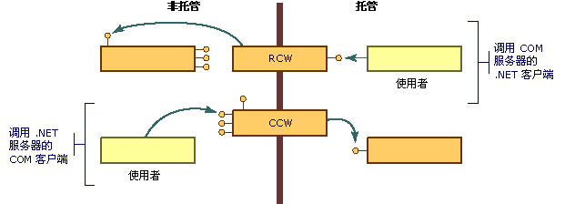

# COM 包装
COM 在以下几个重要方面与 .NET Framework 对象模型存在差异：  
  
-   COM 对象的客户端必须管理这些对象的生存期；公共语言运行时管理其环境中各对象的生存期。  
  
-   COM 对象的客户端通过对提供服务的接口发出请求并取回接口指针来发现服务是否可用。  .NET 对象的客户端可以使用反射来获取对象功能的说明。  
  
-   .NET 对象驻留在由 .NET Framework 执行环境管理的内存中。  为了提高性能，执行环境可以将对象在内存中来回移动，并更新对所移动对象的任何引用。  非托管客户端在获取指向对象的指针后，将依赖于该对象来保持其位置不变。  这些客户端没有相应的机制来处理位置不固定的对象。  
  
 为了克服这些差异，运行时提供了包装类，使托管和非托管客户端认为它们是在其各自的环境中调用对象。  每当托管客户端对某个 COM 对象调用方法时，运行时就会创建一个[运行时可调用包装](../../../docs/framework/interop/runtime-callable-wrapper.md) \(RCW\)。  RCW 的功能之一是抽取托管和非托管引用机制之间的差异。  运行时还会创建一个 [COM 可调用包装](../../../docs/framework/interop/com-callable-wrapper.md) \(CCW\) 来逆转此过程，使 COM 客户端能够对 .NET 对象无缝地调用方法。  如下图所示，调用代码的性质将确定运行时所创建的包装类。  
  
   
COM 包装概览  
  
 大多数情况下，运行时所生成的标准 RCW 或 CCW 将为跨越 COM 和 .NET Framework 之间边界的调用提供充分的封送处理。  利用自定义特性，您可以选择性地调整运行时表示托管和非托管代码的方式。  
  
## 请参阅  
 [Advanced COM Interoperability](http://msdn.microsoft.com/zh-cn/3ada36e5-2390-4d70-b490-6ad8de92f2fb)   
 [运行时可调用包装](../../../docs/framework/interop/runtime-callable-wrapper.md)   
 [COM 可调用包装](../../../docs/framework/interop/com-callable-wrapper.md)   
 [Customizing Standard Wrappers](http://msdn.microsoft.com/zh-cn/c40d089b-6a3c-41b5-a20d-d760c215e49d)   
 [How to: Customize Runtime Callable Wrappers](http://msdn.microsoft.com/zh-cn/4a4bb3da-4d60-4517-99f2-78d46a681732)