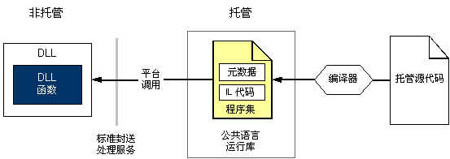

# 使用非托管 DLL 函数
平台调用是一项服务，使托管代码能够调用动态链接库 (DLL) 中实现的非托管函数，例如 Win32 API 中的非托管函数。 此服务定位并调用导出的函数，并根据需要跨交互操作边界封送其自变量（整数、字符串、数组、结构等）。  
  
 本部分介绍了与使用非托管的 DLL 函数关联的任务，并提供有关平台的详细信息调用。 除了以下任务，还提供了一般注意事项以及包含其他信息和示例的链接。  
  
#### 若要使用导出的 DLL 函数  
  
1.  [标识 DLL 中的函数](../../../docs/framework/interop/identifying-functions-in-dlls.md)。  
  
     至少必须指定函数名称及其内含的 DLL 的名称。  
  
2.  [创建用于容纳 DLL 函数的类](../../../docs/framework/interop/creating-a-class-to-hold-dll-functions.md)。  
  
     可使用现有的类为每个非托管函数创建单独的类，或创建包含一组相关的非托管函数的类。  
  
3.  [在托管代码中创建原型](../../../docs/framework/interop/creating-prototypes-in-managed-code.md)。  
  
     [Visual Basic] 使用 Declare 语句以及 Function 和 Lib 关键字。 在极少数情况下，可以使用 DllImportAttribute 和 Shared Function 关键字。 本节稍后会对这些情况进行说明。  
  
     [C#] 使用 DllImportAttribute 标识 DLL 和函数。 为此方法标记 static 和 extern 修饰符。  
  
     [C++] 使用 DllImportAttribute 标识 DLL 和函数。 用 extern "C" 标记此包装方法或函数。  
  
4.  [调用 DLL 函数](../../../docs/framework/interop/calling-a-dll-function.md)。  
  
     与调用任何其他托管方法一样，在托管类上调用方法。 [传递结构](../../../docs/framework/interop/passing-structures.md)和[实现回调函数](../../../docs/framework/interop/callback-functions.md)属于特殊情况。  
  
 有关演示如何构造要用于平台调用、基于 .NET 的声明的示例，请参阅[用平台调用封送数据](../../../docs/framework/interop/marshaling-data-with-platform-invoke.md)。  
  
## 平台调用详解  
 平台调用依赖元数据定位导出的函数并在运行时封送处理它的参数。 下图显示了此过程。  
  
   
平台调用调用非托管 DLL 函数  
  
 平台调用调用非托管函数时，将执行以下操作序列：  
  
1.  定位包含函数的 DLL。  
  
2.  将 DLL 加载到内存中。  
  
3.  在内存中定位函数的地址并将其参数推送到堆栈上，从而根据需要封送数据。  
  
    > [!NOTE]
    >  定位和加载 DLL，并定位仅在首次调用函数时内存中出现的函数地址。  
  
4.  将控件传输到非托管函数。  
  
 平台调用将向托管调用方引发非托管函数生成的异常。  
  
## 请参阅  
 [与非托管代码交互操作](../../../docs/framework/interop/index.md)  
 [平台调用示例](../../../docs/framework/interop/platform-invoke-examples.md)  
 [互操作封送处理](../../../docs/framework/interop/interop-marshaling.md)  
