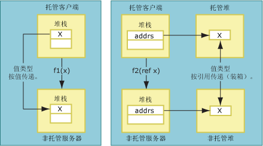
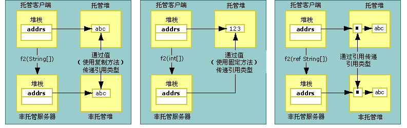

# 复制和锁定
封送数据时，互操作封送拆收器可以复制或锁定正在封送的数据。 复制数据会将数据副本放置从一个内存位置放到另一个内存位置。 下图显示从托管内存向非托管内存复制值类型和复制按引用传递的类型之间的差异。  
  
   
按值和按引用传递的值类型  
  
 按值传递的方法参数作为堆栈上的值封送到非托管代码。 直接进行复制。 按引用传递的参数作为堆栈上的指针传递。 引用类型也按值和按引用传递。 如下图所示，复制或锁定按值传递的引用类型。  
  
   
按值和按引用传递的引用类型  
  
 锁定操作将数据暂时锁定在其当前内存位置，从而阻止公共语言运行时的垃圾回收器将其重定位。 封送拆收器锁定数据可减小复制的开销并提高性能。 数据的类型确定在封送处理过程中是复制数据，还是锁定数据。  在封送 <xref:System.String> 等对象的过程中自动执行锁定操作；然而，也可使用 <xref:System.Runtime.InteropServices.GCHandle> 类手动锁定内存。  
  
## 已设置格式的 Blittable 类  
 在托管和非托管内存中，已设置格式的 [blittable](../../../docs/framework/interop/blittable-and-non-blittable-types.md) 类具有固定布局（已设置格式）以及通用数据表示形式。 当这些类型需要封送处理时，指向堆中对象的指针被直接传递给被调用方。 被调用方可以更改该指针所引用的内存位置的内容。  
  
> [!NOTE]
>  如果参数标记为 Out 或 In/Out，则被调用方可以更改内存内容。相反，当参数设置为作为 In（已设置格式的 blittable 类型的默认值）封送时，被调用方应当避免更改内存内容。 在将同一类导出到类型库并用于进行跨单元调用时，修改 In 对象将产生问题。  
  
## 已设置格式的非 Blittable 类  
 在托管和非托管内存中，已设置格式的[ blittable](../../../docs/framework/interop/blittable-and-non-blittable-types.md) 类具有固定布局（已设置格式），但数据表示形式不同。 在以下情况下，数据可能需要转换：  
  
-   如果按值封送非 blittable 类，则被调用方接收指向该数据结构副本的指针。  
  
-   如果按引用封送非 blittable 类，则被调用方接收指向数据结构副本的指针的指针。  
  
-   如果设置了 <xref:System.Runtime.InteropServices.InAttribute> 属性，则始终通过实例的状态初始化此副本，并在必要时进行封送处理。  
  
-   如果设置了 <xref:System.Runtime.InteropServices.OutAttribute> 属性，则始终在返回时将状态复制回实例，并在必要时进行封送处理。  
  
-   如果同时设置了 InAttribute 和 OutAttribute，则两个副本都需要。 如果省略了其中任一个属性，则封送拆收器可以通过删掉其中一个副本进行优化。  
  
## 引用类型  
 可按值或按引用传递引用类型。 按值传递时，在堆栈上传递指向类型的指针。 按引用传递时，在堆栈上传递指向类型指针的指针。  
  
 引用类型具有以下条件性行为：  
  
-   如果引用类型按值传递且具有非 blittable 类型的成员，则将类型转换两次：  
  
    -   参数传递到非托管端时转换一次。  
  
    -   从调用返回时转换一次。  
  
     为避免不必要的复制和转换，将这些类型作为 In 参数封送。 若要使调用方能够看见被调用方所做的更改，必须将 InAttribute 和 OutAttribute 属性显式应用于参数。  
  
-   如果引用类型按值传递且只具有 blittable 类型的成员，则可在封送处理期间将其锁定，且调用方可看见被调用方对类型成员所做的所有更改。 如果需要该行为，请显式应用 InAttribute 和 OutAttribute。 如果没有这些方向属性，互操作封送拆收器就不会将方向信息导出到类型库（默认情况下作为 In 导出），这会造成 COM 跨单元封送处理方面的问题。  
  
-   如果引用类型按引用传递，则默认将它作为 In/Out 封送。  
  
## System.String 和 System.Text.StringBuilder  
 按值或按引用将数据封送到非托管代码时，封送拆收器通常将数据复制到辅助缓冲区（可能在复制期间转换字符集），并将对缓冲区的引用传递给被调用方。 除非引用是用 SysAllocString 分配的 BSTR，否则将始终用 CoTaskMemAlloc 分配引用。  
  
 作为其中一个字符串类型按值（如 Unicode 字符串）封送时的一种优化，封送拆收器将指向内部 Unicode 缓冲区中托管字符串的直接指针传递给被调用方，而不是将其复制到新缓冲区。  
  
> [!CAUTION]
>  按值传递字符串时，被调用方绝不能改变封送拆收器传递的引用。 这样做会损坏托管堆。  
  
 按引用传递 <xref:System.String?displayProperty=fullName> 时，封送拆收器将字符串内容复制到辅助缓冲区，再进行调用。 在从调用返回时，再将该缓冲区内容复制到新字符串中。 这种技术确保不可变托管字符串保持不变。  
  
 按值传递 <xref:System.Text.StringBuilder?displayProperty=fullName> 时，封送拆收器将对 StringBuilder 的内部缓冲区的引用直接传递给调用方。 调用方和被调用方必须就缓冲区大小达成一致。 调用方负责创建具有足够长度的 StringBuilder。 被调用方必须采取必要措施确保不溢出缓冲区。 对于默认将按值传递的引用类型作为 In 参数传递的规则，StringBuilder 是一个例外。 它始终作为 In/Out 传递。  
  
## 另请参阅  
 [默认的封送行为](../../../docs/framework/interop/default-marshaling-behavior.md)   
 [使用互操作封送拆收器进行内存管理](http://msdn.microsoft.com/en-us/417206ce-ee3e-4619-9529-0c0b686c7bee)   
 [方向特性](http://msdn.microsoft.com/en-us/241ac5b5-928e-4969-8f58-1dbc048f9ea2)   
 [互操作封送处理](../../../docs/framework/interop/interop-marshaling.md)

