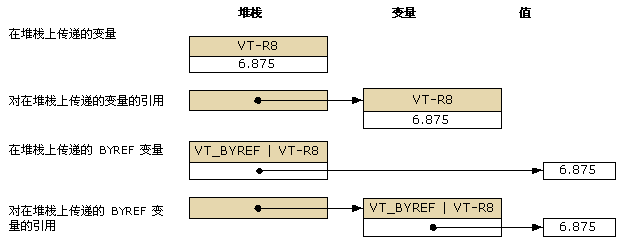

# <a name="default-marshaling-for-objects"></a><span data-ttu-id="df79b-102">对象的默认封送处理</span><span class="sxs-lookup"><span data-stu-id="df79b-102">Default Marshaling for Objects</span></span>
<span data-ttu-id="df79b-103">可将类型化为 <xref:System.Object?displayProperty=nameWithType> 的参数和字段作为下列任一类型向非托管代码公开：</span><span class="sxs-lookup"><span data-stu-id="df79b-103">Parameters and fields typed as <xref:System.Object?displayProperty=nameWithType> can be exposed to unmanaged code as one of the following types:</span></span>  
  
-   <span data-ttu-id="df79b-104">对象为参数时，作为变体。</span><span class="sxs-lookup"><span data-stu-id="df79b-104">A variant when the object is a parameter.</span></span>  
  
-   <span data-ttu-id="df79b-105">对象为结构字段时，作为接口。</span><span class="sxs-lookup"><span data-stu-id="df79b-105">An interface when the object is a structure field.</span></span>  
  
 <span data-ttu-id="df79b-106">仅 COM 互操作支持对象类型的封送处理。</span><span class="sxs-lookup"><span data-stu-id="df79b-106">Only COM interop supports marshaling for object types.</span></span> <span data-ttu-id="df79b-107">默认行为是将对象封送到 COM 变体。</span><span class="sxs-lookup"><span data-stu-id="df79b-107">The default behavior is to marshal objects to COM variants.</span></span> <span data-ttu-id="df79b-108">这些规则只适用于 Object 类型，不适用于从 Object 类派生的强类型对象。</span><span class="sxs-lookup"><span data-stu-id="df79b-108">These rules apply only to the type **Object** and do not apply to strongly typed objects that derive from the **Object** class.</span></span>  
  
 <span data-ttu-id="df79b-109">本主题提供有关封送对象类型的以下附加信息：</span><span class="sxs-lookup"><span data-stu-id="df79b-109">This topic provides the following additional information about marshaling object types:</span></span>  
  
-   [<span data-ttu-id="df79b-110">封送选项</span><span class="sxs-lookup"><span data-stu-id="df79b-110">Marshaling Options</span></span>](#cpcondefaultmarshalingforobjectsanchor7)  
  
-   [<span data-ttu-id="df79b-111">将对象封送到接口</span><span class="sxs-lookup"><span data-stu-id="df79b-111">Marshaling Object to Interface</span></span>](#cpcondefaultmarshalingforobjectsanchor2)  
  
-   [<span data-ttu-id="df79b-112">将对象封送到变体</span><span class="sxs-lookup"><span data-stu-id="df79b-112">Marshaling Object to Variant</span></span>](#cpcondefaultmarshalingforobjectsanchor3)  
  
-   [<span data-ttu-id="df79b-113">将变体封送到对象</span><span class="sxs-lookup"><span data-stu-id="df79b-113">Marshaling Variant to Object</span></span>](#cpcondefaultmarshalingforobjectsanchor4)  
  
-   [<span data-ttu-id="df79b-114">封送 ByRef 变体</span><span class="sxs-lookup"><span data-stu-id="df79b-114">Marshaling ByRef Variants</span></span>](#cpcondefaultmarshalingforobjectsanchor6)  
  
<a name="cpcondefaultmarshalingforobjectsanchor7"></a>   
## <a name="marshaling-options"></a><span data-ttu-id="df79b-115">封送处理选项</span><span class="sxs-lookup"><span data-stu-id="df79b-115">Marshaling Options</span></span>  
 <span data-ttu-id="df79b-116">下表显示 Object 数据类型的封送处理选项。</span><span class="sxs-lookup"><span data-stu-id="df79b-116">The following table shows the marshaling options for the **Object** data type.</span></span> <span data-ttu-id="df79b-117"><xref:System.Runtime.InteropServices.MarshalAsAttribute> 属性提供若干个 <xref:System.Runtime.InteropServices.UnmanagedType> 枚举值来封送对象。</span><span class="sxs-lookup"><span data-stu-id="df79b-117">The <xref:System.Runtime.InteropServices.MarshalAsAttribute> attribute provides several <xref:System.Runtime.InteropServices.UnmanagedType> enumeration values to marshal objects.</span></span>  
  
|<span data-ttu-id="df79b-118">枚举类型</span><span class="sxs-lookup"><span data-stu-id="df79b-118">Enumeration type</span></span>|<span data-ttu-id="df79b-119">非托管格式说明</span><span class="sxs-lookup"><span data-stu-id="df79b-119">Description of unmanaged format</span></span>|  
|----------------------|-------------------------------------|  
|<span data-ttu-id="df79b-120">UnmanagedType.Struct</span><span class="sxs-lookup"><span data-stu-id="df79b-120">**UnmanagedType.Struct**</span></span><br /><br /> <span data-ttu-id="df79b-121">（参数默认值）</span><span class="sxs-lookup"><span data-stu-id="df79b-121">(default for parameters)</span></span>|<span data-ttu-id="df79b-122">COM 样式的变体。</span><span class="sxs-lookup"><span data-stu-id="df79b-122">A COM-style variant.</span></span>|  
|<span data-ttu-id="df79b-123">UnmanagedType.Interface</span><span class="sxs-lookup"><span data-stu-id="df79b-123">**UnmanagedType.Interface**</span></span>|<span data-ttu-id="df79b-124">如果可能，为 IDispatch 接口；否则为 IUnknown 接口。</span><span class="sxs-lookup"><span data-stu-id="df79b-124">An **IDispatch** interface, if possible; otherwise, an **IUnknown** interface.</span></span>|  
|<span data-ttu-id="df79b-125">UnmanagedType.IUnknown</span><span class="sxs-lookup"><span data-stu-id="df79b-125">**UnmanagedType.IUnknown**</span></span><br /><br /> <span data-ttu-id="df79b-126">（字段默认值）</span><span class="sxs-lookup"><span data-stu-id="df79b-126">(default for fields)</span></span>|<span data-ttu-id="df79b-127">IUnknown 接口。</span><span class="sxs-lookup"><span data-stu-id="df79b-127">An **IUnknown** interface.</span></span>|  
|<span data-ttu-id="df79b-128">UnmanagedType.IDispatch</span><span class="sxs-lookup"><span data-stu-id="df79b-128">**UnmanagedType.IDispatch**</span></span>|<span data-ttu-id="df79b-129">IDispatch 接口。</span><span class="sxs-lookup"><span data-stu-id="df79b-129">An **IDispatch** interface.</span></span>|  
  
 <span data-ttu-id="df79b-130">以下示例显示了 `MarshalObject` 的托管接口定义。</span><span class="sxs-lookup"><span data-stu-id="df79b-130">The following example shows the managed interface definition for `MarshalObject`.</span></span>  
  
```vb  
Interface MarshalObject  
   Sub SetVariant(o As Object)  
   Sub SetVariantRef(ByRef o As Object)  
   Function GetVariant() As Object  
  
   Sub SetIDispatch( <MarshalAs(UnmanagedType.IDispatch)> o As Object)  
   Sub SetIDispatchRef(ByRef <MarshalAs(UnmanagedType.IDispatch)> o _  
      As Object)  
   Function GetIDispatch() As <MarshalAs(UnmanagedType.IDispatch)> Object  
   Sub SetIUnknown( <MarshalAs(UnmanagedType.IUnknown)> o As Object)  
   Sub SetIUnknownRef(ByRef <MarshalAs(UnmanagedType.IUnknown)> o _  
      As Object)  
   Function GetIUnknown() As <MarshalAs(UnmanagedType.IUnknown)> Object  
End Interface  
```  
  
```csharp  
interface MarshalObject {  
   void SetVariant(Object o);  
   void SetVariantRef(ref Object o);  
   Object GetVariant();  
  
   void SetIDispatch ([MarshalAs(UnmanagedType.IDispatch)]Object o);  
   void SetIDispatchRef([MarshalAs(UnmanagedType.IDispatch)]ref Object o);  
   [MarshalAs(UnmanagedType.IDispatch)] Object GetIDispatch();  
   void SetIUnknown ([MarshalAs(UnmanagedType.IUnknown)]Object o);  
   void SetIUnknownRef([MarshalAs(UnmanagedType.IUnknown)]ref Object o);  
   [MarshalAs(UnmanagedType.IUnknown)] Object GetIUnknown();  
}  
```  
  
 <span data-ttu-id="df79b-131">以下代码将 `MarshalObject` 接口导出到类型库。</span><span class="sxs-lookup"><span data-stu-id="df79b-131">The following code exports the `MarshalObject` interface to a type library.</span></span>  
  
```  
interface MarshalObject {  
   HRESULT SetVariant([in] VARIANT o);  
   HRESULT SetVariantRef([in,out] VARIANT *o);  
   HRESULT GetVariant([out,retval] VARIANT *o)   
   HRESULT SetIDispatch([in] IDispatch *o);  
   HRESULT SetIDispatchRef([in,out] IDispatch **o);  
   HRESULT GetIDispatch([out,retval] IDispatch **o)   
   HRESULT SetIUnknown([in] IUnknown *o);  
   HRESULT SetIUnknownRef([in,out] IUnknown **o);  
   HRESULT GetIUnknown([out,retval] IUnknown **o)   
}  
```  
  
> [!NOTE]
>  <span data-ttu-id="df79b-132">互操作封送拆收器在调用后自动释放变体内所有已分配的对象。</span><span class="sxs-lookup"><span data-stu-id="df79b-132">The interop marshaler automatically frees any allocated object inside the variant after the call.</span></span>  
  
 <span data-ttu-id="df79b-133">以下示例显示已设置格式的值类型。</span><span class="sxs-lookup"><span data-stu-id="df79b-133">The following example shows a formatted value type.</span></span>  
  
```vb  
Public Structure ObjectHolder  
   Dim o1 As Object  
   <MarshalAs(UnmanagedType.IDispatch)> Public o2 As Object  
End Structure  
```  
  
```csharp  
public struct ObjectHolder {  
   Object o1;  
   [MarshalAs(UnmanagedType.IDispatch)]public Object o2;  
}  
```  
  
 <span data-ttu-id="df79b-134">以下代码将已设置格式的类型导出到类型库。</span><span class="sxs-lookup"><span data-stu-id="df79b-134">The following code exports the formatted type to a type library.</span></span>  
  
```  
struct ObjectHolder {  
   VARIANT o1;  
   IDispatch *o2;  
}  
```  
  
<a name="cpcondefaultmarshalingforobjectsanchor2"></a>   
## <a name="marshaling-object-to-interface"></a><span data-ttu-id="df79b-135">将对象封送到接口</span><span class="sxs-lookup"><span data-stu-id="df79b-135">Marshaling Object to Interface</span></span>  
 <span data-ttu-id="df79b-136">将对象作为接口向 COM 公开时，该接口是托管类型 <xref:System.Object> 的类接口（即 _Object 接口）。</span><span class="sxs-lookup"><span data-stu-id="df79b-136">When an object is exposed to COM as an interface, that interface is the class interface for the managed type <xref:System.Object> (the **_Object** interface).</span></span> <span data-ttu-id="df79b-137">该接口被类型化为 IDispatch (<xref:System.Runtime.InteropServices.UnmanagedType>) 或所得类型库中的 IUnknown (UnmanagedType.IUnknown)。</span><span class="sxs-lookup"><span data-stu-id="df79b-137">This interface is typed as an **IDispatch** (<xref:System.Runtime.InteropServices.UnmanagedType>) or an **IUnknown** (**UnmanagedType.IUnknown**) in the resulting type library.</span></span> <span data-ttu-id="df79b-138">通过 _Object 接口，COM 客户端可动态调用托管类的成员或由该托管类的派生类实现的任何成员。</span><span class="sxs-lookup"><span data-stu-id="df79b-138">COM clients can dynamically invoke the members of the managed class or any members implemented by its derived classes through the **_Object** interface.</span></span> <span data-ttu-id="df79b-139">客户端还可调用 QueryInterface 获取由托管类型显式实现的任何其他接口。</span><span class="sxs-lookup"><span data-stu-id="df79b-139">The client can also call **QueryInterface** to obtain any other interface explicitly implemented by the managed type.</span></span>  
  
<a name="cpcondefaultmarshalingforobjectsanchor3"></a>   
## <a name="marshaling-object-to-variant"></a><span data-ttu-id="df79b-140">将对象封送到变体</span><span class="sxs-lookup"><span data-stu-id="df79b-140">Marshaling Object to Variant</span></span>  
 <span data-ttu-id="df79b-141">将对象封送到变体时，在运行时根据以下规则确定内部变体类型：</span><span class="sxs-lookup"><span data-stu-id="df79b-141">When an object is marshaled to a variant, the internal variant type is determined at run time, based on the following rules:</span></span>  
  
-   <span data-ttu-id="df79b-142">如果对象引用为 null（Visual Basic 中为 Nothing），则将对象封送到 VT_EMPTY 类型的变体。</span><span class="sxs-lookup"><span data-stu-id="df79b-142">If the object reference is null (**Nothing** in Visual Basic), the object is marshaled to a variant of type **VT_EMPTY**.</span></span>  
  
-   <span data-ttu-id="df79b-143">如果对象是下表中列出的任何类型的实例，则得到的变体类型由封送拆收器内置的规则确定，并且显示在下表中。</span><span class="sxs-lookup"><span data-stu-id="df79b-143">If the object is an instance of any type listed in the following table, the resulting variant type is determined by the rules built into the marshaler and shown in the table.</span></span>  
  
-   <span data-ttu-id="df79b-144">需要显式控制封送行为的其他对象可实现 <xref:System.IConvertible> 接口。</span><span class="sxs-lookup"><span data-stu-id="df79b-144">Other objects that need to explicitly control the marshaling behavior can implement the <xref:System.IConvertible> interface.</span></span> <span data-ttu-id="df79b-145">在这种情况下，变体类型由从 <xref:System.IConvertible.GetTypeCode%2A?displayProperty=nameWithType> 方法返回的类型代码确定。</span><span class="sxs-lookup"><span data-stu-id="df79b-145">In that case, the variant type is determined by the type code returned from the <xref:System.IConvertible.GetTypeCode%2A?displayProperty=nameWithType> method.</span></span> <span data-ttu-id="df79b-146">否则，将对象作为 VT_UNKNOWN 类型的变体封送。</span><span class="sxs-lookup"><span data-stu-id="df79b-146">Otherwise, the object is marshaled as a variant of type **VT_UNKNOWN**.</span></span>  
  
### <a name="marshaling-system-types-to-variant"></a><span data-ttu-id="df79b-147">将系统类型封送到变体</span><span class="sxs-lookup"><span data-stu-id="df79b-147">Marshaling System Types to Variant</span></span>  
 <span data-ttu-id="df79b-148">下表显示托管对象类型及其相应的 COM 变体类型。</span><span class="sxs-lookup"><span data-stu-id="df79b-148">The following table shows managed object types and their corresponding COM variant types.</span></span> <span data-ttu-id="df79b-149">仅当所调用方法的签名属于 <xref:System.Object?displayProperty=nameWithType> 类型时，才转换这些类型。</span><span class="sxs-lookup"><span data-stu-id="df79b-149">These types are converted only when the signature of the method being called is of type <xref:System.Object?displayProperty=nameWithType>.</span></span>  
  
|<span data-ttu-id="df79b-150">对象类型</span><span class="sxs-lookup"><span data-stu-id="df79b-150">Object type</span></span>|<span data-ttu-id="df79b-151">COM 变体类型</span><span class="sxs-lookup"><span data-stu-id="df79b-151">COM variant type</span></span>|  
|-----------------|----------------------|  
|<span data-ttu-id="df79b-152">Null 对象引用（在 Visual Basic 中为 Nothing）。</span><span class="sxs-lookup"><span data-stu-id="df79b-152">Null object reference (**Nothing** in Visual Basic).</span></span>|<span data-ttu-id="df79b-153">VT_EMPTY</span><span class="sxs-lookup"><span data-stu-id="df79b-153">**VT_EMPTY**</span></span>|  
|<xref:System.DBNull?displayProperty=nameWithType>|<span data-ttu-id="df79b-154">VT_NULL</span><span class="sxs-lookup"><span data-stu-id="df79b-154">**VT_NULL**</span></span>|  
|<xref:System.Runtime.InteropServices.ErrorWrapper?displayProperty=nameWithType>|<span data-ttu-id="df79b-155">VT_ERROR</span><span class="sxs-lookup"><span data-stu-id="df79b-155">**VT_ERROR**</span></span>|  
|<xref:System.Reflection.Missing?displayProperty=nameWithType>|<span data-ttu-id="df79b-156">带 E_PARAMNOTFOUND 的 VT_ERROR</span><span class="sxs-lookup"><span data-stu-id="df79b-156">**VT_ERROR** with **E_PARAMNOTFOUND**</span></span>|  
|<xref:System.Runtime.InteropServices.DispatchWrapper?displayProperty=nameWithType>|<span data-ttu-id="df79b-157">VT_DISPATCH</span><span class="sxs-lookup"><span data-stu-id="df79b-157">**VT_DISPATCH**</span></span>|  
|<xref:System.Runtime.InteropServices.UnknownWrapper?displayProperty=nameWithType>|<span data-ttu-id="df79b-158">VT_UNKNOWN</span><span class="sxs-lookup"><span data-stu-id="df79b-158">**VT_UNKNOWN**</span></span>|  
|<xref:System.Runtime.InteropServices.CurrencyWrapper?displayProperty=nameWithType>|<span data-ttu-id="df79b-159">VT_CY</span><span class="sxs-lookup"><span data-stu-id="df79b-159">**VT_CY**</span></span>|  
|<xref:System.Boolean?displayProperty=nameWithType>|<span data-ttu-id="df79b-160">VT_BOOL</span><span class="sxs-lookup"><span data-stu-id="df79b-160">**VT_BOOL**</span></span>|  
|<xref:System.SByte?displayProperty=nameWithType>|<span data-ttu-id="df79b-161">VT_I1</span><span class="sxs-lookup"><span data-stu-id="df79b-161">**VT_I1**</span></span>|  
|<xref:System.Byte?displayProperty=nameWithType>|<span data-ttu-id="df79b-162">VT_UI1</span><span class="sxs-lookup"><span data-stu-id="df79b-162">**VT_UI1**</span></span>|  
|<xref:System.Int16?displayProperty=nameWithType>|<span data-ttu-id="df79b-163">VT_I2</span><span class="sxs-lookup"><span data-stu-id="df79b-163">**VT_I2**</span></span>|  
|<xref:System.UInt16?displayProperty=nameWithType>|<span data-ttu-id="df79b-164">VT_UI2</span><span class="sxs-lookup"><span data-stu-id="df79b-164">**VT_UI2**</span></span>|  
|<xref:System.Int32?displayProperty=nameWithType>|<span data-ttu-id="df79b-165">VT_I4</span><span class="sxs-lookup"><span data-stu-id="df79b-165">**VT_I4**</span></span>|  
|<xref:System.UInt32?displayProperty=nameWithType>|<span data-ttu-id="df79b-166">VT_UI4</span><span class="sxs-lookup"><span data-stu-id="df79b-166">**VT_UI4**</span></span>|  
|<xref:System.Int64?displayProperty=nameWithType>|<span data-ttu-id="df79b-167">VT_I8</span><span class="sxs-lookup"><span data-stu-id="df79b-167">**VT_I8**</span></span>|  
|<xref:System.UInt64?displayProperty=nameWithType>|<span data-ttu-id="df79b-168">VT_UI8</span><span class="sxs-lookup"><span data-stu-id="df79b-168">**VT_UI8**</span></span>|  
|<xref:System.Single?displayProperty=nameWithType>|<span data-ttu-id="df79b-169">VT_R4</span><span class="sxs-lookup"><span data-stu-id="df79b-169">**VT_R4**</span></span>|  
|<xref:System.Double?displayProperty=nameWithType>|<span data-ttu-id="df79b-170">VT_R8</span><span class="sxs-lookup"><span data-stu-id="df79b-170">**VT_R8**</span></span>|  
|<xref:System.Decimal?displayProperty=nameWithType>|<span data-ttu-id="df79b-171">VT_DECIMAL</span><span class="sxs-lookup"><span data-stu-id="df79b-171">**VT_DECIMAL**</span></span>|  
|<xref:System.DateTime?displayProperty=nameWithType>|<span data-ttu-id="df79b-172">VT_DATE</span><span class="sxs-lookup"><span data-stu-id="df79b-172">**VT_DATE**</span></span>|  
|<xref:System.String?displayProperty=nameWithType>|<span data-ttu-id="df79b-173">VT_BSTR</span><span class="sxs-lookup"><span data-stu-id="df79b-173">**VT_BSTR**</span></span>|  
|<xref:System.IntPtr?displayProperty=nameWithType>|<span data-ttu-id="df79b-174">VT_INT</span><span class="sxs-lookup"><span data-stu-id="df79b-174">**VT_INT**</span></span>|  
|<xref:System.UIntPtr?displayProperty=nameWithType>|<span data-ttu-id="df79b-175">VT_UINT</span><span class="sxs-lookup"><span data-stu-id="df79b-175">**VT_UINT**</span></span>|  
|<xref:System.Array?displayProperty=nameWithType>|<span data-ttu-id="df79b-176">VT_ARRAY</span><span class="sxs-lookup"><span data-stu-id="df79b-176">**VT_ARRAY**</span></span>|  
  
 <span data-ttu-id="df79b-177">以下代码示例使用前一示例中定义的 `MarshalObject` 接口，演示如何将各种类型的变体传递给 COM 服务器。</span><span class="sxs-lookup"><span data-stu-id="df79b-177">Using the `MarshalObject` interface defined in the previous example, the following code example demonstrates how to pass various types of variants to a COM server.</span></span>  
  
```vb  
Dim mo As New MarshalObject()  
mo.SetVariant(Nothing)         ' Marshal as variant of type VT_EMPTY.  
mo.SetVariant(System.DBNull.Value) ' Marshal as variant of type VT_NULL.  
mo.SetVariant(CInt(27))        ' Marshal as variant of type VT_I2.  
mo.SetVariant(CLng(27))        ' Marshal as variant of type VT_I4.  
mo.SetVariant(CSng(27.0))      ' Marshal as variant of type VT_R4.  
mo.SetVariant(CDbl(27.0))      ' Marshal as variant of type VT_R8.  
```  
  
```csharp  
MarshalObject mo = new MarshalObject();  
mo.SetVariant(null);            // Marshal as variant of type VT_EMPTY.  
mo.SetVariant(System.DBNull.Value); // Marshal as variant of type VT_NULL.  
mo.SetVariant((int)27);          // Marshal as variant of type VT_I2.  
mo.SetVariant((long)27);          // Marshal as variant of type VT_I4.  
mo.SetVariant((single)27.0);   // Marshal as variant of type VT_R4.  
mo.SetVariant((double)27.0);   // Marshal as variant of type VT_R8.  
```  
  
 <span data-ttu-id="df79b-178">可使用 <xref:System.Runtime.InteropServices.ErrorWrapper>、<xref:System.Runtime.InteropServices.DispatchWrapper>、<xref:System.Runtime.InteropServices.UnknownWrapper> 和 <xref:System.Runtime.InteropServices.CurrencyWrapper> 等包装类封送不具有相应托管类型的 COM 类型。</span><span class="sxs-lookup"><span data-stu-id="df79b-178">COM types that do not have corresponding managed types can be marshaled using wrapper classes such as <xref:System.Runtime.InteropServices.ErrorWrapper>, <xref:System.Runtime.InteropServices.DispatchWrapper>, <xref:System.Runtime.InteropServices.UnknownWrapper>, and <xref:System.Runtime.InteropServices.CurrencyWrapper>.</span></span> <span data-ttu-id="df79b-179">以下代码示例演示如何使用这些包装类将各种类型的变体传递给 COM 服务器。</span><span class="sxs-lookup"><span data-stu-id="df79b-179">The following code example demonstrates how to use these wrappers to pass various types of variants to a COM server.</span></span>  
  
```vb  
Imports System.Runtime.InteropServices  
' Pass inew as a variant of type VT_UNKNOWN interface.  
mo.SetVariant(New UnknownWrapper(inew))  
' Pass inew as a variant of type VT_DISPATCH interface.  
mo.SetVariant(New DispatchWrapper(inew))  
' Pass a value as a variant of type VT_ERROR interface.  
mo.SetVariant(New ErrorWrapper(&H80054002))  
' Pass a value as a variant of type VT_CURRENCY interface.  
mo.SetVariant(New CurrencyWrapper(New Decimal(5.25)))  
```  
  
```csharp  
using System.Runtime.InteropServices;  
// Pass inew as a variant of type VT_UNKNOWN interface.  
mo.SetVariant(new UnknownWrapper(inew));  
// Pass inew as a variant of type VT_DISPATCH interface.  
mo.SetVariant(new DispatchWrapper(inew));  
// Pass a value as a variant of type VT_ERROR interface.  
mo.SetVariant(new ErrorWrapper(0x80054002));  
// Pass a value as a variant of type VT_CURRENCY interface.  
mo.SetVariant(new CurrencyWrapper(new Decimal(5.25)));  
```  
  
 <span data-ttu-id="df79b-180">包装类在 <xref:System.Runtime.InteropServices> 命名空间中定义。</span><span class="sxs-lookup"><span data-stu-id="df79b-180">The wrapper classes are defined in the <xref:System.Runtime.InteropServices> namespace.</span></span>  
  
### <a name="marshaling-the-iconvertible-interface-to-variant"></a><span data-ttu-id="df79b-181">将 IConvertible 接口封送到变体</span><span class="sxs-lookup"><span data-stu-id="df79b-181">Marshaling the IConvertible Interface to Variant</span></span>  
 <span data-ttu-id="df79b-182">类型（上一节中列出的类型除外）可通过实现 <xref:System.IConvertible> 接口来控制封送处理它们的方式。</span><span class="sxs-lookup"><span data-stu-id="df79b-182">Types other than those listed in the previous section can control how they are marshaled by implementing the <xref:System.IConvertible> interface.</span></span> <span data-ttu-id="df79b-183">如果对象实现 IConvertible 接口，则 COM 变体类型将在运行时由从 <xref:System.IConvertible.GetTypeCode%2A?displayProperty=nameWithType> 方法返回的 <xref:System.TypeCode> 枚举值确定。</span><span class="sxs-lookup"><span data-stu-id="df79b-183">If the object implements the **IConvertible** interface, the COM variant type is determined at run time by the value of the <xref:System.TypeCode> enumeration returned from the <xref:System.IConvertible.GetTypeCode%2A?displayProperty=nameWithType> method.</span></span>  
  
 <span data-ttu-id="df79b-184">下表显示 TypeCode 枚举可能的值以及每个值相应的 COM 变体类型。</span><span class="sxs-lookup"><span data-stu-id="df79b-184">The following table shows the possible values for the **TypeCode** enumeration and the corresponding COM variant type for each value.</span></span>  
  
|<span data-ttu-id="df79b-185">TypeCode</span><span class="sxs-lookup"><span data-stu-id="df79b-185">TypeCode</span></span>|<span data-ttu-id="df79b-186">COM 变体类型</span><span class="sxs-lookup"><span data-stu-id="df79b-186">COM variant type</span></span>|  
|--------------|----------------------|  
|<span data-ttu-id="df79b-187">TypeCode.Empty</span><span class="sxs-lookup"><span data-stu-id="df79b-187">**TypeCode.Empty**</span></span>|<span data-ttu-id="df79b-188">VT_EMPTY</span><span class="sxs-lookup"><span data-stu-id="df79b-188">**VT_EMPTY**</span></span>|  
|<span data-ttu-id="df79b-189">TypeCode.Object</span><span class="sxs-lookup"><span data-stu-id="df79b-189">**TypeCode.Object**</span></span>|<span data-ttu-id="df79b-190">VT_UNKNOWN</span><span class="sxs-lookup"><span data-stu-id="df79b-190">**VT_UNKNOWN**</span></span>|  
|<span data-ttu-id="df79b-191">TypeCode.DBNull</span><span class="sxs-lookup"><span data-stu-id="df79b-191">**TypeCode.DBNull**</span></span>|<span data-ttu-id="df79b-192">VT_NULL</span><span class="sxs-lookup"><span data-stu-id="df79b-192">**VT_NULL**</span></span>|  
|<span data-ttu-id="df79b-193">TypeCode.Boolean</span><span class="sxs-lookup"><span data-stu-id="df79b-193">**TypeCode.Boolean**</span></span>|<span data-ttu-id="df79b-194">VT_BOOL</span><span class="sxs-lookup"><span data-stu-id="df79b-194">**VT_BOOL**</span></span>|  
|<span data-ttu-id="df79b-195">TypeCode.Char</span><span class="sxs-lookup"><span data-stu-id="df79b-195">**TypeCode.Char**</span></span>|<span data-ttu-id="df79b-196">VT_UI2</span><span class="sxs-lookup"><span data-stu-id="df79b-196">**VT_UI2**</span></span>|  
|<span data-ttu-id="df79b-197">TypeCode.Sbyte</span><span class="sxs-lookup"><span data-stu-id="df79b-197">**TypeCode.Sbyte**</span></span>|<span data-ttu-id="df79b-198">VT_I1</span><span class="sxs-lookup"><span data-stu-id="df79b-198">**VT_I1**</span></span>|  
|<span data-ttu-id="df79b-199">TypeCode.Byte</span><span class="sxs-lookup"><span data-stu-id="df79b-199">**TypeCode.Byte**</span></span>|<span data-ttu-id="df79b-200">VT_UI1</span><span class="sxs-lookup"><span data-stu-id="df79b-200">**VT_UI1**</span></span>|  
|<span data-ttu-id="df79b-201">TypeCode.Int16</span><span class="sxs-lookup"><span data-stu-id="df79b-201">**TypeCode.Int16**</span></span>|<span data-ttu-id="df79b-202">VT_I2</span><span class="sxs-lookup"><span data-stu-id="df79b-202">**VT_I2**</span></span>|  
|<span data-ttu-id="df79b-203">TypeCode.UInt16</span><span class="sxs-lookup"><span data-stu-id="df79b-203">**TypeCode.UInt16**</span></span>|<span data-ttu-id="df79b-204">VT_UI2</span><span class="sxs-lookup"><span data-stu-id="df79b-204">**VT_UI2**</span></span>|  
|<span data-ttu-id="df79b-205">TypeCode.Int32</span><span class="sxs-lookup"><span data-stu-id="df79b-205">**TypeCode.Int32**</span></span>|<span data-ttu-id="df79b-206">VT_I4</span><span class="sxs-lookup"><span data-stu-id="df79b-206">**VT_I4**</span></span>|  
|<span data-ttu-id="df79b-207">TypeCode.UInt32</span><span class="sxs-lookup"><span data-stu-id="df79b-207">**TypeCode.UInt32**</span></span>|<span data-ttu-id="df79b-208">VT_UI4</span><span class="sxs-lookup"><span data-stu-id="df79b-208">**VT_UI4**</span></span>|  
|<span data-ttu-id="df79b-209">TypeCode.Int64</span><span class="sxs-lookup"><span data-stu-id="df79b-209">**TypeCode.Int64**</span></span>|<span data-ttu-id="df79b-210">VT_I8</span><span class="sxs-lookup"><span data-stu-id="df79b-210">**VT_I8**</span></span>|  
|<span data-ttu-id="df79b-211">TypeCode.UInt64</span><span class="sxs-lookup"><span data-stu-id="df79b-211">**TypeCode.UInt64**</span></span>|<span data-ttu-id="df79b-212">VT_UI8</span><span class="sxs-lookup"><span data-stu-id="df79b-212">**VT_UI8**</span></span>|  
|<span data-ttu-id="df79b-213">TypeCode.Single</span><span class="sxs-lookup"><span data-stu-id="df79b-213">**TypeCode.Single**</span></span>|<span data-ttu-id="df79b-214">VT_R4</span><span class="sxs-lookup"><span data-stu-id="df79b-214">**VT_R4**</span></span>|  
|<span data-ttu-id="df79b-215">TypeCode.Double</span><span class="sxs-lookup"><span data-stu-id="df79b-215">**TypeCode.Double**</span></span>|<span data-ttu-id="df79b-216">VT_R8</span><span class="sxs-lookup"><span data-stu-id="df79b-216">**VT_R8**</span></span>|  
|<span data-ttu-id="df79b-217">TypeCode.Decimal</span><span class="sxs-lookup"><span data-stu-id="df79b-217">**TypeCode.Decimal**</span></span>|<span data-ttu-id="df79b-218">VT_DECIMAL</span><span class="sxs-lookup"><span data-stu-id="df79b-218">**VT_DECIMAL**</span></span>|  
|<span data-ttu-id="df79b-219">TypeCode.DateTime</span><span class="sxs-lookup"><span data-stu-id="df79b-219">**TypeCode.DateTime**</span></span>|<span data-ttu-id="df79b-220">VT_DATE</span><span class="sxs-lookup"><span data-stu-id="df79b-220">**VT_DATE**</span></span>|  
|<span data-ttu-id="df79b-221">TypeCode.String</span><span class="sxs-lookup"><span data-stu-id="df79b-221">**TypeCode.String**</span></span>|<span data-ttu-id="df79b-222">VT_BSTR</span><span class="sxs-lookup"><span data-stu-id="df79b-222">**VT_BSTR**</span></span>|  
|<span data-ttu-id="df79b-223">不支持。</span><span class="sxs-lookup"><span data-stu-id="df79b-223">Not supported.</span></span>|<span data-ttu-id="df79b-224">VT_INT</span><span class="sxs-lookup"><span data-stu-id="df79b-224">**VT_INT**</span></span>|  
|<span data-ttu-id="df79b-225">不支持。</span><span class="sxs-lookup"><span data-stu-id="df79b-225">Not supported.</span></span>|<span data-ttu-id="df79b-226">VT_UINT</span><span class="sxs-lookup"><span data-stu-id="df79b-226">**VT_UINT**</span></span>|  
|<span data-ttu-id="df79b-227">不支持。</span><span class="sxs-lookup"><span data-stu-id="df79b-227">Not supported.</span></span>|<span data-ttu-id="df79b-228">VT_ARRAY</span><span class="sxs-lookup"><span data-stu-id="df79b-228">**VT_ARRAY**</span></span>|  
|<span data-ttu-id="df79b-229">不支持。</span><span class="sxs-lookup"><span data-stu-id="df79b-229">Not supported.</span></span>|<span data-ttu-id="df79b-230">VT_RECORD</span><span class="sxs-lookup"><span data-stu-id="df79b-230">**VT_RECORD**</span></span>|  
|<span data-ttu-id="df79b-231">不支持。</span><span class="sxs-lookup"><span data-stu-id="df79b-231">Not supported.</span></span>|<span data-ttu-id="df79b-232">VT_CY</span><span class="sxs-lookup"><span data-stu-id="df79b-232">**VT_CY**</span></span>|  
|<span data-ttu-id="df79b-233">不支持。</span><span class="sxs-lookup"><span data-stu-id="df79b-233">Not supported.</span></span>|<span data-ttu-id="df79b-234">VT_VARIANT</span><span class="sxs-lookup"><span data-stu-id="df79b-234">**VT_VARIANT**</span></span>|  
  
 <span data-ttu-id="df79b-235">通过调用 IConvertible.To Type 接口确定 COM 变体的值，其中 To Type 是转换例程，它对应于从 IConvertible.GetTypeCode 返回的类型。</span><span class="sxs-lookup"><span data-stu-id="df79b-235">The value of the COM variant is determined by calling the **IConvertible.To** *Type* interface, where **To** *Type* is the conversion routine that corresponds to the type that was returned from **IConvertible.GetTypeCode**.</span></span> <span data-ttu-id="df79b-236">例如，将从 IConvertible.GetTypeCode 返回 TypeCode.Double 的对象作为 VT_R8 类型的 COM 变体封送。</span><span class="sxs-lookup"><span data-stu-id="df79b-236">For example, an object that returns **TypeCode.Double** from **IConvertible.GetTypeCode** is marshaled as a COM variant of type **VT_R8**.</span></span> <span data-ttu-id="df79b-237">通过强制转换为 IConvertible 接口并调用 <xref:System.IConvertible.ToDouble%2A> 方法，可获取变体值（存储在 COM 变体的 dblVal 字段中）。</span><span class="sxs-lookup"><span data-stu-id="df79b-237">You can obtain the value of the variant (stored in the **dblVal** field of the COM variant) by casting to the **IConvertible** interface and calling the <xref:System.IConvertible.ToDouble%2A> method.</span></span>  
  
<a name="cpcondefaultmarshalingforobjectsanchor4"></a>   
## <a name="marshaling-variant-to-object"></a><span data-ttu-id="df79b-238">将变体封送到对象</span><span class="sxs-lookup"><span data-stu-id="df79b-238">Marshaling Variant to Object</span></span>  
 <span data-ttu-id="df79b-239">将变体封送到对象时，所封送变体的类型（有时是值）确定生成的对象类型。</span><span class="sxs-lookup"><span data-stu-id="df79b-239">When marshaling a variant to an object, the type, and sometimes the value, of the marshaled variant determines the type of object produced.</span></span> <span data-ttu-id="df79b-240">下表标识每个变体类型以及变体从 COM 传递给 .NET Framework 时封送拆收器所创建的相应对象类型。</span><span class="sxs-lookup"><span data-stu-id="df79b-240">The following table identifies each variant type and the corresponding object type that the marshaler creates when a variant is passed from COM to the .NET Framework.</span></span>  
  
|<span data-ttu-id="df79b-241">COM 变体类型</span><span class="sxs-lookup"><span data-stu-id="df79b-241">COM variant type</span></span>|<span data-ttu-id="df79b-242">对象类型</span><span class="sxs-lookup"><span data-stu-id="df79b-242">Object type</span></span>|  
|----------------------|-----------------|  
|<span data-ttu-id="df79b-243">VT_EMPTY</span><span class="sxs-lookup"><span data-stu-id="df79b-243">**VT_EMPTY**</span></span>|<span data-ttu-id="df79b-244">Null 对象引用（在 Visual Basic 中为 Nothing）。</span><span class="sxs-lookup"><span data-stu-id="df79b-244">Null object reference (**Nothing** in Visual Basic).</span></span>|  
|<span data-ttu-id="df79b-245">VT_NULL</span><span class="sxs-lookup"><span data-stu-id="df79b-245">**VT_NULL**</span></span>|<xref:System.DBNull?displayProperty=nameWithType>|  
|<span data-ttu-id="df79b-246">VT_DISPATCH</span><span class="sxs-lookup"><span data-stu-id="df79b-246">**VT_DISPATCH**</span></span>|<span data-ttu-id="df79b-247">System.__ComObject；如果 (pdispVal == null)，则为 null</span><span class="sxs-lookup"><span data-stu-id="df79b-247">**System.__ComObject** or null if (pdispVal == null)</span></span>|  
|<span data-ttu-id="df79b-248">VT_UNKNOWN</span><span class="sxs-lookup"><span data-stu-id="df79b-248">**VT_UNKNOWN**</span></span>|<span data-ttu-id="df79b-249">System.__ComObject；如果 (punkVal == null)，则为 null</span><span class="sxs-lookup"><span data-stu-id="df79b-249">**System.__ComObject** or null if (punkVal == null)</span></span>|  
|<span data-ttu-id="df79b-250">VT_ERROR</span><span class="sxs-lookup"><span data-stu-id="df79b-250">**VT_ERROR**</span></span>|<xref:System.UInt32?displayProperty=nameWithType>|  
|<span data-ttu-id="df79b-251">VT_BOOL</span><span class="sxs-lookup"><span data-stu-id="df79b-251">**VT_BOOL**</span></span>|<xref:System.Boolean?displayProperty=nameWithType>|  
|<span data-ttu-id="df79b-252">VT_I1</span><span class="sxs-lookup"><span data-stu-id="df79b-252">**VT_I1**</span></span>|<xref:System.SByte?displayProperty=nameWithType>|  
|<span data-ttu-id="df79b-253">VT_UI1</span><span class="sxs-lookup"><span data-stu-id="df79b-253">**VT_UI1**</span></span>|<xref:System.Byte?displayProperty=nameWithType>|  
|<span data-ttu-id="df79b-254">VT_I2</span><span class="sxs-lookup"><span data-stu-id="df79b-254">**VT_I2**</span></span>|<xref:System.Int16?displayProperty=nameWithType>|  
|<span data-ttu-id="df79b-255">VT_UI2</span><span class="sxs-lookup"><span data-stu-id="df79b-255">**VT_UI2**</span></span>|<xref:System.UInt16?displayProperty=nameWithType>|  
|<span data-ttu-id="df79b-256">VT_I4</span><span class="sxs-lookup"><span data-stu-id="df79b-256">**VT_I4**</span></span>|<xref:System.Int32?displayProperty=nameWithType>|  
|<span data-ttu-id="df79b-257">VT_UI4</span><span class="sxs-lookup"><span data-stu-id="df79b-257">**VT_UI4**</span></span>|<xref:System.UInt32?displayProperty=nameWithType>|  
|<span data-ttu-id="df79b-258">VT_I8</span><span class="sxs-lookup"><span data-stu-id="df79b-258">**VT_I8**</span></span>|<xref:System.Int64?displayProperty=nameWithType>|  
|<span data-ttu-id="df79b-259">VT_UI8</span><span class="sxs-lookup"><span data-stu-id="df79b-259">**VT_UI8**</span></span>|<xref:System.UInt64?displayProperty=nameWithType>|  
|<span data-ttu-id="df79b-260">VT_R4</span><span class="sxs-lookup"><span data-stu-id="df79b-260">**VT_R4**</span></span>|<xref:System.Single?displayProperty=nameWithType>|  
|<span data-ttu-id="df79b-261">VT_R8</span><span class="sxs-lookup"><span data-stu-id="df79b-261">**VT_R8**</span></span>|<xref:System.Double?displayProperty=nameWithType>|  
|<span data-ttu-id="df79b-262">VT_DECIMAL</span><span class="sxs-lookup"><span data-stu-id="df79b-262">**VT_DECIMAL**</span></span>|<xref:System.Decimal?displayProperty=nameWithType>|  
|<span data-ttu-id="df79b-263">VT_DATE</span><span class="sxs-lookup"><span data-stu-id="df79b-263">**VT_DATE**</span></span>|<xref:System.DateTime?displayProperty=nameWithType>|  
|<span data-ttu-id="df79b-264">VT_BSTR</span><span class="sxs-lookup"><span data-stu-id="df79b-264">**VT_BSTR**</span></span>|<xref:System.String?displayProperty=nameWithType>|  
|<span data-ttu-id="df79b-265">VT_INT</span><span class="sxs-lookup"><span data-stu-id="df79b-265">**VT_INT**</span></span>|<xref:System.Int32?displayProperty=nameWithType>|  
|<span data-ttu-id="df79b-266">VT_UINT</span><span class="sxs-lookup"><span data-stu-id="df79b-266">**VT_UINT**</span></span>|<xref:System.UInt32?displayProperty=nameWithType>|  
|<span data-ttu-id="df79b-267">VT_ARRAY | VT_\*</span><span class="sxs-lookup"><span data-stu-id="df79b-267">**VT_ARRAY** &#124; **VT_\***</span></span>|<xref:System.Array?displayProperty=nameWithType>|  
|<span data-ttu-id="df79b-268">VT_CY</span><span class="sxs-lookup"><span data-stu-id="df79b-268">**VT_CY**</span></span>|<xref:System.Decimal?displayProperty=nameWithType>|  
|<span data-ttu-id="df79b-269">VT_RECORD</span><span class="sxs-lookup"><span data-stu-id="df79b-269">**VT_RECORD**</span></span>|<span data-ttu-id="df79b-270">对应装箱的值类型。</span><span class="sxs-lookup"><span data-stu-id="df79b-270">Corresponding boxed value type.</span></span>|  
|<span data-ttu-id="df79b-271">VT_VARIANT</span><span class="sxs-lookup"><span data-stu-id="df79b-271">**VT_VARIANT**</span></span>|<span data-ttu-id="df79b-272">不支持。</span><span class="sxs-lookup"><span data-stu-id="df79b-272">Not supported.</span></span>|  
  
 <span data-ttu-id="df79b-273">变体类型从 COM 传递给托管代码、再传回 COM，这样的变体类型在调用期间可能不会保留同一变体类型。</span><span class="sxs-lookup"><span data-stu-id="df79b-273">Variant types passed from COM to managed code and then back to COM might not retain the same variant type for the duration of the call.</span></span> <span data-ttu-id="df79b-274">请考虑将 VT_DISPATCH 类型的变体从 COM 传递到 .NET Framework 时会发生的情况。</span><span class="sxs-lookup"><span data-stu-id="df79b-274">Consider what happens when a variant of type **VT_DISPATCH** is passed from COM to the .NET Framework.</span></span> <span data-ttu-id="df79b-275">在封送处理期间，变体转换为 <xref:System.Object?displayProperty=nameWithType>。</span><span class="sxs-lookup"><span data-stu-id="df79b-275">During marshaling, the variant is converted to a <xref:System.Object?displayProperty=nameWithType>.</span></span> <span data-ttu-id="df79b-276">如果随后对象传回 COM，则将它封送回 VT_UNKNOWN 类型的变体。</span><span class="sxs-lookup"><span data-stu-id="df79b-276">If the **Object** is then passed back to COM, it is marshaled back to a variant of type **VT_UNKNOWN**.</span></span> <span data-ttu-id="df79b-277">将对象从托管代码封送到 COM 时，无法保证产生的变体与最初用于产生该对象的变体为同一类型。</span><span class="sxs-lookup"><span data-stu-id="df79b-277">There is no guarantee that the variant produced when an object is marshaled from managed code to COM will be the same type as the variant initially used to produce the object.</span></span>  
  
<a name="cpcondefaultmarshalingforobjectsanchor6"></a>   
## <a name="marshaling-byref-variants"></a><span data-ttu-id="df79b-278">封送 ByRef 变体</span><span class="sxs-lookup"><span data-stu-id="df79b-278">Marshaling ByRef Variants</span></span>  
 <span data-ttu-id="df79b-279">虽然变体本身可以按值或按引用传递，但 VT_BYREF 标志也可用于任何变体类型，指示变体的内容按引用传递，而不是按值传递。</span><span class="sxs-lookup"><span data-stu-id="df79b-279">Although variants themselves can be passed by value or by reference, the **VT_BYREF** flag can also be used with any variant type to indicate that the contents of the variant are being passed by reference instead of by value.</span></span> <span data-ttu-id="df79b-280">对于按引用封送变体与使用设置的 VT_BYREF 标志封送变体，人们容易混淆这二者之间的差异。</span><span class="sxs-lookup"><span data-stu-id="df79b-280">The difference between marshaling variants by reference and marshaling a variant with the **VT_BYREF** flag set can be confusing.</span></span> <span data-ttu-id="df79b-281">下图阐明了这些差异。</span><span class="sxs-lookup"><span data-stu-id="df79b-281">The following illustration clarifies the differences.</span></span>  
  
 <span data-ttu-id="df79b-282"></span><span class="sxs-lookup"><span data-stu-id="df79b-282"></span></span>  
<span data-ttu-id="df79b-283">按值和按引用传递的变体</span><span class="sxs-lookup"><span data-stu-id="df79b-283">Variants passed by value and by reference</span></span>  
  
 <span data-ttu-id="df79b-284">**值封送对象和变体的默认行为**</span><span class="sxs-lookup"><span data-stu-id="df79b-284">**Default behavior for marshaling objects and variants by value**</span></span>  
  
-   <span data-ttu-id="df79b-285">将对象从托管代码传递给 COM 时，使用在[将对象封送到变体](#cpcondefaultmarshalingforobjectsanchor3)中定义的规则，将对象内容复制到封送拆收器创建的新变体中。</span><span class="sxs-lookup"><span data-stu-id="df79b-285">When passing objects from managed code to COM, the contents of the object are copied into a new variant created by the marshaler, using the rules defined in [Marshaling Object to Variant](#cpcondefaultmarshalingforobjectsanchor3).</span></span> <span data-ttu-id="df79b-286">对非托管端的变体所做的更改不会在从调用返回时传回起始对象。</span><span class="sxs-lookup"><span data-stu-id="df79b-286">Changes made to the variant on the unmanaged side are not propagated back to the original object on return from the call.</span></span>  
  
-   <span data-ttu-id="df79b-287">将变体从 COM 传递给托管代码时，使用[将变体封送到对象](#cpcondefaultmarshalingforobjectsanchor4)中定义的规则，将变体内容复制到新创建的对象。</span><span class="sxs-lookup"><span data-stu-id="df79b-287">When passing variants from COM to managed code, the contents of the variant are copied to a newly created object, using the rules defined in [Marshaling Variant to Object](#cpcondefaultmarshalingforobjectsanchor4).</span></span> <span data-ttu-id="df79b-288">对托管端的对象所做的更改不会在从调用返回时传回起始变体。</span><span class="sxs-lookup"><span data-stu-id="df79b-288">Changes made to the object on the managed side are not propagated back to the original variant on return from the call.</span></span>  
  
 <span data-ttu-id="df79b-289">**按引用封送对象和变体的默认行为**</span><span class="sxs-lookup"><span data-stu-id="df79b-289">**Default behavior for marshaling objects and variants by reference**</span></span>  
  
 <span data-ttu-id="df79b-290">要将更改传回调用方，必须按引用传递参数。</span><span class="sxs-lookup"><span data-stu-id="df79b-290">To propagate changes back to the caller, the parameters must be passed by reference.</span></span> <span data-ttu-id="df79b-291">例如，可使用 C# 中的 ref 关键字（或 Visual Basic 托管代码中的 ByRef），按引用传递参数。</span><span class="sxs-lookup"><span data-stu-id="df79b-291">For example, you can use the **ref** keyword in C# (or **ByRef** in Visual Basic managed code) to pass parameters by reference.</span></span> <span data-ttu-id="df79b-292">在 COM 中，使用指针（例如 variant \*）传递引用参数。</span><span class="sxs-lookup"><span data-stu-id="df79b-292">In COM, reference parameters are passed using a pointer such as a **variant \***.</span></span>  
  
-   <span data-ttu-id="df79b-293">将对象按引用传递给 COM 时，封送拆收器创建一个新变体，并在调用前将对象引用内容复制到变体中。</span><span class="sxs-lookup"><span data-stu-id="df79b-293">When passing an object to COM by reference, the marshaler creates a new variant and copies the contents of the object reference into the variant before the call is made.</span></span> <span data-ttu-id="df79b-294">变体被传递给未托管的函数，用户可在其中随意更改变体的内容。</span><span class="sxs-lookup"><span data-stu-id="df79b-294">The variant is passed to the unmanaged function where the user is free to change the contents of the variant.</span></span> <span data-ttu-id="df79b-295">从调用返回时，对非托管端的变体所做的更改会传回起始对象。</span><span class="sxs-lookup"><span data-stu-id="df79b-295">On return from the call, any changes made to the variant on the unmanaged side are propagated back to the original object.</span></span> <span data-ttu-id="df79b-296">如果变体类型与传递给调用的变体类型不同，则更改会传回另一类型的对象。</span><span class="sxs-lookup"><span data-stu-id="df79b-296">If the type of the variant differs from the type of the variant passed to the call, then the changes are propagated back to an object of a different type.</span></span> <span data-ttu-id="df79b-297">也就是说，传递给调用的对象类型可以不同于从调用返回的对象类型。</span><span class="sxs-lookup"><span data-stu-id="df79b-297">That is, the type of the object passed into the call can differ from the type of the object returned from the call.</span></span>  
  
-   <span data-ttu-id="df79b-298">按引用将变体传递给托管代码时，封送拆收器创建一个新对象，并在调用前将变体内容复制到对象中。</span><span class="sxs-lookup"><span data-stu-id="df79b-298">When passing a variant to managed code by reference, the marshaler creates a new object and copies the contents of the variant into the object before making the call.</span></span> <span data-ttu-id="df79b-299">对对象的引用被传递给托管函数，用户可在其中随意更改该对象。</span><span class="sxs-lookup"><span data-stu-id="df79b-299">A reference to the object is passed to the managed function, where the user is free to change the object.</span></span> <span data-ttu-id="df79b-300">从调用返回时，对引用的对象所做的任何更改都将传回起始变体。</span><span class="sxs-lookup"><span data-stu-id="df79b-300">On return from the call, any changes made to the referenced object are propagated back to the original variant.</span></span> <span data-ttu-id="df79b-301">如果对象类型与传入调用的对象类型不同，则起始变体的类型发生更改，值传回变体中。</span><span class="sxs-lookup"><span data-stu-id="df79b-301">If the type of the object differs from the type of the object passed in to the call, the type of the original variant is changed and the value is propagated back into the variant.</span></span> <span data-ttu-id="df79b-302">同样，传入调用的变体类型可以不同于从调用返回的变体类型。</span><span class="sxs-lookup"><span data-stu-id="df79b-302">Again, the type of the variant passed into the call can differ from the type of the variant returned from the call.</span></span>  
  
 <span data-ttu-id="df79b-303">**使用设置的 VT_BYREF 标志封送变体的默认行为**</span><span class="sxs-lookup"><span data-stu-id="df79b-303">**Default behavior for marshaling a variant with the VT_BYREF flag set**</span></span>  
  
-   <span data-ttu-id="df79b-304">按值传递给托管代码的变体可设置 VT_BYREF 标志，用于指示该变体包含引用而不是值。</span><span class="sxs-lookup"><span data-stu-id="df79b-304">A variant being passed to managed code by value can have the **VT_BYREF** flag set to indicate that the variant contains a reference instead of a value.</span></span> <span data-ttu-id="df79b-305">在这种情况下，仍会将变体封送到对象，因为变体是按值传递的。</span><span class="sxs-lookup"><span data-stu-id="df79b-305">In this case, the variant is still marshaled to an object because the variant is being passed by value.</span></span> <span data-ttu-id="df79b-306">封送拆收器自动取消对变体内容的引用，并在调用前将其复制到新创建的对象中。</span><span class="sxs-lookup"><span data-stu-id="df79b-306">The marshaler automatically dereferences the contents of the variant and copies it into a newly created object before making the call.</span></span> <span data-ttu-id="df79b-307">然后，将对象传入托管函数中；但是，在从调用返回时，不会将该对象传回起始变体中。</span><span class="sxs-lookup"><span data-stu-id="df79b-307">The object is then passed into the managed function; however, on return from the call, the object is not propagated back into the original variant.</span></span> <span data-ttu-id="df79b-308">对托管对象所做的更改丢失。</span><span class="sxs-lookup"><span data-stu-id="df79b-308">Changes made to the managed object are lost.</span></span>  
  
    > [!CAUTION]
    >  <span data-ttu-id="df79b-309">即使变体设置了 VT_BYREF 标志，也无法更改按值传递的变体的值。</span><span class="sxs-lookup"><span data-stu-id="df79b-309">There is no way to change the value of a variant passed by value, even if the variant has the **VT_BYREF** flag set.</span></span>  
  
-   <span data-ttu-id="df79b-310">按引用传递给托管代码的变体也可设置 VT_BYREF 标志，用于指示该变体包含另一个引用。</span><span class="sxs-lookup"><span data-stu-id="df79b-310">A variant being passed to managed code by reference can also have the **VT_BYREF** flag set to indicate that the variant contains another reference.</span></span> <span data-ttu-id="df79b-311">如果采用此做法，则会将该变体封送到 ref 对象，因为变体是按引用传递的。</span><span class="sxs-lookup"><span data-stu-id="df79b-311">If it does, the variant is marshaled to a **ref** object because the variant is being passed by reference.</span></span> <span data-ttu-id="df79b-312">封送拆收器自动取消对变体内容的引用，并在调用前将其复制到新创建的对象中。</span><span class="sxs-lookup"><span data-stu-id="df79b-312">The marshaler automatically dereferences the contents of the variant and copies it into a newly created object before making the call.</span></span> <span data-ttu-id="df79b-313">从调用返回时，仅当对象与传入的对象是同一类型时，才会将对象的值传回起始变体内的引用。</span><span class="sxs-lookup"><span data-stu-id="df79b-313">On return from the call, the value of the object is propagated back to the reference within the original variant only if the object is the same type as the object passed in.</span></span> <span data-ttu-id="df79b-314">也就是说，传播不会更改设置了 VT_BYREF 标志的变体的类型。</span><span class="sxs-lookup"><span data-stu-id="df79b-314">That is, propagation does not change the type of a variant with the **VT_BYREF** flag set.</span></span> <span data-ttu-id="df79b-315">如果在调用期间对象类型发生变化，则在从调用返回时将发生 <xref:System.InvalidCastException>。</span><span class="sxs-lookup"><span data-stu-id="df79b-315">If the type of the object is changed during the call, an <xref:System.InvalidCastException> occurs on return from the call.</span></span>  
  
 <span data-ttu-id="df79b-316">下表总结了变体和对象的传播规则。</span><span class="sxs-lookup"><span data-stu-id="df79b-316">The following table summarizes the propagation rules for variants and objects.</span></span>  
  
|<span data-ttu-id="df79b-317">From</span><span class="sxs-lookup"><span data-stu-id="df79b-317">From</span></span>|<span data-ttu-id="df79b-318">到</span><span class="sxs-lookup"><span data-stu-id="df79b-318">To</span></span>|<span data-ttu-id="df79b-319">传回的更改</span><span class="sxs-lookup"><span data-stu-id="df79b-319">Changes propagated back</span></span>|  
|----------|--------|-----------------------------|  
|<span data-ttu-id="df79b-320">变体 v</span><span class="sxs-lookup"><span data-stu-id="df79b-320">**Variant**  *v*</span></span>|<span data-ttu-id="df79b-321">对象 o</span><span class="sxs-lookup"><span data-stu-id="df79b-321">**Object**  *o*</span></span>|<span data-ttu-id="df79b-322">Never</span><span class="sxs-lookup"><span data-stu-id="df79b-322">Never</span></span>|  
|<span data-ttu-id="df79b-323">对象 o</span><span class="sxs-lookup"><span data-stu-id="df79b-323">**Object**  *o*</span></span>|<span data-ttu-id="df79b-324">变体 v</span><span class="sxs-lookup"><span data-stu-id="df79b-324">**Variant**  *v*</span></span>|<span data-ttu-id="df79b-325">Never</span><span class="sxs-lookup"><span data-stu-id="df79b-325">Never</span></span>|  
|<span data-ttu-id="df79b-326">变体 \* pv</span><span class="sxs-lookup"><span data-stu-id="df79b-326">**Variant**   ***\****  *pv*</span></span>|<span data-ttu-id="df79b-327">Ref 对象 o</span><span class="sxs-lookup"><span data-stu-id="df79b-327">**Ref Object**  *o*</span></span>|<span data-ttu-id="df79b-328">Always</span><span class="sxs-lookup"><span data-stu-id="df79b-328">Always</span></span>|  
|<span data-ttu-id="df79b-329">Ref 对象 o</span><span class="sxs-lookup"><span data-stu-id="df79b-329">**Ref object**  *o*</span></span>|<span data-ttu-id="df79b-330">变体 \* pv</span><span class="sxs-lookup"><span data-stu-id="df79b-330">**Variant**   ***\****  *pv*</span></span>|<span data-ttu-id="df79b-331">Always</span><span class="sxs-lookup"><span data-stu-id="df79b-331">Always</span></span>|  
|<span data-ttu-id="df79b-332">变体  v (VT_BYREF | VT_)**\***</span><span class="sxs-lookup"><span data-stu-id="df79b-332">**Variant**  *v* **(VT_BYREF** *&#124;* **VT_\*)**</span></span>|<span data-ttu-id="df79b-333">对象 o</span><span class="sxs-lookup"><span data-stu-id="df79b-333">**Object**  *o*</span></span>|<span data-ttu-id="df79b-334">Never</span><span class="sxs-lookup"><span data-stu-id="df79b-334">Never</span></span>|  
|<span data-ttu-id="df79b-335">变体 v (VT_BYREF | VT_)</span><span class="sxs-lookup"><span data-stu-id="df79b-335">**Variant**  *v* **(VT_BYREF** *&#124;* **VT_)**</span></span>|<span data-ttu-id="df79b-336">Ref 对象 o</span><span class="sxs-lookup"><span data-stu-id="df79b-336">**Ref Object**  *o*</span></span>|<span data-ttu-id="df79b-337">仅类型未发生更改时。</span><span class="sxs-lookup"><span data-stu-id="df79b-337">Only if the type has not changed.</span></span>|  
  
## <a name="see-also"></a><span data-ttu-id="df79b-338">请参阅</span><span class="sxs-lookup"><span data-stu-id="df79b-338">See Also</span></span>  
 [<span data-ttu-id="df79b-339">默认封送处理行为</span><span class="sxs-lookup"><span data-stu-id="df79b-339">Default Marshaling Behavior</span></span>](../../../docs/framework/interop/default-marshaling-behavior.md)  
 [<span data-ttu-id="df79b-340">可直接复制到本机结构中的类型和非直接复制到本机结构中的类型</span><span class="sxs-lookup"><span data-stu-id="df79b-340">Blittable and Non-Blittable Types</span></span>](../../../docs/framework/interop/blittable-and-non-blittable-types.md)  
 [<span data-ttu-id="df79b-341">方向特性</span><span class="sxs-lookup"><span data-stu-id="df79b-341">Directional Attributes</span></span>](http://msdn.microsoft.com/library/241ac5b5-928e-4969-8f58-1dbc048f9ea2)  
 [<span data-ttu-id="df79b-342">复制和锁定</span><span class="sxs-lookup"><span data-stu-id="df79b-342">Copying and Pinning</span></span>](../../../docs/framework/interop/copying-and-pinning.md)
