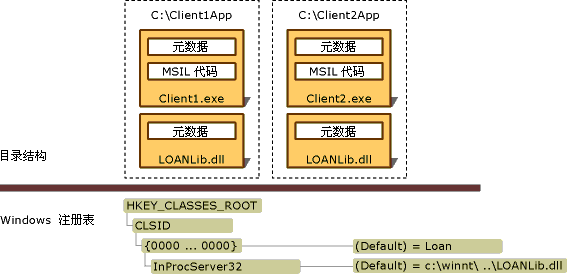

# 部署互操作应用程序
互操作应用程序通常包括 .NET 客户端程序集，表示不同 COM 类型库的一个或多个互操作程序集，以及一个或多个已注册的 COM 组件。 Visual Studio 和 [!INCLUDE[winsdklong](../../../includes/winsdklong-md.md)] 提供用于将类型库导入并转换为互操作程序集的工具，如[将类型库作为程序集导入](../../../docs/framework/interop/importing-a-type-library-as-an-assembly.md)中所述。 可以通过以下两种方式部署互操作应用程序：  
  
-   使用嵌入的互操作类型：从 [!INCLUDE[net_v40_long](../../../includes/net-v40-long-md.md)] 开始，可指示编译器将类型信息从互操作程序集嵌入到可执行文件中。 编译器只嵌入应用程序使用的类型信息。 无需将互操作程序集与应用程序一起部署。 这是推荐采用的方法。  
  
-   部署互操作程序集：可通过这种方式创建对互操作程序集的标准引用。 这种情况下，互操作程序集必须与应用程序一起部署。 如果使用此方法且不使用专有 COM 组件，请始终引用由打算并入托管代码中的 COM 组件的创建者发布的主互操作程序集 (PIA)。 有关生成和使用主互操作程序集的详细信息，请参阅[主互操作程序集](http://msdn.microsoft.com/en-us/b977a8be-59a0-40a0-a806-b11ffba5c080)。  
  
 如果使用嵌入的互操作类型，则部署过程将既简单又直观。 无需执行任何特殊操作。 本文的其余部分将介绍将应用程序与互操作程序集一起部署的方案。  
  
## 部署互操作程序集  
 程序集可以具有强名称。 具有强名称的程序集包括发布者的公钥，它提供一个唯一标识。 通过[类型库导入程序 (Tlbimp.exe)](../../../docs/framework/tools/tlbimp-exe-type-library-importer.md) 生成的程序集可由发行者使用 /keyfile 选项签名。 可将已签名的程序集安装到全局程序集缓存中。 未签名程序集必须作为专用程序集安装在用户计算机上。  
  
### 私有程序集  
 要安装私用程序集，必须在同一目录结构中安装应用程序可执行文件和包含导入的 COM 类型的互操作程序集。 下图显示由 Client1.exe 和 Client2.exe 私用的未签名互操作程序集，二者位于不同的应用程序目录中。 此示例中名为 LOANLib.dll 的互操作程序集安装了两次。  
  
   
私有部署的目录结构和注册表项  
  
 与应用程序关联的所有 COM 组件都必须安装在 Windows 注册表中。 如果图中的 Client1.exe 和 Client2.exe 安装在不同计算机上，则必须在这两台计算机上注册 COM 组件。  
  
### 共享程序集  
 多个应用程序共享的程序集应安装在一个称作全局程序集缓存的集中储存库中。 多个 .NET 客户端可访问互操作程序集的同一副本，此程序集在全局程序集缓存中签名并安装在其中。 有关生成和使用主互操作程序集的详细信息，请参阅[主互操作程序集](http://msdn.microsoft.com/en-us/b977a8be-59a0-40a0-a806-b11ffba5c080)。  
  
## 另请参阅  
 [向 .NET Framework 公开 COM 组件](../../../docs/framework/interop/exposing-com-components.md)  
 [将类型库作为程序集导入](../../../docs/framework/interop/importing-a-type-library-as-an-assembly.md)  
 [在托管代码中使用 COM 类型](http://msdn.microsoft.com/en-us/1a95a8ca-c8b8-4464-90b0-5ee1a1135b66)  
 [编译互操作项目](../../../docs/framework/interop/compiling-an-interop-project.md)
