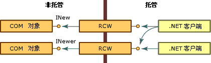
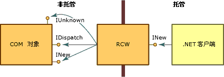

# 运行时可调用包装
公共语言运行时通过名为运行时可调用包装 (RCW) 的代理公开 COM 对象。 尽管 RCW 似乎是 .NET 客户端的普通对象，但它的主要功能是封送处理 .NET 客户端和 COM 对象之间的调用。  
  
 无论 COM 对象上有多少引用数目，运行时都只为每个 COM 对象创建一个 RCW。 运行时针对每个对象的每个进程维护一个 RCW。  如果在某个应用程序域或单元创建一个 RCW，然后传递一个其他应用程序域或单元的引用，则将使用第一个对象的代理。  如下图所示，任意数量的托管客户端都可拥有一个对公开 INew 和 INewer 接口的 COM 对象的引用。  
  
   
通过运行时可调用包装访问 COM 对象  
  
 借助从类型库派生而来的元数据，运行时创建正在调用的 COM 对象及其包装。 每个 RCW 都在其包装的 COM 对象上维护一个接口指针的缓存，并且当不再需要 RCW 时释放 COM 对象上的引用。 运行时在 RCW 上执行垃圾回收。  
  
 在其他活动中，RCW 代表包装的对象封送托管代码和非托管代码间的数据。 具体而言，每当在客户端和服务器之间传递数据的不同表示形式时，RCW 都向方法参数和方法返回值提供封送处理。  
  
 标准包装强制执行内置的封送处理规则。 例如，当 .NET 客户端将 String 类型作为参数的一部分传递到非托管对象时，包装会将字符串转换为 BSTR 类型。 如果 COM 对象向它托管的调用方返回 BSTR，则调用方会收到 String。 客户端和服务器都会发送和接收所熟悉的数据。 其他类型不需要转换。 例如，标准包装始终无需转换类型即可在托管代码和非托管代码间传递 4 字节整数。  
  
## 封送处理所选接口  
 [运行时可调用包装器](../../../docs/framework/interop/runtime-callable-wrapper.md) (RCW) 的主要目的是隐藏托管和非托管编程模型之间的差异。 若要创建无缝转换，RCW 需使用选定的 COM 接口且不将其公开到 .NET 客户端，如下图所示。  
  
   
COM 接口和运行时可调用包装  
  
 当创建为早期绑定对象时，RCW 为特定类型。 它可实现 COM 对象实现的接口，并可公开对象接口中的方法、属性和事件。 图示中，RCW 公开 INew 接口，但使用“IUnknown”和“IDispatch”接口。 此外，RCW 向 .NET 客户端公开 INew 接口的所有成员。  
  
 RCW 使用下表列出的接口，这些接口由其包装的对象公开。  
  
|接口|描述|  
|---------------|-----------------|  
|**IDispatch**|用于通过反射后期绑定到 COM 对象。|  
|**IErrorInfo**|提供以下内容的文字描述：错误、错误源、帮助文件，帮助上下文以及定义错误的接口的 GUID（.NET 类始终为 GUID_NULL）。|  
|**IProvideClassInfo**|如果正在包装的 COM 对象实现 IProvideClassInfo，RCW 会提取此接口中的类型信息以提供更佳的类型标识。|  
|**IUnknown**|针对对象标识、类型强制和生存期管理：   -   对象标识      运行时通过比较每个对象的 IUnknown 接口的值来区分 COM 对象。 -   类型强制      RCW 识别由 QueryInterface 方法执行的动态类型发现。 -   生存期管理      借助 QueryInterface 方法，RCW 获取并保存对非托管对象的引用，直到运行时在包装器上执行会释放非托管对象的垃圾回收。|  
  
 RCW 选择性地使用下表中列出的接口，这些接口由其包装的对象公开。  
  
|接口|描述|  
|---------------|-----------------|  
|**IConnectionPoint** 和 **IConnectionPointContainer**|RCW 对向基于委托的事件公开连接点事件样式的对象执行转换。|  
|**IDispatchEx**|如果类实现 IDispatchEx，则 RCW 实现 IExpando。 IDispatchEx 接口是 IDispatch 接口的扩展，与 IDispatch 不同，它可枚举、添加、删除和以区分大小的方式调用成员。|  
|**IEnumVARIANT**|使支持枚举的 COM 类型可被视为集合。|  
  
## 请参阅  
 [COM 包装](../../../docs/framework/interop/com-wrappers.md)  
 [封送选定的接口](http://msdn.microsoft.com/library/fdb97fd0-f694-4832-bf15-a4e7cf413840)  
 [COM 可调用包装器](../../../docs/framework/interop/com-callable-wrapper.md)  
 [有关从类型库转换到程序集的摘要](http://msdn.microsoft.com/library/bf3f90c5-4770-4ab8-895c-3ba1055cc958)  
 [将类型库作为程序集导入](../../../docs/framework/interop/importing-a-type-library-as-an-assembly.md)
