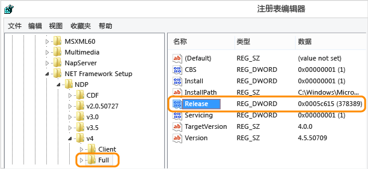

# <a name="how-to-determine-which-net-framework-versions-are-installed"></a><span data-ttu-id="b6574-102">如何：确定已安装的 .NET Framework 版本</span><span class="sxs-lookup"><span data-stu-id="b6574-102">How to: Determine which .NET Framework versions are installed</span></span>

<span data-ttu-id="b6574-103">用户可在他们的计算机上安装和运行 .NET Framework 的多个版本。</span><span class="sxs-lookup"><span data-stu-id="b6574-103">Users can install and run multiple versions of the .NET Framework on their computers.</span></span> <span data-ttu-id="b6574-104">当你开发或部署应用时，你可能需要知道用户的计算机上安装了哪些 .NET Framework 版本。</span><span class="sxs-lookup"><span data-stu-id="b6574-104">When you develop or deploy your app, you might need to know which .NET Framework versions are installed on the user’s computer.</span></span> <span data-ttu-id="b6574-105">请注意，.NET Framework 由两个采用不同版本的主要组件构成：</span><span class="sxs-lookup"><span data-stu-id="b6574-105">Note that the .NET Framework consists of two main components, which are versioned separately:</span></span>  
  
- <span data-ttu-id="b6574-106">一组程序集，它们是为应用提供功能的类型与资源的集合。</span><span class="sxs-lookup"><span data-stu-id="b6574-106">A set of assemblies, which are collections of types and resources that provide the functionality for your apps.</span></span> <span data-ttu-id="b6574-107">.NET Framework 和程序集使用相同的版本号。</span><span class="sxs-lookup"><span data-stu-id="b6574-107">The .NET Framework and assemblies share the same version number.</span></span>  
  
- <span data-ttu-id="b6574-108">公共语言运行时 (CLR)，可管理并执行应用的代码。</span><span class="sxs-lookup"><span data-stu-id="b6574-108">The common language runtime (CLR), which manages and executes your app's code.</span></span> <span data-ttu-id="b6574-109">CLR 由其自己的版本号标识（请参阅[版本和依赖关系](~/docs/framework/migration-guide/versions-and-dependencies.md)）。</span><span class="sxs-lookup"><span data-stu-id="b6574-109">The CLR is identified by its own version number (see [Versions and Dependencies](~/docs/framework/migration-guide/versions-and-dependencies.md)).</span></span>  
  
<span data-ttu-id="b6574-110">若要获取计算机上安装的 .NET Framework 版本的准确列表，你可以在代码中查看注册表或查询注册表：</span><span class="sxs-lookup"><span data-stu-id="b6574-110">To get an accurate list of the .NET Framework versions installed on a computer, you can view the registry or query the registry in code:</span></span>  
  
 [<span data-ttu-id="b6574-111">在注册表中查找 .NET Framework 版本 1-4</span><span class="sxs-lookup"><span data-stu-id="b6574-111">Find .NET Framework versions 1-4 in the registry</span></span>](#net_a)  
 [<span data-ttu-id="b6574-112">在注册表中查找 .NET Framework 4.5 及更高版本</span><span class="sxs-lookup"><span data-stu-id="b6574-112">Find .NET Framework versions 4.5 and later in the registry)</span></span>](#net_b)  
 [<span data-ttu-id="b6574-113">使用代码查询注册表（版本 1-4）</span><span class="sxs-lookup"><span data-stu-id="b6574-113">Using code to query the registry (versions 1-4)</span></span>](#net_c)  
 [<span data-ttu-id="b6574-114">使用代码查询注册表（版本 4.5 和更高版本）</span><span class="sxs-lookup"><span data-stu-id="b6574-114">Using code to query the registry (version 4.5 and later)</span></span>](#net_d)  
 [<span data-ttu-id="b6574-115">使用 PowerShell 查询注册表（版本 4.5 及更高版本）</span><span class="sxs-lookup"><span data-stu-id="b6574-115">Using PowerShell to query the registry (version 4.5 and later)</span></span>](#ps_a)  

 <span data-ttu-id="b6574-116">若要查找 CLR 版本，你可以使用工具或代码：</span><span class="sxs-lookup"><span data-stu-id="b6574-116">To find the CLR version, you can use a tool or code:</span></span>  
  
 [<span data-ttu-id="b6574-117">使用 Clrver 工具</span><span class="sxs-lookup"><span data-stu-id="b6574-117">Using the Clrver tool</span></span>](#clr_a)  
 [<span data-ttu-id="b6574-118">使用代码查询 System.Environment 类</span><span class="sxs-lookup"><span data-stu-id="b6574-118">Using code to query the System.Environment class</span></span>](#clr_b)  

> [!NOTE]
> <span data-ttu-id="b6574-119">.NET Framework 版本和公共语言运行时 (CLR) 版本之间存在差异。</span><span class="sxs-lookup"><span data-stu-id="b6574-119">There is a difference between the .NET Framework version and the common language runtime (CLR) version.</span></span> <span data-ttu-id="b6574-120">.NET Framework 基于构成 .Net Framework 类库的一组程序集进行版本控制。</span><span class="sxs-lookup"><span data-stu-id="b6574-120">The .NET Framework is versioned based on the set of assemblies that form the .NET Framework Class Library.</span></span> <span data-ttu-id="b6574-121">例如，.NET Framework 版本包括 4.5、4.6.1 和 4.7.2。</span><span class="sxs-lookup"><span data-stu-id="b6574-121">For example, .NET Framework versions include 4.5, 4.6.1, and 4.7.2.</span></span> <span data-ttu-id="b6574-122">CLR 基于执行 .NET Framework 应用程序的运行时进行版本控制，且单个 CLR 版本通常支持多个 .NET Framework 版本。</span><span class="sxs-lookup"><span data-stu-id="b6574-122">The CLR is versioned based on the runtime on which .NET Framework applications execute, and a single CLR version typically supports multiple .NET Framework versions.</span></span> <span data-ttu-id="b6574-123">CLR 版本 4.30319.xxxxx 支持 .NET Framework 版本 4 到 4.5.2；CLR 版本 4.30319.42000 支持从 .NET Framework 4.6 开始的 .NET Framework 版本。</span><span class="sxs-lookup"><span data-stu-id="b6574-123">CLR version 4.30319.*xxxxx* supports .NET Framework versions 4 through 4.5.2; CLR version 4.30319.42000 supports .NET Framework versions starting with .NET Framework 4.6.</span></span> <span data-ttu-id="b6574-124">有关更多信息，请参见 <xref:System.Environment.Version?displayProperty=nameWithType> 属性。</span><span class="sxs-lookup"><span data-stu-id="b6574-124">For more information, see the <xref:System.Environment.Version?displayProperty=nameWithType> property.</span></span>

 <span data-ttu-id="b6574-125">有关检测安装的每个 .NET Framework 版本的更新的信息，请参阅[如何：确定已安装的 .NET Framework 更新](~/docs/framework/migration-guide/how-to-determine-which-net-framework-updates-are-installed.md)。</span><span class="sxs-lookup"><span data-stu-id="b6574-125">For information about detecting the installed updates for each version of the .NET Framework, see [How to: Determine Which .NET Framework Updates Are Installed](~/docs/framework/migration-guide/how-to-determine-which-net-framework-updates-are-installed.md).</span></span> <span data-ttu-id="b6574-126">若要了解如何安装 .NET Framework，请参阅[安装面向开发人员的 .NET Framework](../../../docs/framework/install/guide-for-developers.md)。</span><span class="sxs-lookup"><span data-stu-id="b6574-126">For information about installing the .NET Framework, see [Install the .NET Framework for developers](../../../docs/framework/install/guide-for-developers.md).</span></span>  
  
<a name="net_a"></a>   
## <a name="find-net-framework-versions-1-4-in-the-registry"></a><span data-ttu-id="b6574-127">在注册表中查找 .NET Framework 版本 1-4</span><span class="sxs-lookup"><span data-stu-id="b6574-127">Find .NET Framework versions 1-4 in the registry</span></span> 
  
1.  <span data-ttu-id="b6574-128">在“开始”菜单上，选择“运行”。</span><span class="sxs-lookup"><span data-stu-id="b6574-128">On the **Start** menu, choose **Run**.</span></span>  
  
2.  <span data-ttu-id="b6574-129">在“打开”框中，输入“regedit.exe”。</span><span class="sxs-lookup"><span data-stu-id="b6574-129">In the **Open** box, enter **regedit.exe**.</span></span>  
  
     <span data-ttu-id="b6574-130">你必须具有管理凭据才能运行 regedit.exe。</span><span class="sxs-lookup"><span data-stu-id="b6574-130">You must have administrative credentials to run regedit.exe.</span></span>  
  
3.  <span data-ttu-id="b6574-131">在注册表编辑器中，打开以下子项：</span><span class="sxs-lookup"><span data-stu-id="b6574-131">In the Registry Editor, open the following subkey:</span></span>  
  
     `HKEY_LOCAL_MACHINE\SOFTWARE\Microsoft\NET Framework Setup\NDP`  
  
     <span data-ttu-id="b6574-132">对于 .NET Framework 版本 1.1 到 3.5，已安装的版本被列为 `NDP` 子项下的子项。</span><span class="sxs-lookup"><span data-stu-id="b6574-132">For .NET Framework versions 1.1 through 3.5, the installed versions are listed as subkeys under the `NDP` subkey.</span></span> <span data-ttu-id="b6574-133">版本号存储在版本子项的“版本”项中。</span><span class="sxs-lookup"><span data-stu-id="b6574-133">The version number is stored in the version subkey's **Version** entry.</span></span> 
     
     <span data-ttu-id="b6574-134">对于 .NET Framework 4，“版本”项位于 `HKEY_LOCAL_MACHINE\SOFTWARE\Microsoft\NET Framework Setup\NDP\v4.0\Client` 子项和/或 `HKEY_LOCAL_MACHINE\SOFTWARE\Microsoft\NET Framework Setup\NDP\v4.0\Full` 子项下。</span><span class="sxs-lookup"><span data-stu-id="b6574-134">For .NET Framework 4, the **Version** entry is under the `HKEY_LOCAL_MACHINE\SOFTWARE\Microsoft\NET Framework Setup\NDP\v4.0\Client` subkey, the `HKEY_LOCAL_MACHINE\SOFTWARE\Microsoft\NET Framework Setup\NDP\v4.0\Full` subkey, or under both subkeys.</span></span>

    > [!NOTE]
    > <span data-ttu-id="b6574-135">注册表中的“NET Framework Setup”文件夹不会以句点开头。</span><span class="sxs-lookup"><span data-stu-id="b6574-135">The "NET Framework Setup" folder in the registry does not begin with a period.</span></span>

    <span data-ttu-id="b6574-136">下图显示 .NET Framework 3.5 的子项及其“版本”项。</span><span class="sxs-lookup"><span data-stu-id="b6574-136">The following figure shows that the subkey for the .NET Framework 3.5 along with its **Version** entry.</span></span>

     <span data-ttu-id="b6574-137"></span><span class="sxs-lookup"><span data-stu-id="b6574-137"></span></span>

<a name="net_b"></a> 
## <a name="find-net-framework-versions-45-and-later-in-the-registry"></a><span data-ttu-id="b6574-138">在注册表中查找 .NET Framework 4.5 及更高版本</span><span class="sxs-lookup"><span data-stu-id="b6574-138">Find .NET Framework versions 4.5 and later in the registry</span></span>

1. <span data-ttu-id="b6574-139">在“开始”菜单上，选择“运行”。</span><span class="sxs-lookup"><span data-stu-id="b6574-139">On the **Start** menu, choose **Run**.</span></span>

2. <span data-ttu-id="b6574-140">在“打开”框中，输入“regedit.exe”。</span><span class="sxs-lookup"><span data-stu-id="b6574-140">In the **Open** box, enter **regedit.exe**.</span></span>

     <span data-ttu-id="b6574-141">你必须具有管理凭据才能运行 regedit.exe。</span><span class="sxs-lookup"><span data-stu-id="b6574-141">You must have administrative credentials to run regedit.exe.</span></span>

3. <span data-ttu-id="b6574-142">在注册表编辑器中，打开以下子项：</span><span class="sxs-lookup"><span data-stu-id="b6574-142">In the Registry Editor, open the following subkey:</span></span>

     `HKEY_LOCAL_MACHINE\SOFTWARE\Microsoft\NET Framework Setup\NDP\v4\Full`

     <span data-ttu-id="b6574-143">请注意，`Full` 子项的路径包括 `Net Framework` 子项，而不包括 `.NET Framework`。</span><span class="sxs-lookup"><span data-stu-id="b6574-143">Note that the path to the `Full` subkey includes the subkey `Net Framework` rather than `.NET Framework`.</span></span>

    > [!NOTE]
    > <span data-ttu-id="b6574-144">如果 `Full` 子项不存在，则表示你尚未安装 .NET Framework 4.5 或更高版本。</span><span class="sxs-lookup"><span data-stu-id="b6574-144">If the `Full` subkey is not present, then you do not have the .NET Framework 4.5 or later installed.</span></span>

     <span data-ttu-id="b6574-145">检查名为 `Release` 的 DWORD 值。</span><span class="sxs-lookup"><span data-stu-id="b6574-145">Check for a DWORD value named `Release`.</span></span> <span data-ttu-id="b6574-146">`Release` DWORD 的存在表明该计算机上已安装 .NET Framework 4.5 或更高版本。</span><span class="sxs-lookup"><span data-stu-id="b6574-146">The existence of the `Release` DWORD indicates that .NET Framework 4.5 or later has been installed on that computer.</span></span> <span data-ttu-id="b6574-147">其值是对应于特定版本的 .NET Framework 的版本键。</span><span class="sxs-lookup"><span data-stu-id="b6574-147">Its value is a release key that corresponds to a particular version of .NET Framework.</span></span> <span data-ttu-id="b6574-148">以下图为例，`Release` DWORD 的值为 378389，这是 .NET Framework 4.5 的版本密钥。</span><span class="sxs-lookup"><span data-stu-id="b6574-148">In the following figure, for example, the value of the `Release` DWORD is 378389, which is the release key for .NET Framework 4.5.</span></span> 

     <span data-ttu-id="b6574-149"></span><span class="sxs-lookup"><span data-stu-id="b6574-149"></span></span>

<span data-ttu-id="b6574-150">下表列出每个 .NET Framework 版本 `Release` DWORD 的最小值。</span><span class="sxs-lookup"><span data-stu-id="b6574-150">The following table lists the minimum value of the `Release` DWORD for each .NET Framework version.</span></span> <span data-ttu-id="b6574-151">可以使用这些值，如下所示：</span><span class="sxs-lookup"><span data-stu-id="b6574-151">You can use these values as follows:</span></span>

- <span data-ttu-id="b6574-152">若要确定是否存在 .NET Framework 最低版本，测试在注册表中找到的 `Release` DWORD 值是大于还是等于表中列出的值。</span><span class="sxs-lookup"><span data-stu-id="b6574-152">To determine whether a minimum .NET Framework version is present, test whether the `Release` DWORD value found in the registry is *greater than or equal to* the value listed in the table.</span></span> <span data-ttu-id="b6574-153">例如，如果应用程序需要 .NET Framework 4.7 或更高版本，则测试最小版本密钥值是否为 460798。</span><span class="sxs-lookup"><span data-stu-id="b6574-153">For example, if your application requires .NET Framework 4.7 or later, you would test for a minimum release key value of 460798.</span></span>

- <span data-ttu-id="b6574-154">若要测试多个版本，请从最新的 .NET Framework 版本开始，然后对每个后续的早期版本进行测试。</span><span class="sxs-lookup"><span data-stu-id="b6574-154">To test for multiple versions, begin with the latest .NET Framework version, and then test for each successive earlier version.</span></span>

[!INCLUDE[Release key values note](~/includes/version-keys-note.md)]

|<span data-ttu-id="b6574-155">.NET Framework 版本</span><span class="sxs-lookup"><span data-stu-id="b6574-155">.NET Framework Version</span></span>|<span data-ttu-id="b6574-156">Release DWORD 的值</span><span class="sxs-lookup"><span data-stu-id="b6574-156">Value of the Release DWORD</span></span>|
|--------------------------------|-------------|
|<span data-ttu-id="b6574-157">.NET Framework 4.5</span><span class="sxs-lookup"><span data-stu-id="b6574-157">.NET Framework 4.5</span></span>|<span data-ttu-id="b6574-158">378389</span><span class="sxs-lookup"><span data-stu-id="b6574-158">378389</span></span>|
|<span data-ttu-id="b6574-159">.NET Framework 4.5.1</span><span class="sxs-lookup"><span data-stu-id="b6574-159">.NET Framework 4.5.1</span></span>|<span data-ttu-id="b6574-160">378675</span><span class="sxs-lookup"><span data-stu-id="b6574-160">378675</span></span>|
|<span data-ttu-id="b6574-161">.NET Framework 4.5.2</span><span class="sxs-lookup"><span data-stu-id="b6574-161">.NET Framework 4.5.2</span></span>|<span data-ttu-id="b6574-162">379893</span><span class="sxs-lookup"><span data-stu-id="b6574-162">379893</span></span>|
|<span data-ttu-id="b6574-163">.NET Framework 4.6</span><span class="sxs-lookup"><span data-stu-id="b6574-163">.NET Framework 4.6</span></span>|<span data-ttu-id="b6574-164">393295</span><span class="sxs-lookup"><span data-stu-id="b6574-164">393295</span></span>|
|<span data-ttu-id="b6574-165">.NET Framework 4.6.1</span><span class="sxs-lookup"><span data-stu-id="b6574-165">.NET Framework 4.6.1</span></span>|<span data-ttu-id="b6574-166">394254</span><span class="sxs-lookup"><span data-stu-id="b6574-166">394254</span></span>|
|<span data-ttu-id="b6574-167">.NET Framework 4.6.2</span><span class="sxs-lookup"><span data-stu-id="b6574-167">.NET Framework 4.6.2</span></span>|<span data-ttu-id="b6574-168">394802</span><span class="sxs-lookup"><span data-stu-id="b6574-168">394802</span></span>|
|<span data-ttu-id="b6574-169">.NET Framework 4.7</span><span class="sxs-lookup"><span data-stu-id="b6574-169">.NET Framework 4.7</span></span>|<span data-ttu-id="b6574-170">460798</span><span class="sxs-lookup"><span data-stu-id="b6574-170">460798</span></span>|
|<span data-ttu-id="b6574-171">.NET Framework 4.7.1</span><span class="sxs-lookup"><span data-stu-id="b6574-171">.NET Framework 4.7.1</span></span>|<span data-ttu-id="b6574-172">461308</span><span class="sxs-lookup"><span data-stu-id="b6574-172">461308</span></span>|
|<span data-ttu-id="b6574-173">.NET Framework 4.7.2</span><span class="sxs-lookup"><span data-stu-id="b6574-173">.NET Framework 4.7.2</span></span>|<span data-ttu-id="b6574-174">461808</span><span class="sxs-lookup"><span data-stu-id="b6574-174">461808</span></span>|

<span data-ttu-id="b6574-175">有关完整的适用于特定 Windows 操作系统版本的 .NET Framework 的版本密钥表，请参阅 [.NET Framework 版本密钥和 Windows 操作系统版本](release-keys-and-os-versions.md)。</span><span class="sxs-lookup"><span data-stu-id="b6574-175">For a complete table of release keys for the .NET Framework for specific Windows operating system versions, see [.NET Framework release keys and Windows operating system versions](release-keys-and-os-versions.md).</span></span>

<a name="net_c"></a> 
## <a name="find-net-framework-versions-1-4-with-code"></a><span data-ttu-id="b6574-176">使用代码查找 .NET Framework 版本 1-4</span><span class="sxs-lookup"><span data-stu-id="b6574-176">Find .NET Framework versions 1-4 with code</span></span>

- <span data-ttu-id="b6574-177">使用 <xref:Microsoft.Win32.RegistryKey?displayProperty=nameWithType> 类访问 Windows 注册表 `HKEY_LOCAL_MACHINE` 分支下的 `Software\Microsoft\NET Framework Setup\NDP\` 子项。</span><span class="sxs-lookup"><span data-stu-id="b6574-177">Use the <xref:Microsoft.Win32.RegistryKey?displayProperty=nameWithType> class to access the `Software\Microsoft\NET Framework Setup\NDP\` subkey under `HKEY_LOCAL_MACHINE` branch in the Windows registry.</span></span>

     <span data-ttu-id="b6574-178">下面的代码显示此查询的示例。</span><span class="sxs-lookup"><span data-stu-id="b6574-178">The following code shows an example of this query.</span></span>

    > [!NOTE]
    > <span data-ttu-id="b6574-179">此代码不演示如何检测 .NET Framework 4.5 或更高版本。</span><span class="sxs-lookup"><span data-stu-id="b6574-179">This code does not show how to detect .NET Framework 4.5 or later.</span></span> <span data-ttu-id="b6574-180">检查 `Release` DWORD 以检测这些版本，如上一节所述。</span><span class="sxs-lookup"><span data-stu-id="b6574-180">Check the `Release` DWORD to detect those versions, as described in the previous section.</span></span> <span data-ttu-id="b6574-181">有关检测 .NET Framework 4.5 或更高版本的代码，请参阅本文的下一节。</span><span class="sxs-lookup"><span data-stu-id="b6574-181">For code that detects .NET Framework 4.5 or later versions, see the next section in this article.</span></span>

     [!code-csharp[ListVersions](../../../samples/snippets/csharp/framework/migration-guide/versions-installed1.cs)]
     [!code-vb[ListVersions](../../../samples/snippets/visualbasic/framework/migration-guide/versions-installed1.vb)]

<a name="net_d"></a> 
## <a name="find-net-framework-versions-45-and-later-with-code"></a><span data-ttu-id="b6574-182">使用代码查找 .NET Framework 4.5 及更高版本</span><span class="sxs-lookup"><span data-stu-id="b6574-182">Find .NET Framework versions 4.5 and later with code</span></span>

1. <span data-ttu-id="b6574-183">`HKEY_LOCAL_MACHINE\SOFTWARE\Microsoft\NET Framework Setup\NDP\v4\Full` 项中 `Release` DWORD 的存在表明该计算机上已安装 .NET Framework 4.5 或更高版本。</span><span class="sxs-lookup"><span data-stu-id="b6574-183">The existence of the `Release` DWORD in the `HKEY_LOCAL_MACHINE\SOFTWARE\Microsoft\NET Framework Setup\NDP\v4\Full` key indicates that the .NET Framework 4.5 or later is installed on a computer.</span></span> <span data-ttu-id="b6574-184">关键字的值表示已安装的版本。</span><span class="sxs-lookup"><span data-stu-id="b6574-184">The value of the keyword indicates the installed version.</span></span> <span data-ttu-id="b6574-185">若要检查此关键字，使用 <xref:Microsoft.Win32.RegistryKey.OpenBaseKey%2A?displayProperty=nameWithType> 和 <xref:Microsoft.Win32.RegistryKey.OpenSubKey%2A?displayProperty=nameWithType> 方法访问 Windows 注册表中的子项。</span><span class="sxs-lookup"><span data-stu-id="b6574-185">To check this keyword, use the <xref:Microsoft.Win32.RegistryKey.OpenBaseKey%2A?displayProperty=nameWithType> and <xref:Microsoft.Win32.RegistryKey.OpenSubKey%2A?displayProperty=nameWithType> methods to access the subkey in the Windows registry.</span></span>

2. <span data-ttu-id="b6574-186">检查 `Release` 关键字的值以确定安装的版本。</span><span class="sxs-lookup"><span data-stu-id="b6574-186">Check the value of the `Release` keyword to determine the installed version.</span></span> <span data-ttu-id="b6574-187">若要向前兼容，可以检查值是大于还是等于[在注册表中查找 .NET Framework 4.5 及更高版本](#net_b)部分的表中列出的值。</span><span class="sxs-lookup"><span data-stu-id="b6574-187">To be forward-compatible, you can check for a value greater than or equal to the value listed in the table in the [Find .NET Framework versions 4.5 and later in the registry](#net_b) section.</span></span>

<span data-ttu-id="b6574-188">以下示例检查注册表中的 `Release` 值来确定是否已安装 .NET Framework 4.5 或更高版本。</span><span class="sxs-lookup"><span data-stu-id="b6574-188">The following example checks the `Release` value in the registry to determine whether .NET Framework 4.5 or a later version is installed.</span></span>

[!code-csharp[ListVersions#5](../../../samples/snippets/csharp/framework/migration-guide/versions-installed3.cs)]
[!code-vb[ListVersions#5](../../../samples/snippets/visualbasic/framework/migration-guide/versions-installed3.vb)]

<span data-ttu-id="b6574-189">此示例遵循版本检查的建议做法：</span><span class="sxs-lookup"><span data-stu-id="b6574-189">This example follows the recommended practice for version checking:</span></span>

- <span data-ttu-id="b6574-190">检查 `Release` 项的值是否*大于等于*已知版本键的值。</span><span class="sxs-lookup"><span data-stu-id="b6574-190">It checks whether the value of the `Release` entry is *greater than or equal to* the value of the known release keys.</span></span>

- <span data-ttu-id="b6574-191">按从最新版本到最早版本的顺序检查。</span><span class="sxs-lookup"><span data-stu-id="b6574-191">It checks in order from most recent version to earliest version.</span></span>

<a name="ps_a"></a> 
## <a name="check-for-a-minimum-required-net-framework-version-45-and-later-with-powershell"></a><span data-ttu-id="b6574-192">使用 PowerShell 检查所需的 .NET Framework 的最低版本（4.5 或更高版本）</span><span class="sxs-lookup"><span data-stu-id="b6574-192">Check for a minimum required .NET Framework version (4.5 and later) with PowerShell</span></span>

<span data-ttu-id="b6574-193">下面的示例检查 `Release` 关键字的值，以确定是否已安装 .NET Framework 4.6.2 或更高版本（如果已安装，返回 `True`；否则，返回 `False`）。</span><span class="sxs-lookup"><span data-stu-id="b6574-193">The following example checks the value of the `Release` keyword to determine whether .NET Framework 4.6.2 or higher is installed (returning `True` if it is and `False` otherwise).</span></span>

    ```PowerShell
    # PowerShell 5
    Get-ChildItem 'HKLM:\SOFTWARE\Microsoft\NET Framework Setup\NDP\v4\Full\' | Get-ItemPropertyValue -Name Release | Foreach-Object { $_ -ge 394802 } 
    ```

    ```PowerShell
    # PowerShell 4
    (Get-ItemProperty "HKLM:SOFTWARE\Microsoft\NET Framework Setup\NDP\v4\Full").Release -gt 394802
    ```

    You can replace `394802` in the previous example with another value from the following table in the [Find .NET Framework versions 4.5 and later in the registry](#net_b) section to check for a different minimum required .NET Framework version.
  
<a name="clr_a"></a> 
## <a name="find-the-current-clr-version-with-clrverexe"></a><span data-ttu-id="b6574-194">使用 Clrver.exe 查找当前的 CLR 版本</span><span class="sxs-lookup"><span data-stu-id="b6574-194">Find the current CLR version with Clrver.exe</span></span>

<span data-ttu-id="b6574-195">使用 CLR 版本工具 (Clrver.exe) 决定已安装在计算机上的公共语言运行时的版本。</span><span class="sxs-lookup"><span data-stu-id="b6574-195">Use the CLR Version Tool (Clrver.exe) to determine which versions of the common language runtime are installed on a computer.</span></span>

<span data-ttu-id="b6574-196">从“Visual Studio 开发人员命令提示”，输入 `clrver`。</span><span class="sxs-lookup"><span data-stu-id="b6574-196">From a Developer Command Prompt for Visual Studio, enter `clrver`.</span></span> <span data-ttu-id="b6574-197">该命令生成类似下面的输出：</span><span class="sxs-lookup"><span data-stu-id="b6574-197">This command produces output similar to the following:</span></span>

```console
Versions installed on the machine:
v2.0.50727
v4.0.30319
```

<span data-ttu-id="b6574-198">有关使用此工具的详细信息，请参阅 [Clrver.exe（CLR 版本工具）](~/docs/framework/tools/clrver-exe-clr-version-tool.md)。</span><span class="sxs-lookup"><span data-stu-id="b6574-198">For more information about using this tool, see [Clrver.exe (CLR Version Tool)](~/docs/framework/tools/clrver-exe-clr-version-tool.md).</span></span>

<a name="clr_b"></a> 
## <a name="find-the-current-clr-version-with-the-environment-class"></a><span data-ttu-id="b6574-199">使用 Environment 类查找当前的 CLR 版本</span><span class="sxs-lookup"><span data-stu-id="b6574-199">Find the current CLR version with the Environment class</span></span>

<span data-ttu-id="b6574-200">可以检索 <xref:System.Environment.Version?displayProperty=nameWithType> 属性的值，以检索标识当前正在执行代码的运行时版本的 <xref:System.Version> 对象。</span><span class="sxs-lookup"><span data-stu-id="b6574-200">You can retrieve the value of the <xref:System.Environment.Version?displayProperty=nameWithType> property to retrieve a <xref:System.Version> object that identifies the version of the runtime that is currently executing the code.</span></span> <span data-ttu-id="b6574-201">此属性返回单个值，用于反映当前正在执行代码的运行时的版本；它不返回可能已安装在计算机上的程序集版本或运行时的其他版本。可以使用 <xref:System.Version.Major%2A?displayProperty=nameWithType> 属性获取主版本标识符（例如，“4”即表示版本 4.0），使用 <xref:System.Version.Minor%2A?displayProperty=nameWithType> 属性获取次要版本标识符（例如，“0”即表示版本 4.0），或使用 <xref:System.Version.ToString%2A?displayProperty=nameWithType> 方法获取完整版本字符串（例如，“4.0.30319.18010”，如以下代码所示）。</span><span class="sxs-lookup"><span data-stu-id="b6574-201">This property returns a single value that reflects the version of the runtime that is currently executing the code; it does not return assembly versions or other versions of the runtime that may have been installed on the computer.You can use the <xref:System.Version.Major%2A?displayProperty=nameWithType> property to get the major release identifier (for example, "4" for version 4.0), the <xref:System.Version.Minor%2A?displayProperty=nameWithType> property to get the minor release identifier (for example, "0" for version 4.0), or the <xref:System.Version.ToString%2A?displayProperty=nameWithType> method to get the entire version string (for example, "4.0.30319.18010", as shown in the following code).</span></span> 

<span data-ttu-id="b6574-202">对于 .NET Framework 版本 4、4.5、4.5.1 和 4.5.2，<xref:System.Environment.Version%2A?displayProperty=nameWithType> 属性返回字符串表现形式具有窗体 `4.0.30319.xxxxx` 的 <xref:System.Version> 对象。</span><span class="sxs-lookup"><span data-stu-id="b6574-202">For the .NET Framework Versions 4, 4.5, 4.5.1, and 4.5.2, the <xref:System.Environment.Version%2A?displayProperty=nameWithType> property returns a <xref:System.Version> object whose string representation has the form `4.0.30319.xxxxx`.</span></span> <span data-ttu-id="b6574-203">对于 .NET Framework 4.6 及更高版本，形式为 `4.0.30319.42000`。</span><span class="sxs-lookup"><span data-stu-id="b6574-203">For the .NET Framework 4.6 and later, it has the form `4.0.30319.42000`.</span></span>

> [!IMPORTANT]
> <span data-ttu-id="b6574-204">对于 .NET Framework 4.5 和更高版本，不建议使用 <xref:System.Environment.Version%2A?displayProperty=nameWithType> 属性来检测运行时的版本。</span><span class="sxs-lookup"><span data-stu-id="b6574-204">For the .NET Framework 4.5 and later, we do not recommend using the  <xref:System.Environment.Version%2A?displayProperty=nameWithType> property to detect the version of the runtime.</span></span> <span data-ttu-id="b6574-205">相反，我们建议查询注册表，如本文前面[通过用代码查询注册表来查找 .NET Framework 版本（.NET Framework 4.5 及更高版本）](#net_d)一节所述。</span><span class="sxs-lookup"><span data-stu-id="b6574-205">Instead, we recommend that you query the registry, as described in the [To find .NET Framework versions by querying the registry in code (.NET Framework 4.5 and later)](#net_d) section earlier in this article.</span></span>

<span data-ttu-id="b6574-206">下面的示例已使用 <xref:System.Environment.Version%2A?displayProperty=nameWithType> 属性来检索运行时版本信息：</span><span class="sxs-lookup"><span data-stu-id="b6574-206">The following example used the <xref:System.Environment.Version%2A?displayProperty=nameWithType> property to retrieve runtime version information:</span></span>

[!code-csharp[ListVersions](../../../samples/snippets/csharp/framework/migration-guide/versions-installed2.cs)]
[!code-vb[ListVersions](../../../samples/snippets/visualbasic/framework/migration-guide/versions-installed2.vb)]

## <a name="see-also"></a><span data-ttu-id="b6574-207">请参阅</span><span class="sxs-lookup"><span data-stu-id="b6574-207">See also</span></span>

- [<span data-ttu-id="b6574-208">如何：确定已安装的 .NET Framework 更新</span><span class="sxs-lookup"><span data-stu-id="b6574-208">How to: Determine Which .NET Framework Updates Are Installed</span></span>](~/docs/framework/migration-guide/how-to-determine-which-net-framework-updates-are-installed.md)
- [<span data-ttu-id="b6574-209">安装面向开发者的 .NET Framework</span><span class="sxs-lookup"><span data-stu-id="b6574-209">Install the .NET Framework for developers</span></span>](../../../docs/framework/install/guide-for-developers.md)
- [<span data-ttu-id="b6574-210">版本和依赖关系</span><span class="sxs-lookup"><span data-stu-id="b6574-210">Versions and Dependencies</span></span>](~/docs/framework/migration-guide/versions-and-dependencies.md)
