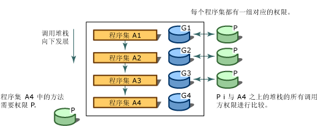

# 代码访问安全性
[!INCLUDE[net_security_note](../../../includes/net-security-note-md.md)]  
  
 当今高度连接的计算机系统频繁地暴露来自各种可能未知源的代码中。 代码可附加到电子邮件、包含在文档中或通过 Internet 下载。 不幸的是，许多计算机用户都亲身经历了恶意移动代码（包括病毒和蠕虫）所带来的影响，这些代码可能损坏或破坏数据、花费时间和资金。  
  
 最常见的安全机制是根据用户的登录凭据（通常为密码）授予用户权限，以及限制允许用户访问的资源（通常为目录和文件）。 然而，这种方法无法解决以下几个问题：用户从许多来源获取代码，其中一些来源可能不可靠；代码包含 bug 或漏洞，被恶意代码所利用；代码有时会执行一些用户不知道的操作。 因此，当谨慎且值得信赖的用户运行恶意或有错的软件时，计算机系统可能会受到损坏并泄露私有数据。 大多数操作系统安全机制要求每一段代码必须完全可信方能运行（Web 页面上的脚本除外）。 因此，仍需要一个广泛适用的安全机制来允许源自一个计算机系统的代码在另一个系统中受保护运行，即使这两个系统之间没有信任关系。  
  
 .NET Framework 提供了一种安全机制，称为代码访问安全性。该机制可帮助保护计算机系统免受恶意移动代码的侵害，允许来自未知源的代码在实施保护的情况下运行，并帮助防止受信任的代码免受有意或无意安全性折损影响。 代码访问安全性使代码可以根据它所来自的位置以及代码标识的其他方面，获得不同等级的受信度。 代码访问安全性还对代码强制实施不同的信任级别，从而最大程度地减少必须完全可信方能运行的代码数量。 使用代码访问安全性可以降低恶意或有错代码滥用代码的可能性。 它可以减少责任，因为你可以指定允许代码执行的操作。 代码访问安全性还可以最大程度地减少代码安全漏洞所产生的损害。  
  
> [!NOTE]
>  [!INCLUDE[net_v40_long](../../../includes/net-v40-long-md.md)] 中的代码访问安全性已经进行了重大更改。 最值得注意的更改已被[安全透明度](../../../docs/framework/misc/security-transparent-code.md)，但也有其他影响代码访问安全性的重大更改。 有关这些更改的信息，请参阅[安全更改](../../../docs/framework/security/security-changes.md)。  
  
 代码访问安全性主要影响库代码和部分受信任的应用程序。 库开发人员必须防止部分受信任的应用程序在未经授权的情况下访问其代码。 部分受信任的应用程序是从外部源（如 Internet）中加载的应用程序。 台式机或本地局域网中安装的应用程序完全受信任并可运行。 完全信任应用程序不影响代码访问安全，除非标记为[安全透明](../../../docs/framework/misc/security-transparent-code.md)，因为它们是完全受信任。 完全受信任应用程序的唯一限制是，标记有 <xref:System.Security.SecurityTransparentAttribute> 特性的应用程序无法调用标记有 <xref:System.Security.SecurityCriticalAttribute> 特性的代码。 部分受信任的应用程序必须在沙盒（如 Internet Explorer）中运行，以确保应用代码访问安全性。 如果从 Internet 下载一个应用程序并尝试在台式机中运行该应用程序，那么将收到 <xref:System.NotSupportedException> 并且系统将显示消息：“尝试从网络地址加载程序集，这可能会导致程序集在旧版 .NET Framework 中进行沙盒处理。 此版本的 .NET Framework 默认不启用 CAS 策略，因此加载可能存在危险。” 如果您确信可以信任应用程序，你可以使其能够通过使用以完全信任权限来运行[ \<loadFromRemoteSources > 元素](../../../docs/framework/configure-apps/file-schema/runtime/loadfromremotesources-element.md)。 有关在沙盒中运行应用程序的信息，请参阅[如何： 运行部分受信任的代码在沙盒中](../../../docs/framework/misc/how-to-run-partially-trusted-code-in-a-sandbox.md)。  
  
 面向公共语言运行时的所有托管代码都受益于代码访问安全性，即使该代码不调用单个代码访问安全性。 有关详细信息，请参阅[代码访问安全性基础知识](../../../docs/framework/misc/code-access-security-basics.md)。  
  
   
## 代码访问安全性的主要功能  
 代码访问安全性帮助限制代码对受保护资源和操作的访问权限。 在 .NET Framework 中，代码访问安全性具有以下功能：  
  
-   定义权限和权限集，它们表示访问各种系统资源的权限。  
  
-   使代码能够要求其调用方拥有特定的权限。  
  
-   使代码能够要求其调用方拥有数字签名，从而只允许特定组织或特定站点的调用方来调用受保护的代码。  
  
-   通过将调用堆栈上为每个调用方授予的权限与调用方必须拥有的权限相比较，加强在运行时对代码的限制。  
  
   
## 审核调用堆栈  
 为了确定代码是否有权访问某一资源或执行某一操作，运行时的安全系统将审核调用堆栈，以将每个调用方获得的权限与要求的权限进行比较。 如果调用堆栈中的任何调用方不具备要求的权限，则会引发安全性异常并拒绝访问。 堆栈审核旨在帮助防止引诱攻击，引诱攻击是指不太受信任的代码调用高度受信任的代码，并利用高度受信任的代码来执行未经授权的操作。 在运行时要求所有调用方的权限会影响性能，但是为了帮助防止代码免受不太受信任的代码的引诱攻击，这是很有必要的。 为了优化性能，可以使代码执行少量堆栈审核，但是必须确保每次进行此操作时不会暴露安全性漏洞。  
  
 下图显示当程序集 A4 中的方法要求其调用方具备 P 权限时堆栈审核产生的结果。  
  
   
安全性堆栈审核  
  
   
## 相关主题  
  
|标题|描述|  
|-----------|-----------------|  
|[代码访问安全性基础知识](../../../docs/framework/misc/code-access-security-basics.md)|描述代码访问安全性及其最常见的用途。|  
|[安全透明的代码，级别 2](../../../docs/framework/misc/security-transparent-code-level-2.md)|描述 [!INCLUDE[net_v40_short](../../../includes/net-v40-short-md.md)] 中的安全性透明模型。|  
|[通过部分受信任的代码使用库](../../../docs/framework/misc/using-libraries-from-partially-trusted-code.md)|描述如何借助非托管代码启用库以及如何从非托管代码中使用库。|  
|[安全性的基础概念](../../../docs/standard/security/key-security-concepts.md)|概述 .NET Framework 安全性系统中使用的许多关键术语和概念。|  
|[基于角色的安全性](../../../docs/standard/security/role-based-security.md)|描述如何合并基于角色的安全性。|  
|[Cryptographic Services](../../../docs/standard/security/cryptographic-services.md)|描述如何将加密合并到应用程序。|
