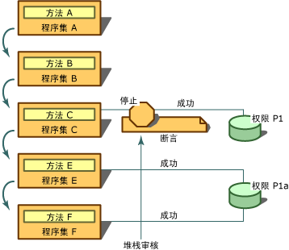

# <a name="using-the-assert-method"></a>使用 Assert 方法
[!INCLUDE[net_security_note](../../../includes/net-security-note-md.md)]  
  
 <xref:System.Security.CodeAccessPermission.Assert%2A> 是一种可在代码访问权限类和 <xref:System.Security.PermissionSet> 类上调用的方法。 你可以使用**断言**若要启用你的代码 （和下游调用方） 以执行你的代码有权执行的操作，但其调用方可能没有权限来执行。 安全断言会更改在安全检查期间运行时所执行的正常过程。 断言权限时，它会通知安全系统不检查断言权限的代码的调用方。  
  
> [!CAUTION]
>  请谨慎使用断言，因为它们会打开安全漏洞并破坏运行时强制执行安全限制的机制。  
  
 当库调用非托管代码或所执行的调用需要与库的预期用途不明显关联的权限时，断言非常有用。 例如，所有托管代码的调入非托管代码必须具有**SecurityPermission**与**UnmanagedCode**指定的标志。 默认情况下，如果代码不是来自本地计算机（如从本地 intranet 下载的代码），则不会对其授予此权限。 因此，为了使从本地 intranet 下载的代码能调用使用非托管代码的库，它必须具有由该库断言的权限。 此外，某些库可能会执行对调用方不可见且需要特殊权限的调用。  
  
 在代码以对调用方完全不可见的方式访问资源时，也可使用断言。 例如，假设你的库从数据库获取信息，但在此过程中还会从计算机注册表读取信息。 使用你的库的开发人员无权访问你的源，因为它们具有无法知道其代码需要**RegistryPermission**才能使用你的代码。 在此情况下，如果你决定要求代码调用方有权访问注册表是不合理或不必要的，你可以断言权限以读取注册表。 在此情况下，它是适用于库可以断言权限，而无需呼叫**RegistryPermission**可以使用库。  
  
 仅当断言权限和下游调用方所需的权限属于同一类型且要求的权限是断言权限的子集时，断言才会影响堆栈审核。 例如，如果你断言**FileIOPermission**读取 C 驱动器中，以及的下游要求上的所有文件对进行**FileIOPermission**读取 C:\Temp 中的文件，则断言可能会影响堆栈审核;但是，如果是要求**FileIOPermission**要写入到 C 驱动器，则断言将不起作用。  
  
 若要执行断言，必须向你的代码授予正在断言的权限以及表示有权执行断言的 <xref:System.Security.Permissions.SecurityPermission>。 虽然你可以断言尚未授予代码的权限，但此断言毫无意义，因为安全检查在断言使其成功之前就会失败。  
  
 下图显示了当你使用时，会发生什么情况**断言**。 假设以下语句针对程序集 A、B、C、E 和 F 以及 P1 和 P1A 两个权限为 true：  
  
-   P1A 表示读取 C 驱动器上的 .txt 文件的权限。  
  
-   P1 表示读取 C 驱动器上所有文件的权限。  
  
-   P1A 和 P1 都**FileIOPermission**类型，且 P1A 是 P1 的子集。  
  
-   已向程序集 E 和 F 授予了 P1A 权限。  
  
-   已向程序集 C 授予了 P1 权限。  
  
-   尚未向程序集 A 和 B 授予 P1 或 P1A 权限。  
  
-   方法 A 包含在程序集 A 中，方法 B 包含在程序集 B 中，依次类推。  
  
   
使用断言  
  
 在此方案，方法 A 调用 B、 B 调用 C、 C 调用 E、 和 E 调用 f。 方法 C 断言权限以读取 C 驱动器 （权限 P1） 上的文件和方法 E 要求权限以读取 C 驱动器 （权限 P1A） 上的.txt 文件。 当在运行时遇到 F 中的要求时，将执行堆栈审核以检查 F 的所有调用方的权限从 E 开始已被授予 P1A 权限，以便堆栈审核将继续检查的 C，其中发现 C 的断言的权限。 因为要求的权限 (P1A) 是断言的权限 (P1) 的子集，所以堆栈审核将停止且安全检查会自动成功。 未向程序集 A 和 B 授予权限 P1A 并不重要。 通过断言 P1，方法 C 确保其调用方可以访问受 P1 保护的资源，即使尚未授予调用方访问该资源的权限也是如此。  
  
 如果你设计一个类库且某个类访问受保护的资源，则在大多数情况下，你应该提出安全要求，要求此类的调用方拥有适当的权限。 如果该类随后会执行一项操作你知道其大多数调用方均将不具有权限，并且你是否愿意为允许这些调用方调用你的代码承担责任，你可以断言权限，通过调用**断言**上表示的操作的权限对象的方法的代码是否执行。 使用**断言**以这种方式调用方也能够使通常不能调用你的代码。 因此，如果你断言了一个权限，应确保预先执行了适当的安全检查，以防止你的组件被误用。  
  
 例如，假设你的高度受信任的库类具有删除文件的方法。 它通过调用非托管的 Win32 函数来访问文件。 调用方调用你的代码**删除**方法，并传递要删除的文件的名称 C:\Test.txt。 在**删除**方法，你的代码创建<xref:System.Security.Permissions.FileIOPermission>表示对 C:\Test.txt 的写访问的对象。 （需要写权限来删除文件。）你的代码然后通过调用来调用命令性安全检查**FileIOPermission**对象的**需**方法。 如果调用堆栈中的某个调用方不具有此权限，则会引发 <xref:System.Security.SecurityException>。 如果未引发任何异常，你会知道所有调用方都有权限访问 C:\Test.txt。 由于您确信大多数调用方没有访问非托管的代码的权限，然后，你的代码创建<xref:System.Security.Permissions.SecurityPermission>对象，表示有权调用非托管的代码并调用该对象的**断言**方法。 最后，它会调用非托管的 Win32 函数来删除 C:\Text.txt，并将控件返回给调用方。  
  
> [!CAUTION]
>  你必须确保你的代码在以下情况下不使用断言：其他代码可使用你的代码来访问由你正在断言的权限所保护的资源。 例如，在代码中将写入其名称由作为参数调用方指定的文件，不可断言**FileIOPermission**来写入文件，因为你的代码将可能被第三方误用。  
  
 当你使用命令性安全语法时，调用**断言**在同一方法中的多个权限上的方法会导致安全异常引发。 相反，应创建**PermissionSet**对象，请将其传递要调用，然后调用的单个权限**断言**方法**PermissionSet**对象。 你可以调用**断言**超过一次当你使用的声明性安全语法的方法。  
  
 下面的示例演示声明性语法重写安全检查使用**断言**方法。 请注意， **FileIOPermissionAttribute**语法采用两个值：<xref:System.Security.Permissions.SecurityAction>枚举以及文件或目录为授予权限的位置。 调用**断言**导致访问的存储需求`C:\Log.txt`成功，即使调用方不检查的权限访问该文件。  
  
```vb  
Option Explicit  
Option Strict  
  
Imports System  
Imports System.IO  
Imports System.Security.Permissions  
  
Namespace LogUtil  
   Public Class Log  
      Public Sub New()  
  
      End Sub  
  
     <FileIOPermission(SecurityAction.Assert, All := "C:\Log.txt")> Public Sub   
      MakeLog()  
         Dim TextStream As New StreamWriter("C:\Log.txt")  
         TextStream.WriteLine("This  Log was created on {0}", DateTime.Now) '  
         TextStream.Close()  
      End Sub  
   End Class  
End Namespace  
```  
  
```csharp  
namespace LogUtil  
{  
   using System;  
   using System.IO;  
   using System.Security.Permissions;  
  
   public class Log  
   {  
      public Log()  
      {      
      }     
      [FileIOPermission(SecurityAction.Assert, All = @"C:\Log.txt")]  
      public void MakeLog()  
      {     
         StreamWriter TextStream = new StreamWriter(@"C:\Log.txt");  
         TextStream.WriteLine("This  Log was created on {0}", DateTime.Now);  
         TextStream.Close();  
      }  
   }  
}   
```  
  
 下面的代码段显示命令性语法重写安全检查使用**断言**方法。 在此示例中，实例**FileIOPermission**声明对象。 其构造函数传递**FileIOPermissionAccess.AllAccess**允许，访问的类型定义后, 跟描述文件的位置的字符串。 一次**FileIOPermission**定义对象，只需调用其**断言**方法重写安全检查。  
  
```vb  
Option Explicit  
Option Strict  
Imports System  
Imports System.IO  
Imports System.Security.Permissions  
Namespace LogUtil  
   Public Class Log  
      Public Sub New()  
      End Sub 'New  
  
      Public Sub MakeLog()  
         Dim FilePermission As New FileIOPermission(FileIOPermissionAccess.AllAccess, "C:\Log.txt")  
         FilePermission.Assert()  
         Dim TextStream As New StreamWriter("C:\Log.txt")  
         TextStream.WriteLine("This  Log was created on {0}", DateTime.Now)  
         TextStream.Close()  
      End Sub  
   End Class  
End Namespace  
```  
  
```csharp  
namespace LogUtil  
{  
   using System;  
   using System.IO;  
   using System.Security.Permissions;  
  
   public class Log  
   {  
      public Log()  
      {      
      }     
      public void MakeLog()  
      {  
         FileIOPermission FilePermission = new FileIOPermission(FileIOPermissionAccess.AllAccess,@"C:\Log.txt");   
         FilePermission.Assert();  
         StreamWriter TextStream = new StreamWriter(@"C:\Log.txt");  
         TextStream.WriteLine("This  Log was created on {0}", DateTime.Now);  
         TextStream.Close();  
      }  
   }  
}  
```  
  
## <a name="see-also"></a>请参阅  
 <xref:System.Security.PermissionSet>  
 <xref:System.Security.Permissions.SecurityPermission>  
 <xref:System.Security.Permissions.FileIOPermission>  
 <xref:System.Security.Permissions.SecurityAction>  
 [特性](../../../docs/standard/attributes/index.md)  
 [代码访问安全性](../../../docs/framework/misc/code-access-security.md)
