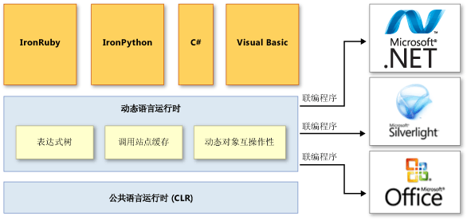

# 动态语言运行时概述Dynamic Language Runtime Overview

动态语言运行时 (DLR) 是一种运行时环境，可以将一组动态语言服务添加到公共语言运行时 (CLR)。The *dynamic language runtime* (DLR) is a runtime environment that adds a set of services for dynamic languages to the common language runtime (CLR). 使用 DLR 可以轻松开发在 .NET Framework 上运行的动态语言，并为静态类型语言添加动态特征。The DLR makes it easier to develop dynamic languages to run on the .NET Framework and to add dynamic features to statically typed languages.

动态语言可以在运行时标识对象的类型，而在 C# 和 Visual Basic（使用 `Option Explicit On` 时）等静态类型的语言中，则必须在设计时指定对象类型。Dynamic languages can identify the type of an object at run time, whereas in statically typed languages such as C# and Visual Basic (when you use `Option Explicit On`) you must specify object types at design time. 动态语言包括 Lisp、Smalltalk、JavaScript、PHP、Ruby、Python、ColdFusion、Lua、Cobra 和 Groovy 等。Examples of dynamic languages are Lisp, Smalltalk, JavaScript, PHP, Ruby, Python, ColdFusion, Lua, Cobra, and Groovy.

对开发人员而言，大部分动态语言具有以下优势：Most dynamic languages provide the following advantages for developers:

-   能使用快速反馈循环（REPL 或称读取-评估-打印循环）。The ability to use a rapid feedback loop (REPL, or read-evaluate-print loop). 用户可以输入多个语句，并立即执行这些语句查看结果。This lets you enter several statements and immediately execute them to see the results.

-   同时支持自上而下的开发和传统的自下而上的开发。Support for both top-down development and more traditional bottom-up development. 例如，使用自上而下的方法时，可以调用尚未实现的函数，然后在需要时添加底层实现。For example, when you use a top-down approach, you can call functions that are not yet implemented and then add underlying implementations when you need them.

-   重构和代码修改变得更加简单，因为不必更改整个代码中的静态类型声明。Easier refactoring and code modifications, because you do not have to change static type declarations throughout the code.

动态语言可以生成出色的脚本语言。Dynamic languages make excellent scripting languages. 客户可以使用新命令和新功能轻松扩展使用动态语言创建的应用程序。Customers can easily extend applications created by using dynamic languages with new commands and functionality. 动态语言也经常用于创建网站和测试工具、维护服务器场、开发各种实用程序以及执行数据转换。Dynamic languages are also frequently used for creating Web sites and test harnesses, maintaining server farms, developing various utilities, and performing data transformations.

DLR 的目的是让动态语言系统可以在 .NET Framework 上运行，并为其提供 .NET 互操作性。The purpose of the DLR is to enable a system of dynamic languages to run on the .NET Framework and give them .NET interoperability. DLR 将动态对象添加到 C# 和 Visual Basic，以支持这些语言的动态行为，并实现这些语言与动态语言的互操作。The DLR adds dynamic objects to C# and Visual Basic to support dynamic behavior in these languages and enable their interoperation with dynamic languages.

DLR 还可以帮助用户创建支持动态操作的库。The DLR also helps you create libraries that support dynamic operations. 例如，如果用户的库使用的是 XML 或 JavaScript 对象表示法 (JSON) 对象，则对于使用 DLR 的语言，该对象可以显示为动态对象。For example, if you have a library that uses XML or JavaScript Object Notation (JSON) objects, your objects can appear as dynamic objects to languages that use the DLR. 这样库用户可以编写语法更简单且更自然的代码来操作对象和访问对象成员。This lets library users write syntactically simpler and more natural code for operating with objects and accessing object members.

例如，可以使用以下 C# 代码在 XML 中增加一个计数器。For example, you might use the following code to increment a counter in XML in C#.

`Scriptobj.SetProperty("Count", ((int)GetProperty("Count")) + 1);`

而使用 DLR 则可以改为使用以下代码实现相同的操作。By using the DLR, you could use the following code instead for the same operation.

`scriptobj.Count += 1;`

DLR 与 CLR一样，也属于 .NET Framework，并随 .NET Framework 和 Visual Studio 安装包提供。Like the CLR, the DLR is a part of the .NET Framework and is provided with the .NET Framework and Visual Studio installation packages. 还可以从 GitHub 上的 [IronLanguages/dlr](https://github.com/IronLanguages/dlr) 存储库下载 DLR 的开源版本。The open-source version of the DLR is also available for download on the [IronLanguages/dlr](https://github.com/IronLanguages/dlr) repo on GitHub.

> [!NOTE]
> DLR 开源版本具有 Visual Studio 和 .NET Framework 中包含的 DLR 所具有的所有功能。The open-source version of the DLR has all the features of the DLR that is included in Visual Studio and the .NET Framework. 它还为语言实现者提供额外支持。It also provides additional support for language implementers. 有关详细信息，请参阅位于 GitHub 上 [IronLanguages/dlr](https://github.com/IronLanguages/dlr) 存储库上的文档。For more information, see the documentation on the [IronLanguages/dlr](https://github.com/IronLanguages/dlr) repo on GitHub.

举例来说，使用 DLR 开发的语言包括以下语言：Examples of languages developed by using the DLR include the following:

-   IronPython。IronPython. 在 [GitHub](https://github.com/IronLanguages/ironpython2) 网站上作为开源软件提供。Available as open-source software from the [GitHub](https://github.com/IronLanguages/ironpython2) Web site.

-   IronRuby。IronRuby. 在 [RubyForge](https://go.microsoft.com/fwlink/?LinkId=141044) 网站上作为开源软件提供。Available as open-source software from the [RubyForge](https://go.microsoft.com/fwlink/?LinkId=141044) Web site.

## DLR 的主要优点Primary DLR Advantages
 DLR 具有以下优点。The DLR provides the following advantages.

### 简化了将动态语言移植到 .NET Framework 的操作Simplifies Porting Dynamic Languages to the .NET Framework
 DLR 让语言实现者无需创建词法分析器、解析器、语义分析器、代码生成器等过去需要自己创建的工具。The DLR allows language implementers to avoid creating lexical analyzers, parsers, semantic analyzers, code generators, and other tools that they traditionally had to create themselves. 若要使用 DLR，语言需要生成以树形结构表示语言级代码的表达式树、运行时帮助程序例程以及用于实现 <xref:System.Dynamic.IDynamicMetaObjectProvider> 接口的可选动态对象。To use the DLR, a language needs to produce *expression trees*, which represent language-level code in a tree-shaped structure, runtime helper routines, and optional dynamic objects that implement the <xref:System.Dynamic.IDynamicMetaObjectProvider> interface. DLR 和 .NET Framework 自动执行大量代码分析和代码生成任务。The DLR and the .NET Framework automate a lot of code analysis and code generation tasks. 这样语言实现者可以集中处理独特的语言功能。This enables language implementers to concentrate on unique language features.

### 在静态类型语言中实现动态功能Enables Dynamic Features in Statically Typed Languages
 现有的 .NET Framework 语言（如 C# 和 Visual Basic）可以创建动态对象，并将动态对象与静态类型对象结合使用。Existing .NET Framework languages such as C# and Visual Basic can create dynamic objects and use them together with statically typed objects. 例如，C# 和 Visual Basic 可将动态对象用于 HTML、文档对象模型 (DOM) 和 .NET 反射。For example, C# and Visual Basic can use dynamic objects for HTML, Document Object Model (DOM), and .NET reflection.

### 可以获得 DLR 和 .NET Framework 的后续改进Provides Future Benefits of the DLR and .NET Framework
 使用 DLR 实现的语言可受益于 DLR 和 .NET Framework 的后续改进。Languages implemented by using the DLR can benefit from future DLR and .NET Framework improvements. 例如，如果 .NET Framework 发布的新版本改进了垃圾回收器或降低了程序集的加载时间，则使用 DLR 实现的语言可以立即受益于这些改进。For example, if the .NET Framework releases a new version that has an improved garbage collector or faster assembly loading time, languages implemented by using the DLR immediately get the same benefit. 如果 DLR 添加了优化（例如更好的编译），那么使用 DLR 实现的所有语言的性能也会得到改善。If the DLR adds optimizations such as better compilation, the performance also improves for all languages implemented by using the DLR.

### 可以共享库和对象Enables Sharing of Libraries and Objects
 使用一种语言实现的对象和库可以用于其他语言。The objects and libraries implemented in one language can be used by other languages. DLR 还支持静态类型语言和动态语言之间的互操作。The DLR also enables interoperation between statically typed and dynamic languages. 例如，如果动态对象使用的库以动态语言编写，C# 也可以声明该对象。For example, C# can declare a dynamic object that uses a library that is written in a dynamic language. 同时，动态语言可以使用 .NET Framework 中的库。At the same time, dynamic languages can use libraries from the .NET Framework.

### 可以快速动态调度和调用Provides Fast Dynamic Dispatch and Invocation
 DLR 支持高级多态缓存，因此可以快速执行动态操作。The DLR provides fast execution of dynamic operations by supporting advanced polymorphic caching. DLR 创建适用于绑定操作的规则，这些操作将对象用于必要的运行时实现，然后缓存这些规则，以避免在对相同类型的对象连续执行相同代码时进行大量消耗资源的绑定计算。The DLR creates rules for binding operations that use objects to the necessary runtime implementations and then caches these rules to avoid resource-exhausting binding computations during successive executions of the same code on the same types of objects.

## DLR 体系结构DLR Architecture
 下图显示了动态语言运行时的体系结构。The following illustration shows the architecture of the dynamic language runtime.

  DLR 体系结构 DLR architecture

 DLR 向 CLR 添加了一组服务，以便更好地支持动态语言。The DLR adds a set of services to the CLR for better supporting dynamic languages. 这些服务包括：These services include the following:

-   表达式树。Expression trees. DLR 使用表达式树来表示语言语义。The DLR uses expression trees to represent language semantics. 为此，DLR 扩展了 LINQ 表达式树，使其包含控制流、分配和其他语言建模节点。For this purpose, the DLR has extended LINQ expression trees to include control flow, assignment, and other language-modeling nodes. 有关详细信息，请参阅[表达式树](https://msdn.microsoft.com/library/fb1d3ed8-d5b0-4211-a71f-dd271529294b)。For more information, see [Expression Trees](https://msdn.microsoft.com/library/fb1d3ed8-d5b0-4211-a71f-dd271529294b).

-   调用站点缓存。Call site caching. 动态调用站点是代码中对动态对象执行 `a + b` 或 `a.b()` 等操作的位置。A *dynamic call site* is a place in the code where you perform an operation like `a + b` or `a.b()` on dynamic objects. DLR 会缓存 `a` 和 `b`（通常为这些对象的类型）的特征，以及有关操作的信息。The DLR caches the characteristics of `a` and `b` (usually the types of these objects) and information about the operation. 如果之前已经执行过此类操作，则 DLR 会从缓存中检索所有的必要信息，以实现快速调度。If such an operation has been performed previously, the DLR retrieves all the necessary information from the cache for fast dispatch.

-   动态对象互操作性。Dynamic object interoperability. DLR 提供一组表示动态对象和操作的类和接口，供语言实现者和动态库的作者使用。The DLR provides a set of classes and interfaces that represent dynamic objects and operations and can be used by language implementers and authors of dynamic libraries. 这些类和接口包括<xref:System.Dynamic.IDynamicMetaObjectProvider>、<xref:System.Dynamic.DynamicMetaObject>、<xref:System.Dynamic.DynamicObject> 和 <xref:System.Dynamic.ExpandoObject>。These classes and interfaces include <xref:System.Dynamic.IDynamicMetaObjectProvider>, <xref:System.Dynamic.DynamicMetaObject>, <xref:System.Dynamic.DynamicObject>, and <xref:System.Dynamic.ExpandoObject>.

DLR 在调用站点中使用联编程序不仅与 .NET Framework 进行通信，还与 Silverlight 和 COM 等其他基础结构和服务进行通信。The DLR uses binders in call sites to communicate not only with the .NET Framework, but with other infrastructures and services, including Silverlight and COM. 联编程序封装语言的语义，并指定如何使用表达式树在调用站点中执行操作。Binders encapsulate a language's semantics and specify how to perform operations in a call site by using expression trees. 这样使用 DLR 的动态和静态类型语言便可共享库，并访问 DLR 支持的所有技术。This enables dynamic and statically typed languages that use the DLR to share libraries and gain access to all the technologies that the DLR supports.

## DLR 文档DLR Documentation
 如需深入了解如何使用 DLR 开源版本向语言添加动态行为，以及如何在 .NET Framework 中使用动态语言，请参阅 GitHub 上 [IronLanguages/dlr](https://github.com/IronLanguages/dlr/tree/master/Docs) 存储库上的文档。For more information about how to use the open source version of the DLR to add dynamic behavior to a language, or about how to enable the use of a dynamic language with the .NET Framework, see the documentation on the [IronLanguages/dlr](https://github.com/IronLanguages/dlr/tree/master/Docs) repo on GitHub.

## 请参阅See also

- <xref:System.Dynamic.ExpandoObject>
- <xref:System.Dynamic.DynamicObject>
- [公共语言运行时Common Language Runtime](../../../docs/standard/clr.md)
- [表达式树Expression Trees](https://msdn.microsoft.com/library/fb1d3ed8-d5b0-4211-a71f-dd271529294b)
- [演练：创建和使用动态对象Walkthrough: Creating and Using Dynamic Objects](~/docs/csharp/programming-guide/types/walkthrough-creating-and-using-dynamic-objects.md)