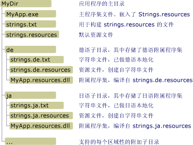

# <a name="creating-satellite-assemblies-for-desktop-apps"></a>创建桌面应用程序的附属程序集
资源文件在本地化的应用程序中具有核心作用。 通过资源文件，应用程序可以使用用户自己的语言和区域性显示字符串、图像及其他数据，并且在用户自己的语言或区域性资源不可用时，提供备用数据。 .NET Framework 使用中心辐射型模型来查找和检索已本地化的资源。 中心即主程序集，包含不可本地化的可执行代码和单个区域性（称作非特定区域性或默认区域性）的资源。 默认区域性是应用程序的回退区域性；没有任何已本地化的资源可用时，则使用默认区域性。 使用 <xref:System.Resources.NeutralResourcesLanguageAttribute> 属性来指定应用程序默认区域性的区域性。 每条轮辐均连接到一个附属程序集，该附属程序集包含单个本地化区域性的资源，但不包含任何代码。 因为附属程序集不是主程序集的一部分，所以不必替换该应用程序的主程序集即可轻松更新或替换与特定区域性相对应的资源。  
  
> [!NOTE]
>  应用程序默认区域性的资源也可以存储在附属程序集中。 为此，可为 <xref:System.Resources.NeutralResourcesLanguageAttribute> 属性分配一个 <xref:System.Resources.UltimateResourceFallbackLocation.Satellite?displayProperty=nameWithType> 值。  
  
## <a name="satellite-assembly-name-and-location"></a>附属程序集名称和位置  
 中心辐射型模型要求将资源放在特定位置，以便轻松查找和使用资源。 如果未按预期编译和命名资源，或未将其放在正确的位置，则公共语言运行时将无法定位它们，并改为使用默认区域性的资源。 .NET Framework 资源管理器由 <xref:System.Resources.ResourceManager> 对象表示，用于自动访问本地化的资源。 该资源管理器的相关要求如下：  
  
-   单个附属程序集必须包含特定区域性的所有资源。 换言之，应该将多个 .txt 或 .resx 文件编译成单个二进制 .resources 文件。  
  
-   存储区域性资源的每个本地化区域性的应用程序目录中必须有一个单独的子目录。 该子目录名称必须与区域性名称相同。 或者，也可以将附属程序集存储在全局程序集缓存中。 在这种情况下，程序集强名称的区域性信息组件必须指明其区域性。 （请参阅本主题后面的[在全局程序集缓存中安装附属程序集](#SN)部分。）  
  
    > [!NOTE]
    >  如果应用程序中包含了子区域性的资源，则将每个子区域性放在应用程序目录下的单独子目录中。 不要将子区域性放在其主区域性目录下的子目录中。  
  
-   附属程序集的名称必须与应用程序相同，并且必须使用文件扩展名“.resources.dll”。 例如，如果应用程序名为 Example.exe，则每个附属程序集的名称应该为 Example.resources.dll。 请注意附属程序集名称不指示其资源文件的区域性。 但是，附属程序集会显示在不指定区域性的目录中。  
  
-   附属程序集的区域性的相关信息必须包括在程序集的元数据中。 若要将区域性名称存储在附属程序集的元数据中，则在使用[程序集链接器](../../../docs/framework/tools/al-exe-assembly-linker.md)将资源嵌入附属程序集时指定 `/culture` 选项。  
  
 下图显示未安装在[全局程序集缓存](../../../docs/framework/app-domains/gac.md)中的应用程序的示例目录结构和位置要求。 具有 .txt 和 .resources 扩展名的项不会随附在最终应用程序中。 这些是用于创建最终附属资源程序集的中间资源文件。 在此示例中，可以将 .txt 文件替换为 .resx 文件。 有关详细信息，请参阅[打包和部署资源](../../../docs/framework/resources/packaging-and-deploying-resources-in-desktop-apps.md)。  
  
   
附属程序集目录  
  
## <a name="compiling-satellite-assemblies"></a>编译附属程序集  
 使用[资源文件生成器 (Resgen.exe)](../../../docs/framework/tools/resgen-exe-resource-file-generator.md) 将包含资源的文本文件或 XML (.resx) 文件编译为二进制 .resources 文件。 然后使用[程序集链接器 (Al.exe)](../../../docs/framework/tools/al-exe-assembly-linker.md) 将 .resources 文件编译到附属程序集中。 Al.exe 从指定的 .resources 文件创建程序集。 附属程序集只能包含资源，而不能包含任何可执行代码。  
  
 下面的 Al.exe 命令从德语资源文件 strings.de.resources 为 `Example` 应用程序创建了一个附属程序集。  
  
```console
al -target:lib -embed:strings.de.resources -culture:de -out:Example.resources.dll  
```  
  
 下面的 Al.exe 命令也从文件 strings.de.resources 为 `Example` 应用程序创建了一个附属程序集。 /Template 选项会导致附属程序集从父程序集 (Example.dll) 继承除区域性信息之外的所有程序集元数据。  
  
```console
al -target:lib -embed:strings.de.resources -culture:de -out:Example.resources.dll -template:Example.dll  
```  
  
 下表详细展示了这些命令中使用的 Al.exe 选项。  
  
|选项|说明|  
|------------|-----------------|  
|-target:lib|指定将附属程序集编译成库 (.dll) 文件。 因为附属程序集不包含可执行代码，并且不是应用程序的主程序集，所以必须将附属程序集另存为 DLL。|  
|-embed:strings.de.resources|指定在 Al.exe 编译程序集时要嵌入的资源文件名。 可在附属程序集中嵌入多个 .resources 文件，但如果依循中心辐射模型，则必须为每个区域性编译一个附属程序集。 但是，可以为字符串和对象创建单独的 .resources 文件。|  
|-culture:de|指定要编译的资源的区域性。 公共语言运行时搜索特定区域性的资源时会使用此信息。 如果省略此选项，Al.ex e 仍然会编译资源，但当用户请求资源时，运行时将无法找到该资源。|  
|-out:Example.resources.dll|指定输出文件的名称。 名称必须遵循命名标准 baseName.resources.extension，其中 baseName 是主程序集的名称，extension 是有效的文件扩展名（例如 .dll）。 请注意，运行时无法根据输出文件名确定附属程序集的区域性，必须使用 /culture 选项指定。|  
|-template:Example.dll|指定程序集，附属程序集将从该程序集继承除区域性字段之外的所有程序集元数据。 仅当指定了具有[强名称](../../../docs/framework/app-domains/strong-named-assemblies.md)的程序集时，此选项才会影响附属程序集。|  
  
 有关 Al.exe 可用选项的完整列表，请参阅[程序集链接器 (Al.exe)](../../../docs/framework/tools/al-exe-assembly-linker.md)。  
  
## <a name="satellite-assemblies-an-example"></a>附属程序集：示例  
 下面是一个简单的“Hello world”示例，该示例展示了一个包含本地化的问候语的消息框。 此示例包含了英语（美国）、法语（法国）和俄语（俄罗斯）区域性的资源，并且其回退区域性为英语。 要创建示例，请执行以下操作：  
  
1.  创建一个名为 Greeting.resx 或 Greeting.txt 的资源文件，使其包含默认区域性的资源。 在此文件中存储一个名为 `HelloString`，并且值为“Hello world!”的 单个字符串。  
  
2.  为指示英语 (en) 是该应用程序的默认区域性，请将以下 <xref:System.Resources.NeutralResourcesLanguageAttribute?displayProperty=nameWithType> 属性添加到应用程序的 AssemblyInfo 文件或主源代码文件中，该文件之后会编译到应用程序的主程序集中。  
  
     [!code-csharp[Conceptual.Resources.Locating#2](../../../samples/snippets/csharp/VS_Snippets_CLR/conceptual.resources.locating/cs/assemblyinfo.cs#2)]
     [!code-vb[Conceptual.Resources.Locating#2](../../../samples/snippets/visualbasic/VS_Snippets_CLR/conceptual.resources.locating/vb/assemblyinfo.vb#2)]  
  
3.  向应用程序添加对其他区域性的支持（en-US、fr-FR 和 ru-RU），如下所示：  
  
    -   若要支持 en-US 或英语（美国）区域性，创建一个名为 Greeting.en-US.resx 或 Greeting.en-US.txt 的资源文件，并在其中存储一个名为 `HelloString` 且值为“Hi world!”的单个字符串  
  
    -   若要支持 fr-FR 或法语（法国）区域性，创建一个名为 Greeting.fr-FR.resx 或 Greeting.fr-FR.txt 的资源文件，并在其中存储一个名为 `HelloString` 且值为“Salut tout le monde!”的单字符串  
  
    -   若要支持 ru-RU 或俄语（俄罗斯）区域性，创建一个名为 Greeting.ru-RU.resx 或 Greeting.ru-RU.txt 的资源文件，并在其中存储一个名为 `HelloString` 且值为“Всем привет!”的单字符串  
  
4.  使用 [Resgen.exe](../../../docs/framework/tools/resgen-exe-resource-file-generator.md) 将每个文本文件或 XML 资源文件编译为二进制 .resources 文件。 其输出是一组与 .resx 或 .txt 文件具有相同根文件名的文件，这些文件的扩展名为 .resources。 如果使用 Visual Studio 创建该示例，将自动处理编译过程。 如果不使用 Visual Studio，则运行以下命令将 .resx 文件编译为 .resources 文件：  
  
    ```console
    resgen Greeting.resx  
    resgen Greeting.en-us.resx  
    resgen Greeting.fr-FR.resx  
    resgen Greeting.ru-RU.resx  
    ```  
  
     如果资源位于文本文件而非 XML 文件中，则将 .resx 扩展名替换为 .txt。  
  
5.  将以下源代码和默认区域性的资源编译到应用程序的主程序集中：  
  
    > [!IMPORTANT]
    >  如果使用的是命令行而不是 Visual Studio 来创建此示例，则应将对 <xref:System.Resources.ResourceManager> 类构造函数的调用修改为后列内容：`ResourceManager rm = new ResourceManager("Greetings", typeof(Example).Assembly);`  
  
     [!code-csharp[Conceptual.Resources.Locating#1](../../../samples/snippets/csharp/VS_Snippets_CLR/conceptual.resources.locating/cs/program.cs#1)]
     [!code-vb[Conceptual.Resources.Locating#1](../../../samples/snippets/visualbasic/VS_Snippets_CLR/conceptual.resources.locating/vb/module1.vb#1)]  
  
     如果应用程序名为 Example，并从命令行进行编译，则适用于 C# 编译器的命令为：  
  
    ```console  
    csc Example.cs -res:Greeting.resources  
    ```  
  
     相应的 Visual Basic 编译器命令为：  
  
    ```console  
    vbc Example.vb -res:Greeting.resources  
    ```  
  
6.  在主应用程序目录中为应用程序支持的每个本地化的区域性创建一个子目录。 应该创建一个 en-US、fr-FR 和 ru-RU 子目录。 Visual Studio 将在编译过程中自动创建这些子目录。  
  
7.  将某个区域性特定的 .resources 文件嵌入附属程序集，并将其保存到相应的目录。 用于为每个 .resources 文件执行此操作的命令是：  
  
    ```console
    al -target:lib -embed:Greeting.culture.resources -culture:culture -out:culture\Example.resources.dll  
    ```  
  
     其中 culture 是由附属程序集包含了资源的区域性的名称。 Visual Studio 会自动处理这一过程。  
  
 然后便可运行该示例。 它会随机将某种支持的区域性设为当前区域性，并显示本地化的问候语。  
  
<a name="SN"></a>   
## <a name="installing-satellite-assemblies-in-the-global-assembly-cache"></a>在全局程序集缓存中安装附属程序集  
 可以在全局程序集缓存（而不是本地应用程序子目录）中安装程序集。 当具有供多个应用程序使用的类库和类库资源程序集时，这种方式非常有用。  
  
 在全局程序集缓存中安装程序集要求程序集具有强名称。 具有强名称的程序集使用有效公钥/私钥对进行签名。 它们包含版本信息，运行时会使用这些版本信息来确定使用哪个程序集来满足绑定要求。 有关强名称和版本控制的详细信息，请参阅[程序集版本控制](../../../docs/framework/app-domains/assembly-versioning.md)。 有关强名称的详细信息，请参阅[具有强名称的程序集](../../../docs/framework/app-domains/strong-named-assemblies.md)。  
  
 开发应用程序时，不可能具有对最终公钥/私钥对的访问权限。 为在全局程序集缓存中安装附属程序集，并确保附属程序集工作正常，可使用延迟签名技术。 延迟为程序集签名时，生成时可在文件中保留用于强名称签名的空间。 实际签名将延迟到以后的某个时间进行，即当最后的公钥/私钥对可用时。 有关延迟签名的详细信息，请参阅[延迟为程序集签名](../../../docs/framework/app-domains/delay-sign-assembly.md)。  
  
### <a name="obtaining-the-public-key"></a>获取公钥  
 若要延迟程序集签名，必须具有公钥访问权限。 可以从公司中将进行最终签名的组织处获取真正的公钥，也可以使用[强名称工具 (Sn.exe)](../../../docs/framework/tools/sn-exe-strong-name-tool.md) 创建一个公钥。  
  
 下面的 Sn.exe 命令创建一个测试公钥/私钥对。 –k 选项指定 Sn.exe 应新建一个密钥对，并将其保存在 TestKeyPair.snk 文件中。  
  
```console
sn –k TestKeyPair.snk   
```  
  
 可以从包含测试密钥对的文件中提取公钥。 以下命令从 TestKeyPair.snk 中提取公钥，并将其保存在 PublicKey.snk 中：  
  
```console
sn –p TestKeyPair.snk PublicKey.snk  
```  
  
### <a name="delay-signing-an-assembly"></a>延迟为程序集签名  
 获取或创建公钥后，使用[程序集链接器 (Al.exe)](../../../docs/framework/tools/al-exe-assembly-linker.md) 编译程序集，并指定延迟签名。  
  
 下面的 Al.exe 命令从 strings.ja.resources 文件为应用程序 StringLibrary 创建了一个强名称附属程序集：  
  
```console 
al -target:lib -embed:strings.ja.resources -culture:ja -out:StringLibrary.resources.dll -delay+ -keyfile:PublicKey.snk  
```  
  
 -delay+ 选项指定程序集链接器应延迟对程序集签名。 -keyfile 选项指定密钥文件的名称，该文件包含用以延迟程序集签名的公钥。  
  
### <a name="re-signing-an-assembly"></a>对程序集重新签名  
 部署应用程序之前，必须使用真正的密钥对对延迟签名的附属程序集重新签名。 可以使用 Sn.exe 执行此操作。  
  
 下面的 Sn.exe 命令使用 RealKeyPair.snk 文件中存储的密钥对对 StringLibrary.resources.dll 进行签名。 – R 选项指定对之前已签名或延迟签名的程序集进行重新签名。  
  
```console
sn –R StringLibrary.resources.dll RealKeyPair.snk   
```  
  
### <a name="installing-a-satellite-assembly-in-the-global-assembly-cache"></a>在全局程序集缓存中安装附属程序集  
 运行时在资源回退进程中搜索资源时，首先会在[全局程序集缓存](../../../docs/framework/app-domains/gac.md)中查找。 （有关详细信息，请参阅[打包和部署资源](../../../docs/framework/resources/packaging-and-deploying-resources-in-desktop-apps.md)主题中的“资源回退进程”部分。）只要使用强名称对附属程序集签名，就可以使用[全局程序集缓存工具 (Gacutil.exe)](../../../docs/framework/tools/gacutil-exe-gac-tool.md) 在全局程序集缓存中安装该程序集。  
  
 下面的 Gacutil.exe 命令在全局程序集缓存中安装了 StringLibrary.resources.dll：  
  
```console
gacutil -i:StringLibrary.resources.dll  
```  
  
 /I 选项指定 Gacutil.exe 应将指定的程序集安装到全局程序集缓存中。 在缓存中安装了附属程序集之后，要使用附属程序集的应用程序便能够使用该附属程序集所包含的资源。  
  
### <a name="resources-in-the-global-assembly-cache-an-example"></a>全局程序集缓存中的资源：示例  
 以下示例使用 .NET Framework 类库中的方法从资源文件中提取和返回本地化的问候语。 在全局程序集缓存中注册库及其资源。 示例包括了英语（美国）、法语（法国）、俄语（俄罗斯）和英语区域性的资源。 英语是默认区域性；其资源存储在主程序集中。 此示例最初使用公钥延迟对库及其附属程序集签名，然后使用公钥/私钥对为其重新签名。 要创建示例，请执行以下操作：  
  
1.  如果不是使用 Visual Studio，则使用以下[强名称工具 (Sn.exe)](../../../docs/framework/tools/sn-exe-strong-name-tool.md) 命令创建名为 ResKey.snk 的公钥/私钥对：  
  
    ```console
    sn –k ResKey.snk  
    ```  
  
     如果使用的是 Visual Studio，则使用项目“属性”对话框中的“签名”选项卡生成密钥文件。  
  
2.  使用以下[强名称工具 (Sn.exe)](../../../docs/framework/tools/sn-exe-strong-name-tool.md) 命令创建名为 PublicKey.snk 的公钥文件：  
  
    ```console
    sn –p ResKey.snk PublicKey.snk  
    ```  
  
3.  创建一个名为 Strings.resx 的资源文件，使其包含默认区域性的资源。 在此文件中存储一个名为 `Greeting`，并且值为“How do you do?”的 单个字符串。  
  
4.  为指示 "en" 是该应用程序的默认区域性，请将以下 <xref:System.Resources.NeutralResourcesLanguageAttribute?displayProperty=nameWithType> 属性添加到应用程序的 AssemblyInfo 文件或主源代码文件中，该文件之后会编译到应用程序的主程序集中：  
  
     [!code-csharp[Conceptual.Resources.Satellites#2](../../../samples/snippets/csharp/VS_Snippets_CLR/conceptual.resources.satellites/cs/stringlibrary.cs#2)]
     [!code-vb[Conceptual.Resources.Satellites#2](../../../samples/snippets/visualbasic/VS_Snippets_CLR/conceptual.resources.satellites/vb/stringlibrary.vb#2)]  
  
5.  向应用程序添加对其他区域性的支持（en-US、fr-FR 和 ru-RU 区域性），如下所示：  
  
    -   若要支持“en-US”或英语（美国）区域性，则创建一个名为 Strings.en-US.resx 或 Strings.en-US.txt 的资源文件，并在其中存储一个名为 `Greeting` 且值为“Hello”的单个字符串。  
  
    -   若要支持“fr-FR”或法语（法国）区域性，创建一个名为 Strings.fr-FR.resx 或 Strings.fr-FR.txt 的资源文件，并在其中存储一个值为“Bon jour!”的 `Greeting` 单字符串  
  
    -   若要支持“ru-RU”或俄语（俄罗斯）区域性，创建一个名为 Strings.ru-RU.resx 或 Strings.ru-RU.txt 的资源文件，并在其中存储一个值为“Привет”的 `Greeting` 单字符串  
  
6.  使用 [Resgen.exe](../../../docs/framework/tools/resgen-exe-resource-file-generator.md) 将每个文本文件或 XML 资源文件编译为二进制 .resources 文件。 其输出是一组与 .resx 或 .txt 文件具有相同根文件名的文件，这些文件的扩展名为 .resources。 如果使用 Visual Studio 创建该示例，将自动处理编译过程。 如果不使用 Visual Studio，则运行以下命令将 .resx 文件编译进 .resources 文件：  
  
    ```console
    resgen filename  
    ```  
  
     其中 filename 是 .resx 或文本文件的可选路径、文件名和扩展名。  
  
7.  将以下 StringLibrary.vb 或 StringLibrary.cs 的源代码连同默认区域性的资源编译到名为 StringLibrary.dll 的延迟签名库程序集中：  
  
    > [!IMPORTANT]
    >  如果使用命令行而不是 Visual Studio 来创建此示例，则将对 <xref:System.Resources.ResourceManager> 类构造函数的调用修改为 `ResourceManager rm = new ResourceManager("Strings",` `typeof(Example).Assembly);`。  
  
     [!code-csharp[Conceptual.Resources.Satellites#1](../../../samples/snippets/csharp/VS_Snippets_CLR/conceptual.resources.satellites/cs/stringlibrary.cs#1)]
     [!code-vb[Conceptual.Resources.Satellites#1](../../../samples/snippets/visualbasic/VS_Snippets_CLR/conceptual.resources.satellites/vb/stringlibrary.vb#1)]  
  
     适用于 C# 编译器的命令：  
  
    ```console
    csc -t:library -resource:Strings.resources -delaysign+ -keyfile:publickey.snk StringLibrary.cs  
    ```  
  
     相应的 Visual Basic 编译器命令为：  
  
    ```console  
    vbc -t:library -resource:Strings.resources -delaysign+ -keyfile:publickey.snk StringLibrary.vb  
    ```  
  
8.  在主应用程序目录中为应用程序支持的每个本地化的区域性创建一个子目录。 应该创建一个 en-US、fr-FR 和 ru-RU 子目录。 Visual Studio 将在编译过程中自动创建这些子目录。 由于所有附属程序集都具有相同的文件名，所以使用子目录存储单个区域性特定的附属程序集，直到使用公钥/私钥对为附属程序集签名为止。  
  
9. 将某个特定区域性的 .resources 文件嵌入延迟签名的附属程序集，并将其保存到相应的目录。 用于为每个 .resources 文件执行此操作的命令是：  
  
    ```console
    al -target:lib -embed:Strings.culture.resources -culture:culture -out:culture\StringLibrary.resources.dll -delay+ -keyfile:publickey.snk  
    ```  
  
     其中 culture 是区域性的名称。 在此示例中，区域性名称是 en-US、fr-FR 和 ru-RU。  
  
10. 使用[强名称工具 (Sn.exe)](../../../docs/framework/tools/sn-exe-strong-name-tool.md) 对 StringLibrary.dll 重新签名，如下所示：  
  
    ```console
    sn –R StringLibrary.dll RealKeyPair.snk  
    ```  
  
11. 对单个附属程序集重新签名。 要执行此操作，请按如下所示对每个附属程序集使用[强名称工具 (Sn.exe)](../../../docs/framework/tools/sn-exe-strong-name-tool.md)：  
  
    ```console
    sn –R StringLibrary.resources.dll RealKeyPair.snk  
    ```  
  
12. 使用以下命令在全局程序集缓存中注册 StringLibrary.dll 及其每个附属程序集：  
  
    ```console
    gacutil -i filename  
    ```  
  
     其中 filename 是要注册的文件的名称。  
  
13. 如果使用的是 Visual Studio，则新建一个名为 `Example` 的控制台应用程序项目，向其添加对 StringLibrary.dll 的引用和以下源代码，然后进行编译。  
  
     [!code-csharp[Conceptual.Resources.Satellites#3](../../../samples/snippets/csharp/VS_Snippets_CLR/conceptual.resources.satellites/cs/example.cs#3)]
     [!code-vb[Conceptual.Resources.Satellites#3](../../../samples/snippets/visualbasic/VS_Snippets_CLR/conceptual.resources.satellites/vb/example.vb#3)]  
  
     若要通过命令行进行编译，请在 C# 编译器中使用以下命令：  
  
    ```console
    csc Example.cs -r:StringLibrary.dll   
    ```  
  
     适用于 Visual Basic 编译器的命令行为：  
  
    ```console
    vbc Example.vb -r:StringLibrary.dll   
    ```  
  
14. 运行 Example.exe。  
  
## <a name="see-also"></a>请参阅
- [打包和部署资源](../../../docs/framework/resources/packaging-and-deploying-resources-in-desktop-apps.md)
- [延迟签发程序集](../../../docs/framework/app-domains/delay-sign-assembly.md)
- [Al.exe（程序集链接器）](../../../docs/framework/tools/al-exe-assembly-linker.md)
- [Sn.exe（强名称工具）](../../../docs/framework/tools/sn-exe-strong-name-tool.md)
- [Gacutil.exe（全局程序集缓存工具）](../../../docs/framework/tools/gacutil-exe-gac-tool.md)
- [桌面应用中的资源](../../../docs/framework/resources/index.md)
