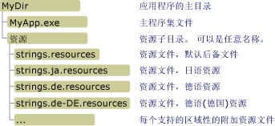

# <a name="retrieving-resources-in-desktop-apps"></a><span data-ttu-id="6c61b-102">检索桌面应用程序中的资源</span><span class="sxs-lookup"><span data-stu-id="6c61b-102">Retrieving Resources in Desktop Apps</span></span>
<span data-ttu-id="6c61b-103">使用 .NET Framework 桌面应用中的本地化资源时，最好用主程序集打包默认或非特定区域性的资源，并为应用支持的每种语言或区域性单独创建附属程序集。</span><span class="sxs-lookup"><span data-stu-id="6c61b-103">When you work with localized resources in .NET Framework desktop apps, you should ideally package the resources for the default or neutral culture with the main assembly and create a separate satellite assembly for each language or culture that your app supports.</span></span> <span data-ttu-id="6c61b-104">可以使用下一节中介绍的 <xref:System.Resources.ResourceManager> 类访问已命名的资源。</span><span class="sxs-lookup"><span data-stu-id="6c61b-104">You can then use the <xref:System.Resources.ResourceManager> class as described in the next section to access named resources.</span></span> <span data-ttu-id="6c61b-105">如果选择不在主程序集和附属程序集中嵌入资源，也可以按本文后面的 [从 .resources 文件中检索资源](#from_file) 一节中所述直接访问二进制 .resources 文件。</span><span class="sxs-lookup"><span data-stu-id="6c61b-105">If you choose not to embed your resources in the main assembly and satellite assemblies, you can also access binary .resources files directly, as discussed in the section [Retrieving Resources from .resources files](#from_file) later in this article.</span></span>  <span data-ttu-id="6c61b-106">若要检索 [!INCLUDE[win8_appname_long](../../../includes/win8-appname-long-md.md)] 应用中的资源，请参阅 Windows 开发人员中心中的 [在 Windows 应用商店应用中创建和检索资源](http://go.microsoft.com/fwlink/p/?LinkID=241674) 一文。</span><span class="sxs-lookup"><span data-stu-id="6c61b-106">To retrieve resources in [!INCLUDE[win8_appname_long](../../../includes/win8-appname-long-md.md)] apps, see [Creating and retrieving resources in Windows Store apps](http://go.microsoft.com/fwlink/p/?LinkID=241674) in the Windows Dev Center.</span></span>  
  
<a name="from_assembly"></a>   
## <a name="retrieving-resources-from-assemblies"></a><span data-ttu-id="6c61b-107">从程序集中检索资源</span><span class="sxs-lookup"><span data-stu-id="6c61b-107">Retrieving Resources from Assemblies</span></span>  
 <span data-ttu-id="6c61b-108"><xref:System.Resources.ResourceManager> 类提供对运行时资源的访问权限。</span><span class="sxs-lookup"><span data-stu-id="6c61b-108">The <xref:System.Resources.ResourceManager> class provides access to resources at run time.</span></span> <span data-ttu-id="6c61b-109">使用 <xref:System.Resources.ResourceManager.GetString%2A?displayProperty=nameWithType> 方法检索字符串资源和 <xref:System.Resources.ResourceManager.GetObject%2A?displayProperty=nameWithType> 或使用 <xref:System.Resources.ResourceManager.GetStream%2A?displayProperty=nameWithType> 方法检索非字符串资源。</span><span class="sxs-lookup"><span data-stu-id="6c61b-109">You use the <xref:System.Resources.ResourceManager.GetString%2A?displayProperty=nameWithType> method to retrieve string resources and the <xref:System.Resources.ResourceManager.GetObject%2A?displayProperty=nameWithType> or <xref:System.Resources.ResourceManager.GetStream%2A?displayProperty=nameWithType> method to retrieve non-string resources.</span></span> <span data-ttu-id="6c61b-110">每个方法都有两种重载：</span><span class="sxs-lookup"><span data-stu-id="6c61b-110">Each method has two overloads:</span></span>  
  
-   <span data-ttu-id="6c61b-111">单一参数是包含资源名称的字符串的重载。</span><span class="sxs-lookup"><span data-stu-id="6c61b-111">An overload whose single parameter is a string that contains the name of the resource.</span></span> <span data-ttu-id="6c61b-112">该方法尝试为当前线程区域性检索资源。</span><span class="sxs-lookup"><span data-stu-id="6c61b-112">The method attempts to retrieve that resource for the current thread culture.</span></span> <span data-ttu-id="6c61b-113">有关详细信息，请参阅 <xref:System.Resources.ResourceManager.GetString%28System.String%29>、 <xref:System.Resources.ResourceManager.GetObject%28System.String%29>和 <xref:System.Resources.ResourceManager.GetStream%28System.String%29> 方法。</span><span class="sxs-lookup"><span data-stu-id="6c61b-113">For more information, see the <xref:System.Resources.ResourceManager.GetString%28System.String%29>, <xref:System.Resources.ResourceManager.GetObject%28System.String%29>, and <xref:System.Resources.ResourceManager.GetStream%28System.String%29> methods.</span></span>  
  
-   <span data-ttu-id="6c61b-114">具有两个参数的重载：一个字符串包含资源名称，一个 <xref:System.Globalization.CultureInfo> 对象表示要对其检索资源的区域性。</span><span class="sxs-lookup"><span data-stu-id="6c61b-114">An overload that has two parameters: a string containing the name of the resource, and a <xref:System.Globalization.CultureInfo> object that represents the culture whose resource is to be retrieved.</span></span> <span data-ttu-id="6c61b-115">如果找不到该区域性的资源集，资源管理器将使用回退规则检索相应的资源。</span><span class="sxs-lookup"><span data-stu-id="6c61b-115">If a resource set for that culture cannot be found, the resource manager uses fallback rules to retrieve an appropriate resource.</span></span> <span data-ttu-id="6c61b-116">有关详细信息，请参阅 <xref:System.Resources.ResourceManager.GetString%28System.String%2CSystem.Globalization.CultureInfo%29>、 <xref:System.Resources.ResourceManager.GetObject%28System.String%2CSystem.Globalization.CultureInfo%29>和 <xref:System.Resources.ResourceManager.GetStream%28System.String%2CSystem.Globalization.CultureInfo%29> 方法。</span><span class="sxs-lookup"><span data-stu-id="6c61b-116">For more information, see the <xref:System.Resources.ResourceManager.GetString%28System.String%2CSystem.Globalization.CultureInfo%29>, <xref:System.Resources.ResourceManager.GetObject%28System.String%2CSystem.Globalization.CultureInfo%29>, and <xref:System.Resources.ResourceManager.GetStream%28System.String%2CSystem.Globalization.CultureInfo%29> methods.</span></span>  
  
 <span data-ttu-id="6c61b-117">资源管理器使用资源回退进程控制应用检索区域性特定资源的方式。</span><span class="sxs-lookup"><span data-stu-id="6c61b-117">The resource manager uses the resource fallback process to control how the app retrieves culture-specific resources.</span></span> <span data-ttu-id="6c61b-118">有关详细信息，请参阅 [Packaging and Deploying Resources](../../../docs/framework/resources/packaging-and-deploying-resources-in-desktop-apps.md)中的“资源回退进程”一节。</span><span class="sxs-lookup"><span data-stu-id="6c61b-118">For more information, see the "Resource Fallback Process" section in [Packaging and Deploying Resources](../../../docs/framework/resources/packaging-and-deploying-resources-in-desktop-apps.md).</span></span> <span data-ttu-id="6c61b-119">有关实例化 <xref:System.Resources.ResourceManager> 对象的详细信息，请参阅 <xref:System.Resources.ResourceManager> 类主题中的“实例化 ResourceManager 对象”一节。</span><span class="sxs-lookup"><span data-stu-id="6c61b-119">For information about instantiating a <xref:System.Resources.ResourceManager> object, see the "Instantiating a ResourceManager Object" section in the <xref:System.Resources.ResourceManager> class topic.</span></span>  
  
### <a name="retrieving-string-data-an-example"></a><span data-ttu-id="6c61b-120">检索字符串数据：示例</span><span class="sxs-lookup"><span data-stu-id="6c61b-120">Retrieving String Data: An Example</span></span>  
 <span data-ttu-id="6c61b-121">下面的示例调用 <xref:System.Resources.ResourceManager.GetString%28System.String%29> 方法检索当前 UI 区域性的字符串资源。</span><span class="sxs-lookup"><span data-stu-id="6c61b-121">The following example calls the <xref:System.Resources.ResourceManager.GetString%28System.String%29> method to retrieve the string resources of the current UI culture.</span></span> <span data-ttu-id="6c61b-122">它包括英语（美国）区域性的非特定字符串资源和法语（法国）和俄语（俄罗斯）区域性的本地化资源。</span><span class="sxs-lookup"><span data-stu-id="6c61b-122">It includes a neutral string resource for the English (United States) culture and localized resources for the French (France) and Russian (Russia) cultures.</span></span> <span data-ttu-id="6c61b-123">下面的英语（美国）资源位于名为 Strings.txt 的文件中：</span><span class="sxs-lookup"><span data-stu-id="6c61b-123">The following English (United States) resource is in a file named Strings.txt:</span></span>  
  
```  
TimeHeader=The current time is  
```  
  
 <span data-ttu-id="6c61b-124">法语（法国）资源位于名为 Strings.fr-FR.txt 的文件中：</span><span class="sxs-lookup"><span data-stu-id="6c61b-124">The French (France) resource is in a file named Strings.fr-FR.txt:</span></span>  
  
```  
TimeHeader=L'heure actuelle est  
```  
  
 <span data-ttu-id="6c61b-125">俄语（俄罗斯）资源位于名为 Strings.ru-RU.txt 的文件中：</span><span class="sxs-lookup"><span data-stu-id="6c61b-125">The Russian (Russia) resource is in a file named Strings.ru-RU-txt:</span></span>  
  
```  
TimeHeader=Текущее время —  
```  
  
 <span data-ttu-id="6c61b-126">此示例的源代码（在代码的 C# 版本中位于名为 GetString.cs 的文件中，在 Visual Basic 版本中位于名为 GetString.vb 的文件中）定义包含四种区域性名称（资源可用的三种区域性和西班牙语（西班牙）区域性）的字符串数组。</span><span class="sxs-lookup"><span data-stu-id="6c61b-126">The source code for this example, which is in a file named GetString.cs for the C# version of the code and GetString.vb for the Visual Basic version, defines a string array that contains the name of four cultures: the three cultures for which resources are available and the Spanish (Spain) culture.</span></span> <span data-ttu-id="6c61b-127">一个随机执行 5 次的循环选择其中一种区域性并将其分配到 <xref:System.Threading.Thread.CurrentCulture%2A?displayProperty=nameWithType> 和 <xref:System.Globalization.CultureInfo.CurrentUICulture%2A?displayProperty=nameWithType> 属性。</span><span class="sxs-lookup"><span data-stu-id="6c61b-127">A loop that executes five times randomly selects one of these cultures and assigns it to the <xref:System.Threading.Thread.CurrentCulture%2A?displayProperty=nameWithType> and <xref:System.Globalization.CultureInfo.CurrentUICulture%2A?displayProperty=nameWithType> properties.</span></span> <span data-ttu-id="6c61b-128">然后调用 <xref:System.Resources.ResourceManager.GetString%28System.String%29> 方法检索与一天当中的时间一起显示的本地化的字符串。</span><span class="sxs-lookup"><span data-stu-id="6c61b-128">It then calls the <xref:System.Resources.ResourceManager.GetString%28System.String%29> method to retrieve the localized string, which it displays along with the time of day.</span></span>  
  
 [!code-csharp[Conceptual.Resources.Retrieving#3](../../../samples/snippets/csharp/VS_Snippets_CLR/conceptual.resources.retrieving/cs/getstring.cs#3)]
 [!code-vb[Conceptual.Resources.Retrieving#3](../../../samples/snippets/visualbasic/VS_Snippets_CLR/conceptual.resources.retrieving/vb/getstring.vb#3)]  
  
 <span data-ttu-id="6c61b-129">以下批处理 (.bat) 文件编译该示例，并在相应的目录中生成附属程序集。</span><span class="sxs-lookup"><span data-stu-id="6c61b-129">The following batch (.bat) file compiles the example and generates satellite assemblies in the appropriate directories.</span></span> <span data-ttu-id="6c61b-130">为 C# 语言和编译器提供了命令。</span><span class="sxs-lookup"><span data-stu-id="6c61b-130">The commands are provided for the C# language and compiler.</span></span> <span data-ttu-id="6c61b-131">对于 Visual Basic ，将 `csc` 更改为 `vbc`，并将 `GetString.cs` 更改为 `GetString.vb`。</span><span class="sxs-lookup"><span data-stu-id="6c61b-131">For Visual Basic, change `csc` to `vbc`, and change `GetString.cs` to `GetString.vb`.</span></span>  
  
```  
resgen strings.txt  
csc GetString.cs /resource:strings.resources  
  
resgen strings.fr-FR.txt  
md fr-FR  
al /embed:strings.fr-FR.resources /culture:fr-FR /out:fr-FR\GetString.resources.dll  
  
resgen strings.ru-RU.txt  
md ru-RU  
al /embed:strings.ru-RU.resources /culture:ru-RU /out:ru-RU\GetString.resources.dll  
```  
  
 <span data-ttu-id="6c61b-132">当前 UI 区域性为西班牙语（西班牙）时，请注意该示例会显示英语语言资源，因为西班牙语语言资源不可用，而英语是该示例的默认区域性。</span><span class="sxs-lookup"><span data-stu-id="6c61b-132">When the current UI culture is Spanish (Spain), note that the example displays English language resources, because Spanish language resources are unavailable, and English is the example's default culture.</span></span>  
  
### <a name="retrieving-object-data-two-examples"></a><span data-ttu-id="6c61b-133">检索对象数据：2 个示例</span><span class="sxs-lookup"><span data-stu-id="6c61b-133">Retrieving Object Data: Two Examples</span></span>  
 <span data-ttu-id="6c61b-134">可以使用 <xref:System.Resources.ResourceManager.GetObject%2A> 和 <xref:System.Resources.ResourceManager.GetStream%2A> 方法检索对象数据。</span><span class="sxs-lookup"><span data-stu-id="6c61b-134">You can use the <xref:System.Resources.ResourceManager.GetObject%2A> and <xref:System.Resources.ResourceManager.GetStream%2A> methods to retrieve object data.</span></span> <span data-ttu-id="6c61b-135">这包括基元数据类型、可序列化对象和以二进制格式存储的对象（如图像）。</span><span class="sxs-lookup"><span data-stu-id="6c61b-135">This includes primitive data types, serializable objects, and objects that are stored in binary format (such as images).</span></span>  
  
 <span data-ttu-id="6c61b-136">下面的示例使用 <xref:System.Resources.ResourceManager.GetStream%28System.String%29> 方法检索应用启动初始窗口中使用的位图。</span><span class="sxs-lookup"><span data-stu-id="6c61b-136">The following example uses the <xref:System.Resources.ResourceManager.GetStream%28System.String%29> method to retrieve a bitmap that is used in an app's opening splash window.</span></span> <span data-ttu-id="6c61b-137">以下源代码位于名为 CreateResources.cs 的文件中（C# 版本）或位于名为 CreateResources.vb 的文件中（Visual Basic 版本），它能生成包含序列化图像的 .resx 文件。</span><span class="sxs-lookup"><span data-stu-id="6c61b-137">The following source code in a file named CreateResources.cs (for C#) or CreateResources.vb (for Visual Basic) generates a .resx file that contains the serialized image.</span></span> <span data-ttu-id="6c61b-138">在这种情况下，图片从一个名为 SplashScreen.jpg 的文件中加载；可以修改文件名以替换你自己的图像。</span><span class="sxs-lookup"><span data-stu-id="6c61b-138">In this case, the image is loaded from a file named SplashScreen.jpg; you can modify the file name to substitute your own image.</span></span>  
  
 [!code-csharp[Conceptual.Resources.Retrieving#4](../../../samples/snippets/csharp/VS_Snippets_CLR/conceptual.resources.retrieving/cs/createresources.cs#4)]
 [!code-vb[Conceptual.Resources.Retrieving#4](../../../samples/snippets/visualbasic/VS_Snippets_CLR/conceptual.resources.retrieving/vb/createresources.vb#4)]  
  
 <span data-ttu-id="6c61b-139">以下代码将检索该资源，并在 <xref:System.Windows.Forms.PictureBox> 控件中显示图像。</span><span class="sxs-lookup"><span data-stu-id="6c61b-139">The following code retrieves the resource and displays the image in a <xref:System.Windows.Forms.PictureBox> control.</span></span>  
  
 [!code-csharp[Conceptual.Resources.Retrieving#5](../../../samples/snippets/csharp/VS_Snippets_CLR/conceptual.resources.retrieving/cs/getstream.cs#5)]
 [!code-vb[Conceptual.Resources.Retrieving#5](../../../samples/snippets/visualbasic/VS_Snippets_CLR/conceptual.resources.retrieving/vb/getstream.vb#5)]  
  
 <span data-ttu-id="6c61b-140">可以使用以下批处理文件生成 C# 示例。</span><span class="sxs-lookup"><span data-stu-id="6c61b-140">You can use the following batch file to build the C# example.</span></span> <span data-ttu-id="6c61b-141">对于 Visual Basic，将 `csc` 更改为 `vbc`，并将源代码文件的扩展名由 `.cs` 更改为 `.vb`。</span><span class="sxs-lookup"><span data-stu-id="6c61b-141">For Visual Basic, change `csc` to `vbc`, and change the extension of the source code file from `.cs` to `.vb`.</span></span>  
  
```  
csc CreateResources.cs  
CreateResources  
  
resgen AppResources.resx  
  
csc GetStream.cs /resource:AppResources.resources  
```  
  
 <span data-ttu-id="6c61b-142">下面的示例使用 <xref:System.Resources.ResourceManager.GetObject%28System.String%29?displayProperty=nameWithType> 方法反序列化一个自定义对象。</span><span class="sxs-lookup"><span data-stu-id="6c61b-142">The following example uses the <xref:System.Resources.ResourceManager.GetObject%28System.String%29?displayProperty=nameWithType> method to deserialize a custom object.</span></span> <span data-ttu-id="6c61b-143">该示例包含一个名为 UIElements.cs （对于 Visual Basic 则为 UIElements.vb）的源代码文件，用于定义以下名为 `PersonTable`的结构。</span><span class="sxs-lookup"><span data-stu-id="6c61b-143">The example includes a source code file named UIElements.cs (UIElements.vb for Visual Basic) that defines the following structure named `PersonTable`.</span></span> <span data-ttu-id="6c61b-144">此结构应由显示表列的本地化名称的常规表显示例程使用。</span><span class="sxs-lookup"><span data-stu-id="6c61b-144">This structure is intended to be used by a general table display routine that displays the localized names of table columns.</span></span> <span data-ttu-id="6c61b-145">请注意， `PersonTable` 结构标有 <xref:System.SerializableAttribute> 属性。</span><span class="sxs-lookup"><span data-stu-id="6c61b-145">Note that the `PersonTable` structure is marked with the <xref:System.SerializableAttribute> attribute.</span></span>  
  
 [!code-csharp[Conceptual.Resources.Retrieving#6](../../../samples/snippets/csharp/VS_Snippets_CLR/conceptual.resources.retrieving/cs/example.cs#6)]
 [!code-vb[Conceptual.Resources.Retrieving#6](../../../samples/snippets/visualbasic/VS_Snippets_CLR/conceptual.resources.retrieving/vb/example.vb#6)]  
  
 <span data-ttu-id="6c61b-146">下面的代码来自名为 CreateResources.cs（对于 Visual Basic 则为 CreateResources.vb）的文件，该代码创建一个名为 UIResources.resx 的 XML 资源文件，该文件存储有表标题和包含已针对英语语言本地化的应用的信息的 `PersonTable` 对象。</span><span class="sxs-lookup"><span data-stu-id="6c61b-146">The following code from a file named CreateResources.cs (CreateResources.vb for Visual Basic) creates an XML resource file named UIResources.resx that stores a table title and a `PersonTable` object that contains information for an app that is localized for the English language.</span></span>  
  
 [!code-csharp[Conceptual.Resources.Retrieving#7](../../../samples/snippets/csharp/VS_Snippets_CLR/conceptual.resources.retrieving/cs/example1.cs#7)]
 [!code-vb[Conceptual.Resources.Retrieving#7](../../../samples/snippets/visualbasic/VS_Snippets_CLR/conceptual.resources.retrieving/vb/example.vb#7)]  
  
 <span data-ttu-id="6c61b-147">下面的代码位于名为 GetObject.cs (GetObject.vb) 的源代码文件中，然后检索资源并将其显示在控制台上。</span><span class="sxs-lookup"><span data-stu-id="6c61b-147">The following code in a source code file named GetObject.cs (GetObject.vb) then retrieves the resources and displays them to the console.</span></span>  
  
 [!code-csharp[Conceptual.Resources.Retrieving#8](../../../samples/snippets/csharp/VS_Snippets_CLR/conceptual.resources.retrieving/cs/example2.cs#8)]
 [!code-vb[Conceptual.Resources.Retrieving#8](../../../samples/snippets/visualbasic/VS_Snippets_CLR/conceptual.resources.retrieving/vb/example2.vb#8)]  
  
 <span data-ttu-id="6c61b-148">可以生成必要的资源文件和程序集，并通过执行以下批处理文件运行该应用。</span><span class="sxs-lookup"><span data-stu-id="6c61b-148">You can build the necessary resource file and assemblies and run the app by executing the following batch file.</span></span> <span data-ttu-id="6c61b-149">必须使用 `/r` 选项提供具有对 UIElements.dll 的引用的 Resgen.exe，以便其能够访问有关 `PersonTable` 结构的信息。</span><span class="sxs-lookup"><span data-stu-id="6c61b-149">You must use the `/r` option to supply Resgen.exe with a reference to UIElements.dll so that it can access information about the `PersonTable` structure.</span></span> <span data-ttu-id="6c61b-150">如果使用 C#，请将 `vbc` 编译器名称替换为 `csc`，并将 `.vb` 扩展名替换为 `.cs`。</span><span class="sxs-lookup"><span data-stu-id="6c61b-150">If you're using C#, replace the `vbc` compiler name with `csc`, and replace the `.vb` extension with `.cs`.</span></span>  
  
```  
vbc /t:library UIElements.vb  
vbc CreateResources.vb /r:UIElements.dll  
CreateResources  
  
resgen UIResources.resx  /r:UIElements.dll  
vbc GetObject.vb /r:UIElements.dll /resource:UIResources.resources  
  
GetObject.exe  
```  
  
## <a name="versioning-support-for-satellite-assemblies"></a><span data-ttu-id="6c61b-151">附属程序集的版本控制支持</span><span class="sxs-lookup"><span data-stu-id="6c61b-151">Versioning Support for Satellite Assemblies</span></span>  
 <span data-ttu-id="6c61b-152">默认情况下， <xref:System.Resources.ResourceManager> 对象检索请求的资源时，会寻找版本号与主程序集版本号相匹配的附属程序集。</span><span class="sxs-lookup"><span data-stu-id="6c61b-152">By default, when the <xref:System.Resources.ResourceManager> object retrieves requested resources, it looks for satellite assemblies that have version numbers that match the version number of the main assembly.</span></span> <span data-ttu-id="6c61b-153">部署应用后，建议更新主程序集或特定资源附属程序集。</span><span class="sxs-lookup"><span data-stu-id="6c61b-153">After you have deployed an app, you might want to update the main assembly or specific resource satellite assemblies.</span></span> <span data-ttu-id="6c61b-154">.NET Framework 提供对主程序集和附属程序集的版本控制支持。</span><span class="sxs-lookup"><span data-stu-id="6c61b-154">The .NET Framework provides support for versioning the main assembly and satellite assemblies.</span></span>  
  
 <span data-ttu-id="6c61b-155"><xref:System.Resources.SatelliteContractVersionAttribute> 属性提供对主程序集的版本控制支持。</span><span class="sxs-lookup"><span data-stu-id="6c61b-155">The <xref:System.Resources.SatelliteContractVersionAttribute> attribute  provides versioning support for a main assembly.</span></span> <span data-ttu-id="6c61b-156">在应用的主程序集上指定此属性，无需更新主程序集的附属程序集即可更新和重新部署主程序集。</span><span class="sxs-lookup"><span data-stu-id="6c61b-156">Specifying this attribute on an app's main assembly enables you to update and redeploy a main assembly without updating its satellite assemblies.</span></span> <span data-ttu-id="6c61b-157">更新主程序集后，递增主程序集的版本号，但附属协定版本号保持不变。</span><span class="sxs-lookup"><span data-stu-id="6c61b-157">After you update the main assembly, increment the main assembly's version number but leave the satellite contract version number unchanged.</span></span> <span data-ttu-id="6c61b-158">资源管理器检索请求的资源时，会加载此属性指定的附属程序集版本。</span><span class="sxs-lookup"><span data-stu-id="6c61b-158">When the resource manager retrieves requested resources, it loads the satellite assembly version specified by this attribute.</span></span>  
  
 <span data-ttu-id="6c61b-159">发行者策略程序集提供对附属程序集的版本控制支持。</span><span class="sxs-lookup"><span data-stu-id="6c61b-159">Publisher policy assemblies provide support for versioning satellite assemblies.</span></span> <span data-ttu-id="6c61b-160">你可以更新并重新部署附属程序集，而不用更新主程序集。</span><span class="sxs-lookup"><span data-stu-id="6c61b-160">You can update and redeploy a satellite assembly without updating the main assembly.</span></span> <span data-ttu-id="6c61b-161">更新附属程序集后，递增其版本号，并将其附带到发行者策略程序集中。</span><span class="sxs-lookup"><span data-stu-id="6c61b-161">After you update a satellite assembly, increment its version number and ship it with a publisher policy assembly.</span></span> <span data-ttu-id="6c61b-162">在发行者策略程序集中，指定新附属程序集为后向兼容其之前版本。</span><span class="sxs-lookup"><span data-stu-id="6c61b-162">In the publisher policy assembly, specify that your new satellite assembly is backward-compatible with its previous version.</span></span> <span data-ttu-id="6c61b-163">资源管理器会使用 <xref:System.Resources.SatelliteContractVersionAttribute> 属性确定附属程序集的版本，但程序集加载程序将绑定到发行者策略所指定的附属程序集版本。</span><span class="sxs-lookup"><span data-stu-id="6c61b-163">The resource manager will use the <xref:System.Resources.SatelliteContractVersionAttribute> attribute to determine the version of the satellite assembly, but the assembly loader will bind to the satellite assembly version specified by the publisher policy.</span></span> <span data-ttu-id="6c61b-164">有关发行者策略程序集的详细信息，请参阅 [创建发行者策略文件](../../../docs/framework/configure-apps/how-to-create-a-publisher-policy.md)。</span><span class="sxs-lookup"><span data-stu-id="6c61b-164">For more information about publisher policy assemblies, see [Creating a Publisher Policy File](../../../docs/framework/configure-apps/how-to-create-a-publisher-policy.md).</span></span>  
  
 <span data-ttu-id="6c61b-165">若要启用完全的程序集版本控制支持，建议你在 [全局程序集缓存](../../../docs/framework/app-domains/gac.md) 中部署具有强名称的程序集，并将不具有强名称的程序集部署在应用程序目录中。</span><span class="sxs-lookup"><span data-stu-id="6c61b-165">To enable full assembly versioning support, we recommend that you deploy strong-named assemblies in the [global assembly cache](../../../docs/framework/app-domains/gac.md) and deploy assemblies that don't have strong names in the application directory.</span></span> <span data-ttu-id="6c61b-166">若在应用程序目录中部署具有强名称的程序集，则无法在更新程序集时递增附属程序集的版本号。</span><span class="sxs-lookup"><span data-stu-id="6c61b-166">If you want to deploy strong-named assemblies in the application directory, you will not be able to increment a satellite assembly's version number when you update the assembly.</span></span> <span data-ttu-id="6c61b-167">相反，必须在使用更新的代码替换现有代码处执行就地更新，并保持相同的版本号。</span><span class="sxs-lookup"><span data-stu-id="6c61b-167">Instead, you must perform an in-place update where you replace the existing code with the updated code and maintain the same version number.</span></span> <span data-ttu-id="6c61b-168">例如，若要使用完全指定的程序集名称 "myApp.resources, Version=1.0.0.0, Culture=de, PublicKeyToken=b03f5f11d50a3a" 更新版本 1.0.0.0 的附属程序集，请使用已编译同一个完全指定的程序集名称 "myApp.resources, Version=1.0.0.0, Culture=de, PublicKeyToken=b03f5f11d50a3a" 的更新的 myApp.resources.dll 来覆盖它。</span><span class="sxs-lookup"><span data-stu-id="6c61b-168">For example, if you want to update version 1.0.0.0 of a satellite assembly with the fully specified assembly name "myApp.resources, Version=1.0.0.0, Culture=de, PublicKeyToken=b03f5f11d50a3a", overwrite it with the updated myApp.resources.dll that has been compiled with the same, fully specified assembly name "myApp.resources, Version=1.0.0.0, Culture=de, PublicKeyToken=b03f5f11d50a3a".</span></span> <span data-ttu-id="6c61b-169">请注意，在附属程序集文件上使用就地更新会使应用难以准确确定附属程序集的版本。</span><span class="sxs-lookup"><span data-stu-id="6c61b-169">Note that using in-place updates on satellite assembly files makes it difficult for an app to accurately determine the version of a satellite assembly.</span></span>  
  
 <span data-ttu-id="6c61b-170">有关程序集版本控制的详细信息，请参阅 [程序集版本控制](../../../docs/framework/app-domains/assembly-versioning.md) 和 [运行时如何定位程序集](../../../docs/framework/deployment/how-the-runtime-locates-assemblies.md)。</span><span class="sxs-lookup"><span data-stu-id="6c61b-170">For more information about assembly versioning, see [Assembly Versioning](../../../docs/framework/app-domains/assembly-versioning.md) and [How the Runtime Locates Assemblies](../../../docs/framework/deployment/how-the-runtime-locates-assemblies.md).</span></span>  
  
<a name="from_file"></a>   
## <a name="retrieving-resources-from-resources-files"></a><span data-ttu-id="6c61b-171">从 .resources 文件中检索资源</span><span class="sxs-lookup"><span data-stu-id="6c61b-171">Retrieving Resources from .resources Files</span></span>  
 <span data-ttu-id="6c61b-172">如果选择不在附属程序集中部署资源，你仍可以使用 <xref:System.Resources.ResourceManager> 对象直接访问 .resources 文件中的资源。</span><span class="sxs-lookup"><span data-stu-id="6c61b-172">If you choose not to deploy resources in satellite assemblies, you can still use a <xref:System.Resources.ResourceManager> object to access resources from .resources files directly.</span></span> <span data-ttu-id="6c61b-173">要执行此操作，必须正确部署.resources 文件。</span><span class="sxs-lookup"><span data-stu-id="6c61b-173">To do this, you must deploy the .resources files correctly.</span></span> <span data-ttu-id="6c61b-174">然后使用 <xref:System.Resources.ResourceManager.CreateFileBasedResourceManager%2A?displayProperty=nameWithType> 方法实例化 <xref:System.Resources.ResourceManager> 对象，并指定包含独立 .resources 文件的目录。</span><span class="sxs-lookup"><span data-stu-id="6c61b-174">Then you use the <xref:System.Resources.ResourceManager.CreateFileBasedResourceManager%2A?displayProperty=nameWithType> method to instantiate a <xref:System.Resources.ResourceManager> object and specify the directory that contains the standalone .resources files.</span></span>  
  
### <a name="deploying-resources-files"></a><span data-ttu-id="6c61b-175">部署 .resources 文件</span><span class="sxs-lookup"><span data-stu-id="6c61b-175">Deploying .resources Files</span></span>  
 <span data-ttu-id="6c61b-176">将 .resources 文件嵌入应用程序程序集和附属程序集后，每个附属程序集都具有相同的文件名，但被放在反射附属程序集区域性的子目录中。</span><span class="sxs-lookup"><span data-stu-id="6c61b-176">When you embed .resources files in an application assembly and satellite assemblies, each satellite assembly has the same file name, but is placed in a subdirectory that reflects the satellite assembly's culture.</span></span> <span data-ttu-id="6c61b-177">与此相反，从 .resources 文件直接访问资源时，可以将所有 .resources 文件放在单一目录（通常为应用程序目录的子目录）中。</span><span class="sxs-lookup"><span data-stu-id="6c61b-177">In contrast, when you access resources from .resources files directly, you can place all the .resources files in a single directory, usually a subdirectory of the application directory.</span></span> <span data-ttu-id="6c61b-178">应用的默认 .resources 文件名称仅包含一个根名称，不带有其区域性的指示（例如 strings.resources）。</span><span class="sxs-lookup"><span data-stu-id="6c61b-178">The name of the app's default .resources file consists of a root name only, with no indication of its culture (for example, strings.resources).</span></span> <span data-ttu-id="6c61b-179">每个本地化的区域性资源存储在名称包含根名称，后带有区域性标记所组成的文件中（例如 strings.ja.resources 或 strings.de-DE.resources）。</span><span class="sxs-lookup"><span data-stu-id="6c61b-179">The resources for each localized culture are stored in a file whose name consists of the root name followed by the culture (for example, strings.ja.resources or strings.de-DE.resources).</span></span> <span data-ttu-id="6c61b-180">下图显示资源文件应被放置在目录结构中的何处。</span><span class="sxs-lookup"><span data-stu-id="6c61b-180">The following illustration shows where resource files should be located in the directory structure.</span></span>  
  
 <span data-ttu-id="6c61b-181"></span><span class="sxs-lookup"><span data-stu-id="6c61b-181"></span></span>  
<span data-ttu-id="6c61b-182">.resources 文件的目录结构和命名约定</span><span class="sxs-lookup"><span data-stu-id="6c61b-182">Directory structure and naming conventions for .resources files</span></span>  
  
### <a name="using-the-resource-manager"></a><span data-ttu-id="6c61b-183">使用资源管理器</span><span class="sxs-lookup"><span data-stu-id="6c61b-183">Using the Resource Manager</span></span>  
 <span data-ttu-id="6c61b-184">创建资源并将其放置在相应的目录中后，通过调用 <xref:System.Resources.ResourceManager> 方法创建 <xref:System.Resources.ResourceManager.CreateFileBasedResourceManager%28System.String%2CSystem.String%2CSystem.Type%29> 对象以使用资源。</span><span class="sxs-lookup"><span data-stu-id="6c61b-184">After you have created your resources and placed them in the appropriate directory, you create a <xref:System.Resources.ResourceManager> object to use the resources by calling the <xref:System.Resources.ResourceManager.CreateFileBasedResourceManager%28System.String%2CSystem.String%2CSystem.Type%29> method.</span></span> <span data-ttu-id="6c61b-185">第一个参数指定应用的默认 .resources 文件的根名称（在上一节的示例中为 "strings"）。</span><span class="sxs-lookup"><span data-stu-id="6c61b-185">The first parameter specifies the root name of the app's default .resources file (this would be "strings" for the example in the previous section).</span></span> <span data-ttu-id="6c61b-186">第二个参数指定的资源的位置（上一个示例中为 "Resources"）。</span><span class="sxs-lookup"><span data-stu-id="6c61b-186">The second parameter specifies the location of the resources ("Resources" for the previous example).</span></span> <span data-ttu-id="6c61b-187">第三个参数指定要使用的 <xref:System.Resources.ResourceSet> 实现。</span><span class="sxs-lookup"><span data-stu-id="6c61b-187">The third parameter specifies the <xref:System.Resources.ResourceSet> implementation to use.</span></span> <span data-ttu-id="6c61b-188">如果第三个参数为 `null`，则使用默认运行时 <xref:System.Resources.ResourceSet> 。</span><span class="sxs-lookup"><span data-stu-id="6c61b-188">If the third parameter is `null`, the default runtime <xref:System.Resources.ResourceSet> is used.</span></span>  
  
> [!NOTE]
>  <span data-ttu-id="6c61b-189">请勿使用独立 .resources 文件部署 ASP.NET 应用。</span><span class="sxs-lookup"><span data-stu-id="6c61b-189">Do not deploy ASP.NET apps using standalone .resources files.</span></span> <span data-ttu-id="6c61b-190">这可能会导致锁定问题并破坏 XCOPY 部署。</span><span class="sxs-lookup"><span data-stu-id="6c61b-190">This can cause locking issues and breaks XCOPY deployment.</span></span> <span data-ttu-id="6c61b-191">建议部署附属程序集中的 ASP.NET 资源。</span><span class="sxs-lookup"><span data-stu-id="6c61b-191">We recommend that you deploy ASP.NET resources in satellite assemblies.</span></span> <span data-ttu-id="6c61b-192">有关更多信息，请参见 [ASP.NET Web Page Resources Overview](http://msdn.microsoft.com/library/0936b3b2-9e6e-4abe-9c06-364efef9dbbd)。</span><span class="sxs-lookup"><span data-stu-id="6c61b-192">For more information, see [ASP.NET Web Page Resources Overview](http://msdn.microsoft.com/library/0936b3b2-9e6e-4abe-9c06-364efef9dbbd).</span></span>  
  
 <span data-ttu-id="6c61b-193">实例化 <xref:System.Resources.ResourceManager> 对象后，使用前文所述的 <xref:System.Resources.ResourceManager.GetString%2A>、 <xref:System.Resources.ResourceManager.GetObject%2A>和 <xref:System.Resources.ResourceManager.GetStream%2A> 方法检索资源。</span><span class="sxs-lookup"><span data-stu-id="6c61b-193">After you instantiate the <xref:System.Resources.ResourceManager> object, you use the <xref:System.Resources.ResourceManager.GetString%2A>, <xref:System.Resources.ResourceManager.GetObject%2A>, and <xref:System.Resources.ResourceManager.GetStream%2A> methods as discussed earlier to retrieve the resources.</span></span> <span data-ttu-id="6c61b-194">但是，直接从 .resources 文件中检索资源与从程序集中检索嵌入的资源有所不同。</span><span class="sxs-lookup"><span data-stu-id="6c61b-194">However, the retrieval of resources directly from .resources files differs from the retrieval of embedded resources from assemblies.</span></span> <span data-ttu-id="6c61b-195">从 .resources 文件中检索资源时， <xref:System.Resources.ResourceManager.GetString%28System.String%29>、 <xref:System.Resources.ResourceManager.GetObject%28System.String%29>和 <xref:System.Resources.ResourceManager.GetStream%28System.String%29> 方法总是忽略当前区域性检索默认区域性的资源。</span><span class="sxs-lookup"><span data-stu-id="6c61b-195">When you retrieve resources from .resources files, the <xref:System.Resources.ResourceManager.GetString%28System.String%29>, <xref:System.Resources.ResourceManager.GetObject%28System.String%29>, and <xref:System.Resources.ResourceManager.GetStream%28System.String%29> methods always retrieve the default culture's resources regardless of the current culture.</span></span> <span data-ttu-id="6c61b-196">若要检索应用的当前区域性资源或指定区域性的资源，必须调用 <xref:System.Resources.ResourceManager.GetString%28System.String%2CSystem.Globalization.CultureInfo%29>、 <xref:System.Resources.ResourceManager.GetObject%28System.String%2CSystem.Globalization.CultureInfo%29>或 <xref:System.Resources.ResourceManager.GetStream%28System.String%2CSystem.Globalization.CultureInfo%29> 方法并指定要检索资源的区域性。</span><span class="sxs-lookup"><span data-stu-id="6c61b-196">To retrieve the resources of the either the app's current culture or a specific culture, you must call the <xref:System.Resources.ResourceManager.GetString%28System.String%2CSystem.Globalization.CultureInfo%29>, <xref:System.Resources.ResourceManager.GetObject%28System.String%2CSystem.Globalization.CultureInfo%29>, or <xref:System.Resources.ResourceManager.GetStream%28System.String%2CSystem.Globalization.CultureInfo%29> method and specify the culture whose resources are to be retrieved.</span></span> <span data-ttu-id="6c61b-197">若要检索当前区域性的资源，请将 <xref:System.Globalization.CultureInfo.CurrentCulture%2A?displayProperty=nameWithType> 属性的值指定为 `culture` 参数。</span><span class="sxs-lookup"><span data-stu-id="6c61b-197">To retrieve the resources of the current culture, specify the value of the <xref:System.Globalization.CultureInfo.CurrentCulture%2A?displayProperty=nameWithType> property as the `culture` argument.</span></span> <span data-ttu-id="6c61b-198">如果资源管理器无法检索 `culture`的资源，则使用标准资源回退规则检索相应的资源。</span><span class="sxs-lookup"><span data-stu-id="6c61b-198">If the resource manager cannot retrieve the resources of `culture`, it uses the standard resource fallback rules to retrieve the appropriate resources.</span></span>  
  
### <a name="an-example"></a><span data-ttu-id="6c61b-199">示例</span><span class="sxs-lookup"><span data-stu-id="6c61b-199">An Example</span></span>  
 <span data-ttu-id="6c61b-200">下面的示例说明资源管理器如何直接从 .resources 文件中检索资源。</span><span class="sxs-lookup"><span data-stu-id="6c61b-200">The following example illustrates how the resource manager retrieves resources directly from .resources files.</span></span> <span data-ttu-id="6c61b-201">此示例由三个基于文本的资源文件组成，区域性分别为英语（美国）、法语（法国）和俄语（俄罗斯）。</span><span class="sxs-lookup"><span data-stu-id="6c61b-201">The example consists of three text-based resource files for the English (United States), French (France), and Russian (Russia) cultures.</span></span> <span data-ttu-id="6c61b-202">英语（美国）为示例的默认区域性。</span><span class="sxs-lookup"><span data-stu-id="6c61b-202">English (United States) is the example's default culture.</span></span> <span data-ttu-id="6c61b-203">其资源存储在以下名为 Strings.txt 的文件中：</span><span class="sxs-lookup"><span data-stu-id="6c61b-203">Its resources are stored in the following file named Strings.txt:</span></span>  
  
```  
Greeting=Hello  
Prompt=What is your name?  
```  
  
 <span data-ttu-id="6c61b-204">法语(法国) 区域性的资源存储在以下名为 Strings.fr-FR.txt 的文件中：</span><span class="sxs-lookup"><span data-stu-id="6c61b-204">Resources for the French (France) culture are stored in the following file, which is named Strings.fr-FR.txt:</span></span>  
  
```  
Greeting=Bon jour  
Prompt=Comment vous appelez-vous?  
```  
  
 <span data-ttu-id="6c61b-205">俄语(俄罗斯) 区域性的资源存储在以下名为 Strings.ru-RU.txt 的文件中：</span><span class="sxs-lookup"><span data-stu-id="6c61b-205">Resources for the Russian (Russia) culture are stored in the following file, which is named Strings.ru-RU.txt:</span></span>  
  
```  
Greeting=Здравствуйте  
Prompt=Как вас зовут?  
```  
  
 <span data-ttu-id="6c61b-206">以下是该实例的源代码。</span><span class="sxs-lookup"><span data-stu-id="6c61b-206">The following is the source code for the example.</span></span> <span data-ttu-id="6c61b-207">该示例为英语（美国）、英语（加拿大）、法语（法国）和俄语（俄罗斯）区域性实例化 <xref:System.Globalization.CultureInfo> 对象，并将以上每一种语言作为当前区域性。</span><span class="sxs-lookup"><span data-stu-id="6c61b-207">The example instantiates <xref:System.Globalization.CultureInfo> objects for the English (United States), English (Canada), French (France), and Russian (Russia) cultures, and makes each the current culture.</span></span> <span data-ttu-id="6c61b-208"><xref:System.Resources.ResourceManager.GetString%28System.String%2CSystem.Globalization.CultureInfo%29?displayProperty=nameWithType> 方法提供 <xref:System.Globalization.CultureInfo.CurrentCulture%2A?displayProperty=nameWithType> 属性的值作为 `culture` 参数来检索相应的区域性指定资源。</span><span class="sxs-lookup"><span data-stu-id="6c61b-208">The <xref:System.Resources.ResourceManager.GetString%28System.String%2CSystem.Globalization.CultureInfo%29?displayProperty=nameWithType> method then supplies the value of the <xref:System.Globalization.CultureInfo.CurrentCulture%2A?displayProperty=nameWithType> property as the `culture` argument to retrieve the appropriate culture-specific resources.</span></span>  
  
 [!code-csharp[Conceptual.Resources.Retrieving#9](../../../samples/snippets/csharp/VS_Snippets_CLR/conceptual.resources.retrieving/cs/example3.cs#9)]
 [!code-vb[Conceptual.Resources.Retrieving#9](../../../samples/snippets/visualbasic/VS_Snippets_CLR/conceptual.resources.retrieving/vb/example3.vb#9)]  
  
 <span data-ttu-id="6c61b-209">可以通过运行以下批处理文件编译该示例的 C# 版本。</span><span class="sxs-lookup"><span data-stu-id="6c61b-209">You can compile the C# version of the example by running the following batch file.</span></span> <span data-ttu-id="6c61b-210">如果使用 Visual Basic，请将 `csc` 替换为 `vbc`，并将 `.cs` 扩展名替换为 `.vb`。</span><span class="sxs-lookup"><span data-stu-id="6c61b-210">If you're using Visual Basic, replace `csc` with `vbc`, and replace the `.cs` extension with `.vb`.</span></span>  
  
```  
Md Resources  
Resgen Strings.txt Resources\Strings.resources  
Resgen Strings.fr-FR.txt Resources\Strings.fr-FR.resources  
Resgen Strings.ru-RU.txt Resources\Strings.ru-RU.resources  
  
csc Example.cs  
```  
  
## <a name="see-also"></a><span data-ttu-id="6c61b-211">另请参阅</span><span class="sxs-lookup"><span data-stu-id="6c61b-211">See Also</span></span>  
 <xref:System.Resources.ResourceManager>  
 [<span data-ttu-id="6c61b-212">桌面应用中的资源</span><span class="sxs-lookup"><span data-stu-id="6c61b-212">Resources in Desktop Apps</span></span>](../../../docs/framework/resources/index.md)  
 [<span data-ttu-id="6c61b-213">打包和部署资源</span><span class="sxs-lookup"><span data-stu-id="6c61b-213">Packaging and Deploying Resources</span></span>](../../../docs/framework/resources/packaging-and-deploying-resources-in-desktop-apps.md)  
 [<span data-ttu-id="6c61b-214">运行时如何定位程序集</span><span class="sxs-lookup"><span data-stu-id="6c61b-214">How the Runtime Locates Assemblies</span></span>](../../../docs/framework/deployment/how-the-runtime-locates-assemblies.md)  
 [<span data-ttu-id="6c61b-215">在 Windows 应用商店应用中创建和检索资源</span><span class="sxs-lookup"><span data-stu-id="6c61b-215">Creating and retrieving resources in Windows Store apps</span></span>](http://go.microsoft.com/fwlink/p/?LinkID=241674)
