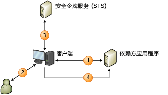

# 基于声明的标识模型Claims-Based Identity Model
在生成声明感知应用程序时，用户标识在应用程序中表示为一组声明。When you build claims-aware applications, the user identity is represented in your application as a set of claims. 其中一个声明可能是用户名，另一个声明可能是电子邮件地址。One claim could be the user’s name, another might be an e-mail address. 其理念是，配置外部标识系统以便为您的应用程序提供所需的一切，是其了解用户及用户发出的每个请求和加密，从而确保您收到的标识数据来自受信任的源。The idea is that an external identity system is configured to give your application everything it needs to know about the user with each request she makes, along with cryptographic assurance that the identity data you receive comes from a trusted source.  
  
 在此模型下，可以更轻松地实现单一登录，并且应用程序不再负责执行以下操作：Under this model, single sign-on is much easier to achieve, and your application is no longer responsible for the following:  
  
-   对用户进行身份验证。Authenticating users.  
  
-   存储用户帐户和密码。Storing user accounts and passwords.  
  
-   调用企业目录以查找用户标识详细信息。Calling to enterprise directories to look up user identity details.  
  
-   与来自其他平台或公司的标识系统集成。Integrating with identity systems from other platforms or companies.  
  
 在此模型下，应用程序可以基于由已对用户进行身份验证的系统提供的声明做出与标识相关的决定。Under this model, your application makes identity-related decisions based on claims supplied by the system that authenticated your user. 这可以是来自简单应用程序个性化的任何内容（带用户的名字），以便为用户授予访问应用程序中更有用的功能和资源的权限。This could be anything from simple application personalization with the user’s first name, to authorizing the user to access higher valued features and resources in your application.  
  
 本主题提供以下信息：This topic provides the following information:  
  
-   [基于声明的标识简介Introduction to Claims-Based Identity](../../../docs/framework/security/claims-based-identity-model.md#BKMK_1)  
  
-   [基于声明的标识模型的基本方案Basic Scenario for a Claims-Based Identity Model](../../../docs/framework/security/claims-based-identity-model.md#BKMK_2)  
  
   
## 基于声明的标识简介Introduction to Claims-Based Identity  
 下列术语和概念可帮助您了解标识的此新体系结构。The following terminology and concepts can help you understand this new architecture for identity.  
  
### 标识Identity  
 为描述 Windows Identity Foundation (WIF) 中的编程模型，将使用术语“标识”来表示一组特性，这些特性描述了系统中要保护的用户或其他实体。For the purposes of describing the programming model in Windows Identity Foundation (WIF), we will use the term "identity" to represent a set of attributes that describe a user or some other entity in a system that you want to secure.  
  
### 声明Claim  
 将声明视为一条标识信息，如“销售”角色中的姓名、电子邮件地址、年龄和成员资格。Think of a claim as a piece of identity information such as name, e-mail address, age, membership in the Sales role. 应用程序收到的声明越多，您对用户的了解就越深。The more claims your application receives, the more you’ll know about your user. 可能会想为何将它们称为“声明”，而不是像描述企业目一样称之为“特性”。You may be wondering why these are called "claims," rather than "attributes," as is commonly used in describing enterprise directories. 原因与传递方法相关。The reason has to do with the delivery method. 在此模型中，应用程序不会查找目录中的用户特性。In this model, your application doesn’t look up user attributes in a directory. 相反，用户会将声明提供给您的应用程序，然后您的应用程序会对其进行检查。Instead, the user delivers claims to your application, and your application examines them. 每个声明均由颁发者做出，您可以像信任颁发者一样信任此声明。Each claim is made by an issuer, and you trust the claim only as much as you trust the issuer. 例如，您对由您公司的域控制器做出的声明的信任程度比对用户自身做出的声明的信任程度更高。For example, you trust a claim made by your company’s domain controller more than you trust a claim made by the user herself. WIF 表示具有 <xref:System.Security.Claims.Claim> 类型的声明，此类型拥有一个允许您查明此声明的颁发者的 <xref:System.Security.Claims.Claim.Issuer%2A> 属性。WIF represents claims with a <xref:System.Security.Claims.Claim> type, which has an <xref:System.Security.Claims.Claim.Issuer%2A> property that allows you to find out who issued the claim.  
  
### 安全令牌Security Token  
 用户会将一组声明随请求一起提供给您的应用程序。The user delivers a set of claims to your application along with a request. 在 Web 服务中，SOAP 信封的安全标头中携带了这些声明。In a Web service, these claims are carried in the security header of the SOAP envelope. 在基于浏览器的 Web 应用程序中，这些声明会通过来自用户浏览器的 HTTP POST 到达，且稍后可能缓存在 Cookie 中（如果需要会话）。In a browser-based Web application, the claims arrive through an HTTP POST from the user’s browser, and may later be cached in a cookie if a session is desired. 不管这些声明是如何到达的，都必须对其进行序列化，从而产生安全令牌。Regardless of how these claims arrive, they must be serialized, which is where security tokens come in. 安全令牌是由颁发机构进行数字签名的一组序列化的声明。A security token is a serialized set of claims that is digitally signed by the issuing authority. 签名很重要：它可以为您确保用户不只是构建一组声明并将其发送给您。The signature is important: it gives you assurance that the user didn’t just make up a bunch of claims and send them to you. 在不需要加密的安全性较低的情况下，您可以使用未签名的标记，但本主题中不描述此情况。In low security situations where cryptography isn’t necessary or desired, you can use unsigned tokens, but that scenario is not described in this topic.  
  
 WIF 中的一项核心功能是可以创建和读取安全令牌。One of the core features in WIF is the ability to create and read security tokens. WIF 和 .NET Framework 将处理所有加密工作，并使用可读取的一组声明来呈现您的应用程序。WIF and the .NET Framework handle all of the cryptographic work, and present your application with a set of claims that you can read.  
  
### 签发机构Issuing Authority  
 有很多不同类型的签发机构，范围从颁发 Kerberos 票证的域控制器到颁发 X.509 证书的证书颁发机构，而本主题中讨论的特定类型的颁发机构可颁发包含声明的安全令牌。There are lots of different types of issuing authorities, from domain controllers that issue Kerberos tickets, to certification authorities that issue X.509 certificates, but the specific type of authority discussed in this topic issues security tokens that contain claims. 此签发机构是了解如何颁发安全令牌的 Web 应用程序或 Web 服务。This issuing authority is a Web application or Web service that knows how to issue security tokens. 它必须具备了足够的知识才能发出适当的声明（给定发出请求的目标依赖方和用户的情况下），并且可能负责与用户存储进行交互以查找声明并对用户本身进行身份验证。It must have enough knowledge to be able to issue the proper claims given the target relying party and the user making the request, and might be responsible for interacting with user stores to look up claims and authenticate the users themselves.  
  
 无论您选择哪个签发机构，它都会在您的标识解决方案中起到重要作用。Whatever issuing authority you choose, it plays a central role in your identity solution. 当您通过依赖声明将身份验证分解出应用程序时，您便将责任传递给此机构并要求它代表您对用户进行身份验证。When you factor authentication out of your application by relying on claims, you’re passing responsibility to that authority and asking it to authenticate users on your behalf.  
  
### 安全令牌服务 (STS)Security Token Service (STS)  
 安全令牌服务 (STS) 是根据 WS-Trust 和 WS 联合身份验证协议生成、签名并颁发安全令牌的服务组件。A security token service (STS) is the service component that builds, signs, and issues security tokens according to the WS-Trust and WS-Federation protocols. 尽管实现这些协议需要做大量工作，但 WIF 会为您完成所有这些工作，使得协议中的非专业人士只需做极少量的工作即可启动并运行 STS。There’s a lot of work that goes into implementing these protocols, but WIF does all of this work for you, making it feasible for someone who isn’t an expert in the protocols to get an STS up and running with very little effort. 可以使用预生成的 STS（如 [Active Directory® 联合身份验证服务 (AD FS) 2.0](http://go.microsoft.com/fwlink/?LinkID=247516)）和云 STS（如 [Microsoft Azure 访问控制服务 (ACS)](http://go.microsoft.com/fwlink/?LinkID=247517)），或者如果要发布自定义标记或提供自定义身份验证或授权，则可使用 WIF 生成自定义 STS。You can use a pre-built STS such as [Active Directory® Federation Services (AD FS) 2.0](http://go.microsoft.com/fwlink/?LinkID=247516), a cloud STS such as a [Windows Azure Access Control Service (ACS)](http://go.microsoft.com/fwlink/?LinkID=247517), or, if you want to issue custom tokens or provide custom authentication or authorization, you can build your own custom STS using WIF. 利用 WIF，您可以轻松生成自己的 STS。WIF makes it easy to build your own STS.  
  
### 依赖方应用程序Relying Party Application  
 在生成依赖声明的应用程序时，您将生成依赖方 (RP) 应用程序。When you build an application that relies on claims, you are building a relying party (RP) application. RP 的同义词包括“声明感知应用程序”和“基于声明的应用程序”。Synonyms for an RP include "claims-aware application" and "claims-based application". Web 应用程序和 Web 服务都可以成为 RP。Web applications and Web services can both be RPs. RP 应用程序使用 STS 颁发的令牌，并从令牌中提取声明以将其用于与标识相关的任务。A RP application consumes the tokens issued by a STS and extracts the claims from tokens to use them for identity related tasks. WIF 提供可帮助您生成 RP 应用程序的功能。WIF offers functionalities to help you build RP applications.  
  
### 标准Standards  
 为了使所有这些功能能够进行互操作，上一个方案中使用了多个 WS-* 标准。In order to make all of this interoperable, several WS-* standards are used in the previous scenario. 使用 WS-MetadataExchange 检索策略，并根据 WS-Policy 规范构造策略本身。Policy is retrieved using WS-MetadataExchange, and the policy itself is structured according to the WS-Policy specification. STS 公开了实现 WS-Trust 规范的终结点，此规范描述了如何请求和接收安全令牌。The STS exposes endpoints that implement the WS-Trust specification, which describes how to request and receive security tokens. 现在，大多数 STS 都颁发使用安全断言标记语言 (SAML) 进行格式化的令牌。Most STSs today issue tokens formatted with Security Assertion Markup Langauge (SAML). SAML 是行业认可的 XML 词汇表，可用于以可互操作的方式表示声明。SAML is an industry-recognized XML vocabulary that can be used to represent claims in an interoperable way. 或者，在多平台情况下，这将允许您在完全不同的平台上与 STS 进行通信并跨所有应用程序实现单一登录，不论平台如何。Or, in a multi-platform situation, this allows you to communicate with an STS on an entirely different platform and achieve single sign-on across all of your applications, regardless of platform.  
  
### 基于浏览器的应用程序Browser-Based Applications  
 智能客户端不是可使用基于声明的标识模型的唯一对象。Smart clients aren’t the only ones who can use the claims-based identity model. 基于浏览器的应用程序（也称为被动客户端）也可使用该模型。Browser-based applications (also referred to as passive clients) can use it as well. 以下方案描述了其工作原理。The following scenario describes how this works.  
  
 首先，用户指向声明感知 Web 应用程序（依赖方应用程序）上的浏览器。First, the user points a browser at a claims-aware Web application (the relying party application). Web 应用程序会将该浏览器重定向到 STS，以便能够对用户进行身份验证。The Web application redirects the browser to the STS so the user can be authenticated. 此 STS 承载于一个简单的 Web 应用程序中，此应用程序读取传入请求、使用标准 HTTP 机制对用户进行身份验证，然后创建 SAML 令牌并通过一段 JavaScript 代码进行回复（此代码会使浏览器启动将 SAML 令牌发送回 RP 的 HTTP POST）。The STS is hosted in a simple web application that reads the incoming request, authenticates the user using standard HTTP mechanisms, and then creates a SAML token and replies with a piece of JavaScript code that causes the browser to initiate an HTTP POST that sends the SAML token back to the RP. 此 POST 的主体包含 RP 请求的声明。The body of this POST contains the claims that the RP requested. 此时，RP 通常会将声明打包到 Cookie 中，这样一来，便无需为每个请求重定向用户。At this point, it is common for the RP to package the claims into a cookie so that the user doesn’t have to be redirected for each request.  
  
   
## 基于声明的标识模型的基本方案Basic Scenario for a Claims-Based Identity Model  
 以下是基于声明的系统的示例。The following is an example of a claims-based system.  
  
   
  
 此关系图显示一个已配置为使用 WIF 进行身份验证的网站（依赖方应用程序，RP）、一个客户端和一个要使用该网站的 Web 浏览器。This diagram shows a Web site (the relying party application, RP) that has been configured to use WIF for authentication and a client, a web browser, that wants to use that site.  
  
1.  当未经过身份验证的用户请求页时，其浏览器将重定向到标识提供程序 (IP) 页。When an unauthenticated user requests a page their browser is redirected to the identity provider (IP) pages.  
  
2.  此 IP 要求用户提供其凭据，例如，用户名/密码、Kerberos 等。The IP requires the user to present their credentials, e.g. username/password, Kerberos, etc.  
  
3.  IP 会将令牌发送回已返回到浏览器的页。The IP issues a token back to that is returned to the browser.  
  
4.  浏览器现在将重定向回最初请求的页，其中 WIF 将确定此令牌是否满足访问该页的要求。The browser is now redirected back to the originally requested page where WIF determines if the token satisfies the requirements to access the page. 如果是这样，则会发出一个 cookie 以建立会话，以便只需进行一次身份验证并将控制传递给应用程序。If so a cookie is issued to establish a session so the authentication only needs to occur once, and control is passed to the application.

