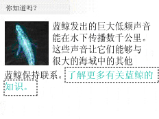

# 使用 UI 自动化访问嵌入式对象Access Embedded Objects Using UI Automation
> [!NOTE]
>  本文档适用于想要使用 [!INCLUDE[TLA2#tla_uiautomation](../../../includes/tla2sharptla-uiautomation-md.md)] 命名空间中定义的托管 <xref:System.Windows.Automation> 类的 .NET Framework 开发人员。This documentation is intended for .NET Framework developers who want to use the managed [!INCLUDE[TLA2#tla_uiautomation](../../../includes/tla2sharptla-uiautomation-md.md)] classes defined in the <xref:System.Windows.Automation> namespace. 有关最新信息[!INCLUDE[TLA2#tla_uiautomation](../../../includes/tla2sharptla-uiautomation-md.md)]，请参阅[Windows 自动化 API: UI 自动化](https://go.microsoft.com/fwlink/?LinkID=156746)。For the latest information about [!INCLUDE[TLA2#tla_uiautomation](../../../includes/tla2sharptla-uiautomation-md.md)], see [Windows Automation API: UI Automation](https://go.microsoft.com/fwlink/?LinkID=156746).  
  
 本主题显示可如何使用 [!INCLUDE[TLA#tla_uiautomation](../../../includes/tlasharptla-uiautomation-md.md)] 来公开嵌入在文本控件内容中的对象。This topic shows how [!INCLUDE[TLA#tla_uiautomation](../../../includes/tlasharptla-uiautomation-md.md)] can be used to expose objects embedded within the content of a text control.  
  
> [!NOTE]
>  嵌入对象可以包括图像、超链接、按钮、表或 ActiveX 控件。Embedded objects can include images, hyperlinks, buttons, tables, or ActiveX controls.  
  
 嵌入对象可视为 [!INCLUDE[TLA2#tla_uiautomation](../../../includes/tla2sharptla-uiautomation-md.md)] 文本提供程序的子项。Embedded objects are considered children of the [!INCLUDE[TLA2#tla_uiautomation](../../../includes/tla2sharptla-uiautomation-md.md)] text provider. 将能够通过与所有其他 [!INCLUDE[TLA#tla_ui](../../../includes/tlasharptla-ui-md.md)] 元素相同的 UI 自动化树结构来公开嵌入对象。This allows them to be exposed through the same UI Automation tree structure as all other [!INCLUDE[TLA#tla_ui](../../../includes/tlasharptla-ui-md.md)] elements. 而功能是通过嵌入对象控件类型通常需要的控件模式公开的（例如，由于超链接基于文本，因此超链接将支持 <xref:System.Windows.Automation.TextPattern>）。Functionality, in turn, is exposed through the control patterns typically required by the embedded objects control type (for example, since hyperlinks are text-based they will support <xref:System.Windows.Automation.TextPattern>).  
  
   
示例文档包含文本内容 （"您知道吗？"...）和两个嵌入的对象 （一幅鲸鱼照片和一个文本超链接） 的代码示例使用作为目标。A sample document with textual content, ("Did You Know?"…) and two embedded objects (a picture of a whale and a text hyperlink), used as a target for the code examples.  
  
## 示例Example  
 下面的代码示例演示如何从 [!INCLUDE[TLA2#tla_uiautomation](../../../includes/tla2sharptla-uiautomation-md.md)] 文本提供程序内检索嵌入对象的集合。The following code example demonstrates how to retrieve a collection of embedded objects from within a [!INCLUDE[TLA2#tla_uiautomation](../../../includes/tla2sharptla-uiautomation-md.md)] text provider. 对于简介中提供的示例文档，将返回两个对象（一个图像元素和一个文本元素）。For the sample document provided in the introduction, two objects would be returned (an image element and a text element).  
  
> [!NOTE]
>  图像元素应具有一些与图像关联的内部文本来描述图像，这些文本通常位于图像的 <xref:System.Windows.Automation.AutomationElement.NameProperty> 中（例如，“蓝鲸”）。The image element should have some intrinsic text associated with it that describes the image, typically in its <xref:System.Windows.Automation.AutomationElement.NameProperty> (for example, "A blue whale."). 但是，如果获得了跨越图像对象的文本范围，文本流中既不会返回图像，也不会返回此描述性文本。However, when a text range spanning the image object is obtained, neither the image nor this descriptive text is returned in the text stream.  
  
 [!code-csharp[FindText#StartApp](../../../samples/snippets/csharp/VS_Snippets_Wpf/FindText/CSharp/SearchWindow.cs#startapp)]
 [!code-vb[FindText#StartApp](../../../samples/snippets/visualbasic/VS_Snippets_Wpf/FindText/VisualBasic/SearchWindow.vb#startapp)]  
[!code-csharp[FindText#FindTextProvider](../../../samples/snippets/csharp/VS_Snippets_Wpf/FindText/CSharp/SearchWindow.cs#findtextprovider)]
[!code-vb[FindText#FindTextProvider](../../../samples/snippets/visualbasic/VS_Snippets_Wpf/FindText/VisualBasic/SearchWindow.vb#findtextprovider)]  
[!code-csharp[FindText#GetChildren](../../../samples/snippets/csharp/VS_Snippets_Wpf/FindText/CSharp/SearchWindow.cs#getchildren)]
[!code-vb[FindText#GetChildren](../../../samples/snippets/visualbasic/VS_Snippets_Wpf/FindText/VisualBasic/SearchWindow.vb#getchildren)]  
  
## 示例Example  
 下面的代码示例演示如何从 [!INCLUDE[TLA2#tla_uiautomation](../../../includes/tla2sharptla-uiautomation-md.md)] 文本提供程序内的嵌入对象中获取文本范围。The following code example demonstrates how to obtain a text range from an embedded object within a [!INCLUDE[TLA2#tla_uiautomation](../../../includes/tla2sharptla-uiautomation-md.md)] text provider. 检索的文本范围是一个空范围，The text range retrieved is an empty range where the starting endpoint follows "… 其中起始端点紧跟在“… ocean.”后的空格之后，结束端点位于表示嵌入超链接的结束“.”之前（如简介中提供的图像所示）。ocean.(space)" and the ending endpoint precedes the closing "." representing the embedded hyperlink (as shown by the image provided in the introduction). 即使这是一个空范围，也不会被视作退化的范围，因为它有非零跨度。Even though this is an empty range, it is not considered a degenerate range because it has a non-zero span.  
  
> [!NOTE]
>  <xref:System.Windows.Automation.TextPattern> 可以检索基于文本的嵌入对象（如超链接）；但是，将需要从嵌入对象中获取第二个 <xref:System.Windows.Automation.TextPattern> 才能公开其完整功能。<xref:System.Windows.Automation.TextPattern> can retrieve a text-based embedded object such as a hyperlink; however, a secondary <xref:System.Windows.Automation.TextPattern> will have to be obtained from the embedded object to expose its full functionality.  
  
 [!code-csharp[UIATextPattern_snip#GetRangeFromChild](../../../samples/snippets/csharp/VS_Snippets_Wpf/UIATextPattern_snip/CSharp/SearchWindow.cs#getrangefromchild)]
 [!code-vb[UIATextPattern_snip#GetRangeFromChild](../../../samples/snippets/visualbasic/VS_Snippets_Wpf/UIATextPattern_snip/VisualBasic/SearchWindow.vb#getrangefromchild)]  
  
## 请参阅See Also  
 [UI 自动化 TextPattern 概述UI Automation TextPattern Overview](../../../docs/framework/ui-automation/ui-automation-textpattern-overview.md)  
 [UI 自动化控件模式概述UI Automation Control Patterns Overview](../../../docs/framework/ui-automation/ui-automation-control-patterns-overview.md)  
 [客户端的 UI 自动化控件模式UI Automation Control Patterns for Clients](../../../docs/framework/ui-automation/ui-automation-control-patterns-for-clients.md)  
 [使用 UI 自动化向文本框添加内容Add Content to a Text Box Using UI Automation](../../../docs/framework/ui-automation/add-content-to-a-text-box-using-ui-automation.md)  
 [使用 UI 自动化查找和突出显示文本Find and Highlight Text Using UI Automation](../../../docs/framework/ui-automation/find-and-highlight-text-using-ui-automation.md)
