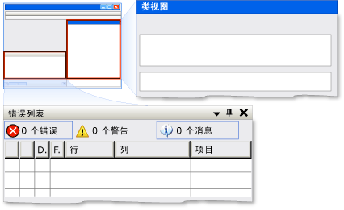

# 实现 UI 自动化 Dock 控件模式
> [!NOTE]
>  本文档适用于想要使用 [!INCLUDE[TLA2#tla_uiautomation](../../../includes/tla2sharptla-uiautomation-md.md)] 命名空间中定义的托管 <xref:System.Windows.Automation> 类的 .NET Framework 开发人员。 有关最新信息[!INCLUDE[TLA2#tla_uiautomation](../../../includes/tla2sharptla-uiautomation-md.md)]，请参阅[Windows 自动化 API:UI 自动化](https://go.microsoft.com/fwlink/?LinkID=156746)。  
  
 本主题介绍实现 <xref:System.Windows.Automation.Provider.IDockProvider>的准则和约定，包括有关属性的信息。 本主题的结尾列出了指向其他参考资料的链接。  
  
 <xref:System.Windows.Automation.DockPattern> 控件模式用于公开停靠容器内控件的停靠属性。 停靠容器是一个可让你水平或垂直地在彼此之间相对排列子元素的控件。 有关实现此控件模式的控件示例，请参阅 [Control Pattern Mapping for UI Automation Clients](../../../docs/framework/ui-automation/control-pattern-mapping-for-ui-automation-clients.md)。  
  
   
Visual Studio 中的停靠示例，其中“类视图”窗口为 DockPosition.Right，“错误列表”窗口为 DockPosition.Bottom  
  
   
## 实现准则和约定  
 在实现 Dock 控件模式时，请注意以下准则和约定：  
  
- <xref:System.Windows.Automation.Provider.IDockProvider> 不公开停靠容器的任何属性，或者停靠在停靠容器内当前控件旁边的控件的任何属性。  
  
- 控件根据其当前的 z 顺序彼此相对停靠；控件的 z 顺序位置越高，则其距停靠容器的指定边缘就越远。  
  
- 如果调整了停靠容器的大小，则容器内的停靠控件将沿着最初的停靠边缘重新定位。 停靠的控件也将调整大小，以根据其 <xref:System.Windows.Automation.DockPosition>的停靠行为来填充容器内的任何空间。 例如，如果指定了 <xref:System.Windows.Automation.DockPosition.Top> ，则控件的左边和右边将会扩展以填充任何可用空间。 如果指定了 <xref:System.Windows.Automation.DockPosition.Fill> ，则控件的所有四个边都将扩展以填充任何可用空间。  
  
- 在具有多个监视器的系统上，控件应该停靠在当前监视器的左侧或右侧。 如果这不可能，则控件应该停靠在最左侧监视器的左侧或最右侧监视器的右侧。  
  
   
## IDockProvider 必需的成员  
 实现 IDockProvider 接口需要以下属性和方法。  
  
|必需的成员|成员类型|说明|  
|----------------------|-----------------|-----------|  
|<xref:System.Windows.Automation.Provider.IDockProvider.DockPosition%2A>|属性|None|  
|<xref:System.Windows.Automation.Provider.IDockProvider.SetDockPosition%2A>|方法|None|  
  
 没有与此控件模式关联的事件。  
  
   
## Exceptions  
 提供程序必须引发以下异常。  
  
|异常类型|条件|  
|--------------------|---------------|  
|<xref:System.InvalidOperationException>|<xref:System.Windows.Automation.Provider.IDockProvider.SetDockPosition%2A>   -当控件不能执行请求的停靠样式。|  
  
## 请参阅

- [UI 自动化控件模式概述](../../../docs/framework/ui-automation/ui-automation-control-patterns-overview.md)
- [在 UI 自动化提供程序中支持控件模式](../../../docs/framework/ui-automation/support-control-patterns-in-a-ui-automation-provider.md)
- [客户端的 UI 自动化控件模式](../../../docs/framework/ui-automation/ui-automation-control-patterns-for-clients.md)
- [UI 自动化树概述](../../../docs/framework/ui-automation/ui-automation-tree-overview.md)
- [在 UI 自动化中使用缓存](../../../docs/framework/ui-automation/use-caching-in-ui-automation.md)
