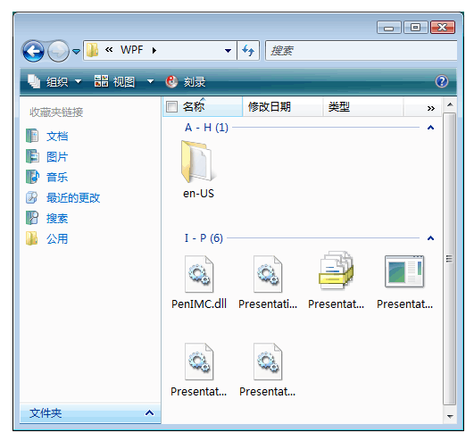

# 实现 UI 自动化 Grid 控件模式Implementing the UI Automation Grid Control Pattern
> [!NOTE]
>  本文档适用于想要使用 [!INCLUDE[TLA2#tla_uiautomation](../../../includes/tla2sharptla-uiautomation-md.md)] 命名空间中定义的托管 <xref:System.Windows.Automation> 类的 .NET Framework 开发人员。This documentation is intended for .NET Framework developers who want to use the managed [!INCLUDE[TLA2#tla_uiautomation](../../../includes/tla2sharptla-uiautomation-md.md)] classes defined in the <xref:System.Windows.Automation> namespace. 有关最新信息[!INCLUDE[TLA2#tla_uiautomation](../../../includes/tla2sharptla-uiautomation-md.md)]，请参阅[Windows 自动化 API: UI 自动化](https://go.microsoft.com/fwlink/?LinkID=156746)。For the latest information about [!INCLUDE[TLA2#tla_uiautomation](../../../includes/tla2sharptla-uiautomation-md.md)], see [Windows Automation API: UI Automation](https://go.microsoft.com/fwlink/?LinkID=156746).  
  
 本主题介绍实现 <xref:System.Windows.Automation.Provider.IGridProvider>的准则和约定，包括有关属性、方法和事件的信息。This topic introduces guidelines and conventions for implementing <xref:System.Windows.Automation.Provider.IGridProvider>, including information about properties, methods, and events. 本概述的结尾列出了指向其他参考资料的链接。Links to additional references are listed at the end of the overview.  
  
 <xref:System.Windows.Automation.GridPattern> 控件模式用于支持作为子元素集合的容器的控件。The <xref:System.Windows.Automation.GridPattern> control pattern is used to support controls that act as containers for a collection of child elements. 此元素的子元素必须实现 <xref:System.Windows.Automation.Provider.IGridItemProvider> ，并且在可以按行和列进行遍历的二维逻辑坐标系统中进行组织。The children of this element must implement <xref:System.Windows.Automation.Provider.IGridItemProvider> and be organized in a two-dimensional logical coordinate system that can be traversed by row and column. 有关实现此控件模式的控件示例，请参阅 [Control Pattern Mapping for UI Automation Clients](../../../docs/framework/ui-automation/control-pattern-mapping-for-ui-automation-clients.md)。For examples of controls that implement this control pattern, see [Control Pattern Mapping for UI Automation Clients](../../../docs/framework/ui-automation/control-pattern-mapping-for-ui-automation-clients.md).  
  
   
## 实现准则和约定Implementation Guidelines and Conventions  
 在实现 Grid 控件模式时，请注意以下准则和约定：When implementing the Grid control pattern, note the following guidelines and conventions:  
  
-   网格坐标从零开始，左上角单元格（或右上角单元格，具体取决于区域设置）的坐标为 (0, 0)。Grid coordinates are zero-based with the upper left (or upper right cell depending on locale) having coordinates (0, 0).  
  
-   如果某个单元格为空，必须仍返回 UI 自动化元素以便支持该单元格的 <xref:System.Windows.Automation.Provider.IGridItemProvider.ContainingGrid%2A> 属性。If a cell is empty, a UI Automation element must still be returned in order to support the <xref:System.Windows.Automation.Provider.IGridItemProvider.ContainingGrid%2A> property for that cell. 当网格中的子元素的布局类似于未对齐的数组时，这是可能的（请参阅下面的示例）。This is possible when the layout of child elements in the grid is similar to a ragged array (see example below).  
  
   
坐标为空的 Grid 控件的示例Example of a Grid Control with Empty Coordinates  
  
-   只有一项的网格仍需要实现 <xref:System.Windows.Automation.Provider.IGridProvider> （如果它逻辑上被视为网格）。A grid with a single item is still required to implement <xref:System.Windows.Automation.Provider.IGridProvider> if it is logically considered to be a grid. 网格中的子项数并不重要。The number of child items in the grid is immaterial.  
  
-   隐藏的行和列（具体取决于提供程序实现）可能会在 [!INCLUDE[TLA2#tla_uiautomation](../../../includes/tla2sharptla-uiautomation-md.md)] 树中加载，因此将会反映在 <xref:System.Windows.Automation.GridPattern.GridPatternInformation.RowCount%2A> 和 <xref:System.Windows.Automation.GridPattern.GridPatternInformation.ColumnCount%2A> 属性中。Hidden rows and columns, depending on the provider implementation, may be loaded in the [!INCLUDE[TLA2#tla_uiautomation](../../../includes/tla2sharptla-uiautomation-md.md)] tree and therefore will be reflected in the <xref:System.Windows.Automation.GridPattern.GridPatternInformation.RowCount%2A> and <xref:System.Windows.Automation.GridPattern.GridPatternInformation.ColumnCount%2A> properties. 如果尚未加载隐藏的行和列，则不应对它们进行计数。If the hidden rows and columns have not yet been loaded, they should not be counted.  
  
-   <xref:System.Windows.Automation.Provider.IGridProvider> 不会启用网格的主动操作；必须实现 <xref:System.Windows.Automation.Provider.ITransformProvider> 以启用此功能。<xref:System.Windows.Automation.Provider.IGridProvider> does not enable active manipulation of a grid; <xref:System.Windows.Automation.Provider.ITransformProvider> must be implemented to enable this functionality.  
  
-   使用 <xref:System.Windows.Automation.StructureChangedEventHandler> 来侦听对网格的结构和布局更改（如已添加、删除或合并的单元格）。Use a <xref:System.Windows.Automation.StructureChangedEventHandler> to listen for structural or layout changes to the grid such as cells that have been added, removed, or merged.  
  
-   使用 <xref:System.Windows.Automation.AutomationFocusChangedEventHandler> 来跟踪遍历的网格的项或单元格。Use a <xref:System.Windows.Automation.AutomationFocusChangedEventHandler> to track traversal through the items or cells of a grid.  
  
   
## IGridProvider 必需的成员Required Members for IGridProvider  
 实现 IGridProvider 接口需要以下属性和方法。The following properties and methods are required for implementing the IGridProvider interface.  
  
|必需的成员Required members|类型Type|说明Notes|  
|----------------------|----------|-----------|  
|<xref:System.Windows.Automation.Provider.IGridProvider.RowCount%2A>|属性Property|无None|  
|<xref:System.Windows.Automation.Provider.IGridProvider.ColumnCount%2A>|属性Property|无None|  
|<xref:System.Windows.Automation.Provider.IGridProvider.GetItem%2A>|方法Method|无None|  
  
 没有与此控件模式关联的事件。This control pattern has no associated events.  
  
   
## 异常Exceptions  
 提供程序必须引发以下异常。Providers must throw the following exceptions.  
  
|异常类型Exception type|条件Condition|  
|--------------------|---------------|  
|<xref:System.ArgumentOutOfRangeException>|<xref:System.Windows.Automation.Provider.IGridProvider.GetItem%2A>   -如果请求的行坐标大于<xref:System.Windows.Automation.Provider.IGridProvider.RowCount%2A>或列坐标大于<xref:System.Windows.Automation.Provider.IGridProvider.ColumnCount%2A>。-   If the requested row coordinate is larger than the <xref:System.Windows.Automation.Provider.IGridProvider.RowCount%2A> or the column coordinate is larger than the <xref:System.Windows.Automation.Provider.IGridProvider.ColumnCount%2A>.|  
|<xref:System.ArgumentOutOfRangeException>|<xref:System.Windows.Automation.Provider.IGridProvider.GetItem%2A>   -如果请求的行或列坐标小于零。-   If either of the requested row or column coordinates is less than zero.|  
  
## 请参阅See Also  
 [UI 自动化控件模式概述UI Automation Control Patterns Overview](../../../docs/framework/ui-automation/ui-automation-control-patterns-overview.md)  
 [在 UI 自动化提供程序中支持控件模式Support Control Patterns in a UI Automation Provider](../../../docs/framework/ui-automation/support-control-patterns-in-a-ui-automation-provider.md)  
 [客户端的 UI 自动化控件模式UI Automation Control Patterns for Clients](../../../docs/framework/ui-automation/ui-automation-control-patterns-for-clients.md)  
 [实现 UI 自动化 GridItem 控件模式Implementing the UI Automation GridItem Control Pattern](../../../docs/framework/ui-automation/implementing-the-ui-automation-griditem-control-pattern.md)  
 [UI 自动化树概述UI Automation Tree Overview](../../../docs/framework/ui-automation/ui-automation-tree-overview.md)  
 [在 UI 自动化中使用缓存Use Caching in UI Automation](../../../docs/framework/ui-automation/use-caching-in-ui-automation.md)
