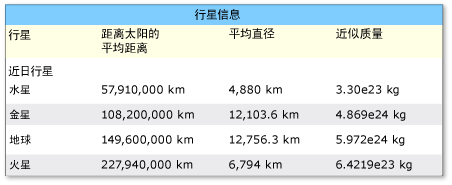
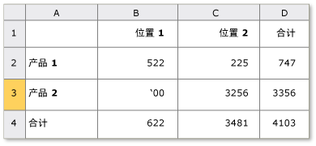

# 实现 UI 自动化 Table 控件模式Implementing the UI Automation Table Control Pattern
> [!NOTE]
>  本文档适用于想要使用 [!INCLUDE[TLA2#tla_uiautomation](../../../includes/tla2sharptla-uiautomation-md.md)] 命名空间中定义的托管 <xref:System.Windows.Automation> 类的 .NET Framework 开发人员。This documentation is intended for .NET Framework developers who want to use the managed [!INCLUDE[TLA2#tla_uiautomation](../../../includes/tla2sharptla-uiautomation-md.md)] classes defined in the <xref:System.Windows.Automation> namespace. 有关最新信息[!INCLUDE[TLA2#tla_uiautomation](../../../includes/tla2sharptla-uiautomation-md.md)]，请参阅[Windows 自动化 API: UI 自动化](https://go.microsoft.com/fwlink/?LinkID=156746)。For the latest information about [!INCLUDE[TLA2#tla_uiautomation](../../../includes/tla2sharptla-uiautomation-md.md)], see [Windows Automation API: UI Automation](https://go.microsoft.com/fwlink/?LinkID=156746).  
  
 本主题介绍实现 <xref:System.Windows.Automation.Provider.ITableProvider> 的准则和约定，包括有关属性、方法和事件的信息。This topic introduces guidelines and conventions for implementing <xref:System.Windows.Automation.Provider.ITableProvider>, including information about properties, methods, and events. 本概述的结尾列出了指向其他参考资料的链接。Links to additional references are listed at the end of the overview.  
  
 <xref:System.Windows.Automation.TablePattern>控件模式用于支持充当子元素的集合的容器的控件。The <xref:System.Windows.Automation.TablePattern> control pattern is used to support controls that act as containers for a collection of child elements. 此元素的子级必须实现<xref:System.Windows.Automation.Provider.ITableItemProvider>和组织可以按行和列进行遍历的二维逻辑坐标系统中。The children of this element must implement <xref:System.Windows.Automation.Provider.ITableItemProvider> and be organized in a two-dimensional logical coordinate system that can be traversed by row and column. 此控件模式是类似于<xref:System.Windows.Automation.Provider.IGridProvider>，与任何控件实现的区别<xref:System.Windows.Automation.Provider.ITableProvider>还必须公开每个子元素的列和/或行标题关系。This control pattern is analogous to <xref:System.Windows.Automation.Provider.IGridProvider>, with the distinction that any control implementing <xref:System.Windows.Automation.Provider.ITableProvider> must also expose a column and/or row header relationship for each child element. 有关实现此控件模式的控件示例，请参阅 [Control Pattern Mapping for UI Automation Clients](../../../docs/framework/ui-automation/control-pattern-mapping-for-ui-automation-clients.md)。For examples of controls that implement this control pattern, see [Control Pattern Mapping for UI Automation Clients](../../../docs/framework/ui-automation/control-pattern-mapping-for-ui-automation-clients.md).  
  
   
## 实现准则和约定Implementation Guidelines and Conventions  
 在实现 Table 控件模式时，请注意以下准则和约定：When implementing the Table control pattern, note the following guidelines and conventions:  
  
-   对各个单元格的内容的访问是通过二维逻辑坐标系统或数组的所需的并发实现提供<xref:System.Windows.Automation.Provider.IGridProvider>。Access to the content of individual cells is through a two-dimensional logical coordinate system or array provided by the required concurrent implementation of <xref:System.Windows.Automation.Provider.IGridProvider>.  
  
-   列或行标头可包含在表对象中或可以为与表对象相关联的单独标头对象。A column or row header can be contained within a table object or be a separate header object that is associated with a table object.  
  
-   列和行标头可能包含主标头以及任何支持的标头。Column and row headers may include both a primary header as well as any supporting headers.  
  
> [!NOTE]
>  这一概念将变得显而易见中[!INCLUDE[TLA#tla_xl](../../../includes/tlasharptla-xl-md.md)]电子表格用户定义的"名字"列。This concept becomes evident in a [!INCLUDE[TLA#tla_xl](../../../includes/tlasharptla-xl-md.md)] spreadsheet where a user has defined a "First name" column. 此列现在有两个标头 — 用户定义的“名字”标头和应用程序分配的该列的字母数字名称。This column now has two headers—the "First name" header defined by the user and the alphanumeric designation for that column assigned by the application.  
  
-   请参阅[实现 UI 自动化 Grid 控件模式](../../../docs/framework/ui-automation/implementing-the-ui-automation-grid-control-pattern.md)相关的网格功能。See [Implementing the UI Automation Grid Control Pattern](../../../docs/framework/ui-automation/implementing-the-ui-automation-grid-control-pattern.md) for related grid functionality.  
  
   
具有复杂列标头的表示例Example of a Table with Complex Column Headers  
  
   
具有不明确的 RowOrColumnMajor 属性的表示例。Example of a Table with Ambiguous RowOrColumnMajor Property  
  
   
## ITableProvider 必需的成员Required Members for ITableProvider  
 ITableProvider 接口需要以下属性和方法。The following properties and methods are required for the ITableProvider interface.  
  
|必需的成员Required members|成员类型Member type|说明Notes|  
|----------------------|-----------------|-----------|  
|<xref:System.Windows.Automation.Provider.ITableProvider.RowOrColumnMajor%2A>|属性Property|无None|  
|<xref:System.Windows.Automation.Provider.ITableProvider.GetColumnHeaders%2A>|方法Method|无None|  
|<xref:System.Windows.Automation.Provider.ITableProvider.GetRowHeaders%2A>|方法Method|无None|  
  
 没有与此控件模式关联的事件。This control pattern has no associated events.  
  
   
## 异常Exceptions  
 没有与此控件模式关联的异常。This control pattern has no associated exceptions.  
  
## 请参阅See Also  
 [UI 自动化控件模式概述UI Automation Control Patterns Overview](../../../docs/framework/ui-automation/ui-automation-control-patterns-overview.md)  
 [在 UI 自动化提供程序中支持控件模式Support Control Patterns in a UI Automation Provider](../../../docs/framework/ui-automation/support-control-patterns-in-a-ui-automation-provider.md)  
 [客户端的 UI 自动化控件模式UI Automation Control Patterns for Clients](../../../docs/framework/ui-automation/ui-automation-control-patterns-for-clients.md)  
 [实现 UI 自动化 TableItem 控件模式Implementing the UI Automation TableItem Control Pattern](../../../docs/framework/ui-automation/implementing-the-ui-automation-tableitem-control-pattern.md)  
 [实现 UI 自动化 Grid 控件模式Implementing the UI Automation Grid Control Pattern](../../../docs/framework/ui-automation/implementing-the-ui-automation-grid-control-pattern.md)  
 [UI 自动化树概述UI Automation Tree Overview](../../../docs/framework/ui-automation/ui-automation-tree-overview.md)  
 [在 UI 自动化中使用缓存Use Caching in UI Automation](../../../docs/framework/ui-automation/use-caching-in-ui-automation.md)
