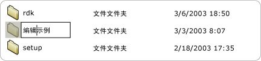
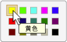

# 实现 UI 自动化 Value 控件模式Implementing the UI Automation Value Control Pattern
> [!NOTE]
>  本文档适用于想要使用 [!INCLUDE[TLA2#tla_uiautomation](../../../includes/tla2sharptla-uiautomation-md.md)] 命名空间中定义的托管 <xref:System.Windows.Automation> 类的 .NET Framework 开发人员。This documentation is intended for .NET Framework developers who want to use the managed [!INCLUDE[TLA2#tla_uiautomation](../../../includes/tla2sharptla-uiautomation-md.md)] classes defined in the <xref:System.Windows.Automation> namespace. 有关 [!INCLUDE[TLA2#tla_uiautomation](../../../includes/tla2sharptla-uiautomation-md.md)]的最新信息，请参阅 [Windows 自动化 API：UI 自动化](http://go.microsoft.com/fwlink/?LinkID=156746)。For the latest information about [!INCLUDE[TLA2#tla_uiautomation](../../../includes/tla2sharptla-uiautomation-md.md)], see [Windows Automation API: UI Automation](http://go.microsoft.com/fwlink/?LinkID=156746).  
  
 本主题介绍了实现 <xref:System.Windows.Automation.Provider.IValueProvider>的准则和约定，包括有关事件和属性的信息。This topic introduces guidelines and conventions for implementing <xref:System.Windows.Automation.Provider.IValueProvider>, including information on events and properties. 本主题的结尾列出了指向其他参考资料的链接。Links to additional references are listed at the end of the topic.  
  
 <xref:System.Windows.Automation.ValuePattern> 控件模式用于支持具有未跨越范围的内部值的控件，以及可用字符串表示的控件。The <xref:System.Windows.Automation.ValuePattern> control pattern is used to support controls that have an intrinsic value not spanning a range and that can be represented as a string. 此字符串是可编辑的，具体取决于控件及其设置。This string can be editable, depending on the control and its settings. 有关实现此模式的控件的示例，请参阅 [Control Pattern Mapping for UI Automation Clients](../../../docs/framework/ui-automation/control-pattern-mapping-for-ui-automation-clients.md)。For examples of controls that implement this pattern, see [Control Pattern Mapping for UI Automation Clients](../../../docs/framework/ui-automation/control-pattern-mapping-for-ui-automation-clients.md).  
  
   
## 实现准则和约定Implementation Guidelines and Conventions  
 在实现 Value 控件模式时，请注意以下准则和约定：When implementing the Value control pattern, note the following guidelines and conventions:  
  
-   如果任何项的值是可编辑的，则诸如 <xref:System.Windows.Automation.ControlType.ListItem> 和 <xref:System.Windows.Automation.ControlType.TreeItem> 等控件必须支持 <xref:System.Windows.Automation.ValuePattern> ，而无论控件的当前编辑模式。Controls such as <xref:System.Windows.Automation.ControlType.ListItem> and <xref:System.Windows.Automation.ControlType.TreeItem> must support <xref:System.Windows.Automation.ValuePattern> if the value of any of the items is editable, regardless of the current edit mode of the control. 如果子项是可编辑的，则父控件还必须支持 <xref:System.Windows.Automation.ValuePattern> 。The parent control must also support <xref:System.Windows.Automation.ValuePattern> if the child items are editable.  
  
 ![可编辑列表项。] (../../../docs/framework/ui-automation/media/uia-valuepattern-editable-listitem.PNG "UIA_ValuePattern_Editable_ListItem")  
可编辑列表项的示例Example of an Editable List Item  
  
-   单行编辑控件支持通过实现 <xref:System.Windows.Automation.Provider.IValueProvider>编程访问其内容。Single-line edit controls support programmatic access to their contents by implementing <xref:System.Windows.Automation.Provider.IValueProvider>. 但是，多行编辑控件不实现 <xref:System.Windows.Automation.Provider.IValueProvider>；相反，它们通过实现 <xref:System.Windows.Automation.Provider.ITextProvider>来提供对其内容的访问。However, multi-line edit controls do not implement <xref:System.Windows.Automation.Provider.IValueProvider>; instead they provide access to their content by implementing <xref:System.Windows.Automation.Provider.ITextProvider>.  
  
-   若要检索多行编辑控件的文本内容，控件必须实现 <xref:System.Windows.Automation.Provider.ITextProvider>。To retrieve the textual contents of a multi-line edit control, the control must implement <xref:System.Windows.Automation.Provider.ITextProvider>. 但是， <xref:System.Windows.Automation.Provider.ITextProvider> 不支持设置控件的值。However, <xref:System.Windows.Automation.Provider.ITextProvider> does not support setting the value of a control.  
  
-   <xref:System.Windows.Automation.Provider.IValueProvider> 不支持检索格式设置信息或子字符串值。<xref:System.Windows.Automation.Provider.IValueProvider> does not support the retrieval of formatting information or substring values. 在这些情况下，请实现 <xref:System.Windows.Automation.Provider.ITextProvider> 。Implement <xref:System.Windows.Automation.Provider.ITextProvider> in these scenarios.  
  
-   <xref:System.Windows.Automation.Provider.IValueProvider> 必须由诸如 **中的“颜色选取器”**[!INCLUDE[TLA#tla_word](../../../includes/tlasharptla-word-md.md)] 选择控件（如下所示）之类的控件实现，该控件支持颜色值（例如，“黄色”）与等效的内部 [!INCLUDE[TLA#tla_rgb](../../../includes/tlasharptla-rgb-md.md)] 结构之间的字符串映射。<xref:System.Windows.Automation.Provider.IValueProvider> must be implemented by controls such as the **Color Picker** selection control from [!INCLUDE[TLA#tla_word](../../../includes/tlasharptla-word-md.md)] (illustrated below), which supports string mapping between a color value (for example, "yellow") and an equivalent internal [!INCLUDE[TLA#tla_rgb](../../../includes/tlasharptla-rgb-md.md)] structure.  
  
 ![突出显示黄色的颜色选取器。] (../../../docs/framework/ui-automation/media/uia-valuepattern-colorpicker.png "UIA_ValuePattern_ColorPicker")  
颜色样本字符串映射的示例Example of Color Swatch String Mapping  
  
-   在允许调用 <xref:System.Windows.Automation.AutomationElement.IsEnabledProperty> 之前，控件应将其 `true` 设置为 <xref:System.Windows.Automation.ValuePattern.IsReadOnlyProperty> ，并将其 `false` 设置为 <xref:System.Windows.Automation.Provider.IValueProvider.SetValue%2A>。A control should have its <xref:System.Windows.Automation.AutomationElement.IsEnabledProperty> set to `true` and its <xref:System.Windows.Automation.ValuePattern.IsReadOnlyProperty> set to `false` before allowing a call to <xref:System.Windows.Automation.Provider.IValueProvider.SetValue%2A>.  
  
   
## IValueProvider 必需的成员Required Members for IValueProvider  
 实现 <xref:System.Windows.Automation.Provider.IValueProvider>需要以下属性和方法。The following properties and methods are required for implementing <xref:System.Windows.Automation.Provider.IValueProvider>.  
  
|必需的成员Required members|成员类型Member type|备注Notes|  
|----------------------|-----------------|-----------|  
|<xref:System.Windows.Automation.ValuePattern.IsReadOnlyProperty>|属性Property|无None|  
|<xref:System.Windows.Automation.ValuePattern.ValueProperty>|属性Property|无None|  
|<xref:System.Windows.Automation.ValuePattern.SetValue%2A>|方法Method|无None|  
  
   
## 异常Exceptions  
 提供程序必须引发以下异常。Providers must throw the following exceptions.  
  
|异常类型Exception type|条件Condition|  
|--------------------|---------------|  
|<xref:System.InvalidOperationException>|<xref:System.Windows.Automation.ValuePattern.SetValue%2A>   -如果区域设置特定的信息传递给如格式不正确的日期格式不正确的控件。-   If locale-specific information is passed to a control in an incorrect format such as an incorrectly formatted date.|  
|<xref:System.ArgumentException>|<xref:System.Windows.Automation.ValuePattern.SetValue%2A>   -如果无法将新值从字符串转换为格式控件可识别。-   If a new value cannot be converted from a string to a format the control recognizes.|  
|<xref:System.Windows.Automation.ElementNotEnabledException>|<xref:System.Windows.Automation.ValuePattern.SetValue%2A>   -当尝试操作未启用的控件。-   When an attempt is made to manipulate a control that is not enabled.|  
  
## 另请参阅See Also  
 [UI 自动化控件模式概述UI Automation Control Patterns Overview](../../../docs/framework/ui-automation/ui-automation-control-patterns-overview.md)  
 [在 UI 自动化提供程序中支持控件模式Support Control Patterns in a UI Automation Provider](../../../docs/framework/ui-automation/support-control-patterns-in-a-ui-automation-provider.md)  
 [客户端的 UI 自动化控件模式UI Automation Control Patterns for Clients](../../../docs/framework/ui-automation/ui-automation-control-patterns-for-clients.md)  
 [TextPattern 插入文本示例TextPattern Insert Text Sample](http://msdn.microsoft.com/en-us/67353f93-7ee2-42f2-ab76-5c078cf6ca16)  
 [UI 自动化树概述UI Automation Tree Overview](../../../docs/framework/ui-automation/ui-automation-tree-overview.md)  
 [使用在 UI 自动化中缓存Use Caching in UI Automation](../../../docs/framework/ui-automation/use-caching-in-ui-automation.md)
