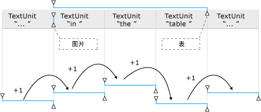

# TextPattern 和嵌入式对象概述TextPattern and Embedded Objects Overview
> [!NOTE]
>  本文档适用于想要使用 [!INCLUDE[TLA2#tla_uiautomation](../../../includes/tla2sharptla-uiautomation-md.md)] 命名空间中定义的托管 <xref:System.Windows.Automation> 类的 .NET Framework 开发人员。This documentation is intended for .NET Framework developers who want to use the managed [!INCLUDE[TLA2#tla_uiautomation](../../../includes/tla2sharptla-uiautomation-md.md)] classes defined in the <xref:System.Windows.Automation> namespace. 有关最新信息[!INCLUDE[TLA2#tla_uiautomation](../../../includes/tla2sharptla-uiautomation-md.md)]，请参阅[Windows 自动化 API:UI 自动化](https://go.microsoft.com/fwlink/?LinkID=156746)。For the latest information about [!INCLUDE[TLA2#tla_uiautomation](../../../includes/tla2sharptla-uiautomation-md.md)], see [Windows Automation API: UI Automation](https://go.microsoft.com/fwlink/?LinkID=156746).  
  
 本概述介绍 [!INCLUDE[TLA#tla_uiautomation](../../../includes/tlasharptla-uiautomation-md.md)] 如何在文本文档或容器中公开嵌入对象或子元素。This overview describes how [!INCLUDE[TLA#tla_uiautomation](../../../includes/tlasharptla-uiautomation-md.md)] exposes embedded objects, or child elements, within a text document or container.  
  
 在 [!INCLUDE[TLA2#tla_uiautomation](../../../includes/tla2sharptla-uiautomation-md.md)] 中，嵌入对象是具有非文本边界的任何元素，例如图像、超链接、表格或 [!INCLUDE[TLA#tla_xl](../../../includes/tlasharptla-xl-md.md)] 电子表格或 [!INCLUDE[TLA#tla_winmedia](../../../includes/tlasharptla-winmedia-md.md)] 文件等文档类型。In [!INCLUDE[TLA2#tla_uiautomation](../../../includes/tla2sharptla-uiautomation-md.md)] an embedded object is any element that has non-textual boundaries; for example, an image, hyperlink, table, or document type such as an [!INCLUDE[TLA#tla_xl](../../../includes/tlasharptla-xl-md.md)] spreadsheet or [!INCLUDE[TLA#tla_winmedia](../../../includes/tlasharptla-winmedia-md.md)] file. 这与标准定义不同，在标准定义中，我们在一个应用程序中创建元素，在另一个应用程序中嵌入或链接该元素。This differs from the standard definition, where an element is created in one application and embedded, or linked, within another. 是否可以在对象的原始应用程序中编辑对象与 [!INCLUDE[TLA2#tla_uiautomation](../../../includes/tla2sharptla-uiautomation-md.md)]的上下文无关。Whether the object can be edited within its original application is irrelevant in the context of [!INCLUDE[TLA2#tla_uiautomation](../../../includes/tla2sharptla-uiautomation-md.md)].  
  
   
## 嵌入对象和 UI 自动化树Embedded Objects and the UI Automation Tree  
 在 [!INCLUDE[TLA2#tla_uiautomation](../../../includes/tla2sharptla-uiautomation-md.md)] 树的控制视图中，嵌入对象被视为独立元素。Embedded objects are treated as individual elements within the control view of the [!INCLUDE[TLA2#tla_uiautomation](../../../includes/tla2sharptla-uiautomation-md.md)] tree. 由于它们都是作为文本容器的子级公开的，因此可以通过与 [!INCLUDE[TLA2#tla_uiautomation](../../../includes/tla2sharptla-uiautomation-md.md)]中的其他控件相同的模型进行访问。They are exposed as children of the text container so that they can be accessed through the same model as other controls in [!INCLUDE[TLA2#tla_uiautomation](../../../includes/tla2sharptla-uiautomation-md.md)].  
  
   
具有表、图像和超链接嵌入对象的文本容器示例Example of a Text Container with Table, Image, and Hyperlink Embedded Objects  
  
   
前述文本容器的一部分的内容视图示例Example of the Content View for a Portion of the Preceding Text Container  
  
   
## 使用 TextPattern 和 TextPatternRange 公开嵌入对象Expose Embedded Objects Using TextPattern and TextPatternRange  
 结合使用 <xref:System.Windows.Automation.TextPattern> 控件模式类和 <xref:System.Windows.Automation.Text.TextPatternRange> 类可公开促进嵌入对象导航和查询的方法和属性。Used in conjunction, the <xref:System.Windows.Automation.TextPattern> control pattern class and the <xref:System.Windows.Automation.Text.TextPatternRange> class expose methods and properties that facilitate navigation and querying of embedded objects.  
  
 文本容器和嵌入对象（如超链接或表格单元格）的文本内容（或内部文本）在 [!INCLUDE[TLA2#tla_uiautomation](../../../includes/tla2sharptla-uiautomation-md.md)] 树的控件视图和内容视图中作为单个连续文本流公开，对象边界被忽略。The textual content (or inner text) of a text container and an embedded object, such as a hyperlink or table cell, is exposed as a single, continuous text stream in both the control view and the content view of the [!INCLUDE[TLA2#tla_uiautomation](../../../includes/tla2sharptla-uiautomation-md.md)] tree; object boundaries are ignored. 如果 UI 自动化客户端检索文本的目的是以某种方式进行叙述、解释或分析，则应检查文本范围中的特殊情况，例如含有文本内容或其他嵌入对象的表格。If a UI Automation client is retrieving the text for the purpose of reciting, interpreting, or analyzing in some manner, the text range should be checked for special cases, such as a table with textual content or other embedded objects. 此操作可通过以下方式实现：调用 <xref:System.Windows.Automation.Text.TextPatternRange.GetChildren%2A> 以获取每个嵌入对象的 <xref:System.Windows.Automation.AutomationElement> ，然后调用 <xref:System.Windows.Automation.TextPattern.RangeFromChild%2A> 以获取每个元素的文本范围。This can be accomplished by calling <xref:System.Windows.Automation.Text.TextPatternRange.GetChildren%2A> to obtain an <xref:System.Windows.Automation.AutomationElement> for each embedded object and then calling <xref:System.Windows.Automation.TextPattern.RangeFromChild%2A> to obtain a text range for each element. 以递归方式完成操作，直到检索到所有文本内容。This is done recursively until all textual content has been retrieved.  
  
   
含有嵌入对象及其范围跨度的文本流示例Example of a text stream with embedded objects and their range spans  
  
 如果需要遍历文本范围的内容，为使 <xref:System.Windows.Automation.Text.TextPatternRange.Move%2A> 方法成功执行，将在后台进行一系列步骤。When it is necessary to traverse the content of a text range, a series of steps are involved behind the scenes in order for the <xref:System.Windows.Automation.Text.TextPatternRange.Move%2A> method to execute successfully.  
  
1.  对文本范围进行了规范化。也就是说，已在 <xref:System.Windows.Automation.Text.TextPatternRangeEndpoint.Start> 终结点将文本范围折叠为退化范围，这使得 <xref:System.Windows.Automation.Text.TextPatternRangeEndpoint.End> 终结点成为多余。The text range is normalized; that is, the text range is collapsed to a degenerate range at the <xref:System.Windows.Automation.Text.TextPatternRangeEndpoint.Start> endpoint, which makes the <xref:System.Windows.Automation.Text.TextPatternRangeEndpoint.End> endpoint superfluous. 此步骤是必需的文本范围跨越的情况下消除歧义<xref:System.Windows.Automation.Text.TextUnit>边界： 例如，`{The URL https://www.microsoft.com is embedded in text`其中"{"和"}"是文本范围的终结点。This step is necessary to remove ambiguity in situations where a text range spans <xref:System.Windows.Automation.Text.TextUnit> boundaries: for example, `{The URL https://www.microsoft.com is embedded in text` where "{" and "}" are the text range endpoints.  
  
2.  生成的范围在 <xref:System.Windows.Automation.TextPattern.DocumentRange%2A> 中向后移动到所请求的 <xref:System.Windows.Automation.Text.TextUnit> 边界的开头。The resulting range is moved backward in the <xref:System.Windows.Automation.TextPattern.DocumentRange%2A> to the beginning of the requested <xref:System.Windows.Automation.Text.TextUnit> boundary.  
  
3.  范围在 <xref:System.Windows.Automation.TextPattern.DocumentRange%2A> 中向前或向后移动所请求的 <xref:System.Windows.Automation.Text.TextUnit> 边界的数目。The range is moved forward or backward in the <xref:System.Windows.Automation.TextPattern.DocumentRange%2A> by the requested number of <xref:System.Windows.Automation.Text.TextUnit> boundaries.  
  
4.  然后通过将 <xref:System.Windows.Automation.Text.TextPatternRangeEndpoint.End> 终结点移动一个所请求的 <xref:System.Windows.Automation.Text.TextUnit> 边界，范围从退化范围状态扩展开来。The range is then expanded from a degenerate range state by moving the <xref:System.Windows.Automation.Text.TextPatternRangeEndpoint.End> endpoint by one requested <xref:System.Windows.Automation.Text.TextUnit> boundary.  
  
   
如何针对 Move() 和 ExpandToEnclosingUnit() 调整文本范围的示例Examples of how a text range is adjusted for Move() and ExpandToEnclosingUnit()  
  
   
## 常见方案Common Scenarios  
 以下各节显示涉及嵌入对象的最常见情景的示例。The following sections present examples of the most common scenarios that involve embedded objects.  
  
 示例的图例如下所示：Legend for the examples shown:  
  
 { = <xref:System.Windows.Automation.Text.TextPatternRangeEndpoint.Start>{ = <xref:System.Windows.Automation.Text.TextPatternRangeEndpoint.Start>  
  
 } = <xref:System.Windows.Automation.Text.TextPatternRangeEndpoint.End>} = <xref:System.Windows.Automation.Text.TextPatternRangeEndpoint.End>  
  
### 超链接Hyperlink  

**示例 1 - 包含嵌入文本超链接的文本范围****Example 1 - A text range that contains an embedded text hyperlink**
  
`{The URL https://www.microsoft.com is embedded in text}.`
  
|调用方法Method called|结果Result|  
|-------------------|------------|  
|<xref:System.Windows.Automation.Text.TextPatternRange.GetText%2A>|返回字符串 `The URL https://www.microsoft.com is embedded in text`。Returns the string `The URL https://www.microsoft.com is embedded in text`.|  
|<xref:System.Windows.Automation.Text.TextPatternRange.GetEnclosingElement%2A>|返回结束文本范围的最内层 <xref:System.Windows.Automation.AutomationElement> 。在本例中，即为表示文本提供程序本身的 <xref:System.Windows.Automation.AutomationElement> 。Returns the innermost <xref:System.Windows.Automation.AutomationElement> that encloses the text range; in this case, the <xref:System.Windows.Automation.AutomationElement> that represents the text provider itself.|  
|<xref:System.Windows.Automation.Text.TextPatternRange.GetChildren%2A>|返回表示超链接控件的 <xref:System.Windows.Automation.AutomationElement> 。Returns an <xref:System.Windows.Automation.AutomationElement> representing the hyperlink control.|  
|<xref:System.Windows.Automation.TextPattern.RangeFromChild%2A> ，其中 <xref:System.Windows.Automation.AutomationElement> 是由上一个 `GetChildren` 方法返回的对象。<xref:System.Windows.Automation.TextPattern.RangeFromChild%2A> where <xref:System.Windows.Automation.AutomationElement> is the object returned by the previous `GetChildren` method.|返回表示的范围"https://www.microsoft.com"。Returns the range that represents "https://www.microsoft.com".|  
  
 **示例 2 - 部分跨越嵌入文本超链接的文本范围****Example 2 - A text range that partially spans an embedded text hyperlink**  
  
 URL`https://{[www]}`嵌入在文本中。The URL `https://{[www]}` is embedded in text.  
  
|调用方法Method called|结果Result|  
|-------------------|------------|  
|<xref:System.Windows.Automation.Text.TextPatternRange.GetText%2A>|返回字符串“www”。Returns the string "www".|  
|<xref:System.Windows.Automation.Text.TextPatternRange.GetEnclosingElement%2A>|返回结束文本范围的最内层 <xref:System.Windows.Automation.AutomationElement> 。在本例中，即为超链接控件。Returns the innermost <xref:System.Windows.Automation.AutomationElement> that encloses the text range; in this case, the hyperlink control.|  
|<xref:System.Windows.Automation.Text.TextPatternRange.GetChildren%2A>|由于文本范围未跨越整个 URL 字符串，因此返回 `null` 。Returns `null` since the text range doesn't span the entire URL string.|  
  
**示例 3-部分跨越文本容器的内容的文本范围。文本容器包含不属于文本范围的嵌入的文本超链接。****Example 3 - A text range that partially spans the content of a text container. The text container has an embedded text hyperlink that is not part of the text range.**  
  
`{The URL} [https://www.microsoft.com](https://www.microsoft.com) is embedded in text.`
  
|调用方法Method called|结果Result|  
|-------------------|------------|  
|<xref:System.Windows.Automation.Text.TextPatternRange.GetText%2A>|返回字符串“The URL”。Returns the string "The URL".|  
|<xref:System.Windows.Automation.Text.TextPatternRange.GetEnclosingElement%2A>|返回结束文本范围的最内层 <xref:System.Windows.Automation.AutomationElement> 。在本例中，即为表示文本提供程序本身的 <xref:System.Windows.Automation.AutomationElement> 。Returns the innermost <xref:System.Windows.Automation.AutomationElement> that encloses the text range; in this case, the <xref:System.Windows.Automation.AutomationElement> that represents the text provider itself.|  
|具有参数 (TextUnit.Word, 1) 的<xref:System.Windows.Automation.Text.TextPatternRange.Move%2A> 。<xref:System.Windows.Automation.Text.TextPatternRange.Move%2A> with parameters of (TextUnit.Word, 1).|将文本范围跨度移到“http”，因为该超链接的文本由独立单词组成。Moves the text range span to "http" since the text of the hyperlink is comprised of individual words. 在本例中，不将超链接视为单个对象。In this case, the hyperlink is not treated as a single object.   在文本中嵌入 URL {[http]}。The URL {[http]} is embedded in text.|  
  
   
### 图像Image  
 **示例 1 - 包含嵌入图像的文本范围****Example 1 - A text range that contains an embedded image**  
  
 {图像嵌入在文本}。{The image  is embedded in text}.  
  
|调用方法Method called|结果Result|  
|-------------------|------------|  
|<xref:System.Windows.Automation.Text.TextPatternRange.GetText%2A>|返回字符串“The is embedded in text”。Returns the string "The is embedded in text". 与图像相关联的任何替换文本均无例外，包括文本流。Any ALT text associated with the image cannot be expected to be included in the text stream.|  
|<xref:System.Windows.Automation.Text.TextPatternRange.GetEnclosingElement%2A>|返回结束文本范围的最内层 <xref:System.Windows.Automation.AutomationElement> 。在本例中，即为表示文本提供程序本身的 <xref:System.Windows.Automation.AutomationElement> 。Returns the innermost <xref:System.Windows.Automation.AutomationElement> that encloses the text range; in this case, the <xref:System.Windows.Automation.AutomationElement> that represents the text provider itself.|  
|<xref:System.Windows.Automation.Text.TextPatternRange.GetChildren%2A>|返回表示图像控件的 <xref:System.Windows.Automation.AutomationElement> 。Returns an <xref:System.Windows.Automation.AutomationElement> representing the image control.|  
|<xref:System.Windows.Automation.TextPattern.RangeFromChild%2A> ，其中 <xref:System.Windows.Automation.AutomationElement> 是由上一个 <xref:System.Windows.Automation.Text.TextPatternRange.GetChildren%2A> 方法返回的对象。<xref:System.Windows.Automation.TextPattern.RangeFromChild%2A> where <xref:System.Windows.Automation.AutomationElement> is the object returned by the previous <xref:System.Windows.Automation.Text.TextPatternRange.GetChildren%2A> method.|返回表示的退化范围""。Returns the degenerate range that represents "".|  
  
 **示例 2-部分跨越文本容器的内容的文本范围。文本容器包含不属于文本范围的嵌入的图像。****Example 2 - A text range that partially spans the content of a text container. The text container has an embedded image that is not part of the text range.**  
  
 {The image}嵌入在文本中。{The image}  is embedded in text.  
  
|调用方法Method called|结果Result|  
|-------------------|------------|  
|<xref:System.Windows.Automation.Text.TextPatternRange.GetText%2A>|返回字符串“The image”。Returns the string "The image".|  
|<xref:System.Windows.Automation.Text.TextPatternRange.GetEnclosingElement%2A>|返回结束文本范围的最内层 <xref:System.Windows.Automation.AutomationElement> 。在本例中，即为表示文本提供程序本身的 <xref:System.Windows.Automation.AutomationElement> 。Returns the innermost <xref:System.Windows.Automation.AutomationElement> that encloses the text range; in this case, the <xref:System.Windows.Automation.AutomationElement> that represents the text provider itself.|  
|具有参数 (TextUnit.Word, 1) 的<xref:System.Windows.Automation.Text.TextPatternRange.Move%2A> 。<xref:System.Windows.Automation.Text.TextPatternRange.Move%2A> with parameters of (TextUnit.Word, 1).|将文本范围跨度移到“is ”。Moves the text range span to "is ". 由于只有基于文本的嵌入对象被视为文本流的一部分，因此本示例中的图像不影响 Move 或其返回值（在本例中为 1）。Because only text-based embedded objects are considered part of the text stream, the image in this example does not affect Move or its return value (1 in this case).|  
  
   
### 表Table  
  
### 示例用表Table used for examples  
  
|带图像的单元格Cell with Image|带文本的单元格Cell with Text|  
|---------------------|--------------------|  
||XX|  
||YY|  
|   Z 的图像Image for Z|ZZ|  
  
 **示例 1 - 从单元格的内容获取文本容器。****Example 1 - Get the text container from the content of a cell.**  
  
|调用方法Method Called|结果Result|  
|-------------------|------------|  
|具有参数 (0,0) 的<xref:System.Windows.Automation.GridPattern.GetItem%2A> <xref:System.Windows.Automation.GridPattern.GetItem%2A> with parameters (0,0)|返回表示表格单元格内容的 <xref:System.Windows.Automation.AutomationElement> 。在本例中，该元素是文本控件。Returns the <xref:System.Windows.Automation.AutomationElement> representing the content of the table cell; in this case, the element is a text control.|  
|<xref:System.Windows.Automation.TextPattern.RangeFromChild%2A> ，其中 <xref:System.Windows.Automation.AutomationElement> 是由上一个 `GetItem` 方法返回的对象。<xref:System.Windows.Automation.TextPattern.RangeFromChild%2A> where <xref:System.Windows.Automation.AutomationElement> is the object returned by the previous `GetItem` method.|返回跨越图像的范围。Returns the range that spans the image .|  
|<xref:System.Windows.Automation.Text.TextPatternRange.GetEnclosingElement%2A> 是由上一个 `RangeFromChild` 方法返回的对象。<xref:System.Windows.Automation.Text.TextPatternRange.GetEnclosingElement%2A> for the object returned by the previous `RangeFromChild` method.|返回表示表格单元格的 <xref:System.Windows.Automation.AutomationElement> 。在本例中，该元素是支持 TableItemPattern 的文本控件。Returns the <xref:System.Windows.Automation.AutomationElement> representing the table cell; in this case, the element is a text control that supports TableItemPattern.|  
|<xref:System.Windows.Automation.Text.TextPatternRange.GetEnclosingElement%2A> 是由上一个 `GetEnclosingElement` 方法返回的对象。<xref:System.Windows.Automation.Text.TextPatternRange.GetEnclosingElement%2A> for the object returned by the previous `GetEnclosingElement` method.|返回表示表格的 <xref:System.Windows.Automation.AutomationElement> 。Returns the <xref:System.Windows.Automation.AutomationElement> representing the table.|  
|<xref:System.Windows.Automation.Text.TextPatternRange.GetEnclosingElement%2A> 是由上一个 `GetEnclosingElement` 方法返回的对象。<xref:System.Windows.Automation.Text.TextPatternRange.GetEnclosingElement%2A> for the object returned by the previous `GetEnclosingElement` method.|返回表示文本提供程序本身的 <xref:System.Windows.Automation.AutomationElement> 。Returns the <xref:System.Windows.Automation.AutomationElement> that represents the text provider itself.|  
  
 **示例 2 - 获取单元格的文本内容。****Example 2 - Get the text content of a cell.**  
  
|调用方法Method Called|结果Result|  
|-------------------|------------|  
|具有参数 (1,1) 的<xref:System.Windows.Automation.GridPattern.GetItem%2A> 。<xref:System.Windows.Automation.GridPattern.GetItem%2A> with parameters of (1,1).|返回表示表格单元格内容的 <xref:System.Windows.Automation.AutomationElement> 。在本例中，该元素是文本控件。Returns the <xref:System.Windows.Automation.AutomationElement> representing the content of the table cell; in this case, the element is a text control.|  
|<xref:System.Windows.Automation.TextPattern.RangeFromChild%2A> ，其中 <xref:System.Windows.Automation.AutomationElement> 是由上一个 `GetItem` 方法返回的对象。<xref:System.Windows.Automation.TextPattern.RangeFromChild%2A> where <xref:System.Windows.Automation.AutomationElement> is the object returned by the previous `GetItem` method.|返回“Y”。Returns "Y".|  
  
## 请参阅See also
- <xref:System.Windows.Automation.TextPattern>
- <xref:System.Windows.Automation.Text.TextPatternRange>
- <xref:System.Windows.Automation.Provider.ITextProvider>
- <xref:System.Windows.Automation.Provider.ITextRangeProvider>
- [使用 UI 自动化访问嵌入式对象Access Embedded Objects Using UI Automation](../../../docs/framework/ui-automation/access-embedded-objects-using-ui-automation.md)
- [使用 UI 自动化公开表的内容Expose the Content of a Table Using UI Automation](../../../docs/framework/ui-automation/expose-the-content-of-a-table-using-ui-automation.md)
- [使用 UI 自动化遍历文本Traverse Text Using UI Automation](../../../docs/framework/ui-automation/traverse-text-using-ui-automation.md)
- [TextPattern 搜索和选择示例TextPattern Search and Selection Sample](https://msdn.microsoft.com/library/0a3bca57-8b72-489d-a57c-da85b7a22c7f)
