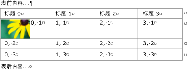
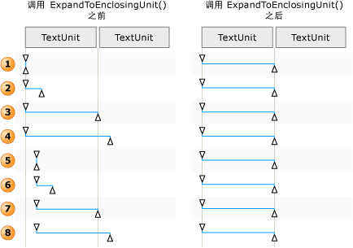

# TextPattern 和嵌入式对象概述
> [!NOTE]
>  本文档适用于想要使用 [!INCLUDE[TLA2#tla_uiautomation](../../../includes/tla2sharptla-uiautomation-md.md)] 命名空间中定义的托管 <xref:System.Windows.Automation> 类的 .NET Framework 开发人员。 有关 [!INCLUDE[TLA2#tla_uiautomation](../../../includes/tla2sharptla-uiautomation-md.md)]的最新信息，请参阅 [Windows 自动化 API：UI 自动化](http://go.microsoft.com/fwlink/?LinkID=156746)。  
  
 本概述介绍 [!INCLUDE[TLA#tla_uiautomation](../../../includes/tlasharptla-uiautomation-md.md)] 如何在文本文档或容器中公开嵌入对象或子元素。  
  
 在 [!INCLUDE[TLA2#tla_uiautomation](../../../includes/tla2sharptla-uiautomation-md.md)] 中，嵌入对象是具有非文本边界的任何元素，例如图像、超链接、表格或 [!INCLUDE[TLA#tla_xl](../../../includes/tlasharptla-xl-md.md)] 电子表格或 [!INCLUDE[TLA#tla_winmedia](../../../includes/tlasharptla-winmedia-md.md)] 文件等文档类型。 这与标准定义不同，在标准定义中，我们在一个应用程序中创建元素，在另一个应用程序中嵌入或链接该元素。 是否可以在对象的原始应用程序中编辑对象与 [!INCLUDE[TLA2#tla_uiautomation](../../../includes/tla2sharptla-uiautomation-md.md)]的上下文无关。  
  
   
## 嵌入对象和 UI 自动化树  
 在 [!INCLUDE[TLA2#tla_uiautomation](../../../includes/tla2sharptla-uiautomation-md.md)] 树的控制视图中，嵌入对象被视为独立元素。 由于它们都是作为文本容器的子级公开的，因此可以通过与 [!INCLUDE[TLA2#tla_uiautomation](../../../includes/tla2sharptla-uiautomation-md.md)]中的其他控件相同的模型进行访问。  
  
   
具有表、图像和超链接嵌入对象的文本容器示例  
  
   
前述文本容器的一部分的内容视图示例  
  
   
## 使用 TextPattern 和 TextPatternRange 公开嵌入对象  
 结合使用 <xref:System.Windows.Automation.TextPattern> 控件模式类和 <xref:System.Windows.Automation.Text.TextPatternRange> 类可公开促进嵌入对象导航和查询的方法和属性。  
  
 文本容器和嵌入对象（如超链接或表格单元格）的文本内容（或内部文本）在 [!INCLUDE[TLA2#tla_uiautomation](../../../includes/tla2sharptla-uiautomation-md.md)] 树的控件视图和内容视图中作为单个连续文本流公开，对象边界被忽略。 如果 UI 自动化客户端检索文本的目的是以某种方式进行叙述、解释或分析，则应检查文本范围中的特殊情况，例如含有文本内容或其他嵌入对象的表格。 此操作可通过以下方式实现：调用 <xref:System.Windows.Automation.Text.TextPatternRange.GetChildren%2A> 以获取每个嵌入对象的 <xref:System.Windows.Automation.AutomationElement> ，然后调用 <xref:System.Windows.Automation.TextPattern.RangeFromChild%2A> 以获取每个元素的文本范围。 以递归方式完成操作，直到检索到所有文本内容。  
  
 ![跨的嵌入对象的文本范围。] (../../../docs/framework/ui-automation/media/uia-textpattern-embeddedobjecttextranges.png "UIA_TextPattern_EmbeddedObjectTextRanges")  
含有嵌入对象及其范围跨度的文本流示例  
  
 如果需要遍历文本范围的内容，为使 <xref:System.Windows.Automation.Text.TextPatternRange.Move%2A> 方法成功执行，将在后台进行一系列步骤。  
  
1.  对文本范围进行了规范化。也就是说，已在 <xref:System.Windows.Automation.Text.TextPatternRangeEndpoint.Start> 终结点将文本范围折叠为退化范围，这使得 <xref:System.Windows.Automation.Text.TextPatternRangeEndpoint.End> 终结点成为多余。 在文本范围跨越 <xref:System.Windows.Automation.Text.TextUnit> 边界的情况下消除歧义时，此步骤是必需的：例如“{The U}RL [http://www.microsoft.com](http://www.microsoft.com) is embedded in text”，其中“{”和“}”是文本范围的终结点。  
  
2.  生成的范围在 <xref:System.Windows.Automation.TextPattern.DocumentRange%2A> 中向后移动到所请求的 <xref:System.Windows.Automation.Text.TextUnit> 边界的开头。  
  
3.  范围在 <xref:System.Windows.Automation.TextPattern.DocumentRange%2A> 中向前或向后移动所请求的 <xref:System.Windows.Automation.Text.TextUnit> 边界的数目。  
  
4.  然后通过将 <xref:System.Windows.Automation.Text.TextPatternRangeEndpoint.End> 终结点移动一个所请求的 <xref:System.Windows.Automation.Text.TextUnit> 边界，范围从退化范围状态扩展开来。  
  
   
如何针对 Move() 和 ExpandToEnclosingUnit() 调整文本范围的示例  
  
   
## 常见方案  
 以下各节显示涉及嵌入对象的最常见情景的示例。  
  
 示例的图例如下所示：  
  
 { = <xref:System.Windows.Automation.Text.TextPatternRangeEndpoint.Start>  
  
 } = <xref:System.Windows.Automation.Text.TextPatternRangeEndpoint.End>  
  
   
### 超链接  
 **示例 1 - 包含嵌入文本超链接的文本范围**  
  
 {The URL [http://www.microsoft.com](http://www.microsoft.com) is embedded in text}。  
  
|调用方法|结果|  
|-------------------|------------|  
|<xref:System.Windows.Automation.Text.TextPatternRange.GetText%2A>|返回字符串“The URL http://www.microsoft.com is embedded in text”。|  
|<xref:System.Windows.Automation.Text.TextPatternRange.GetEnclosingElement%2A>|返回结束文本范围的最内层 <xref:System.Windows.Automation.AutomationElement> 。在本例中，即为表示文本提供程序本身的 <xref:System.Windows.Automation.AutomationElement> 。|  
|<xref:System.Windows.Automation.Text.TextPatternRange.GetChildren%2A>|返回表示超链接控件的 <xref:System.Windows.Automation.AutomationElement> 。|  
|<xref:System.Windows.Automation.TextPattern.RangeFromChild%2A> ，其中 <xref:System.Windows.Automation.AutomationElement> 是由上一个 `GetChildren` 方法返回的对象。|返回表示“http://www.microsoft.com”的范围。|  
  
 **示例 2 - 部分跨越嵌入文本超链接的文本范围**  
  
 URL http://{[www]} 嵌入在文本中。  
  
|调用方法|结果|  
|-------------------|------------|  
|<xref:System.Windows.Automation.Text.TextPatternRange.GetText%2A>|返回字符串“www”。|  
|<xref:System.Windows.Automation.Text.TextPatternRange.GetEnclosingElement%2A>|返回结束文本范围的最内层 <xref:System.Windows.Automation.AutomationElement> 。在本例中，即为超链接控件。|  
|<xref:System.Windows.Automation.Text.TextPatternRange.GetChildren%2A>|由于文本范围未跨越整个 URL 字符串，因此返回 `null` 。|  
  
 **示例 3-部分跨越文本容器的内容的文本范围。文本容器包含不属于文本范围一部分的嵌入的文本超链接。**  
  
 {The URL} [http://www.microsoft.com](http://www.microsoft.com) is embedded in text。  
  
|调用方法|结果|  
|-------------------|------------|  
|<xref:System.Windows.Automation.Text.TextPatternRange.GetText%2A>|返回字符串“The URL”。|  
|<xref:System.Windows.Automation.Text.TextPatternRange.GetEnclosingElement%2A>|返回结束文本范围的最内层 <xref:System.Windows.Automation.AutomationElement> 。在本例中，即为表示文本提供程序本身的 <xref:System.Windows.Automation.AutomationElement> 。|  
|具有参数 (TextUnit.Word, 1) 的<xref:System.Windows.Automation.Text.TextPatternRange.Move%2A> 。|将文本范围跨度移到“http”，因为该超链接的文本由独立单词组成。 在本例中，不将超链接视为单个对象。   URL {[http]} 嵌入在文本中。|  
  
   
### Image  
 **示例 1 - 包含嵌入图像的文本范围**  
  
 {映像嵌入在文本}。  
  
|调用方法|结果|  
|-------------------|------------|  
|<xref:System.Windows.Automation.Text.TextPatternRange.GetText%2A>|返回字符串“The is embedded in text”。 与图像相关联的任何替换文本均无例外，包括文本流。|  
|<xref:System.Windows.Automation.Text.TextPatternRange.GetEnclosingElement%2A>|返回结束文本范围的最内层 <xref:System.Windows.Automation.AutomationElement> 。在本例中，即为表示文本提供程序本身的 <xref:System.Windows.Automation.AutomationElement> 。|  
|<xref:System.Windows.Automation.Text.TextPatternRange.GetChildren%2A>|返回表示图像控件的 <xref:System.Windows.Automation.AutomationElement> 。|  
|<xref:System.Windows.Automation.TextPattern.RangeFromChild%2A> ，其中 <xref:System.Windows.Automation.AutomationElement> 是由上一个 <xref:System.Windows.Automation.Text.TextPatternRange.GetChildren%2A> 方法返回的对象。|返回表示的退化范围""。|  
  
 **示例 2-部分跨越文本容器的内容的文本范围。文本容器包含不是文本范围的一部分的嵌入的图像。**  
  
 {The image}嵌入文本中。  
  
|调用方法|结果|  
|-------------------|------------|  
|<xref:System.Windows.Automation.Text.TextPatternRange.GetText%2A>|返回字符串“The image”。|  
|<xref:System.Windows.Automation.Text.TextPatternRange.GetEnclosingElement%2A>|返回结束文本范围的最内层 <xref:System.Windows.Automation.AutomationElement> 。在本例中，即为表示文本提供程序本身的 <xref:System.Windows.Automation.AutomationElement> 。|  
|具有参数 (TextUnit.Word, 1) 的<xref:System.Windows.Automation.Text.TextPatternRange.Move%2A> 。|将文本范围跨度移到“is ”。 由于只有基于文本的嵌入对象被视为文本流的一部分，因此本示例中的图像不影响 Move 或其返回值（在本例中为 1）。|  
  
   
### 表  
  
### 示例用表  
  
|带图像的单元格|带文本的单元格|  
|---------------------|--------------------|  
||X|  
||Y|  
|   Z 的图像|Z|  
  
 **示例 1 - 从单元格的内容获取文本容器。**  
  
|调用方法|结果|  
|-------------------|------------|  
|具有参数 (0,0) 的<xref:System.Windows.Automation.GridPattern.GetItem%2A> |返回表示表格单元格内容的 <xref:System.Windows.Automation.AutomationElement> 。在本例中，该元素是文本控件。|  
|<xref:System.Windows.Automation.TextPattern.RangeFromChild%2A> ，其中 <xref:System.Windows.Automation.AutomationElement> 是由上一个 `GetItem` 方法返回的对象。|返回跨越图像的范围。|  
|<xref:System.Windows.Automation.Text.TextPatternRange.GetEnclosingElement%2A> 是由上一个 `RangeFromChild` 方法返回的对象。|返回表示表格单元格的 <xref:System.Windows.Automation.AutomationElement> 。在本例中，该元素是支持 TableItemPattern 的文本控件。|  
|<xref:System.Windows.Automation.Text.TextPatternRange.GetEnclosingElement%2A> 是由上一个 `GetEnclosingElement` 方法返回的对象。|返回表示表格的 <xref:System.Windows.Automation.AutomationElement> 。|  
|<xref:System.Windows.Automation.Text.TextPatternRange.GetEnclosingElement%2A> 是由上一个 `GetEnclosingElement` 方法返回的对象。|返回表示文本提供程序本身的 <xref:System.Windows.Automation.AutomationElement> 。|  
  
 **示例 2 - 获取单元格的文本内容。**  
  
|调用方法|结果|  
|-------------------|------------|  
|具有参数 (1,1) 的<xref:System.Windows.Automation.GridPattern.GetItem%2A> 。|返回表示表格单元格内容的 <xref:System.Windows.Automation.AutomationElement> 。在本例中，该元素是文本控件。|  
|<xref:System.Windows.Automation.TextPattern.RangeFromChild%2A> ，其中 <xref:System.Windows.Automation.AutomationElement> 是由上一个 `GetItem` 方法返回的对象。|返回“Y”。|  
  
## 另请参阅  
 <xref:System.Windows.Automation.TextPattern>  
 <xref:System.Windows.Automation.Text.TextPatternRange>  
 <xref:System.Windows.Automation.Provider.ITextProvider>  
 <xref:System.Windows.Automation.Provider.ITextRangeProvider>  
 [使用 UI 自动化访问嵌入式对象](../../../docs/framework/ui-automation/access-embedded-objects-using-ui-automation.md)  
 [Expose the Content of a Table Using UI Automation](../../../docs/framework/ui-automation/expose-the-content-of-a-table-using-ui-automation.md)  
 [使用 UI 自动化遍历文本](../../../docs/framework/ui-automation/traverse-text-using-ui-automation.md)  
 [TextPattern 搜索和选择示例](http://msdn.microsoft.com/en-us/0a3bca57-8b72-489d-a57c-da85b7a22c7f)
