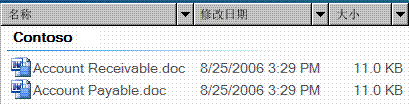

# UI 自动化对 DataItem 控件类型的支持
> [!NOTE]
>  本文档适用于想要使用 [!INCLUDE[TLA2#tla_uiautomation](../../../includes/tla2sharptla-uiautomation-md.md)] 命名空间中定义的托管 <xref:System.Windows.Automation> 类的 .NET Framework 开发人员。 有关 [!INCLUDE[TLA2#tla_uiautomation](../../../includes/tla2sharptla-uiautomation-md.md)]的最新信息，请参阅 [Windows 自动化 API：UI 自动化](http://go.microsoft.com/fwlink/?LinkID=156746)。  
  
 本主题介绍 DataItem 控件类型的 [!INCLUDE[TLA#tla_uiautomation](../../../includes/tlasharptla-uiautomation-md.md)] 支持。 在 [!INCLUDE[TLA2#tla_uiautomation](../../../includes/tla2sharptla-uiautomation-md.md)] 中，控件类型是一组条件，控件必须满足这些条件才能使用 <xref:System.Windows.Automation.AutomationElement.ControlTypeProperty> 属性。 这些条件包括针对 [!INCLUDE[TLA2#tla_uiautomation](../../../includes/tla2sharptla-uiautomation-md.md)] 树结构、 [!INCLUDE[TLA2#tla_uiautomation](../../../includes/tla2sharptla-uiautomation-md.md)] 属性值和控件模式的特定准则。  
  
 联系人列表中的条目是数据项控件的一个示例。 数据项控件包含最终用户感兴趣的信息。 它比简单列表项更复杂，因为它包含更丰富的信息。  
  
 以下几节定义了 DataItem 控件类型必需的 [!INCLUDE[TLA2#tla_uiautomation](../../../includes/tla2sharptla-uiautomation-md.md)] 树结构、属性、控件模式和事件。 [!INCLUDE[TLA2#tla_uiautomation](../../../includes/tla2sharptla-uiautomation-md.md)] 要求适用于所有数据项控件，无论控件是 [!INCLUDE[TLA#tla_winclient](../../../includes/tlasharptla-winclient-md.md)]、 [!INCLUDE[TLA#tla_win32](../../../includes/tlasharptla-win32-md.md)]还是 [!INCLUDE[TLA#tla_winforms](../../../includes/tlasharptla-winforms-md.md)]。  
  
   
## 必需的 UI 自动化树结构  
 下表描述了与数据项控件有关的 [!INCLUDE[TLA2#tla_uiautomation](../../../includes/tla2sharptla-uiautomation-md.md)] 树的控件视图和内容视图，以及每个视图中可包含的内容。 有关 [!INCLUDE[TLA2#tla_uiautomation](../../../includes/tla2sharptla-uiautomation-md.md)] 树的详细信息，请参阅 [UI Automation Tree Overview](../../../docs/framework/ui-automation/ui-automation-tree-overview.md)。  
  
|[!INCLUDE[TLA2#tla_uiautomation](../../../includes/tla2sharptla-uiautomation-md.md)] 树 - 控件视图|[!INCLUDE[TLA2#tla_uiautomation](../../../includes/tla2sharptla-uiautomation-md.md)] 树 - 内容视图|  
|------------------------------------------------------------------------------------------------|------------------------------------------------------------------------------------------------|  
|DataItem   -而异 (0 个或更多; 可采用层次结构形式构成)|DataItem   -而异 (0 个或更多; 可采用层次结构形式构成)|  
  
 在数据网格中的数据项元素可以承载各种对象，包括另一层数据项或特定的网格元素（如文本、图像或编辑控件）。 如果数据项元素具有特定的对象角色，该元素应作为一种特定的控件类型公开；例如，网格中可选择数据项的 ListItem 控件类型。  
  
   
## 必需的 UI 自动化属性  
 下表列出其值或定义与数据项控件尤其相关的属性。 有关 [!INCLUDE[TLA2#tla_uiautomation](../../../includes/tla2sharptla-uiautomation-md.md)] 属性的详细信息，请参阅 [UI Automation Properties for Clients](../../../docs/framework/ui-automation/ui-automation-properties-for-clients.md)。  
  
|属性|值|说明|  
|--------------|-----------|-----------|  
|<xref:System.Windows.Automation.AutomationElementIdentifiers.AutomationIdProperty>|请参阅注释。|此属性的值在应用程序的所有控件中都必须保持唯一。|  
|<xref:System.Windows.Automation.AutomationElementIdentifiers.BoundingRectangleProperty>|请参阅注释。|包含整个控件的最外层矩形。|  
|<xref:System.Windows.Automation.AutomationElementIdentifiers.ClickablePointProperty>|请参阅注释。|如果存在边界矩形，则受支持。 如果边界矩形中存在无法单击的点，而你要执行专门的命中测试，则重写并提供可单击的点。|  
|<xref:System.Windows.Automation.AutomationElementIdentifiers.ControlTypeProperty>|DataItem|此值对于所有 UI 框架均相同。|  
|<xref:System.Windows.Automation.AutomationElementIdentifiers.IsContentElementProperty>|True|数据项控件必须始终为内容。|  
|<xref:System.Windows.Automation.AutomationElementIdentifiers.IsControlElementProperty>|True|数据项控件必须始终为控件。|  
|<xref:System.Windows.Automation.AutomationElementIdentifiers.IsKeyboardFocusableProperty>|请参阅注释。|如果该控件可以接收键盘焦点，则它必须支持此属性。|  
|<xref:System.Windows.Automation.AutomationElementIdentifiers.ItemStatusProperty>|请参阅注释。|如果控件包含正在动态更新的状态，则必须支持此属性，以便辅助技术可以在该元素的状态发生更改时接收更新。|  
|<xref:System.Windows.Automation.AutomationElementIdentifiers.ItemTypeProperty>|请参阅注释。|这是将项所表示的基础对象传达给最终用户的字符串值。 示例包括“媒体文件”或“联系人”。|  
|<xref:System.Windows.Automation.AutomationElementIdentifiers.LabeledByProperty>|`Null`|数据项控件不具有静态文本标签。|  
|<xref:System.Windows.Automation.AutomationElementIdentifiers.LocalizedControlTypeProperty>|“数据项”|与 DataItem 控件类型相对应的本地化字符串。|  
|<xref:System.Windows.Automation.AutomationElementIdentifiers.NameProperty>|请参阅注释。|数据项控件始终包含与用户希望作为项的大多数语义标识符关联的内容相关的主要文本元素。|  
  
   
## 必需的 UI 自动化控件模式  
 下表列出需要由所有数据项控件支持的 [!INCLUDE[TLA#tla_uiautomation](../../../includes/tlasharptla-uiautomation-md.md)] 控件模式。 有关控件模式的详细信息，请参阅 [UI Automation Control Patterns Overview](../../../docs/framework/ui-automation/ui-automation-control-patterns-overview.md)。  
  
|控件模式|支持|说明|  
|---------------------|-------------|-----------|  
|<xref:System.Windows.Automation.Provider.IExpandCollapseProvider>|视情况而定|如果可以展开或折叠数据项以显示和隐藏信息，则必须支持展开/折叠模式。|  
|<xref:System.Windows.Automation.Provider.IGridItemProvider>|视情况而定|当数据项的集合在空间上可以逐项导航的容器内可用时，数据项将支持网格项模式。|  
|<xref:System.Windows.Automation.Provider.IScrollItemProvider>|视情况而定|所有数据项在其数据容器内的项比适合屏幕的项多时，支持滚动到视图的功能。|  
|<xref:System.Windows.Automation.Provider.ISelectionItemProvider>|是|所有数据项必须支持选择项模式以指示何时选定项。|  
|<xref:System.Windows.Automation.Provider.ITableItemProvider>|视情况而定|如果数据项包含在数据网格控件类型内，则它将支持此模式。|  
|<xref:System.Windows.Automation.Provider.IToggleProvider>|视情况而定|如果数据项包含可以重复循环的状态。|  
|<xref:System.Windows.Automation.Provider.IValueProvider>|视情况而定|如果数据项的主文本是可编辑的，则必须支持 Value 模式。|  
  
   
## 使用大型列表中的数据项  
 大型列表通常是 [!INCLUDE[TLA2#tla_ui](../../../includes/tla2sharptla-ui-md.md)] 框架内帮助提高性能的已虚拟化数据。 因此，UI 自动化客户端不能使用 [!INCLUDE[TLA2#tla_uiautomation](../../../includes/tla2sharptla-uiautomation-md.md)] 查询功能以在其他项容器中的方式来擦除完整树的内容。 客户端应该将项滚动到视图（或展开控件以显示所有有价值的选项），然后才从数据项访问完整的信息。  
  
 在调用数据项的 `SetFocus` 元素上的 [!INCLUDE[TLA2#tla_uiautomation](../../../includes/tla2sharptla-uiautomation-md.md)] 时， [!INCLUDE[TLA#tla_winexpl](../../../includes/tlasharptla-winexpl-md.md)] 用例将成功返回，并将焦点设置为数据项子树内的“编辑”。  
  
   
## 必需的 UI 自动化事件  
 下表列出需要由所有数据项控件支持的 [!INCLUDE[TLA2#tla_uiautomation](../../../includes/tla2sharptla-uiautomation-md.md)] 事件。 有关事件的详细信息，请参阅 [F:System.Windows.Automation.AutomationElementIdentifiers.IsEnabledProperty](../../../docs/framework/ui-automation/ui-automation-events-overview.md)。  
  
|[!INCLUDE[TLA2#tla_uiautomation](../../../includes/tla2sharptla-uiautomation-md.md)] 事件|支持|说明|  
|---------------------------------------------------------------------------------|-------------|-----------|  
|<xref:System.Windows.Automation.AutomationElementIdentifiers.AutomationFocusChangedEvent>|必需|无|  
|<xref:System.Windows.Automation.AutomationElementIdentifiers.BoundingRectangleProperty> 属性更改事件。|必需|无|  
|<xref:System.Windows.Automation.AutomationElementIdentifiers.IsEnabledProperty> 属性更改事件。|必需|无|  
|<xref:System.Windows.Automation.AutomationElementIdentifiers.IsOffscreenProperty> 属性更改事件。|必需|无|  
|<xref:System.Windows.Automation.AutomationElementIdentifiers.NameProperty> 属性更改事件。|必需|无|  
|<xref:System.Windows.Automation.AutomationElementIdentifiers.StructureChangedEvent>|必需|无|  
|<xref:System.Windows.Automation.InvokePatternIdentifiers.InvokedEvent>|视情况而定|无|  
|<xref:System.Windows.Automation.ExpandCollapsePatternIdentifiers.ExpandCollapseStateProperty> 属性更改事件。|视情况而定|无|  
|<xref:System.Windows.Automation.SelectionItemPatternIdentifiers.ElementAddedToSelectionEvent>|必需|无|  
|<xref:System.Windows.Automation.SelectionItemPatternIdentifiers.ElementRemovedFromSelectionEvent>|必需|无|  
|<xref:System.Windows.Automation.SelectionItemPatternIdentifiers.ElementSelectedEvent>|必需|无|  
|<xref:System.Windows.Automation.TogglePatternIdentifiers.ToggleStateProperty> 属性更改事件。|视情况而定|无|  
|<xref:System.Windows.Automation.ValuePatternIdentifiers.ValueProperty> 属性更改事件。|视情况而定|无|  
  
   
## DataItem 控件类型示例  
 下图说明了列表视图控件中的 DataItem 控件类型，其支持丰富的列表信息。  
  
   
  
 与数据项控件相关的 [!INCLUDE[TLA2#tla_uiautomation](../../../includes/tla2sharptla-uiautomation-md.md)] 树的控件视图和内容视图如下所示。 每个自动化元素的控件模式均显示在括号中。 “Contoso”组也是数据网格宿主控件的网格的一部分。  
  
|[!INCLUDE[TLA2#tla_uiautomation](../../../includes/tla2sharptla-uiautomation-md.md)] 树 - 控件视图|[!INCLUDE[TLA2#tla_uiautomation](../../../includes/tla2sharptla-uiautomation-md.md)] 树 - 内容视图|  
|------------------------------------------------------------------------------------------------|------------------------------------------------------------------------------------------------|  
|-Group"Contoso"（表、 网格） -DataItem"Accounts Receivable.doc"(TableItem、 GridItem、 SelectionItem、 Invoke) 映像"Accounts Receivable.doc" -编辑"Name"(TableItem、 GridItem、 Value"Accounts Receivable.doc") -编辑"修改日期"(TableItem、 GridItem、 Value"8/25/2006年 3:29 PM") -编辑"大小"(GridItem、 TableItem、 Value"11.0 KB) -DataItem"Accounts Payable.doc"(TableItem、 GridItem、 SelectionItem、 Invoke) -   ...|-Group"Contoso"（表、 网格） -DataItem"Accounts Receivable.doc"(TableItem、 GridItem、 SelectionItem、 Invoke) 映像"Accounts Receivable.doc" -编辑"Name"(TableItem、 GridItem、 Value"Accounts Receivable.doc") -编辑"修改日期"(TableItem、 GridItem、 Value"8/25/2006年 3:29 PM") -编辑"大小"(GridItem、 TableItem、 Value"11.0 KB) -DataItem"Accounts Payable.doc"(TableItem、 GridItem、 SelectionItem、 Invoke) -   …|  
  
 如果一个网格表示可选择项的列表，则可以使用 ListItem 控件类型而不是 DataItem 控件类型公开相应的 UI 元素。 在前面的示例中，可以通过将组（“Contoso”）下的 DataItem 元素（“Accounts Receivable.doc”和“Accounts Payable.doc”）作为 ListItem 控件类型公开来对其进行改进，因为该类型已支持 SelectionItem 控件模式。  
  
## 请参阅  
 <xref:System.Windows.Automation.ControlType.DataItem>  
 [UI 自动化控件类型概述](../../../docs/framework/ui-automation/ui-automation-control-types-overview.md)  
 [UI 自动化概述](../../../docs/framework/ui-automation/ui-automation-overview.md)
