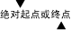

# UI 自动化 TextPattern 概述UI Automation TextPattern Overview
> [!NOTE]
>  本文档适用于想要使用 [!INCLUDE[TLA2#tla_uiautomation](../../../includes/tla2sharptla-uiautomation-md.md)] 命名空间中定义的托管 <xref:System.Windows.Automation> 类的 .NET Framework 开发人员。This documentation is intended for .NET Framework developers who want to use the managed [!INCLUDE[TLA2#tla_uiautomation](../../../includes/tla2sharptla-uiautomation-md.md)] classes defined in the <xref:System.Windows.Automation> namespace. 有关 [!INCLUDE[TLA2#tla_uiautomation](../../../includes/tla2sharptla-uiautomation-md.md)]的最新信息，请参阅 [Windows 自动化 API：UI 自动化](http://go.microsoft.com/fwlink/?LinkID=156746)。For the latest information about [!INCLUDE[TLA2#tla_uiautomation](../../../includes/tla2sharptla-uiautomation-md.md)], see [Windows Automation API: UI Automation](http://go.microsoft.com/fwlink/?LinkID=156746).  
  
 本概述介绍如何使用 [!INCLUDE[TLA#tla_uiautomation](../../../includes/tlasharptla-uiautomation-md.md)] 公开文本内容，其中包括在 [!INCLUDE[TLA2#tla_uiautomation](../../../includes/tla2sharptla-uiautomation-md.md)]支持的平台中的文本控件的格式和样式特性。This overview describes how to use [!INCLUDE[TLA#tla_uiautomation](../../../includes/tlasharptla-uiautomation-md.md)] to expose the textual content, including format and style attributes, of text controls in [!INCLUDE[TLA2#tla_uiautomation](../../../includes/tla2sharptla-uiautomation-md.md)]-supported platforms. 这些控件包括但不限于 Microsoft.NET Framework<xref:System.Windows.Controls.TextBox>和<xref:System.Windows.Controls.RichTextBox>以及其[!INCLUDE[TLA2#tla_win32](../../../includes/tla2sharptla-win32-md.md)]等效项。These controls include, but are not limited to, the Microsoft .NET Framework <xref:System.Windows.Controls.TextBox> and <xref:System.Windows.Controls.RichTextBox> as well as their [!INCLUDE[TLA2#tla_win32](../../../includes/tla2sharptla-win32-md.md)] equivalents.  
  
 控件文本内容的功能通过使用 <xref:System.Windows.Automation.TextPattern> 控件模式完成，该控件模式表示作为文本流的文本容器的内容。Exposing the textual content of a control is accomplished through the use of the <xref:System.Windows.Automation.TextPattern> control pattern, which represents the contents of a text container as a text stream. 与之相反， <xref:System.Windows.Automation.TextPattern> 需要 <xref:System.Windows.Automation.Text.TextPatternRange> 的支持，以公开格式和样式特性。In turn, <xref:System.Windows.Automation.TextPattern> requires the support of the <xref:System.Windows.Automation.Text.TextPatternRange> class to expose format and style attributes. <xref:System.Windows.Automation.Text.TextPatternRange> 通过采用一系列 <xref:System.Windows.Automation.TextPattern> 和 <xref:System.Windows.Automation.Text.TextPatternRangeEndpoint.Start> 终结点表示文本容器中连续或多个不连续的的文本段来支持 <xref:System.Windows.Automation.Text.TextPatternRangeEndpoint.End> 。<xref:System.Windows.Automation.Text.TextPatternRange> supports <xref:System.Windows.Automation.TextPattern> by representing contiguous or multiple, disjoint text spans in a text container with a collection of <xref:System.Windows.Automation.Text.TextPatternRangeEndpoint.Start> and <xref:System.Windows.Automation.Text.TextPatternRangeEndpoint.End> endpoints. <xref:System.Windows.Automation.Text.TextPatternRange> 支持功能包括选择、比较、检索和遍历。<xref:System.Windows.Automation.Text.TextPatternRange> supports functionality such as selection, comparison, retrieval and traversal.  
  
> [!NOTE]
>  <xref:System.Windows.Automation.TextPattern> 类不提供插入或修改文本的方法。The <xref:System.Windows.Automation.TextPattern> classes do not provide a means to insert or modify text. 但是，具体取决于该控件，这可以通过 [!INCLUDE[TLA2#tla_uiautomation](../../../includes/tla2sharptla-uiautomation-md.md)] <xref:System.Windows.Automation.ValuePattern> 或直接键盘输入得到解决。However, depending on the control, this may be accomplished by the [!INCLUDE[TLA2#tla_uiautomation](../../../includes/tla2sharptla-uiautomation-md.md)] <xref:System.Windows.Automation.ValuePattern> or through direct keyboard input. 请参阅[TextPattern 插入文本示例](http://msdn.microsoft.com/library/67353f93-7ee2-42f2-ab76-5c078cf6ca16)有关示例。See the [TextPattern Insert Text Sample](http://msdn.microsoft.com/library/67353f93-7ee2-42f2-ab76-5c078cf6ca16) for an example.  
  
 本概述中所述的功能对辅助技术供应商及其最终用户至关重要。The functionality described in this overview is vital to assistive technology vendors and their end users. 辅助技术可以使用 [!INCLUDE[TLA2#tla_uiautomation](../../../includes/tla2sharptla-uiautomation-md.md)] 为用户收集完整的文本格式信息，并通过 <xref:System.Windows.Automation.Text.TextUnit> （字符、单词、行或段落）提供编程方式导航和文本选择。Assistive technologies can use [!INCLUDE[TLA2#tla_uiautomation](../../../includes/tla2sharptla-uiautomation-md.md)] to gather complete text formatting information for the user and provide programmatic navigation and selection of text by <xref:System.Windows.Automation.Text.TextUnit> (character, word, line, or paragraph).  
  
   
## UI 自动化 TextPattern 与文本服务框架UI Automation TextPattern vs. Text Services Framework  
 [!INCLUDE[TLA#tla_tsf](../../../includes/tlasharptla-tsf-md.md)] 是一个简单的可伸缩系统框架，允许自然语言服务和在桌面上和应用程序中进行高级的文本输入。 is a simple and scalable system framework that enables natural language services and advanced text input on the desktop and within applications. 除了为应用程序提供接口以公开其文本存储，它还支持该文本存储的元数据。In addition to providing interfaces for applications to expose their text store it also supports metadata for that text store.  
  
 但是， [!INCLUDE[TLA2#tla_tsf](../../../includes/tla2sharptla-tsf-md.md)] 适用于需要将输入注入到上下文感知的情境中，而 <xref:System.Windows.Automation.TextPattern> 是只读解决方案（如上所示，具有有限的解决方法），用于提供对屏幕阅读器和盲文设备的文本存储的优化访问。However, [!INCLUDE[TLA2#tla_tsf](../../../includes/tla2sharptla-tsf-md.md)] was designed for applications that need to inject input into context-aware scenarios whereas <xref:System.Windows.Automation.TextPattern> is a read-only solution (with the limited workaround noted above) meant to provide optimized access to a text store for screen-readers and Braille devices.  
  
 简单来说，需要对文本存储的只读访问权限的可访问技术可以使用 <xref:System.Windows.Automation.TextPattern>，但对于上下文感知输入则需要更复杂的 [!INCLUDE[TLA2#tla_tsf](../../../includes/tla2sharptla-tsf-md.md)] 功能。In short, accessible technologies that require read-only access to a text store can use <xref:System.Windows.Automation.TextPattern>, but will need the more complex functionality of [!INCLUDE[TLA2#tla_tsf](../../../includes/tla2sharptla-tsf-md.md)] for context-aware input.  
  
   
## 控件类型Control Types  
  
#### TextText  
 Text 控件是表示屏幕上一段文本的基本元素。The Text control is the basic element representing a piece of text on the screen.  
  
 独立的文本控件可用作标签或窗体上的静态文本。A standalone text control can be used as a label or static text on a form. 文本控件也可包含在 <xref:System.Windows.Automation.ControlType.ListItem>、 <xref:System.Windows.Automation.ControlType.TreeItem> 或 <xref:System.Windows.Automation.ControlType.DataItem>的结构中。Text controls can also be contained within the structure of a <xref:System.Windows.Automation.ControlType.ListItem>, <xref:System.Windows.Automation.ControlType.TreeItem> or <xref:System.Windows.Automation.ControlType.DataItem>.  
  
> [!NOTE]
>  文本控件可能不会显示在 [!INCLUDE[TLA2#tla_uiautomation](../../../includes/tla2sharptla-uiautomation-md.md)] 树的内容视图中（请参阅 [UI Automation Tree Overview](../../../docs/framework/ui-automation/ui-automation-tree-overview.md)）。Text controls might not appear in the content view of the [!INCLUDE[TLA2#tla_uiautomation](../../../includes/tla2sharptla-uiautomation-md.md)] tree (see [UI Automation Tree Overview](../../../docs/framework/ui-automation/ui-automation-tree-overview.md)). 这是因为文本控件通常通过另一个控件的 Name 属性显示。This is because text controls are often displayed through the Name property of another control. 例如，用于标记编辑控件的文本是通过编辑控件的 Name 属性公开的。For instance, the text that is used to label an Edit control is exposed through the Name property of the Edit control. 因为，此编辑控件位于 [!INCLUDE[TLA2#tla_uiautomation](../../../includes/tla2sharptla-uiautomation-md.md)] 树的内容视图中，文本元素自身没有必要处于 [!INCLUDE[TLA2#tla_uiautomation](../../../includes/tla2sharptla-uiautomation-md.md)] 树的视图中。Because the Edit control is in the content view of the [!INCLUDE[TLA2#tla_uiautomation](../../../includes/tla2sharptla-uiautomation-md.md)] tree, it is not necessary for the text element itself to be in that view of the [!INCLUDE[TLA2#tla_uiautomation](../../../includes/tla2sharptla-uiautomation-md.md)] tree. 在内容视图中显示的唯一文本为不是冗余信息的文本。The only text that shows up in the content view is text that is not redundant information. 这能让任何辅助技术仅对其用户需要的信息段进行快速筛选。This enables any assistive technology to quickly filter only on the pieces of information that their users need.  
  
#### 编辑Edit  
 编辑控件使用户可以查看和编辑单个文本行。Edit controls enable a user to view and edit a single line of text.  
  
> [!NOTE]
>  在某些布局方案中，单个文本行可能会换行。The single line of text may wrap in certain layout scenarios.  
  
#### DocumentDocument  
 文档控件能让用户导航并从多个页面的文本上获取的信息。Document controls let a user navigate and obtain information from multiple pages of text.  
  
   
## TextPattern 客户端 API 的TextPattern Client API's  
  
|||  
|-|-|  
|`System.Windows.Automation.TextPattern Class`|文本模型 [!INCLUDE[TLA#tla_uiautomation](../../../includes/tlasharptla-uiautomation-md.md)] 的入口点。The entry point for the [!INCLUDE[TLA#tla_uiautomation](../../../includes/tlasharptla-uiautomation-md.md)] text model.   此类还包含两个 <xref:System.Windows.Automation.TextPattern> 事件侦听器： <xref:System.Windows.Automation.TextPattern.TextSelectionChangedEvent> 和 <xref:System.Windows.Automation.TextPattern.TextChangedEvent>。This class also contains the two <xref:System.Windows.Automation.TextPattern> event listeners, <xref:System.Windows.Automation.TextPattern.TextSelectionChangedEvent> and <xref:System.Windows.Automation.TextPattern.TextChangedEvent>.|  
|`System.Windows.Automation.Text.TextPatternRange Class`|支持 <xref:System.Windows.Automation.TextPattern>的文本容器内的文本段的表示形式。The representation of a span of text within a text container that supports <xref:System.Windows.Automation.TextPattern>.   UI 自动化客户端应该小心使用 <xref:System.Windows.Automation.Text.TextPatternRange>创建的文本范围的当前有效性。UI Automation clients should be careful about the current validity of a text range created using <xref:System.Windows.Automation.Text.TextPatternRange>. 如果新的文本完全替换文本控件中的原始文本，则当前的文本范围将变为无效。If the original text in the text control is completely replaced by new text, the current text range becomes invalid. 但是，如果只更改了原始文本的一部分，并且基础的文本控件使用定位点（或终结点）而不是绝对字符定位来管理其文本“指示器”，则文本范围可能仍具有有效性。However, the text range may still have some viability if only part of the original text is changed and the underlying text control is managing its text "pointer" with anchors (or endpoints) rather than with absolute character positioning.   客户端可以侦听 <xref:System.Windows.Automation.TextPattern.TextChangedEvent> ，获取任何他们正在处理的文本内容的更改通知。Clients can listen for a <xref:System.Windows.Automation.TextPattern.TextChangedEvent> for notification of any changes to the textual content they are working with.|  
|`System.Windows.Automation.AutomationTextAttribute Class`|用于标识文本范围的格式属性。Used to identify the formatting attributes of a text range.|  
  
   
## TextPattern 提供程序 API 的TextPattern Provider API's  
 在本机或通过 <xref:System.Windows.Automation.TextPattern> 代理的方式执行 <xref:System.Windows.Automation.Provider.ITextProvider> 和 <xref:System.Windows.Automation.Provider.ITextRangeProvider> 接口来支持 [!INCLUDE[TLA#tla_uiautomation](../../../includes/tlasharptla-uiautomation-md.md)] 的 UI 元素或控件，除了提供强大的导航功能之外，还能够公开它们包含的任何文本的详细的属性信息。UI elements or controls that support <xref:System.Windows.Automation.TextPattern> by implementing the <xref:System.Windows.Automation.Provider.ITextProvider> and <xref:System.Windows.Automation.Provider.ITextRangeProvider> interfaces, either natively or through [!INCLUDE[TLA#tla_uiautomation](../../../includes/tlasharptla-uiautomation-md.md)] proxies, are capable of exposing detailed attribute information for any text they contain in addition to providing robust navigational capabilities.  
  
 如果控件缺少对任何特定特性的支持，则 <xref:System.Windows.Automation.TextPattern> 提供程序不需要支持所有的文本特性。A <xref:System.Windows.Automation.TextPattern> provider does not have to support all text attributes if the control lacks support for any particular attributes.  
  
 如果控件支持在文本区域（或系统插入标记）内的文本选择或位置，则 <xref:System.Windows.Automation.TextPattern> 提供程序必须支持 <xref:System.Windows.Automation.TextPattern.GetSelection%2A> 和 <xref:System.Windows.Automation.Text.TextPatternRange.Select%2A> 函数。A <xref:System.Windows.Automation.TextPattern> provider must support the <xref:System.Windows.Automation.TextPattern.GetSelection%2A> and <xref:System.Windows.Automation.Text.TextPatternRange.Select%2A> functions if the control supports text selection or placement of the text cursor (or system caret) within the text area. 如果该控件不支持此功能，则它不必支持上述任一方法。If the control does not support this functionality then it does not need to support either of these methods. 但是，该控件必须通过执行 <xref:System.Windows.Automation.Provider.ITextProvider.SupportedTextSelection%2A> 属性公开其支持的文本选择类型。However, the control must expose the type of text selection it supports by implementing the <xref:System.Windows.Automation.Provider.ITextProvider.SupportedTextSelection%2A> property.  
  
 一个 <xref:System.Windows.Automation.TextPattern> 提供程序必须始终支持 <xref:System.Windows.Automation.Text.TextUnit> 常量 <xref:System.Windows.Automation.Text.TextUnit.Character> 和 <xref:System.Windows.Automation.Text.TextUnit.Document> 及其支持的任何其他 <xref:System.Windows.Automation.Text.TextUnit> 常量。A <xref:System.Windows.Automation.TextPattern> provider must always support the <xref:System.Windows.Automation.Text.TextUnit> constants <xref:System.Windows.Automation.Text.TextUnit.Character> and <xref:System.Windows.Automation.Text.TextUnit.Document> as well as any other <xref:System.Windows.Automation.Text.TextUnit> constants it is capable of supporting.  
  
> [!NOTE]
>  提供程序可以跳过某一特定 <xref:System.Windows.Automation.Text.TextUnit> 的支持，只需通过按如下顺序延迟到下一个受支持的最大 <xref:System.Windows.Automation.Text.TextUnit>：<xref:System.Windows.Automation.Text.TextUnit.Character><xref:System.Windows.Automation.Text.TextUnit.Format><xref:System.Windows.Automation.Text.TextUnit.Word><xref:System.Windows.Automation.Text.TextUnit.Line>、<xref:System.Windows.Automation.Text.TextUnit.Paragraph>、<xref:System.Windows.Automation.Text.TextUnit.Page> 和 <xref:System.Windows.Automation.Text.TextUnit.Document>。The provider may skip support for a specific <xref:System.Windows.Automation.Text.TextUnit> by deferring to the next largest <xref:System.Windows.Automation.Text.TextUnit> supported in the following order: <xref:System.Windows.Automation.Text.TextUnit.Character>, <xref:System.Windows.Automation.Text.TextUnit.Format>, <xref:System.Windows.Automation.Text.TextUnit.Word>, <xref:System.Windows.Automation.Text.TextUnit.Line>, <xref:System.Windows.Automation.Text.TextUnit.Paragraph>, <xref:System.Windows.Automation.Text.TextUnit.Page>, and <xref:System.Windows.Automation.Text.TextUnit.Document>.  
  
|||  
|-|-|  
|`ITextProvider Interface`|公开在客户端应用程序中支持 <xref:System.Windows.Automation.TextPattern> 的方法、属性和特性（请参阅 <xref:System.Windows.Automation.Provider.ITextProvider>）。Exposes methods, properties and attributes that support <xref:System.Windows.Automation.TextPattern> in client applications (see <xref:System.Windows.Automation.Provider.ITextProvider>).|  
|`ITextRangeProvider Interface`|表示文本提供程序中的一段文本（请参阅 <xref:System.Windows.Automation.Provider.ITextRangeProvider>）。Represents a span of text in a text provider (see <xref:System.Windows.Automation.Provider.ITextRangeProvider>).|  
|`System.Windows.Automation.TextPatternIdentifiers Class`|包含用作文本提供程序标识符的值（请参阅 <xref:System.Windows.Automation.TextPatternIdentifiers>）。Contains values that are used as identifiers for text providers (see <xref:System.Windows.Automation.TextPatternIdentifiers>).|  
  
   
## 安全性Security  
 [!INCLUDE[TLA2#tla_uiautomation](../../../includes/tla2sharptla-uiautomation-md.md)]体系结构的设计考虑到了安全性 (请参阅[UI 自动化安全性概述](../../../docs/framework/ui-automation/ui-automation-security-overview.md))。The [!INCLUDE[TLA2#tla_uiautomation](../../../includes/tla2sharptla-uiautomation-md.md)] architecture was designed with security in mind (see [UI Automation Security Overview](../../../docs/framework/ui-automation/ui-automation-security-overview.md)). 但是，此概述中所述的 TextPattern 类需要一些特定的安全注意事项。However, the TextPattern classes described in this overview require some specific security considerations.  
  
-   [!INCLUDE[TLA#tla_uiautomation](../../../includes/tlasharptla-uiautomation-md.md)] 文本提供程序提供只读接口，并且不提供能够更改控件中的现有文本的功能。 text providers supply read-only interfaces and do not provide the ability to change the existing text in a control.  
  
-   如果 UI 自动化客户端是完全“信任”的，则 UI 自动化客户端只能使用 [!INCLUDE[TLA#tla_uiautomation](../../../includes/tlasharptla-uiautomation-md.md)] 。UI Automation clients can only use [!INCLUDE[TLA#tla_uiautomation](../../../includes/tlasharptla-uiautomation-md.md)] if they are fully "trusted". 此示例将为受保护的登录桌面，只有已知和受信任的应用程序可以运行。An example of this would be the protected Logon Desktop, where only known and trusted applications can run.  
  
-   UI 自动化提供程序的开发人员应注意：所有他们选择通过 [!INCLUDE[TLA#tla_uiautomation](../../../includes/tlasharptla-uiautomation-md.md)] 在控件中公开的信息实质上是公用的并且其他代码都可访问。Developers of UI Automation providers should be aware that all information they choose to expose in their controls through [!INCLUDE[TLA#tla_uiautomation](../../../includes/tlasharptla-uiautomation-md.md)] is essentially public and fully accessible by other code. [!INCLUDE[TLA#tla_uiautomation](../../../includes/tlasharptla-uiautomation-md.md)] 不会尝试确定任何 UI 自动化客户端的可信度，因此 UI 自动化提供程序不应公开受保护内容或敏感文本信息（如密码字段）。 makes no effort to determine the trustworthiness of any UI Automation client and therefore the UI Automation provider should not expose protected content or sensitive textual information (such as password fields).  
  
-   [!INCLUDE[TLA#tla_winvista](../../../includes/tlasharptla-winvista-md.md)] 安全性最重要的更改之一是：广泛地称为“安全输入”，其包括如最低特权（或有限权限）、用户帐户 (LUA) 和用户界面特权级别隔离 (UIPI) 在内的技术。One of the most significant changes in security for [!INCLUDE[TLA#tla_winvista](../../../includes/tlasharptla-winvista-md.md)] is broadly referred to as "Secure Input" which encompasses technologies such as Least-privileged (or Limited) User Accounts (LUA) and UI Privilege Level Isolation (UIPI).  
  
    -   UIPI 防止一个程序控制和/或监控另一个具有更多“特权”的程序，防止欺骗用户输入的跨进程窗口消息攻击。UIPI prevents one program from controlling and/or monitoring another more "privileged" program, preventing cross-process window message attacks that spoof user input.  
  
    -   LUA 对 Administrators 组中的用户正在运行的应用程序的权限进行限制设置。LUA sets limits on the privileges of applications being run by users in the Administrators group. 应用程序不一定具有管理员权限，但将以必需的最低权限运行。Applications won't necessarily have administrator privileges, but will instead run with the least privileges necessary. 因此，可能会在 LUA 方案中强制执行一些限制。As a consequence, there may be some restrictions enforced in LUA scenarios. 最值得注意的字符串截断（包括 TextPattern 字符串），可能有必要限制从管理员级别的应用程序检索的字符串的大小，因此它们不会被强制将内存分配给禁用该应用程序的点。Most notably string truncation (including TextPattern strings), where it may be necessary to limit the size of strings being retrieved from administrator-level applications so they aren't forced to allocate memory to the point of disabling the application.  
  
   
## 性能Performance  
 由于 TextPattern 依赖于跨进程调用其大多数功能，处理内容时，它不提供缓存机制来提高性能。Because TextPattern relies on cross-process calls for most of its functionality, it does not provide a caching mechanism to improve performance when processing content. 这与其他可以使用 [!INCLUDE[TLA#tla_uiautomation](../../../includes/tlasharptla-uiautomation-md.md)] 或 <xref:System.Windows.Automation.AutomationElement.GetCachedPattern%2A> 方法访问的 <xref:System.Windows.Automation.AutomationElement.TryGetCachedPattern%2A> 中的控件模式不同。This is unlike other control patterns in [!INCLUDE[TLA#tla_uiautomation](../../../includes/tlasharptla-uiautomation-md.md)] that can be accessed using the <xref:System.Windows.Automation.AutomationElement.GetCachedPattern%2A> or <xref:System.Windows.Automation.AutomationElement.TryGetCachedPattern%2A> methods.  
  
 改善性能的一种策略是通过确保 UI 自动化客户端使用 <xref:System.Windows.Automation.Text.TextPatternRange.GetText%2A>尝试检索中等规模的文本块。One tactic for improving performance is by making sure UI Automation clients attempt to retrieve moderately-sized blocks of text using <xref:System.Windows.Automation.Text.TextPatternRange.GetText%2A>. 例如，GetText(1) 调用将对每个字符产生跨进程命中，而一次 GetText(-1) 调用将产生一次跨进程命中，但根据文本提供程序的大小，可以具有高延时。For example, GetText(1) calls will incur cross-process hits for each character whereas one GetText(-1) call will incur one cross-process hit, but can have high latency depending on the size of the text provider.  
  
   
## TextPattern 术语TextPattern Terminology  
 **特性****Attribute**  
 文本范围的格式特性（例如， <xref:System.Windows.Automation.TextPattern.IsItalicAttribute> 或 <xref:System.Windows.Automation.TextPattern.FontNameAttribute>）。A formatting characteristic of a text range (for example, <xref:System.Windows.Automation.TextPattern.IsItalicAttribute> or <xref:System.Windows.Automation.TextPattern.FontNameAttribute>).  
  
 **退化范围****Degenerate Range**  
 退化范围为空或零字符文本区域。A degenerate range is an empty or zero-character text range. 出于 TextPattern 控件模式的目的，文本插入点（或系统插入标记）被视为退化范围。For the purposes of the TextPattern control pattern, the text insertion point (or system caret) is considered a degenerate range. 如果未选择文本， <xref:System.Windows.Automation.TextPattern.GetSelection%2A> 将返回文本插入点处的退化范围， <xref:System.Windows.Automation.TextPattern.RangeFromPoint%2A> 将返回退化范围作为其起始终结点。If no text is selected, <xref:System.Windows.Automation.TextPattern.GetSelection%2A> would return a degenerate range at the text insertion point and <xref:System.Windows.Automation.TextPattern.RangeFromPoint%2A> would return a degenerate range as its starting endpoint. 文本提供程序找不到任何与给定条件相匹配的文本范围时，<xref:System.Windows.Automation.TextPattern.RangeFromChild%2A> 和 <xref:System.Windows.Automation.TextPattern.GetVisibleRanges%2A> 可能会返回退化范围。<xref:System.Windows.Automation.TextPattern.RangeFromChild%2A> and <xref:System.Windows.Automation.TextPattern.GetVisibleRanges%2A> may return degenerate ranges when the text provider cannot find any text ranges that match the given condition. 此退化范围可用作文本提供程序内的起始终结点。This degenerate range can be used as a starting endpoint within the text provider. <xref:System.Windows.Automation.Text.TextPatternRange.FindText%2A> 和<xref:System.Windows.Automation.Text.TextPatternRange.FindAttribute%2A>返回空引用 (`Nothing`在 Microsoft Visual Basic.NET) 以避免与发现范围和退化范围相混淆。<xref:System.Windows.Automation.Text.TextPatternRange.FindText%2A> and <xref:System.Windows.Automation.Text.TextPatternRange.FindAttribute%2A> return a null reference (`Nothing` in Microsoft Visual Basic .NET) to avoid confusion with a discovered range versus a degenerate range.  
  
 **嵌入式对象****Embedded Object**  
 在 [!INCLUDE[TLA2#tla_uiautomation](../../../includes/tla2sharptla-uiautomation-md.md)] 文本模型中，有两种类型的嵌入对象。There are two types of embedded objects in the [!INCLUDE[TLA2#tla_uiautomation](../../../includes/tla2sharptla-uiautomation-md.md)] text model. 它们包含基于文本的内容元素，如超链接或表，以及控制元素（如图像和按钮）。They consist of text-based content elements such as hyperlinks or tables, and control elements such as images and buttons. 有关详细信息，请参见 [Access Embedded Objects Using UI Automation](../../../docs/framework/ui-automation/access-embedded-objects-using-ui-automation.md)。For more detailed information, see [Access Embedded Objects Using UI Automation](../../../docs/framework/ui-automation/access-embedded-objects-using-ui-automation.md).  
  
 **终结点****Endpoint**  
 文本容器内的文本范围的绝对 <xref:System.Windows.Automation.Text.TextPatternRangeEndpoint.Start> 或 <xref:System.Windows.Automation.Text.TextPatternRangeEndpoint.End> 点。The absolute <xref:System.Windows.Automation.Text.TextPatternRangeEndpoint.Start> or <xref:System.Windows.Automation.Text.TextPatternRangeEndpoint.End> point of a text range within a text container.  
  
 ![TextPatternRangeEndpoints&#40;开头和结尾&#41;。] (../../../docs/framework/ui-automation/media/uia-textpattern-endpoints.PNG "UIA_TextPattern_Endpoints")  
下面显示了一套起始点和终结点。The following illustrates a set of start and end points.  
  
 **TextRange****TextRange**  
 表示包括所有的相关特性和功能的文本容器中带起始点和终结点的一段文本。A representation of a span of text, with start and end points, in a text container including all associated attributes and functionality.  
  
 <xref:System.Windows.Automation.Text.TextUnit>  
 用于导航文本范围的逻辑分段的预定义文本单元（字符、单词、行或段落）。A pre-defined unit of text (character, word, line, or paragraph) used for navigating through logical segments of a text range.  
  
## 请参阅See Also  
 [客户端的 UI 自动化控件模式UI Automation Control Patterns for Clients](../../../docs/framework/ui-automation/ui-automation-control-patterns-for-clients.md)  
 [UI 自动化控件模式概述UI Automation Control Patterns Overview](../../../docs/framework/ui-automation/ui-automation-control-patterns-overview.md)  
 [UI 自动化树概述UI Automation Tree Overview](../../../docs/framework/ui-automation/ui-automation-tree-overview.md)  
 [在 UI 自动化中使用缓存Use Caching in UI Automation](../../../docs/framework/ui-automation/use-caching-in-ui-automation.md)  
 [在 UI 自动化提供程序中支持控件模式Support Control Patterns in a UI Automation Provider](../../../docs/framework/ui-automation/support-control-patterns-in-a-ui-automation-provider.md)  
 [UI 自动化客户端的控件模式映射Control Pattern Mapping for UI Automation Clients](../../../docs/framework/ui-automation/control-pattern-mapping-for-ui-automation-clients.md)  
 [文本服务框架Text Services Framework](http://msdn.microsoft.com/library/default.asp?url=/library/tsf/tsf/text_services_framework.asp)
