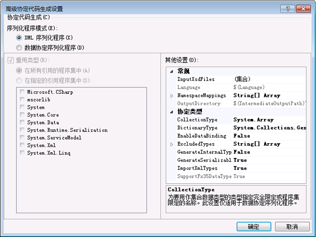

# <a name="contract-first-tool"></a><span data-ttu-id="9ac0f-102">协定优先工具</span><span class="sxs-lookup"><span data-stu-id="9ac0f-102">Contract-First Tool</span></span>
<span data-ttu-id="9ac0f-103">服务协定往往需要从现有的服务创建。</span><span class="sxs-lookup"><span data-stu-id="9ac0f-103">Service contracts often need to be created from existing services.</span></span> <span data-ttu-id="9ac0f-104">在 [!INCLUDE[net_v45](../../../includes/net-v45-md.md)] 中，可以使用协定优先工具从现有服务自动创建数据协定类。</span><span class="sxs-lookup"><span data-stu-id="9ac0f-104">In [!INCLUDE[net_v45](../../../includes/net-v45-md.md)], data contract classes can be created automatically from existing services using the contract-first tool.</span></span> <span data-ttu-id="9ac0f-105">要使用协定优先工具，必须本地下载 XML 架构定义 (XSD) 文件；该工具无法通过 HTTP 导入远程数据协定。</span><span class="sxs-lookup"><span data-stu-id="9ac0f-105">To use the contract-first tool, the XML schema definition file (XSD) must be downloaded locally; the tool cannot import remote data contracts via HTTP.</span></span>

 <span data-ttu-id="9ac0f-106">协定优先工具作为生成任务集成到 Visual Studio 2012。</span><span class="sxs-lookup"><span data-stu-id="9ac0f-106">The contract-first tool is integrated into Visual Studio 2012 as a build task.</span></span> <span data-ttu-id="9ac0f-107">由生成任务所生成的代码文件在每次生成项目时创建，以使项目可以轻松地采用基础服务协定中的更改。</span><span class="sxs-lookup"><span data-stu-id="9ac0f-107">The code files generated by the build task are created every time the project is built, so that the project can easily adopt changes in the underlying service contract.</span></span>

 <span data-ttu-id="9ac0f-108">协定优先工具可以导入的架构类型包括：</span><span class="sxs-lookup"><span data-stu-id="9ac0f-108">Schema types that the contract-first tool can import include the following:</span></span>

```xml
<xsd:complexType>
<xsd:simpleType>
```

 <span data-ttu-id="9ac0f-109">如果它们是基元（如 `Int16` 或 `String`），将不会生成简单类型；如果它们的类型为 `Collection`，将不会生成复杂类型。</span><span class="sxs-lookup"><span data-stu-id="9ac0f-109">Simple types will not be generated if they are primitives such as `Int16` or `String`; complex types will not be generated if they are of type `Collection`.</span></span> <span data-ttu-id="9ac0f-110">如果它们是另一 `xsd:complexType` 的组成部分，则也不会生成类型。</span><span class="sxs-lookup"><span data-stu-id="9ac0f-110">Types will also not be generated if they are part of another `xsd:complexType`.</span></span> <span data-ttu-id="9ac0f-111">在所有这些情况下，这些类型将会被引用到项目中的现有类型。</span><span class="sxs-lookup"><span data-stu-id="9ac0f-111">In all these cases, the types will be referenced to existing types in the project instead.</span></span>

## <a name="adding-a-data-contract-to-a-project"></a><span data-ttu-id="9ac0f-112">向项目中添加数据协定</span><span class="sxs-lookup"><span data-stu-id="9ac0f-112">Adding a data contract to a project</span></span>
 <span data-ttu-id="9ac0f-113">使用协定优先工具之前，服务协定 (XSD) 必须添加到项目中。</span><span class="sxs-lookup"><span data-stu-id="9ac0f-113">Before the contract-first tool can be used, the service contract (XSD) must be added to the project.</span></span> <span data-ttu-id="9ac0f-114">出于本概述的需要，以下协定将用于阐述协定优先函数。</span><span class="sxs-lookup"><span data-stu-id="9ac0f-114">For the purposes of this overview, the following contract will be used to illustrate contract-first functions.</span></span> <span data-ttu-id="9ac0f-115">此服务定义是 Bing 的搜索 API 所使用的服务协定的一个小子集。</span><span class="sxs-lookup"><span data-stu-id="9ac0f-115">This service definition is a small subset of the service contract used by Bing’s search API.</span></span>

```xml
<?xml version="1.0" encoding="utf-8"?>
<xs:schema id="ServiceSchema"
    targetNamespace="http://tempuri.org/ServiceSchema.xsd"
    elementFormDefault="qualified"
    xmlns="http://tempuri.org/ServiceSchema.xsd"
    xmlns:mstns="http://tempuri.org/ServiceSchema.xsd"
    xmlns:xs="http://www.w3.org/2001/XMLSchema"
>
  <xs:complexType name="SearchRequest">
    <xs:sequence>
      <xs:element minOccurs="0" maxOccurs="1" name="Version" type="xs:string" default="2.2" />
      <xs:element minOccurs="0" maxOccurs="1" name="Market" type="xs:string" />
      <xs:element minOccurs="0" maxOccurs="1" name="UILanguage" type="xs:string" />
      <xs:element minOccurs="1" maxOccurs="1" name="Query" type="xs:string" />
      <xs:element minOccurs="1" maxOccurs="1" name="AppId" type="xs:string" />
      <xs:element minOccurs="0" maxOccurs="1" name="Latitude" type="xs:double" />
      <xs:element minOccurs="0" maxOccurs="1" name="Longitude" type="xs:double" />
      <xs:element minOccurs="0" maxOccurs="1" name="Radius" type="xs:double" />
    </xs:sequence>
  </xs:complexType>
  <xs:simpleType name="WebSearchOption">
    <xs:restriction base="xs:string">
      <xs:enumeration value="DisableHostCollapsing" />
      <xs:enumeration value="DisableQueryAlterations" />
    </xs:restriction>
  </xs:simpleType>
</xs:schema>
```

 <span data-ttu-id="9ac0f-116">若要向项目添加上述服务协定，请右键单击该项目并选择**添加新...**.</span><span class="sxs-lookup"><span data-stu-id="9ac0f-116">To add the above service contract to the project, right-click the project and select **Add New…**.</span></span> <span data-ttu-id="9ac0f-117">从“模板”对话框的 WCF 窗格中选择架构定义，然后将新文件命名为 SampleContract.xsd。</span><span class="sxs-lookup"><span data-stu-id="9ac0f-117">Select Schema Definition from the WCF pane of the Templates dialog, and name the new file SampleContract.xsd.</span></span> <span data-ttu-id="9ac0f-118">复制上面的代码并粘贴到新文件的代码视图中。</span><span class="sxs-lookup"><span data-stu-id="9ac0f-118">Copy and paste the above code into the code view of the new file.</span></span>

## <a name="configuring-contract-first-options"></a><span data-ttu-id="9ac0f-119">配置协定优先选项</span><span class="sxs-lookup"><span data-stu-id="9ac0f-119">Configuring contract-first options</span></span>
 <span data-ttu-id="9ac0f-120">协定优先选项可以配置 WCF 项目中的属性菜单中。</span><span class="sxs-lookup"><span data-stu-id="9ac0f-120">Contract-first options can be configured in the Properties menu of a WCF project.</span></span> <span data-ttu-id="9ac0f-121">若要启用协定优先开发，请选择**XSD 作为类型定义语言**项目属性窗口的 WCF 页中的复选框。</span><span class="sxs-lookup"><span data-stu-id="9ac0f-121">To enable contract-first development, select the **Enable XSD as Type Definition Language** check box in the WCF page of the project properties window.</span></span>

 <span data-ttu-id="9ac0f-122"></span><span class="sxs-lookup"><span data-stu-id="9ac0f-122"></span></span>

 <span data-ttu-id="9ac0f-123">要配置高级属性，请单击“高级”按钮。</span><span class="sxs-lookup"><span data-stu-id="9ac0f-123">To configure advanced properties, click the Advanced button.</span></span>

 <span data-ttu-id="9ac0f-124"></span><span class="sxs-lookup"><span data-stu-id="9ac0f-124"></span></span>

 <span data-ttu-id="9ac0f-125">可以从协定中配置下列高级设置用于代码生成。</span><span class="sxs-lookup"><span data-stu-id="9ac0f-125">The following advanced settings can be configured for code generation from contracts.</span></span> <span data-ttu-id="9ac0f-126">只能为项目中的所有文件配置设置；目前不能为单独的文件配置设置。</span><span class="sxs-lookup"><span data-stu-id="9ac0f-126">Settings can only be configured for all of the files in the project; settings cannot be configured for individual files at this time.</span></span>

-   <span data-ttu-id="9ac0f-127">**序列化程序模式**： 此设置确定哪个序列化程序用于读取服务协定文件。</span><span class="sxs-lookup"><span data-stu-id="9ac0f-127">**Serializer Mode**: This setting determines which serializer is used for reading service contract files.</span></span> <span data-ttu-id="9ac0f-128">时**XML 序列化程序**已选中**集合类型**并**重用类型**选项处于禁用状态。</span><span class="sxs-lookup"><span data-stu-id="9ac0f-128">When **XML Serializer** is selected, the **Collection Types** and **Reuse Types** options are disabled.</span></span> <span data-ttu-id="9ac0f-129">这些选项仅适用于**数据协定序列化程序**。</span><span class="sxs-lookup"><span data-stu-id="9ac0f-129">These options only apply to the **Data Contract Serializer**.</span></span>

-   <span data-ttu-id="9ac0f-130">**重新使用的类型**： 此设置指定哪些库用于类型重用。</span><span class="sxs-lookup"><span data-stu-id="9ac0f-130">**Reuse Types**: This setting specifies which libraries are used for type reuse.</span></span> <span data-ttu-id="9ac0f-131">此设置才适用**序列化程序模式**设置为**数据协定序列化程序**。</span><span class="sxs-lookup"><span data-stu-id="9ac0f-131">This setting only applies if **Serializer Mode** is set to **Data Contract Serializer**.</span></span>

-   <span data-ttu-id="9ac0f-132">**集合类型**： 此设置指定要用作集合数据类型的完全限定或程序集限定类型。</span><span class="sxs-lookup"><span data-stu-id="9ac0f-132">**Collection Type**: This setting specifies the fully-qualified or assembly-qualified type to be used for the collection data type.</span></span> <span data-ttu-id="9ac0f-133">此设置才适用**序列化程序模式**设置为**数据协定序列化程序**。</span><span class="sxs-lookup"><span data-stu-id="9ac0f-133">This setting only applies if **Serializer Mode** is set to **Data Contract Serializer**.</span></span>

-   <span data-ttu-id="9ac0f-134">**字典类型**： 此设置指定要用于字典数据类型的完全限定或程序集限定类型。</span><span class="sxs-lookup"><span data-stu-id="9ac0f-134">**Dictionary Type**: This setting specifies the fully-qualified or assembly-qualified type to be used for the dictionary data type.</span></span>

-   <span data-ttu-id="9ac0f-135">**EnableDataBinding**： 此设置指定是否实现<xref:System.ComponentModel.INotifyPropertyChanged>上所有数据类型实现数据绑定接口。</span><span class="sxs-lookup"><span data-stu-id="9ac0f-135">**EnableDataBinding**: This setting specifies whether to implement the <xref:System.ComponentModel.INotifyPropertyChanged> interface on all data types to implement data binding.</span></span>

-   <span data-ttu-id="9ac0f-136">**ExcludedTypes**： 此设置指定的完全限定或程序集限定类型引用的程序集从排除列表。</span><span class="sxs-lookup"><span data-stu-id="9ac0f-136">**ExcludedTypes**:This setting specifies the list of fully-qualified or assembly-qualified types to be excluded from the referenced assemblies.</span></span> <span data-ttu-id="9ac0f-137">此设置才适用**序列化程序模式**设置为**数据协定序列化程序**。</span><span class="sxs-lookup"><span data-stu-id="9ac0f-137">This setting only applies if **Serializer Mode** is set to **Data Contract Serializer**.</span></span>

-   <span data-ttu-id="9ac0f-138">**GenerateInternalTypes**： 此设置指定是否生成标记为内部的类。</span><span class="sxs-lookup"><span data-stu-id="9ac0f-138">**GenerateInternalTypes**: This setting specifies whether to generate classes that are marked as internal.</span></span> <span data-ttu-id="9ac0f-139">此设置才适用**序列化程序模式**设置为**数据协定序列化程序**。</span><span class="sxs-lookup"><span data-stu-id="9ac0f-139">This setting only applies if **Serializer Mode** is set to **Data Contract Serializer**.</span></span>

-   <span data-ttu-id="9ac0f-140">**GenerateSerializableTypes**： 此设置指定是否生成与类<xref:System.SerializableAttribute>属性。</span><span class="sxs-lookup"><span data-stu-id="9ac0f-140">**GenerateSerializableTypes**: This setting specifies whether to generate classes with the <xref:System.SerializableAttribute> attribute.</span></span> <span data-ttu-id="9ac0f-141">此设置才适用**序列化程序模式**设置为**数据协定序列化程序**。</span><span class="sxs-lookup"><span data-stu-id="9ac0f-141">This setting only applies if **Serializer Mode** is set to **Data Contract Serializer**.</span></span>

-   <span data-ttu-id="9ac0f-142">**ImportXMLTypes**： 此设置指定是否将配置数据协定序列化程序，以应用<xref:System.SerializableAttribute>属性为类，而<xref:System.Runtime.Serialization.DataContractAttribute>属性。</span><span class="sxs-lookup"><span data-stu-id="9ac0f-142">**ImportXMLTypes**: This setting specifies whether to configure the data contract serializer to apply the <xref:System.SerializableAttribute> attribute to classes without the <xref:System.Runtime.Serialization.DataContractAttribute> attribute.</span></span>  <span data-ttu-id="9ac0f-143">此设置才适用**序列化程序模式**设置为**数据协定序列化程序**。</span><span class="sxs-lookup"><span data-stu-id="9ac0f-143">This setting only applies if **Serializer Mode** is set to **Data Contract Serializer**.</span></span>

-   <span data-ttu-id="9ac0f-144">**SupportFx35TypedDataSets**： 此设置指定是否以提供其他功能的类型化数据集创建.Net Framework 3.5。</span><span class="sxs-lookup"><span data-stu-id="9ac0f-144">**SupportFx35TypedDataSets**: This setting specifies whether to provide additional functionality for typed data sets created for .Net Framework 3.5.</span></span> <span data-ttu-id="9ac0f-145">当**序列化程序模式**设置为**XML 序列化程序**，则<xref:System.Data.Design.TypedDataSetSchemaImporterExtensionFx35>扩展将添加到 XML 架构导入程序，此值设置为 True 时。</span><span class="sxs-lookup"><span data-stu-id="9ac0f-145">When  **Serializer Mode** is set to **XML Serializer**, the <xref:System.Data.Design.TypedDataSetSchemaImporterExtensionFx35> extension will be added to the XML schema importer when this value is set to True.</span></span> <span data-ttu-id="9ac0f-146">当**序列化程序模式**设置为**数据协定序列化程序**，类型<xref:System.DateTimeOffset>时此值设置为 False，将排除从引用，以便<xref:System.DateTimeOffset>始终生成对于较早的 framework 版本。</span><span class="sxs-lookup"><span data-stu-id="9ac0f-146">When  **Serializer Mode** is set to **Data Contract Serializer**, the type <xref:System.DateTimeOffset> will be excluded from the References when this value is set to False, so that a <xref:System.DateTimeOffset> is always generated for older framework versions.</span></span>

-   <span data-ttu-id="9ac0f-147">**InputXsdFiles**： 此设置指定输入文件的列表。</span><span class="sxs-lookup"><span data-stu-id="9ac0f-147">**InputXsdFiles**: This setting specifies the list of input files.</span></span> <span data-ttu-id="9ac0f-148">每个文件都必须包含有效的 XML 架构。</span><span class="sxs-lookup"><span data-stu-id="9ac0f-148">Each file must contain a valid XML schema.</span></span>

-   <span data-ttu-id="9ac0f-149">**语言**： 此设置指定生成的协定代码的语言。</span><span class="sxs-lookup"><span data-stu-id="9ac0f-149">**Language**: This setting specifies the language of the generated contract code.</span></span> <span data-ttu-id="9ac0f-150">该设置必须为 <xref:System.CodeDom.Compiler.CodeDomProvider> 所识别。</span><span class="sxs-lookup"><span data-stu-id="9ac0f-150">The setting must be recognizable by <xref:System.CodeDom.Compiler.CodeDomProvider>.</span></span>

-   <span data-ttu-id="9ac0f-151">**NamespaceMappings**： 此设置指定从 XSD 目标命名空间到 CLR 命名空间的映射。</span><span class="sxs-lookup"><span data-stu-id="9ac0f-151">**NamespaceMappings**: This setting specifies the mappings from the XSD Target Namespaces to CLR namespaces.</span></span> <span data-ttu-id="9ac0f-152">每个映射应使用以下格式：</span><span class="sxs-lookup"><span data-stu-id="9ac0f-152">Each mapping should use the following format:</span></span>

    ```xml
    "<Schema Namespace>, <CLR Namespace>"
    ```

     <span data-ttu-id="9ac0f-153">XML 序列化程序只接受以下格式的一个映射：</span><span class="sxs-lookup"><span data-stu-id="9ac0f-153">The XML Serializer only accepts one mapping in the following format:</span></span>

    ```xml
    "*, <CLR Namespace>"
    ```

-   <span data-ttu-id="9ac0f-154">**OutputDirectory**： 此设置指定将生成的代码文件的目录。</span><span class="sxs-lookup"><span data-stu-id="9ac0f-154">**OutputDirectory**: This setting specifies the directory where the code files will be generated.</span></span>

 <span data-ttu-id="9ac0f-155">这些设置将用于在生成项目时从服务协定文件中生成服务协定类型。</span><span class="sxs-lookup"><span data-stu-id="9ac0f-155">The settings will be used to generate service contract types from the service contract files when the project is built.</span></span>

## <a name="using-contract-first-development"></a><span data-ttu-id="9ac0f-156">使用协定优先开发</span><span class="sxs-lookup"><span data-stu-id="9ac0f-156">Using contract-first development</span></span>
 <span data-ttu-id="9ac0f-157">向项目添加服务协定并确认生成设置中，通过按生成项目后**F6**。</span><span class="sxs-lookup"><span data-stu-id="9ac0f-157">After adding the service contract to the project and confirming the build settings, build the project by pressing **F6**.</span></span> <span data-ttu-id="9ac0f-158">然后，服务协定中定义的类型将可用于项目中。</span><span class="sxs-lookup"><span data-stu-id="9ac0f-158">The types defined in the service contract will then be available for use in the project.</span></span>

 <span data-ttu-id="9ac0f-159">若要使用在服务协定中定义的类型，请在当前命名空间下添加对 `ContractTypes` 的引用：</span><span class="sxs-lookup"><span data-stu-id="9ac0f-159">To use the types defined in the service contract, add a reference to `ContractTypes` under the current namespace:</span></span>

```csharp
using MyProjectNamespace.ContractTypes;
```

 <span data-ttu-id="9ac0f-160">然后，服务协定中定义的类型将在项目中变得可解析，如下所示。</span><span class="sxs-lookup"><span data-stu-id="9ac0f-160">The types defined in the service contract will then be resolvable in the project, as shown below.</span></span>

 <span data-ttu-id="9ac0f-161"></span><span class="sxs-lookup"><span data-stu-id="9ac0f-161"></span></span>

 <span data-ttu-id="9ac0f-162">在 GeneratedXSDTypes.cs 文件中创建由工具生成的类型。</span><span class="sxs-lookup"><span data-stu-id="9ac0f-162">The types generated by the tool are created in the GeneratedXSDTypes.cs file.</span></span> <span data-ttu-id="9ac0f-163">中创建的文件\<项目目录 > /obj/\<生成配置 > /XSDGeneratedCode/ 目录默认情况下。</span><span class="sxs-lookup"><span data-stu-id="9ac0f-163">The file is created in the \<project directory>/obj/\<build configuration>/XSDGeneratedCode/ directory by default.</span></span> <span data-ttu-id="9ac0f-164">本主题开头的示例架构转换为如下所示：</span><span class="sxs-lookup"><span data-stu-id="9ac0f-164">The sample schema at the beginning of this topic is converted as follows:</span></span>

```csharp
//------------------------------------------------------------------------------
// <auto-generated>
//     This code was generated by a tool.
//     Runtime Version:4.0.30319.17330
//
//     Changes to this file may cause incorrect behavior and will be lost if
//     the code is regenerated.
// </auto-generated>
//------------------------------------------------------------------------------

namespace TestXSD3.ContractTypes
{
    using System.Xml.Serialization;

    /// <remarks/>
    [System.CodeDom.Compiler.GeneratedCodeAttribute("System.Xml", "4.0.30319.17330")]
    [System.SerializableAttribute()]
    [System.Diagnostics.DebuggerStepThroughAttribute()]
    [System.ComponentModel.DesignerCategoryAttribute("code")]
    [System.Xml.Serialization.XmlTypeAttribute(Namespace="http://tempuri.org/ServiceSchema.xsd")]
    [System.Xml.Serialization.XmlRootAttribute(Namespace="http://tempuri.org/ServiceSchema.xsd", IsNullable=true)]
    public partial class SearchRequest
    {

        private string versionField;

        private string marketField;

        private string uILanguageField;

        private string queryField;

        private string appIdField;

        private double latitudeField;

        private bool latitudeFieldSpecified;

        private double longitudeField;

        private bool longitudeFieldSpecified;

        private double radiusField;

        private bool radiusFieldSpecified;

        public SearchRequest()
        {
            this.versionField = "2.2";
        }

        /// <remarks/>
        [System.ComponentModel.DefaultValueAttribute("2.2")]
        public string Version
        {
            get
            {
                return this.versionField;
            }
            set
            {
                this.versionField = value;
            }
        }

        /// <remarks/>
        public string Market
        {
            get
            {
                return this.marketField;
            }
            set
            {
                this.marketField = value;
            }
        }

        /// <remarks/>
        public string UILanguage
        {
            get
            {
                return this.uILanguageField;
            }
            set
            {
                this.uILanguageField = value;
            }
        }

        /// <remarks/>
        public string Query
        {
            get
            {
                return this.queryField;
            }
            set
            {
                this.queryField = value;
            }
        }

        /// <remarks/>
        public string AppId
        {
            get
            {
                return this.appIdField;
            }
            set
            {
                this.appIdField = value;
            }
        }

        /// <remarks/>
        public double Latitude
        {
            get
            {
                return this.latitudeField;
            }
            set
            {
                this.latitudeField = value;
            }
        }

        /// <remarks/>
        [System.Xml.Serialization.XmlIgnoreAttribute()]
        public bool LatitudeSpecified
        {
            get
            {
                return this.latitudeFieldSpecified;
            }
            set
            {
                this.latitudeFieldSpecified = value;
            }
        }

        /// <remarks/>
        public double Longitude
        {
            get
            {
                return this.longitudeField;
            }
            set
            {
                this.longitudeField = value;
            }
        }

        /// <remarks/>
        [System.Xml.Serialization.XmlIgnoreAttribute()]
        public bool LongitudeSpecified
        {
            get
            {
                return this.longitudeFieldSpecified;
            }
            set
            {
                this.longitudeFieldSpecified = value;
            }
        }

        /// <remarks/>
        public double Radius
        {
            get
            {
                return this.radiusField;
            }
            set
            {
                this.radiusField = value;
            }
        }

        /// <remarks/>
        [System.Xml.Serialization.XmlIgnoreAttribute()]
        public bool RadiusSpecified
        {
            get
            {
                return this.radiusFieldSpecified;
            }
            set
            {
                this.radiusFieldSpecified = value;
            }
        }
    }

    /// <remarks/>
    [System.CodeDom.Compiler.GeneratedCodeAttribute("System.Xml", "4.0.30319.17330")]
    [System.SerializableAttribute()]
    [System.Xml.Serialization.XmlTypeAttribute(Namespace="http://tempuri.org/ServiceSchema.xsd")]
    [System.Xml.Serialization.XmlRootAttribute(Namespace="http://tempuri.org/ServiceSchema.xsd", IsNullable=false)]
    public enum WebSearchOption
    {

        /// <remarks/>
        DisableHostCollapsing,

        /// <remarks/>
        DisableQueryAlterations,
    }
}
```

## <a name="errors-and-warnings"></a><span data-ttu-id="9ac0f-165">错误和警告</span><span class="sxs-lookup"><span data-stu-id="9ac0f-165">Errors and warnings</span></span>
 <span data-ttu-id="9ac0f-166">分析 XSD 架构时遇到的错误和警告将显示为生成错误和警告。</span><span class="sxs-lookup"><span data-stu-id="9ac0f-166">Errors and warnings encountered in parsing the XSD schema will appear as build errors and warnings.</span></span>

## <a name="interface-inheritance"></a><span data-ttu-id="9ac0f-167">接口继承</span><span class="sxs-lookup"><span data-stu-id="9ac0f-167">Interface Inheritance</span></span>
 <span data-ttu-id="9ac0f-168">在协定优先开发中无法使用接口继承；这与接口在其他操作中的行为方式一致。</span><span class="sxs-lookup"><span data-stu-id="9ac0f-168">It is not possible to use interface inheritance with contract-first development; this is consistent with the way interfaces behave in other operations.</span></span> <span data-ttu-id="9ac0f-169">为了使用继承基接口的接口，应使用两个单独的终结点。</span><span class="sxs-lookup"><span data-stu-id="9ac0f-169">In order to use an interface that inherits a base interface, use two separate endpoints.</span></span> <span data-ttu-id="9ac0f-170">第一个终结点使用继承的协定，第二个终结点实现基接口。</span><span class="sxs-lookup"><span data-stu-id="9ac0f-170">The first endpoint uses the inherited contract, and the second endpoint implements the base interface.</span></span>
