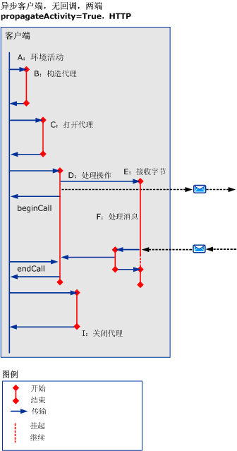
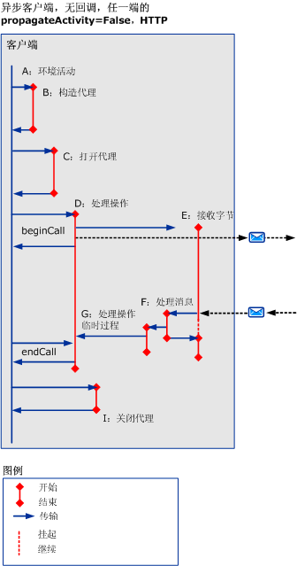
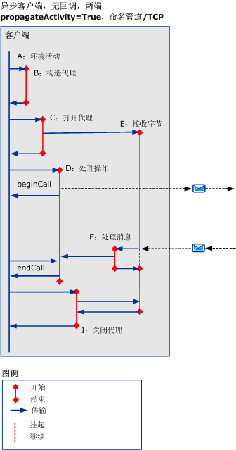
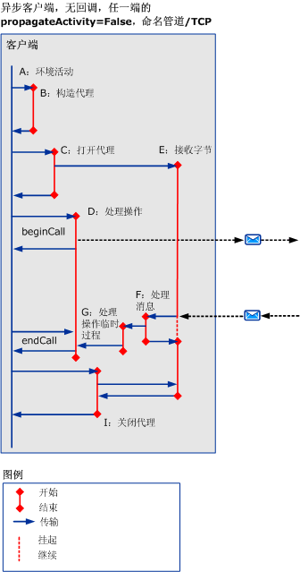
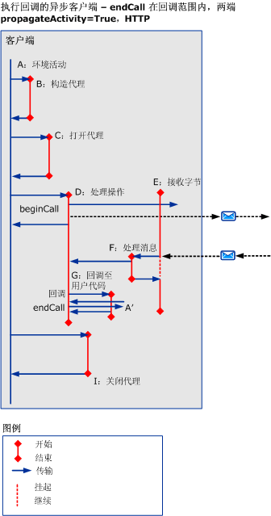
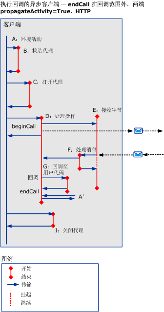
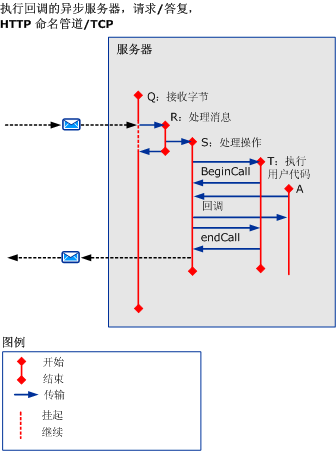

# 使用 HTTP、TCP 或命名管道的异步方案
本主题描述不同异步请求/答复方案的活动和传输，这些异步方案包含使用 HTTP、TCP 或命名管道的多线程请求。  
  
## 未发生错误的异步请求/答复  
 本节描述异步请求/答复方案的活动和传输，该方案包含多线程客户端。  
  
 当 `beginCall` 返回且 `endCall` 返回时，调用方活动终止。 如果调用回调，则回调返回。  
  
 当 `beginCall` 返回、`endCall` 返回，或者当回调返回（如果从被调用的活动中调用回调）时，被调用的活动将终止。  
  
### 不执行回调的异步客户端  
  
#### 在使用 HTTP 的两端启用传播  
   
  
 图 1。 异步客户端且不执行回调， `propagateActivity` = `true`双方，HTTP  
  
 如果`propagateActivity` = `true`，ProcessMessage 指示要传送到哪个 ProcessAction 活动。  
  
 对于基于 HTTP 的方案，ReceiveBytes 将在发送的第一条消息中调用，并在请求的生存期内存在。  
  
#### 在使用 HTTP 的任意一端上禁用传播  
 如果`propagateActivity` = `false`任意一侧，ProcessMessage 不会指示要传送到哪个 ProcessAction 活动。 因此，将调用一个具有新 ID 的新临时 ProcessAction 活动。 当异步响应与 ServiceModel 代码中的请求匹配时，可从本地上下文中检索活动 ID。 可以传送到具有该 ID 的实际 ProcessAction 活动。  
  
   
  
 图 2. 异步客户端且不执行回调， `propagateActivity` = `false`任意一端使用 HTTP  
  
 对于基于 HTTP 的方案，ReceiveBytes 将在发送的第一条消息中调用，并在请求的生存期内存在。  
  
 在异步客户端上创建 Processaction 活动时`propagateActivity` = `false`在调用方或被调用方，并当响应消息不包含 Action 标头。  
  
#### 在使用 TCP 或命名管道的两端启用传播  
   
  
 图 3. 异步客户端且不执行回调， `propagateActivity` = `true`两端使用命名管道 /TCP  
  
 对于命名管道或基于 TCP 的方案，ReceiveBytes 在客户端打开时进行调用，并在连接的生存期内存在。  
  
 类似于图 1，如果`propagateActivity` = `true`，ProcessMessage 指示要传送到哪个 ProcessAction 活动。  
  
#### 在使用 TCP 或命名管道的任意一端上禁用传播  
 对于命名管道或基于 TCP 的方案，ReceiveBytes 在客户端打开时进行调用，并在连接的生存期内存在。  
  
 类似于 Fig.2，如果`propagateActivity` = `false`任意一侧，ProcessMessage 不会指示要传送到哪个 ProcessAction 活动。 因此，将调用一个具有新 ID 的新临时 ProcessAction 活动。 当异步响应与 ServiceModel 代码中的请求匹配时，可从本地上下文中检索活动 ID。 可以传送到具有该 ID 的实际 ProcessAction 活动。  
  
   
  
 图 4。 异步客户端且不执行回调， `propagateActivity` = `false`任意一端使用命名管道 /TCP  
  
### 执行回调的异步客户端  
 此方案将为回调和 `endCall` 添加活动 G 和 A’ 和它们的传入/传出。  
  
 本节仅演示了如何使用具有 HTTP `propragateActivity` = `true`。 但是，其他活动和传送也适用于其他情况下 (即`propagateActivity` = `false`，使用 TCP 或命名管道)。  
  
 当客户端调用用户代码通知结果已准备就绪时，回调将创建新的活动 (G)。 然后，用户代码在回调过程中（如图 5 所示）或回调过程之外（如图 6 所示）调用 `endCall`。 因为它不知道哪个用户活动`endCall`被调用，此活动标记为`A’`。 A’ 可能与 A 相同，也可能不同。  
  
   
  
 图 5。 执行回调、并在回调过程中调用 `endCall` 的异步客户端  
  
   
  
 图 6。 执行回调、并在回调过程之外调用 `endCall` 的异步客户端  
  
### 执行回调的异步服务器  
   
  
 图 7。 执行回调的异步服务器  
  
 通道堆栈在消息接收过程中回调客户端：对此处理的跟踪在 ProcessRequest 活动本身中发出。  
  
## 发生错误的异步请求/答复  
 在 `endCall` 过程中接收到错误消息错误。 否则，活动和传输应与上面的方案类似。  
  
## 发生错误或未发生错误的异步单向方案  
 不会向客户端返回任何响应或错误。
