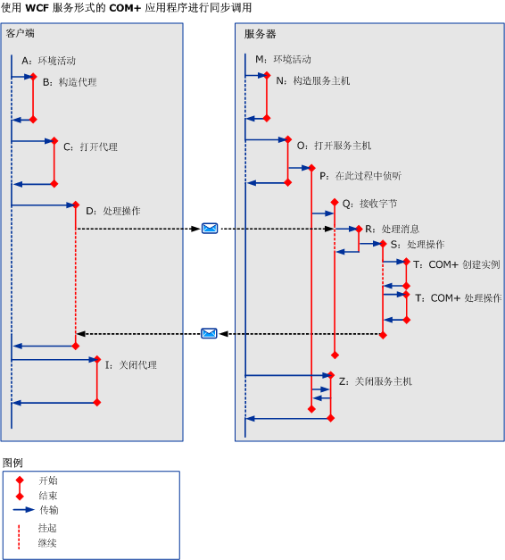

# COM+COM+
下图演示如何在 COM+ 应用程序中使用活动跟踪。The following figure shows how you can use activity tracing in a COM+ application. 可以为每个对 COM+ 对象模型的方法调用定义一个 COM+ 活动，而不是在服务器上执行用户代码。Instead of executing user code on the server, we can define a COM+ activity for each method call to the COM+ object model.  
  
 
