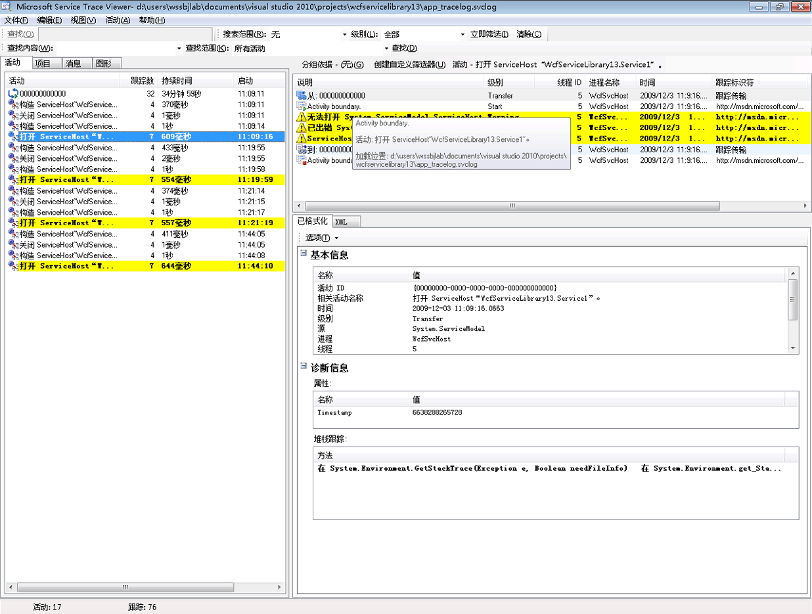
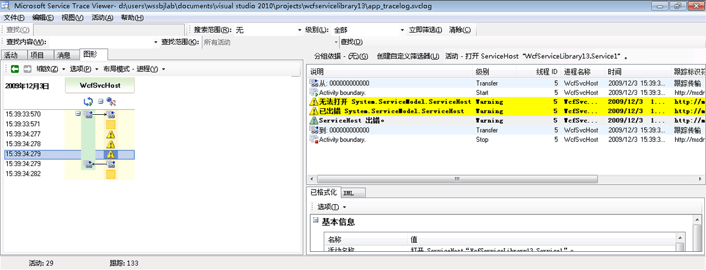

# 发出用户代码跟踪
除了在配置中启用跟踪以收集 [!INCLUDE[indigo1](../../../../../includes/indigo1-md.md)] 生成的检测数据之外，您还可以采用编程方式以用户代码的形式发出跟踪。  这样，您就可以主动创建检测数据，过后您可以细读这些数据以进行诊断。  本主题讨论如何实现这一目的。  
  
 此外，[扩展跟踪](../../../../../docs/framework/wcf/samples/extending-tracing.md)示例包括以下几部分中演示的所有代码。  
  
## 创建跟踪源  
 您可以使用下列代码创建用户跟踪源。  
  
```  
TraceSource ts = new TraceSource("myUserTraceSource");  
```  
  
## 创建活动  
 活动是处理的逻辑单元。  对于您希望在其中组合跟踪的每个主要处理单元，可为其创建一个活动。  例如，您可以为服务的每个请求创建一个活动。  为此，请执行下列步骤。  
  
1.  在范围中保存活动 ID。  
  
2.  创建一个新的活动 ID。  
  
3.  将范围内的活动转移为新活动，将新活动设置在范围之内并对该活动发出初始跟踪。  
  
 下面的代码演示如何执行此操作。  
  
```  
Guid oldID = Trace.CorrelationManager.ActivityId;  
Guid traceID = Guid.NewGuid();  
ts.TraceTransfer(0, "transfer", traceID);  
Trace.CorrelationManager.ActivityId = traceID; // Trace is static  
ts.TraceEvent(TraceEventType.Start, 0, "Add request");  
```  
  
## 在用户活动范围内发出跟踪  
 下面的代码在用户活动范围内发出跟踪。  
  
```  
double value1 = 100.00D;  
double value2 = 15.99D;  
ts.TraceInformation("Client sends message to Add " + value1 + ", " + value2);  
double result = client.Add(value1, value2);  
ts.TraceInformation("Client receives Add response '" + result + "'");  
```  
  
## 停止活动  
 若要停止活动，请转回原来的活动，停止当前的活动 ID，然后再将旧的活动 ID 重置为范围内。  
  
 下面的代码演示如何执行此操作。  
  
```  
ts.TraceTransfer(0, "transfer", oldID);  
ts.TraceEvent(TraceEventType.Stop, 0, "Add request");  
Trace.CorrelationManager.ActivityId = oldID;  
```  
  
## 向服务传播活动 ID  
 如果您将客户端和服务配置文件中的 `System.ServiceModel` 跟踪源的 `propagateActivity` 属性设为 `true`，将在客户端定义的相同活动中发生“加请求”的服务处理。  如果服务定义了自己的活动和转移，服务跟踪将不会出现在由客户端传播的活动中。  相反，它们通过将跟踪转移到其 ID 由客户端传播的活动中出现在关联活动中。  
  
> [!NOTE]
>  如果在客户端和服务中，`propagateActivity` 属性均设置为 `true`，位于服务操作范围内的环境活动将由 [!INCLUDE[indigo2](../../../../../includes/indigo2-md.md)] 设置。  
  
 您可以使用下面的代码检查 [!INCLUDE[indigo2](../../../../../includes/indigo2-md.md)] 是否已将活动设置在范围内。  
  
```  
// Check if an activity was set in scope by WCF, if it was   
// propagated from the client. If not, ( ambient activity is   
// equal to Guid.Empty), create a new one.  
if(Trace.CorrelationManager.ActivityId == Guid.Empty)  
{  
    Guid newGuid = Guid.NewGuid();  
    Trace.CorrelationManager.ActivityId = newGuid;  
}  
// Emit your Start trace.  
ts.TraceEvent(TraceEventType.Start, 0, "Add Activity");  
  
// Emit the processing traces for that request.  
serviceTs.TraceInformation("Service receives Add "   
                            + n1 + ", " + n2);  
// double result = n1 + n2;  
serviceTs.TraceInformation("Service sends Add result" + result);  
  
// Emit the Stop trace and exit the method scope.  
ts.TraceEvent(TraceEventType.Stop, 0, "Add Activity");  
// return result;  
```  
  
## 跟踪代码中引发的异常  
 当您引发代码中的异常时，您还可以使用下面的代码跟踪“警告”级别或更高级别的异常。  
  
```  
ts.TraceEvent(TraceEventType.Warning, 0, “Throwing exception “ + “exceptionMessage”);  
```  
  
## 在服务跟踪查看器工具中查看服务跟踪  
 本部分包含当使用[服务跟踪查看器工具 \(SvcTraceViewer.exe\)](../../../../../docs/framework/wcf/service-trace-viewer-tool-svctraceviewer-exe.md)查看时，通过运行[扩展跟踪](../../../../../docs/framework/wcf/samples/extending-tracing.md)示例生成的跟踪屏幕快照。  
  
 在下图中，之前创建的“加请求”活动在左面板上已被选中。  它与其他三个构成应用程序客户端程序的数学运算活动（除、减、乘）列在一起。  用户代码对每个操作定义了一个新活动，以便隔离在不同请求中发生的潜在错误。  
  
 为了演示[扩展跟踪](../../../../../docs/framework/wcf/samples/extending-tracing.md)示例中使用的转移，还创建了一个封装四个运算请求的“Calculator activity”（计算器活动）。  对于每个请求，它们都将在“Calculator activity”（计算器活动）与请求活动之间来回转移（跟踪在图中的面板右上方突出显示）。  
  
 当您在左面板选择了一个活动之后，此活动包括的跟踪将显示在面板右上方。  如果请求路径的每个终结点上的 `propagateActivity` 均为 `true`，请求活动中的跟踪将来自参与请求的所有进程。  在本示例中，您可以在面板的第 4 列看到来自客户端和服务的跟踪。  
  
 本活动显示下列处理顺序：  
  
1.  客户端向“Add”发送消息。  
  
2.  服务接收“Add”请求消息。  
  
3.  服务发送“Add”响应。  
  
4.  客户端接收“Add”响应。  
  
 所有这些跟踪均在“信息”级别发出。  单击面板右上方的跟踪将在面板右下方显示此跟踪的详细信息。  
  
 在下图中，我们还看到跟踪在“Calculator activity”（计算器活动）中来回转移，而且每个请求活动都具有两对“开始”和“停止”跟踪，一对用于客户端，另一对用于服务（每个跟踪源一对）。  
  
   
按创建时间（左面板）及其嵌套活动（右上面板）排列的活动列表  
  
 如果活动代码引发的异常会导致客户端引发异常（例如，当客户端没有获得请求的响应时），将在同一个直接相关的活动中显示服务和客户端警告或错误消息。  在下图中，服务引发了一个异常，指示“服务拒绝在用户代码中执行此请求”。客户端也引发了一个异常，指示“由于内部错误，服务器无法处理该请求”。  
  
   
如果传播了请求活动 ID，给定请求的各终结点上的错误将显示在同一个活动中  
  
 在左面板上双击“乘”活动将显示下图，图中包含所涉及的每个进程的“乘”活动中的跟踪。  我们首先会看到服务上发生了一个警告（引发的异常），随后因无法处理请求而在客户端上显示警告和错误。  因此，我们可以由此获知终结点之间存在因果错误关系并推理出错误的根源。  
  
   
错误关联的图形视图  
  
 若要获取之前的跟踪，我们为用户跟踪源设置 `ActivityTracing` 并为 `System.ServiceModel` 跟踪源设置 `propagateActivity=true`。  我们没有为 `System.ServiceModel` 跟踪源设置 `ActivityTracing`，以便实现用户代码活动之间的传播。  （当启用“ServiceModel”活动跟踪时，客户端中定义的活动 ID 将不会传播到服务用户代码；但是，转移会将客户端和服务用户代码活动与中间的 [!INCLUDE[indigo2](../../../../../includes/indigo2-md.md)] 活动相关联。）  
  
 定义活动和传播活动 ID 使得我们可以对各终结点执行直接错误关联。  这样，我们就可以更快地找到错误的根源。  
  
## 请参阅  
 [扩展跟踪](../../../../../docs/framework/wcf/samples/extending-tracing.md)