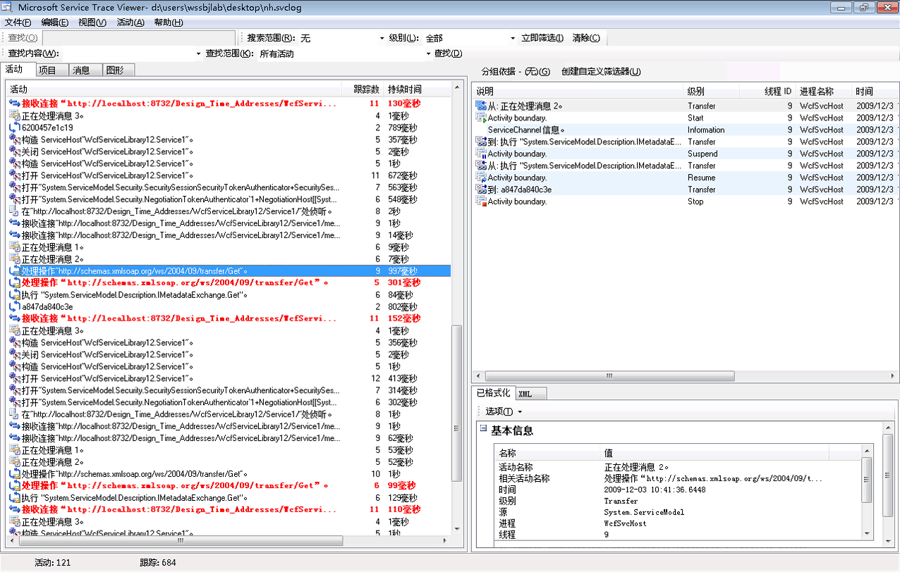
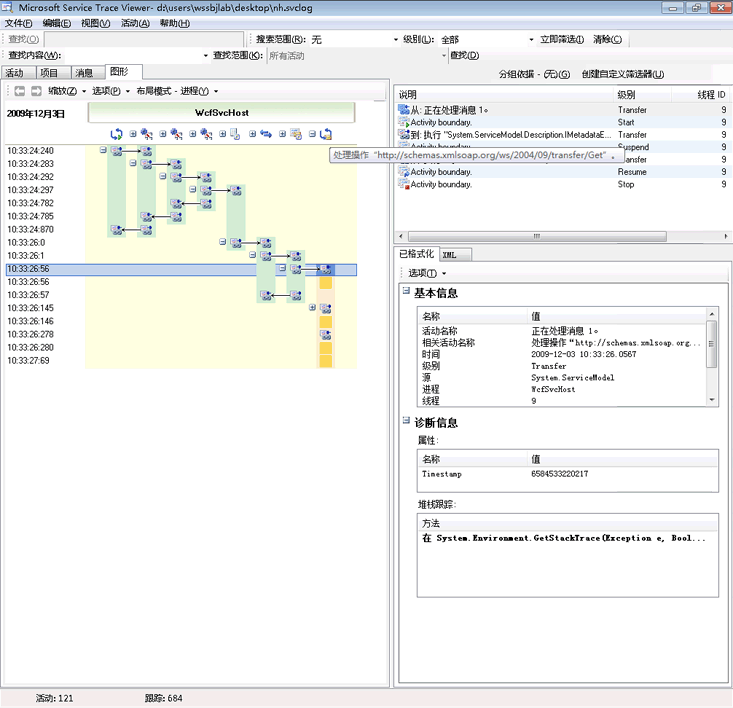
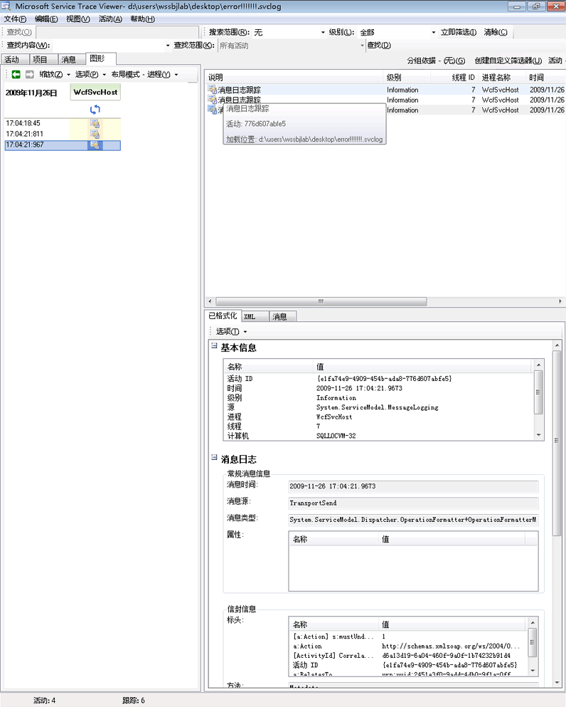
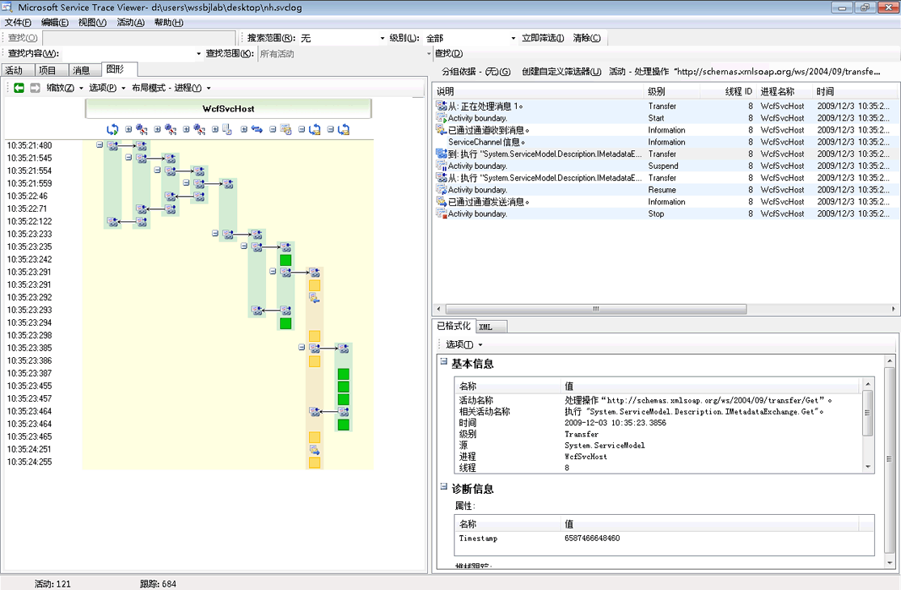
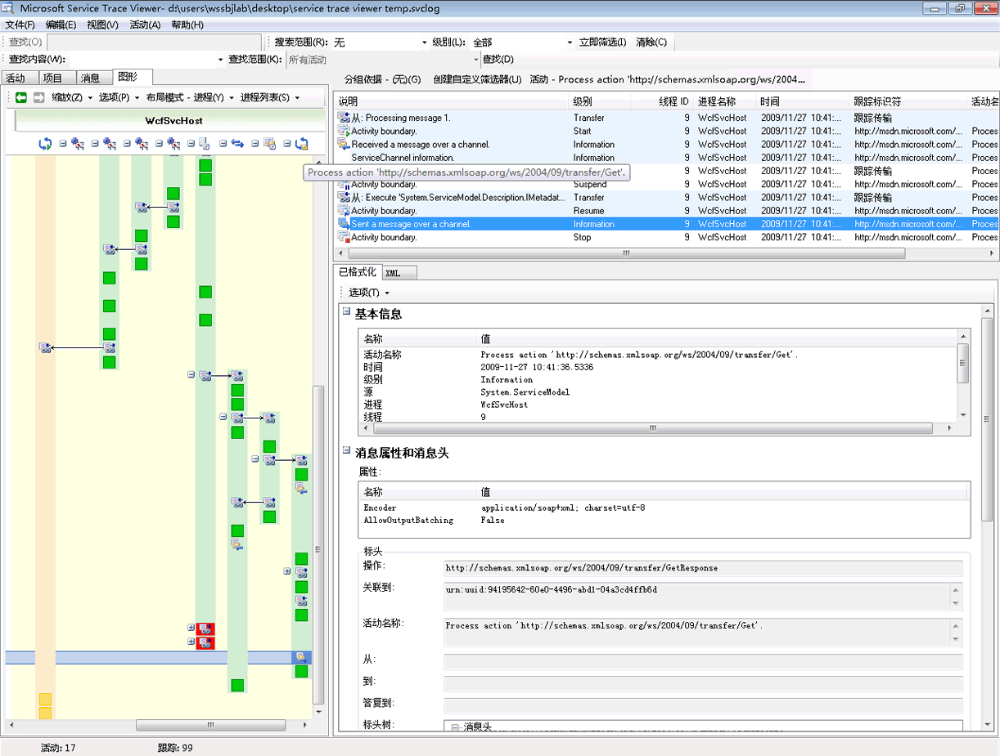
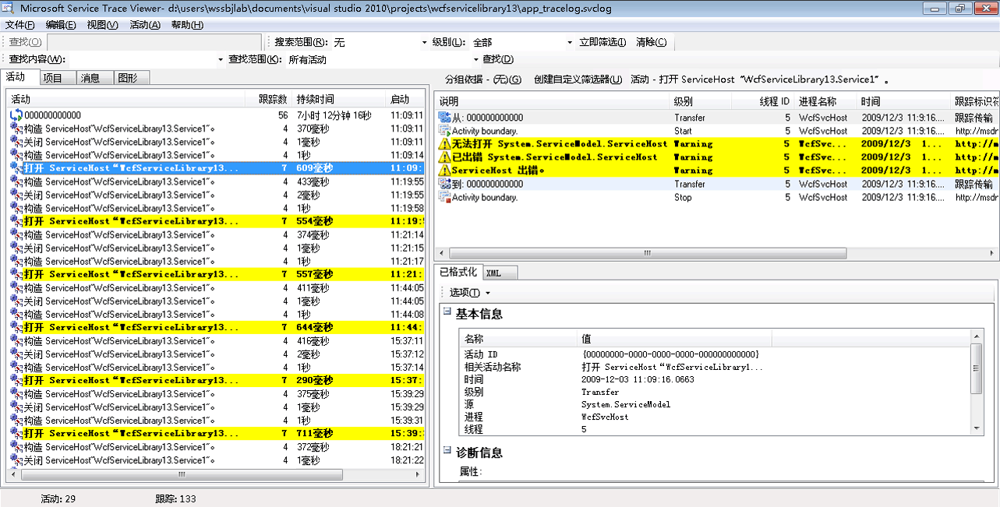
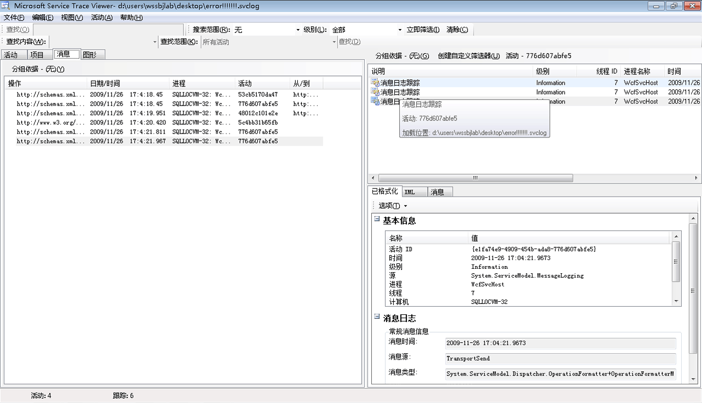

# <a name="using-service-trace-viewer-for-viewing-correlated-traces-and-troubleshooting"></a><span data-ttu-id="a5881-102">使用服务跟踪查看器查看相关跟踪和进行故障诊断</span><span class="sxs-lookup"><span data-stu-id="a5881-102">Using Service Trace Viewer for Viewing Correlated Traces and Troubleshooting</span></span>
<span data-ttu-id="a5881-103">本主题介绍跟踪数据的格式，如何查看它，以及使用服务跟踪查看器对应用程序进行故障诊断的方法。</span><span class="sxs-lookup"><span data-stu-id="a5881-103">This topic describes the format of trace data, how to view it, and approaches that use the Service Trace Viewer to troubleshoot your application.</span></span>  
  
## <a name="using-the-service-trace-viewer-tool"></a><span data-ttu-id="a5881-104">使用服务跟踪查看器工具</span><span class="sxs-lookup"><span data-stu-id="a5881-104">Using the Service Trace Viewer Tool</span></span>  
 <span data-ttu-id="a5881-105">Windows Communication Foundation (WCF) 服务跟踪查看器工具可帮助您将生成 WCF 侦听器，以找到错误的根本原因的诊断跟踪相关联。</span><span class="sxs-lookup"><span data-stu-id="a5881-105">The Windows Communication Foundation (WCF) Service Trace Viewer tool helps you correlate diagnostic traces produced by WCF listeners to locate the root cause of an error.</span></span> <span data-ttu-id="a5881-106">该工具，可以轻松地查看、 分组和筛选跟踪，以便可以诊断、 修复和验证 WCF 服务的问题。</span><span class="sxs-lookup"><span data-stu-id="a5881-106">The tool gives you a way to easily view, group, and filter traces so that you can diagnose, repair and verify issues with WCF services.</span></span> <span data-ttu-id="a5881-107">有关使用此工具的详细信息，请参阅[Service Trace Viewer Tool (SvcTraceViewer.exe)](../../../../../docs/framework/wcf/service-trace-viewer-tool-svctraceviewer-exe.md)。</span><span class="sxs-lookup"><span data-stu-id="a5881-107">For more information about using this tool, see [Service Trace Viewer Tool (SvcTraceViewer.exe)](../../../../../docs/framework/wcf/service-trace-viewer-tool-svctraceviewer-exe.md).</span></span>  
  
 <span data-ttu-id="a5881-108">本主题包含通过运行生成的跟踪的屏幕截图[跟踪和消息日志记录](../../../../../docs/framework/wcf/samples/tracing-and-message-logging.md)采样，请使用查看时[Service Trace Viewer Tool (SvcTraceViewer.exe)](../../../../../docs/framework/wcf/service-trace-viewer-tool-svctraceviewer-exe.md)。</span><span class="sxs-lookup"><span data-stu-id="a5881-108">This topic contains screenshots of traces generated by running the [Tracing and Message Logging](../../../../../docs/framework/wcf/samples/tracing-and-message-logging.md) sample, when viewed using the [Service Trace Viewer Tool (SvcTraceViewer.exe)](../../../../../docs/framework/wcf/service-trace-viewer-tool-svctraceviewer-exe.md).</span></span> <span data-ttu-id="a5881-109">本主题演示如何了解跟踪内容、活动及其关联，以及进行故障诊断时如何分析大量跟踪。</span><span class="sxs-lookup"><span data-stu-id="a5881-109">This topic demonstrates how to understand trace content, activities and their correlation, and how to analyze large numbers of traces when troubleshooting.</span></span>  
  
## <a name="viewing-trace-content"></a><span data-ttu-id="a5881-110">查看跟踪内容</span><span class="sxs-lookup"><span data-stu-id="a5881-110">Viewing Trace Content</span></span>  
 <span data-ttu-id="a5881-111">跟踪事件包含以下最重要的信息：</span><span class="sxs-lookup"><span data-stu-id="a5881-111">A trace event contains the following most significant information:</span></span>  
  
-   <span data-ttu-id="a5881-112">设置时的活动名称。</span><span class="sxs-lookup"><span data-stu-id="a5881-112">Activity name when set.</span></span>  
  
-   <span data-ttu-id="a5881-113">发出时间。</span><span class="sxs-lookup"><span data-stu-id="a5881-113">Emission time.</span></span>  
  
-   <span data-ttu-id="a5881-114">跟踪级别。</span><span class="sxs-lookup"><span data-stu-id="a5881-114">Trace level.</span></span>  
  
-   <span data-ttu-id="a5881-115">跟踪源名称。</span><span class="sxs-lookup"><span data-stu-id="a5881-115">Trace source name.</span></span>  
  
-   <span data-ttu-id="a5881-116">进程名称。</span><span class="sxs-lookup"><span data-stu-id="a5881-116">Process name.</span></span>  
  
-   <span data-ttu-id="a5881-117">线程 ID。</span><span class="sxs-lookup"><span data-stu-id="a5881-117">Thread id.</span></span>  
  
-   <span data-ttu-id="a5881-118">一个唯一跟踪标识符，它是指向 Microsoft 文档，可以从其获取与跟踪相关的详细信息中的目标 URL。</span><span class="sxs-lookup"><span data-stu-id="a5881-118">A unique trace identifier, which is a URL that points to a destination in Microsoft Docs, from which you can obtain more information related to the trace.</span></span>  
  
 <span data-ttu-id="a5881-119">所有这些可在服务跟踪查看器，或在上部的右侧面板中查看**基本信息**选择跟踪时在右下面板的格式化视图中的部分。</span><span class="sxs-lookup"><span data-stu-id="a5881-119">All of these can be seen in the upper right panel in the Service Trace Viewer, or in the **Basic Information** section in the formatted view of the lower-right panel when selecting a trace.</span></span>  
  
> [!NOTE]
>  <span data-ttu-id="a5881-120">如果客户端和服务位于同一计算机上，则将显示针对这两个应用程序的跟踪。</span><span class="sxs-lookup"><span data-stu-id="a5881-120">If the client and the service are on the same machine, the traces for both applications will be present.</span></span> <span data-ttu-id="a5881-121">可以使用筛选这些**进程名称**列。</span><span class="sxs-lookup"><span data-stu-id="a5881-121">These can be filtered using the **Process Name** column.</span></span>  
  
 <span data-ttu-id="a5881-122">此外，格式化视图还提供了跟踪说明和其他可用的详细信息。</span><span class="sxs-lookup"><span data-stu-id="a5881-122">In addition, the formatted view also provides a description for the trace and additional detailed information when available.</span></span> <span data-ttu-id="a5881-123">后者可以包括异常类型和消息、调用堆栈、消息操作、从/到字段以及其他异常信息。</span><span class="sxs-lookup"><span data-stu-id="a5881-123">The latter can include exception type and message, call stacks, message action, from/to fields, and other exception information.</span></span>  
  
 <span data-ttu-id="a5881-124">在 XML 视图中，有用的 xml 标记包括：</span><span class="sxs-lookup"><span data-stu-id="a5881-124">In the XML view, useful xml tags include the following:</span></span>  
  
-   <span data-ttu-id="a5881-125">`<SubType>` （跟踪级别）。</span><span class="sxs-lookup"><span data-stu-id="a5881-125">`<SubType>` (trace level).</span></span>  
  
-   <span data-ttu-id="a5881-126">`<TimeCreated>`。</span><span class="sxs-lookup"><span data-stu-id="a5881-126">`<TimeCreated>`.</span></span>  
  
-   <span data-ttu-id="a5881-127">`<Source>` （跟踪源名称）。</span><span class="sxs-lookup"><span data-stu-id="a5881-127">`<Source>` (trace source name).</span></span>  
  
-   <span data-ttu-id="a5881-128">`<Correlation>` （发出跟踪时设置的活动 id）。</span><span class="sxs-lookup"><span data-stu-id="a5881-128">`<Correlation>` (activity id set when emitting the trace).</span></span>  
  
-   <span data-ttu-id="a5881-129">`<Execution>` (进程和线程 id)。</span><span class="sxs-lookup"><span data-stu-id="a5881-129">`<Execution>` (process and thread id).</span></span>  
  
-   <span data-ttu-id="a5881-130">`<Computer>`。</span><span class="sxs-lookup"><span data-stu-id="a5881-130">`<Computer>`.</span></span>  
  
-   <span data-ttu-id="a5881-131">`<ExtendedData>`其中包括`<Action>`，`<MessageID>`和`<ActivityId>`发送一条消息时消息标头中设置。</span><span class="sxs-lookup"><span data-stu-id="a5881-131">`<ExtendedData>`, including `<Action>`, `<MessageID>` and the `<ActivityId>` set in the message header when sending a message.</span></span>  
  
 <span data-ttu-id="a5881-132">如果检查“通过通道发送消息”跟踪，则可能会看到以下内容。</span><span class="sxs-lookup"><span data-stu-id="a5881-132">If you examine the "Sent a message over a channel" trace, you may see the following content.</span></span>  
  
```xml  
<E2ETraceEvent xmlns="http://schemas.microsoft.com/2004/06/E2ETraceEvent">  
   <System xmlns="http://schemas.microsoft.com/2004/06/windows/eventlog/system">  
      <EventID>262163</EventID>  
      <Type>3</Type>  
      <SubType Name="Information">0</SubType>  
      <Level>8</Level>  
      <TimeCreated SystemTime="2006-08-04T18:45:30.8491051Z" />  
      <Source Name="System.ServiceModel" />  
       <Correlation ActivityID="{27c6331d-8998-43aa-a382-03239013a6bd}"/>  
       <Execution ProcessName="client" ProcessID="1808" ThreadID="1" />  
       <Channel />  
       <Computer>TEST1</Computer>  
   </System>  
   <ApplicationData>  
       <TraceData>  
          <DataItem>  
             <TraceRecord xmlns="http://schemas.microsoft.com/2004/10/E2ETraceEvent/TraceRecord" Severity="Information">  
                 <TraceIdentifier>http://msdn.microsoft.com/library/System.ServiceModel.Channels.MessageSent.aspx</TraceIdentifier>  
                 <Description>Sent a message over a channel.</Description>  
                 <AppDomain>client.exe</AppDomain>  
                 <Source>System.ServiceModel.Channels.ClientFramingDuplexSessionChannel/35191196</Source>  
                <ExtendedData xmlns="http://schemas.microsoft.com/2006/08/ServiceModel/MessageTransmitTraceRecord">  
  
                  <MessageProperties>  
                     <AllowOutputBatching>False</AllowOutputBatching>  
                  </MessageProperties>  
                  <MessageHeaders>  
                     <Action d4p1:mustUnderstand="1" xmlns:d4p1="http://www.w3.org/2003/05/soap-envelope" xmlns="http://www.w3.org/2005/08/addressing">http://Microsoft.ServiceModel.Samples/ICalculator/Multiply</Action>  
                     <MessageID xmlns="http://www.w3.org/2005/08/addressing">urn:uuid:7c6670d8-4c9c-496e-b6a0-2ceb6db35338</MessageID>  
                     <ActivityId CorrelationId="b02e2189-0816-4387-980c-dd8e306440f5" xmlns="http://schemas.microsoft.com/2004/09/ServiceModel/Diagnostics">27c6331d-8998-43aa-a382-03239013a6bd</ActivityId>  
                     <ReplyTo xmlns="http://www.w3.org/2005/08/addressing">  
                        <Address>http://www.w3.org/2005/08/addressing/anonymous</Address>  
                    </ReplyTo>  
                    <To d4p1:mustUnderstand="1" xmlns:d4p1="http://www.w3.org/2003/05/soap-envelope" xmlns="http://www.w3.org/2005/08/addressing">net.tcp://localhost/servicemodelsamples/service</To>  
                  </MessageHeaders>  
                  <RemoteAddress>net.tcp://localhost/servicemodelsamples/service</RemoteAddress>  
                </ExtendedData>  
            </TraceRecord>  
          </DataItem>  
       </TraceData>  
   </ApplicationData>  
</E2ETraceEvent>  
```  
  
## <a name="servicemodel-e2e-tracing"></a><span data-ttu-id="a5881-133">ServiceModel E2E 跟踪</span><span class="sxs-lookup"><span data-stu-id="a5881-133">ServiceModel E2E Tracing</span></span>  
 <span data-ttu-id="a5881-134">当`System.ServiceModel`跟踪源设置`switchValue`除 Off 之外和`ActivityTracing`，WCF 创建活动和传输，WCF 处理。</span><span class="sxs-lookup"><span data-stu-id="a5881-134">When the `System.ServiceModel` trace source is set with a `switchValue` other than Off, and `ActivityTracing`, WCF creates activities and transfers for WCF processing.</span></span>  
  
 <span data-ttu-id="a5881-135">活动是一个逻辑处理单元，将与该处理单元相关的所有跟踪组合在一起。</span><span class="sxs-lookup"><span data-stu-id="a5881-135">An activity is a logical unit of processing that groups all traces related to that processing unit.</span></span> <span data-ttu-id="a5881-136">例如，可以为每个请求定义一个活动。</span><span class="sxs-lookup"><span data-stu-id="a5881-136">For example, you can define one activity for each request.</span></span> <span data-ttu-id="a5881-137">传输在终结点内的活动之间创建因果关系。</span><span class="sxs-lookup"><span data-stu-id="a5881-137">Transfers create a causal relationship between activities within endpoints.</span></span> <span data-ttu-id="a5881-138">通过传播活动 ID，可以跨终结点使活动相关。</span><span class="sxs-lookup"><span data-stu-id="a5881-138">Propagating the activity ID enables you to relate activities across endpoints.</span></span> <span data-ttu-id="a5881-139">这可以通过设置`propagateActivity` = `true`在每个终结点的配置中。</span><span class="sxs-lookup"><span data-stu-id="a5881-139">This can be done by setting `propagateActivity`=`true` in configuration at every endpoint.</span></span> <span data-ttu-id="a5881-140">活动、传输和传播允许您执行错误关联。</span><span class="sxs-lookup"><span data-stu-id="a5881-140">Activities, transfers, and propagation allow you to perform error correlation.</span></span> <span data-ttu-id="a5881-141">这样，可以更快地找到错误的根本原因。</span><span class="sxs-lookup"><span data-stu-id="a5881-141">In this way, you can find the root cause of an error more quickly.</span></span>  
  
 <span data-ttu-id="a5881-142">在客户端上一个 WCF 活动创建为每个对象模型调用 （例如，打开 ChannelFactory、 添加、 除等。）每个操作调用中的"进程操作"活动进行处理。</span><span class="sxs-lookup"><span data-stu-id="a5881-142">On the client, one WCF activity is created for each object model call (for example, Open ChannelFactory, Add, Divide, and so on.) Each of the operation calls is processed in a "Process Action" activity.</span></span>  
  
 <span data-ttu-id="a5881-143">在以下屏幕截图中，从提取[跟踪和消息日志记录](../../../../../docs/framework/wcf/samples/tracing-and-message-logging.md)示例左面板中显示的活动在按创建时间排序的客户端进程中创建的列表。</span><span class="sxs-lookup"><span data-stu-id="a5881-143">In the following screenshot, extracted from the [Tracing and Message Logging](../../../../../docs/framework/wcf/samples/tracing-and-message-logging.md) sample the left panel displays the list of activities created in the client process, sorted by creation time.</span></span> <span data-ttu-id="a5881-144">以下是活动的时间顺序列表：</span><span class="sxs-lookup"><span data-stu-id="a5881-144">The following is a chronological list of activities:</span></span>  
  
-   <span data-ttu-id="a5881-145">构造了通道工厂 (ClientBase)。</span><span class="sxs-lookup"><span data-stu-id="a5881-145">Constructed the channel factory (ClientBase).</span></span>  
  
-   <span data-ttu-id="a5881-146">打开了通道工厂。</span><span class="sxs-lookup"><span data-stu-id="a5881-146">Opened the channel factory.</span></span>  
  
-   <span data-ttu-id="a5881-147">处理了加操作。</span><span class="sxs-lookup"><span data-stu-id="a5881-147">Processed the Add action.</span></span>  
  
-   <span data-ttu-id="a5881-148">设置安全会话 （这发生在首次请求） 和已处理的三个安全基础结构响应消息：RST、 RSTR、 SCT （处理消息 1，2，3）。</span><span class="sxs-lookup"><span data-stu-id="a5881-148">Set up the Secure Session (this OCCURRED on the first request) and processed three security infrastructure response messages: RST, RSTR, SCT (Process message 1, 2, 3).</span></span>  
  
-   <span data-ttu-id="a5881-149">处理了减、乘和除请求。</span><span class="sxs-lookup"><span data-stu-id="a5881-149">Processed the Subtract, Multiply, and Divide requests.</span></span>  
  
-   <span data-ttu-id="a5881-150">关闭了通道工厂，这样做还关闭了安全会话并处理安全消息响应 Cancel。</span><span class="sxs-lookup"><span data-stu-id="a5881-150">Closed the channel factory, and doing so closed the Secure session and processed the security message response Cancel.</span></span>  
  
 <span data-ttu-id="a5881-151">我们看到由于 wsHttpBinding 所致的安全基础结构消息。</span><span class="sxs-lookup"><span data-stu-id="a5881-151">We see the security infrastructure messages because of the wsHttpBinding.</span></span>  
  
> [!NOTE]
>  <span data-ttu-id="a5881-152">我们显示最初在单独的活动 （处理消息） 中处理的响应消息在 WCF 中，我们将其关联到相应的处理操作活动，其中包括请求消息，通过传输之前。</span><span class="sxs-lookup"><span data-stu-id="a5881-152">In WCF, we show response messages being processed initially in a separate activity (Process message) before we correlate them to the corresponding Process Action activity that includes the request message, through a transfer.</span></span> <span data-ttu-id="a5881-153">这发生在基础结构消息和异步请求中，并且归因于以下事实：必须检查消息、读取 activityId 标头以及识别具有该 ID 的现有“处理操作”活动以便与它相关。</span><span class="sxs-lookup"><span data-stu-id="a5881-153">This happens for infrastructure messages and asynchronous requests and is due to the fact that we must inspect the message, read the activityId header, and identify the existing Process Action activity with that id to correlate to it.</span></span> <span data-ttu-id="a5881-154">对于同步请求，我们将为响应截留这些信息，因此可以知道响应与哪个处理操作相关。</span><span class="sxs-lookup"><span data-stu-id="a5881-154">For synchronous requests, we are blocking for the response and hence know which Process action the response relates to.</span></span>  
  
 <span data-ttu-id="a5881-155"></span><span class="sxs-lookup"><span data-stu-id="a5881-155"></span></span>  
<span data-ttu-id="a5881-156">按创建时间列出的 WCF 客户端活动（左面板）及其嵌套活动和跟踪（右上面板）</span><span class="sxs-lookup"><span data-stu-id="a5881-156">WCF client activities listed by creation time (left panel) and their nested activities and traces (upper right panel)</span></span>  
  
 <span data-ttu-id="a5881-157">在左面板中选择一个活动时，可以在右上面板上看到其嵌套活动和跟踪。</span><span class="sxs-lookup"><span data-stu-id="a5881-157">When we select an activity in the left panel, we can see nested activities and traces on the upper right panel.</span></span> <span data-ttu-id="a5881-158">因此，这是左侧活动列表的简化分层视图（基于所选的父活动）。</span><span class="sxs-lookup"><span data-stu-id="a5881-158">Therefore, this is a reduced hierarchical view of the list of activities on the left, based on the selected parent activity.</span></span> <span data-ttu-id="a5881-159">因为所选处理操作“加”是发出的第一个请求，所以此活动包含“设置安全会话”活动（传输到，再传输回）和对“加”操作实际处理的跟踪。</span><span class="sxs-lookup"><span data-stu-id="a5881-159">Because the selected Process action Add is the first request made, this activity contains the Set Up Secure Session activity (transfer to, transfer back from), and traces for the actual processing of the Add action.</span></span>  
  
 <span data-ttu-id="a5881-160">如果双击左面板中添加活动的处理操作，我们可以看到添加到与相关的客户端 WCF 活动的图形表示形式。</span><span class="sxs-lookup"><span data-stu-id="a5881-160">If we double click the Process action Add activity in the left panel, we can see a graphical representation of the client WCF activities related to Add.</span></span> <span data-ttu-id="a5881-161">左侧的第一个活动是根活动 (0000)，它是默认活动。</span><span class="sxs-lookup"><span data-stu-id="a5881-161">The first activity on the left is the root activity (0000), which is the default activity.</span></span> <span data-ttu-id="a5881-162">环境活动之外的 WCF 传输。</span><span class="sxs-lookup"><span data-stu-id="a5881-162">WCF transfers out of the ambient activity.</span></span> <span data-ttu-id="a5881-163">如果未定义，WCF 将到 0000 之外传输。</span><span class="sxs-lookup"><span data-stu-id="a5881-163">If this is not defined, WCF transfers out of 0000.</span></span> <span data-ttu-id="a5881-164">在这里，第二个活动“处理操作添加”在 0 之外传输。</span><span class="sxs-lookup"><span data-stu-id="a5881-164">Here, the second activity, Process Action Add, transfers out of 0.</span></span> <span data-ttu-id="a5881-165">然后可看到“设置安全会话”。</span><span class="sxs-lookup"><span data-stu-id="a5881-165">Then we see Setup Secure Session.</span></span>  
  
 <span data-ttu-id="a5881-166"></span><span class="sxs-lookup"><span data-stu-id="a5881-166"></span></span>  
<span data-ttu-id="a5881-167">WCF 客户端活动的关系图视图：环境活动 (此处为 0)、 处理操作和设置安全会话</span><span class="sxs-lookup"><span data-stu-id="a5881-167">Graph view of WCF client activities: Ambient Activity (here 0), Process action, and Set Up Secure Session</span></span>  
  
 <span data-ttu-id="a5881-168">在右上面板中，可以看到与“处理操作添加”活动相关的所有跟踪。</span><span class="sxs-lookup"><span data-stu-id="a5881-168">On the upper right panel, we can see all traces related to the Process Action Add activity.</span></span> <span data-ttu-id="a5881-169">具体说来，已发送请求消息（“通过通道发送消息”）并在同一活动中收到了响应（“通过通道收到消息”）。</span><span class="sxs-lookup"><span data-stu-id="a5881-169">Specifically, we have sent the request message ("Sent a message over a channel") and received the response ("Received a message over a channel") in the same activity.</span></span> <span data-ttu-id="a5881-170">如下图所示。</span><span class="sxs-lookup"><span data-stu-id="a5881-170">This is shown in the following graph.</span></span> <span data-ttu-id="a5881-171">为清楚起见，在图形中折叠了“设置安全会话”活动。</span><span class="sxs-lookup"><span data-stu-id="a5881-171">For clarity, the Set up Secure Session activity is collapsed in the graph.</span></span>  
  
 <span data-ttu-id="a5881-172"></span><span class="sxs-lookup"><span data-stu-id="a5881-172"></span></span>  
<span data-ttu-id="a5881-173">处理操作活动的跟踪列表：已发送请求并在同一活动中收到响应。</span><span class="sxs-lookup"><span data-stu-id="a5881-173">List of traces for the Process Action activity: we send the request and receive the response in the same activity.</span></span>  
  
 <span data-ttu-id="a5881-174">在这里，我们加载客户端跟踪仅仅是为了清楚起见，但它们也是在该工具中加载，服务跟踪 （收到请求消息和发送响应消息） 将出现在同一活动中并`propagateActivity`已设置为`true.`这更高版本的图中所示。</span><span class="sxs-lookup"><span data-stu-id="a5881-174">Here, we load client traces only for clarity, but service traces (request message received and response message sent) appear in the same activity if they are also loaded in the tool and `propagateActivity` was set to `true.` This is shown in a later illustration.</span></span>  
  
 <span data-ttu-id="a5881-175">在服务上，活动模型映射到 WCF 概念，如下所示：</span><span class="sxs-lookup"><span data-stu-id="a5881-175">On the service, the activity model maps to the WCF concepts as follows:</span></span>  
  
1.  <span data-ttu-id="a5881-176">构造并打开 ServiceHost（这可能创建几个与主机相关的活动，例如在出于安全性的情况下）。</span><span class="sxs-lookup"><span data-stu-id="a5881-176">We construct and open a ServiceHost (this may create several host-related activities, for instance, in the case of security).</span></span>  
  
2.  <span data-ttu-id="a5881-177">在 ServiceHost 中为每个侦听器创建“侦听”活动（包括传入和传出“打开 ServiceHost”）。</span><span class="sxs-lookup"><span data-stu-id="a5881-177">We create a Listen At activity for each listener in the ServiceHost (with transfers in and out of Open ServiceHost).</span></span>  
  
3.  <span data-ttu-id="a5881-178">当侦听器检测到由客户端发起的通信请求时，它将传输到"接收字节"活动，在其中处理从客户端发送的所有字节。</span><span class="sxs-lookup"><span data-stu-id="a5881-178">When the listener detects a communication request initiated by the client, it transfers to a "Receive Bytes" activity, in which all bytes sent from the client are processed.</span></span> <span data-ttu-id="a5881-179">在此活动中，可以看到在客户端-服务交互期间发生的任何连接错误。</span><span class="sxs-lookup"><span data-stu-id="a5881-179">In this activity, we can see any connection errors that have happened during the client-service interaction.</span></span>  
  
4.  <span data-ttu-id="a5881-180">对于每个组接收的字节对应一条消息，我们处理这些字节在"进程内消息"活动中，我们在其中创建 WCF 消息对象。</span><span class="sxs-lookup"><span data-stu-id="a5881-180">For each set of bytes that is received that corresponds to a message, we process these bytes in a "Process Message" activity, where we create the WCF Message object.</span></span> <span data-ttu-id="a5881-181">在此活动中，可看到与错误信封或格式不正确的消息相关的错误。</span><span class="sxs-lookup"><span data-stu-id="a5881-181">In this activity, we see errors related to a bad envelope or a malformed message.</span></span>  
  
5.  <span data-ttu-id="a5881-182">形成消息后，传输到“处理操作”活动。</span><span class="sxs-lookup"><span data-stu-id="a5881-182">Once the message is formed, we transfer to a Process Action activity.</span></span> <span data-ttu-id="a5881-183">如果在客户端和服务上 `propagateActivity` 都设置为 `true`，则此活动具有与客户端中定义的活动相同的 ID，如前所述。</span><span class="sxs-lookup"><span data-stu-id="a5881-183">If `propagateActivity` is set to `true` on both the client and service, this activity has the same id as the one defined in the client, and described previously.</span></span> <span data-ttu-id="a5881-184">此阶段中我们将受益于直接关联的跨终结点，因为在 WCF 中发出的与请求相关的所有跟踪都都位于该同一活动，包括响应消息的处理。</span><span class="sxs-lookup"><span data-stu-id="a5881-184">From this stage we start to benefit from direct correlation across endpoints, because all traces emitted in WCF that are related to the request are in that same activity, including the response message processing.</span></span>  
  
6.  <span data-ttu-id="a5881-185">对于进程外操作，我们将创建"执行用户代码"活动以隔离在 WCF 中的用户代码中发出的跟踪。</span><span class="sxs-lookup"><span data-stu-id="a5881-185">For out-of-process action, we create an "Execute user code" activity to isolate traces emitted in user code from the ones emitted in WCF.</span></span> <span data-ttu-id="a5881-186">在前面的示例中，"服务发送添加响应"跟踪有可能的话将不在客户端传播的活动的"执行用户代码"活动中发出。</span><span class="sxs-lookup"><span data-stu-id="a5881-186">In the preceding example, the "Service sends Add response" trace is emitted in the "Execute User code" activity not in the activity propagated by the client, if applicable.</span></span>  
  
 <span data-ttu-id="a5881-187">在下图中，左侧的第一个活动是根活动 (0000)，它是默认活动。</span><span class="sxs-lookup"><span data-stu-id="a5881-187">In the illustration that follows, the first activity on the left is the root activity (0000), which is the default activity.</span></span> <span data-ttu-id="a5881-188">接下来的三个活动用于打开 ServiceHost。</span><span class="sxs-lookup"><span data-stu-id="a5881-188">The next three activities are to open the ServiceHost.</span></span> <span data-ttu-id="a5881-189">第 5 列中的活动是侦听器，剩余的活动（6 到 8）说明消息的 WCF 处理，从字节处理到用户代码激活。</span><span class="sxs-lookup"><span data-stu-id="a5881-189">The activity in column 5 is the listener, and the remaining activities (6 to 8) describe the WCF processing of a message, from bytes processing to user code activation.</span></span>  
  
 <span data-ttu-id="a5881-190"></span><span class="sxs-lookup"><span data-stu-id="a5881-190"></span></span>  
<span data-ttu-id="a5881-191">WCF 服务活动的列表</span><span class="sxs-lookup"><span data-stu-id="a5881-191">List of WCF service activities</span></span>  
  
 <span data-ttu-id="a5881-192">下面的屏幕快照显示客户端和服务的活动，并突出显示跨进程的“处理操作添加”活动（橙色）。</span><span class="sxs-lookup"><span data-stu-id="a5881-192">The following screenshot shows the activities for both the client and service, and highlights the Process Action Add activity across processes (orange).</span></span> <span data-ttu-id="a5881-193">箭头使客户端和服务发送和接收的请求和响应消息相关。</span><span class="sxs-lookup"><span data-stu-id="a5881-193">Arrows relate the request and response messages sent and received by the client and service.</span></span> <span data-ttu-id="a5881-194">跨进程处理操作的跟踪在图形中单独显示，但在右上面板中作为同一活动的一部分显示。</span><span class="sxs-lookup"><span data-stu-id="a5881-194">The traces of Process Action are separated across processes in the graph, but shown as part of the same activity in the upper-right panel.</span></span> <span data-ttu-id="a5881-195">在此面板中，可以看到已发送消息的客户端跟踪，后跟已接收和已处理消息的服务跟踪。</span><span class="sxs-lookup"><span data-stu-id="a5881-195">In this panel, we can see client traces for sent messages followed by service traces for received and processed messages.</span></span>  
  
 <span data-ttu-id="a5881-196"></span><span class="sxs-lookup"><span data-stu-id="a5881-196"></span></span>  
<span data-ttu-id="a5881-197">WCF 客户端和服务活动的图形视图</span><span class="sxs-lookup"><span data-stu-id="a5881-197">Graph view of both WCF client and service activities</span></span>  
  
 <span data-ttu-id="a5881-198">在下面的错误情形中，服务和客户端上的错误和警告跟踪是相关的。</span><span class="sxs-lookup"><span data-stu-id="a5881-198">In the following error scenario, error and warning traces at the service and client are related.</span></span> <span data-ttu-id="a5881-199">在服务上的用户代码中首先引发异常（最右侧的绿色活动，包括异常“服务无法处理用户代码中的此请求。”的警告跟踪）。</span><span class="sxs-lookup"><span data-stu-id="a5881-199">An exception is first thrown in user code on the service (right-most green activity that includes a warning trace for the exception "The service cannot process this request in user code.").</span></span> <span data-ttu-id="a5881-200">将响应发送到客户端时，会再次发出警告跟踪以指示错误消息（左侧的粉红色活动）。</span><span class="sxs-lookup"><span data-stu-id="a5881-200">When the response is sent to the client, a warning trace is again emitted to denote the fault message (left pink activity).</span></span> <span data-ttu-id="a5881-201">然后客户端关闭其 WCF 客户端（左下侧的黄色活动），这将中止与服务的连接。</span><span class="sxs-lookup"><span data-stu-id="a5881-201">The client then closes its WCF client (yellow activity on the lower-left side), which aborts the connection to the service.</span></span> <span data-ttu-id="a5881-202">服务引发一个错误（右侧最长的粉红色活动）。</span><span class="sxs-lookup"><span data-stu-id="a5881-202">The service throws an error (longest pink activity on the right).</span></span>  
  
 <span data-ttu-id="a5881-203"></span><span class="sxs-lookup"><span data-stu-id="a5881-203"></span></span>  
<span data-ttu-id="a5881-204">跨服务和客户端的错误关联</span><span class="sxs-lookup"><span data-stu-id="a5881-204">Error correlation across the service and client</span></span>  
  
 <span data-ttu-id="a5881-205">用于生成这些跟踪的示例是使用 wsHttpBinding 的一系列同步请求。</span><span class="sxs-lookup"><span data-stu-id="a5881-205">The sample used to generate these traces is a series of synchronous requests using the wsHttpBinding.</span></span> <span data-ttu-id="a5881-206">对于没有安全性或具有异步请求的情形，与此图形存在偏差，其中处理操作活动包括造成异步调用的开始操作和结束操作，并显示到回调活动的传输。</span><span class="sxs-lookup"><span data-stu-id="a5881-206">There are deviations from this graph for scenarios without security, or with asynchronous requests, where the Process Action activity encompasses the begin and end operations that constitute the asynchronous call, and shows transfers to a callback activity.</span></span> <span data-ttu-id="a5881-207">有关其他方案的详细信息，请参阅[端到端跟踪方案](../../../../../docs/framework/wcf/diagnostics/tracing/end-to-end-tracing-scenarios.md)。</span><span class="sxs-lookup"><span data-stu-id="a5881-207">For more information about additional scenarios, see [End-To-End Tracing Scenarios](../../../../../docs/framework/wcf/diagnostics/tracing/end-to-end-tracing-scenarios.md).</span></span>  
  
## <a name="troubleshooting-using-the-service-trace-viewer"></a><span data-ttu-id="a5881-208">使用服务跟踪查看器进行故障诊断</span><span class="sxs-lookup"><span data-stu-id="a5881-208">Troubleshooting Using the Service Trace Viewer</span></span>  
 <span data-ttu-id="a5881-209">在服务跟踪查看器工具中加载跟踪文件时，可以在左面板上选择任何红色或黄色的活动，以追踪应用程序中问题的原因。</span><span class="sxs-lookup"><span data-stu-id="a5881-209">When you load trace files in the Service Trace Viewer Tool, you can select any red or yellow activity on the left panel to track down the cause of a problem in your application.</span></span> <span data-ttu-id="a5881-210">000 活动通常具有最终归因于用户的未经处理的异常。</span><span class="sxs-lookup"><span data-stu-id="a5881-210">The 000 activity typically has unhandled exceptions that bubble up to the user.</span></span>  
  
 <span data-ttu-id="a5881-211"></span><span class="sxs-lookup"><span data-stu-id="a5881-211"></span></span>  
<span data-ttu-id="a5881-212">选择红色或黄色活动以找到问题的根本原因</span><span class="sxs-lookup"><span data-stu-id="a5881-212">Selecting red or yellow activity to locate the root of a problem</span></span>  
  
 <span data-ttu-id="a5881-213">在右上面板上，可以检查在左侧选择的活动的跟踪。</span><span class="sxs-lookup"><span data-stu-id="a5881-213">On the upper right panel, you can examine traces for the activity you selected on the left.</span></span> <span data-ttu-id="a5881-214">然后，可以检查该面板中的红色或黄色跟踪以及查看它们是如何相关的。</span><span class="sxs-lookup"><span data-stu-id="a5881-214">You can then examine red or yellow traces in that panel and see how they are correlated.</span></span> <span data-ttu-id="a5881-215">在前面的图形中，我们看到客户端和服务的警告跟踪都在同一处理操作活动中。</span><span class="sxs-lookup"><span data-stu-id="a5881-215">In the preceding graph, we see warning traces both for the client and service in the same Process Action activity.</span></span>  
  
 <span data-ttu-id="a5881-216">如果这些跟踪未提供错误的根本原因，则可以通过双击左面板上的所选活动（此处为处理操作）来利用图形。</span><span class="sxs-lookup"><span data-stu-id="a5881-216">If these traces do not provide you with the root cause of the error, you can utilize the graph by double-clicking the selected activity on the left panel (here Process action).</span></span> <span data-ttu-id="a5881-217">随后将显示具有相关活动的图形。</span><span class="sxs-lookup"><span data-stu-id="a5881-217">The graph with related activities is then displayed.</span></span> <span data-ttu-id="a5881-218">您可以展开相关的活动 （通过单击"+"符号） 查找红色或黄色的相关活动中的第一个发出的跟踪。</span><span class="sxs-lookup"><span data-stu-id="a5881-218">You can then expand related activities (by clicking the "+" signs) to find the first emitted trace in red or yellow in a related activity.</span></span> <span data-ttu-id="a5881-219">在传输到相关活动或跨终结点的消息流之后，一直展开刚好在相关的红色或黄色跟踪之前发生的活动，直到查明问题的根本原因为止。</span><span class="sxs-lookup"><span data-stu-id="a5881-219">Keep expanding the activities that happened just before the red or yellow trace of interest, following transfers to related activities or message flows across endpoints, until you track the root cause of the problem.</span></span>  
  
 <span data-ttu-id="a5881-220"></span><span class="sxs-lookup"><span data-stu-id="a5881-220"></span></span>  
<span data-ttu-id="a5881-221">展开活动以查明问题的根本原因</span><span class="sxs-lookup"><span data-stu-id="a5881-221">Expanding activities to track the root cause of a problem</span></span>  
  
 <span data-ttu-id="a5881-222">如果已关闭 ServiceModel `ActivityTracing` 但打开了 ServiceModel 跟踪，则可以看到在 0000 活动中发出的 ServiceModel 跟踪。</span><span class="sxs-lookup"><span data-stu-id="a5881-222">If ServiceModel `ActivityTracing` is off but ServiceModel tracing is on, you can see ServiceModel traces emitted in the 0000 activity.</span></span> <span data-ttu-id="a5881-223">但是，这需要进行更多的工作才能了解这些跟踪的关联。</span><span class="sxs-lookup"><span data-stu-id="a5881-223">However, this requires more effort to understand the correlation of these traces.</span></span>  
  
 <span data-ttu-id="a5881-224">如果启用了“消息日志记录”，则可以使用“消息”选项卡查看受错误影响的消息。</span><span class="sxs-lookup"><span data-stu-id="a5881-224">If Message Logging is enabled, you can use the Message Tab to see which message is impacted by the error.</span></span> <span data-ttu-id="a5881-225">通过双击红色或黄色的消息，可以看到相关活动的图形视图。</span><span class="sxs-lookup"><span data-stu-id="a5881-225">By double-clicking a message in red or yellow, you can see the graph view of the related activities.</span></span> <span data-ttu-id="a5881-226">这些活动是与发生错误的请求最紧密相关的活动。</span><span class="sxs-lookup"><span data-stu-id="a5881-226">These activities are the ones most closely related to the request where an error happened.</span></span>  
  
 <span data-ttu-id="a5881-227"></span><span class="sxs-lookup"><span data-stu-id="a5881-227"></span></span>  
<span data-ttu-id="a5881-228">若要开始进行故障诊断，也可以选取一个红色或黄色的消息跟踪，并双击它以查明根本原因</span><span class="sxs-lookup"><span data-stu-id="a5881-228">To start troubleshooting, you can also pick a red or yellow message trace and double click it to track the root cause</span></span>  
  
## <a name="see-also"></a><span data-ttu-id="a5881-229">请参阅</span><span class="sxs-lookup"><span data-stu-id="a5881-229">See also</span></span>
- [<span data-ttu-id="a5881-230">端到端跟踪方案</span><span class="sxs-lookup"><span data-stu-id="a5881-230">End-To-End Tracing Scenarios</span></span>](../../../../../docs/framework/wcf/diagnostics/tracing/end-to-end-tracing-scenarios.md)
- [<span data-ttu-id="a5881-231">服务跟踪查看器工具 (SvcTraceViewer.exe)</span><span class="sxs-lookup"><span data-stu-id="a5881-231">Service Trace Viewer Tool (SvcTraceViewer.exe)</span></span>](../../../../../docs/framework/wcf/service-trace-viewer-tool-svctraceviewer-exe.md)
- [<span data-ttu-id="a5881-232">跟踪</span><span class="sxs-lookup"><span data-stu-id="a5881-232">Tracing</span></span>](../../../../../docs/framework/wcf/diagnostics/tracing/index.md)
